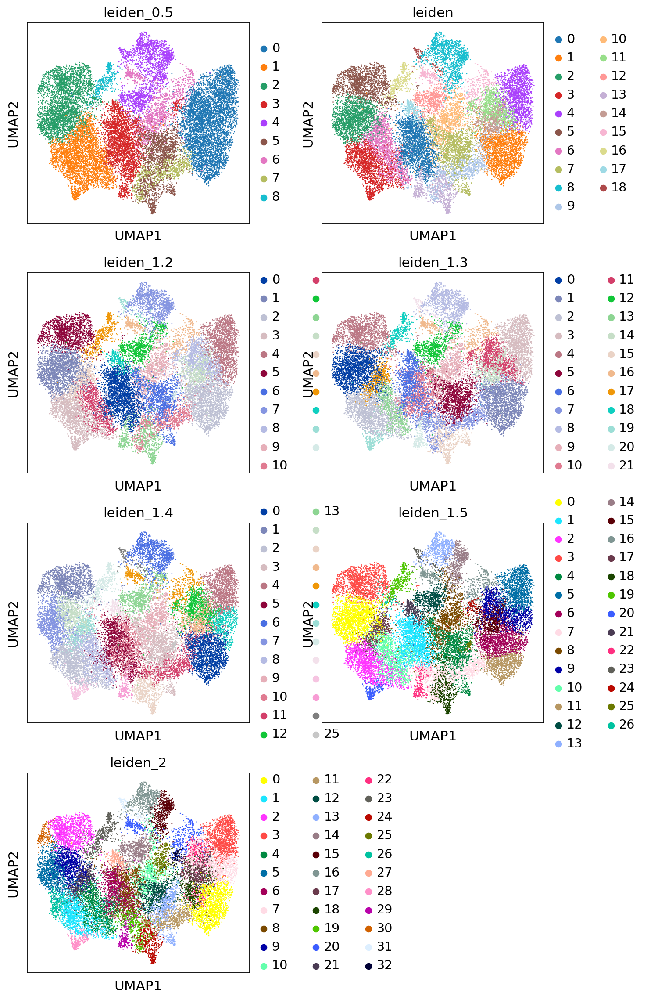

```python
import scanpy as sc
import torch
import scarches as sca
from scarches.dataset.trvae.data_handling import remove_sparsity
import matplotlib.pyplot as plt
import numpy as np
import gdown
import scvi
```

    WARNING:root:In order to use the mouse gastrulation seqFISH datsets, please install squidpy (see https://github.com/scverse/squidpy).
    WARNING:root:In order to use sagenet models, please install pytorch geometric (see https://pytorch-geometric.readthedocs.io) and 
     captum (see https://github.com/pytorch/captum).
    WARNING:root:mvTCR is not installed. To use mvTCR models, please install it first using "pip install mvtcr"
    WARNING:root:multigrate is not installed. To use multigrate models, please install it first using "pip install multigrate".


```python
sc.settings.set_figure_params(dpi=200, frameon=False)
sc.set_figure_params(dpi=200)
sc.set_figure_params(figsize=(4, 4))
torch.set_printoptions(precision=3, sci_mode=False, edgeitems=7)
```


```python
condition_key = 'orig.ident'
cell_type_key = 'celltype'
```


```python
adata = sc.read("../data/palate_epi_MAGIC_periderm_MAGIC_harmony_renamed.h5ad")
```

    /home/zhanglab/mambaforge/envs/py311/lib/python3.11/site-packages/anndata/__init__.py:51: FutureWarning: `anndata.read` is deprecated, use `anndata.read_h5ad` instead. `ad.read` will be removed in mid 2024.
      warnings.warn(


```python
adata.X[1:10,1:10].toarray()
```


    array([[0., 0., 0., 5., 0., 0., 2., 0., 0.],
           [0., 0., 0., 3., 0., 0., 2., 0., 0.],
           [0., 0., 0., 3., 1., 0., 1., 0., 0.],
           [0., 0., 0., 1., 0., 0., 1., 0., 0.],
           [0., 0., 0., 2., 0., 0., 3., 0., 0.],
           [0., 0., 0., 1., 0., 0., 1., 0., 0.],
           [0., 0., 0., 0., 0., 0., 5., 0., 0.],
           [0., 0., 0., 4., 1., 0., 0., 0., 0.],
           [0., 0., 0., 2., 0., 0., 2., 0., 0.]])


```python
adata.raw = adata  # keep full dimension safe
adata.layers["counts"] = adata.X

```


```python
sc.pp.highly_variable_genes(
    adata,
    flavor="seurat_v3",
    n_top_genes=2000,
    layer="counts",
    batch_key="orig.ident",
    subset=True,
)
```


```python
scvi.model.SCVI.setup_anndata(adata, layer="counts", batch_key=condition_key)
```

    /home/zhanglab/mambaforge/envs/py311/lib/python3.11/site-packages/scvi/data/fields/_layer_field.py:115: UserWarning: Training will be faster when sparse matrix is formatted as CSR. It is safe to cast before model initialization.
      _verify_and_correct_data_format(adata, self.attr_name, self.attr_key)


```python
model = scvi.model.SCVI(adata, n_layers=2, n_latent=30, gene_likelihood="nb")
```


```python
model.train()
```

    INFO: GPU available: False, used: False
    INFO:lightning.pytorch.utilities.rank_zero:GPU available: False, used: False
    INFO: TPU available: False, using: 0 TPU cores
    INFO:lightning.pytorch.utilities.rank_zero:TPU available: False, using: 0 TPU cores
    INFO: IPU available: False, using: 0 IPUs
    INFO:lightning.pytorch.utilities.rank_zero:IPU available: False, using: 0 IPUs
    INFO: HPU available: False, using: 0 HPUs
    INFO:lightning.pytorch.utilities.rank_zero:HPU available: False, using: 0 HPUs
    /home/zhanglab/mambaforge/envs/py311/lib/python3.11/site-packages/lightning/pytorch/trainer/connectors/data_connector.py:441: The 'train_dataloader' does not have many workers which may be a bottleneck. Consider increasing the value of the `num_workers` argument` to `num_workers=47` in the `DataLoader` to improve performance.


    Epoch 34/400:   8%|▊         | 33/400 [53:51<12:08:21, 119.08s/it, v_num=1, train_loss_step=1.19e+3, train_loss_epoch=1.12e+3]

    /home/zhanglab/mambaforge/envs/py311/lib/python3.11/site-packages/lightning/pytorch/trainer/call.py:54: Detected KeyboardInterrupt, attempting graceful shutdown...


```python
adata= sc.read("../processed_data/framework/4.29_scvi.h5ad")
```

    /home/zhanglab/mambaforge/envs/py311/lib/python3.11/site-packages/anndata/__init__.py:51: FutureWarning: `anndata.read` is deprecated, use `anndata.read_h5ad` instead. `ad.read` will be removed in mid 2024.
      warnings.warn(


```python
SCVI_LATENT_KEY = "X_scVI"
sc.pp.neighbors(adata, use_rep=SCVI_LATENT_KEY)
sc.tl.leiden(adata)
sc.tl.umap(adata)
```


```python
adata
```


    AnnData object with n_obs × n_vars = 19404 × 2000
        obs: 'orig.ident', 'nCount_RNA', 'nFeature_RNA', 'percent.mt', 'nCount_SCT', 'nFeature_SCT', 'SCT_snn_res.0.8', 'seurat_clusters', 'group', 'SCT_snn_res.0.6', 'celltype', 'SCT_snn_res.0.4', 'S.Score', 'G2M.Score', 'Phase', 'old.ident', 'ident', '_scvi_batch', '_scvi_labels', 'leiden'
        var: 'highly_variable', 'highly_variable_rank', 'means', 'variances', 'variances_norm', 'highly_variable_nbatches'
        uns: 'X_name', '_scvi_manager_uuid', '_scvi_uuid', 'hvg', 'neighbors', 'leiden', 'umap', 'orig.ident_colors', 'celltype_colors', 'group_colors'
        obsm: 'HARMONY', 'PCA', 'UMAP', 'X_scVI', 'X_umap'
        layers: 'counts', 'logcounts'
        obsp: 'distances', 'connectivities'


```python
sc.pl.umap(adata,color = ["orig.ident","celltype","group","leiden"])
```

    /home/zhanglab/mambaforge/envs/py311/lib/python3.11/site-packages/scanpy/plotting/_tools/scatterplots.py:378: UserWarning: No data for colormapping provided via 'c'. Parameters 'cmap' will be ignored
      cax = scatter(
    /home/zhanglab/mambaforge/envs/py311/lib/python3.11/site-packages/scanpy/plotting/_tools/scatterplots.py:378: UserWarning: No data for colormapping provided via 'c'. Parameters 'cmap' will be ignored
      cax = scatter(
    /home/zhanglab/mambaforge/envs/py311/lib/python3.11/site-packages/scanpy/plotting/_tools/scatterplots.py:378: UserWarning: No data for colormapping provided via 'c'. Parameters 'cmap' will be ignored
      cax = scatter(
    /home/zhanglab/mambaforge/envs/py311/lib/python3.11/site-packages/scanpy/plotting/_tools/scatterplots.py:378: UserWarning: No data for colormapping provided via 'c'. Parameters 'cmap' will be ignored
      cax = scatter(


    

    


```python
sc.tl.leiden(adata,resolution=2,key_added="leiden_2")


```


```python
sc.tl.leiden(adata,resolution=1.5,key_added="leiden_1.5")
```


```python
sc.tl.leiden(adata,resolution=1.2,key_added="leiden_1.2")
```


```python
sc.tl.leiden(adata,resolution=1.3,key_added="leiden_1.3")
```


```python
sc.tl.leiden(adata,resolution=1.4,key_added="leiden_1.4")
```


```python
sc.tl.leiden(adata,resolution=0.5,key_added="leiden_0.5")
```


```python
sc.pl.umap(adata,color = ["leiden_0.5","leiden","leiden_1.2","leiden_1.3","leiden_1.4","leiden_1.5","leiden_2"],ncols=2)
```

    /home/zhanglab/mambaforge/envs/py311/lib/python3.11/site-packages/scanpy/plotting/_tools/scatterplots.py:378: UserWarning: No data for colormapping provided via 'c'. Parameters 'cmap' will be ignored
      cax = scatter(
    /home/zhanglab/mambaforge/envs/py311/lib/python3.11/site-packages/scanpy/plotting/_tools/scatterplots.py:378: UserWarning: No data for colormapping provided via 'c'. Parameters 'cmap' will be ignored
      cax = scatter(
    /home/zhanglab/mambaforge/envs/py311/lib/python3.11/site-packages/scanpy/plotting/_tools/scatterplots.py:378: UserWarning: No data for colormapping provided via 'c'. Parameters 'cmap' will be ignored
      cax = scatter(
    /home/zhanglab/mambaforge/envs/py311/lib/python3.11/site-packages/scanpy/plotting/_tools/scatterplots.py:378: UserWarning: No data for colormapping provided via 'c'. Parameters 'cmap' will be ignored
      cax = scatter(
    /home/zhanglab/mambaforge/envs/py311/lib/python3.11/site-packages/scanpy/plotting/_tools/scatterplots.py:378: UserWarning: No data for colormapping provided via 'c'. Parameters 'cmap' will be ignored
      cax = scatter(
    /home/zhanglab/mambaforge/envs/py311/lib/python3.11/site-packages/scanpy/plotting/_tools/scatterplots.py:378: UserWarning: No data for colormapping provided via 'c'. Parameters 'cmap' will be ignored
      cax = scatter(
    /home/zhanglab/mambaforge/envs/py311/lib/python3.11/site-packages/scanpy/plotting/_tools/scatterplots.py:378: UserWarning: No data for colormapping provided via 'c'. Parameters 'cmap' will be ignored
      cax = scatter(


    

    


```python
meta_subset = adata.obs.filter(regex=("leiden"))
```


```python
meta_subset.to_csv("../processed_data/cluster/rna_leiden_scvi.csv")
```


```python
sc.pl.umap(adata,color = ["Tgfb2"],vmax=10)
```


    


```python

```


```python
import pandas as pd
umap = pd.DataFrame(adata.obsm["X_umap"])
umap.index = adata.obs_names
```


```python
adata
```


    AnnData object with n_obs × n_vars = 19404 × 2000
        obs: 'orig.ident', 'nCount_RNA', 'nFeature_RNA', 'percent.mt', 'nCount_SCT', 'nFeature_SCT', 'SCT_snn_res.0.8', 'seurat_clusters', 'group', 'SCT_snn_res.0.6', 'celltype', 'SCT_snn_res.0.4', 'S.Score', 'G2M.Score', 'Phase', 'old.ident', 'ident', '_scvi_batch', '_scvi_labels', 'leiden'
        var: 'highly_variable', 'highly_variable_rank', 'means', 'variances', 'variances_norm', 'highly_variable_nbatches'
        uns: 'X_name', '_scvi_manager_uuid', '_scvi_uuid', 'hvg', 'neighbors', 'leiden', 'umap', 'orig.ident_colors', 'celltype_colors', 'group_colors'
        obsm: 'HARMONY', 'PCA', 'UMAP', 'X_scVI', 'X_umap'
        layers: 'counts', 'logcounts'
        obsp: 'distances', 'connectivities'


```python
scviDf = pd.DataFrame(adata.obsm["X_scVI"])
scviDf.index = adata.obs_names
```


```python
umap.to_csv("../processed_data/embedding/RNA_scvi_umap.csv")
```


```python
scviDf.to_csv("../processed_data/embedding/RNA_scvi_latent.csv")
```


```python

```
