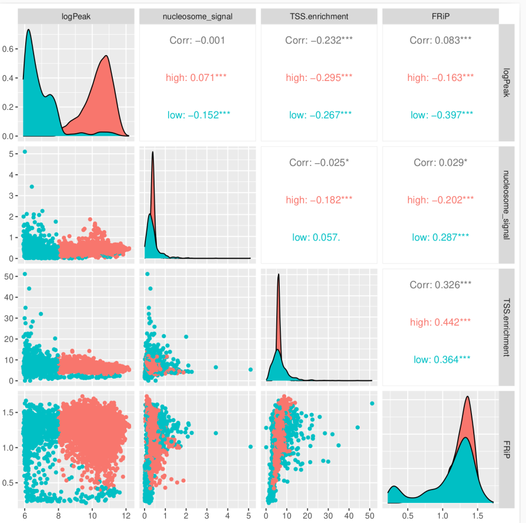

# Downstream quality control

## QC strategy
The downstream qc mainly was performed with signac. See this [post](https://gilberthan1011.github.io/blog/2024/scATAC-quality-control/) for details. Also see the example [script](./qc_script.md) for B2.

