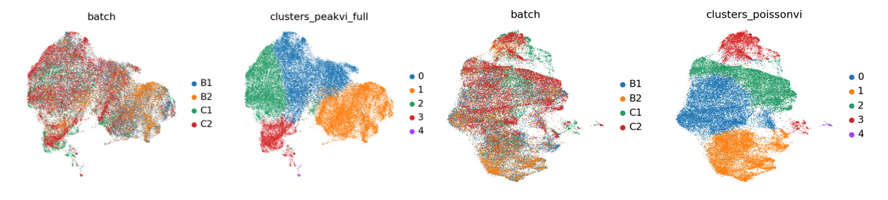

## Integration

I have compared different integration methods.

- [peakvi](script/20240717_peak_vi/7.17_peakvi_train)

- [possionvi](script/20240717_poissonvi_vi/7.17_poisson_train)

- harmony

Left is peakvi and right is possionvi.

## Compare cluster1 and cluster3
Cluster 1 enriched in E14 cells, therefore may related with mature cells.

Cluster 3 enriched E12.5 cells, therefore may related with stemness.

The original script is located at [here](script/20240718_differential_peak).

## Peak accessibility in different clusters

Here is the original [script](script/20240718_peakHM).
## Hypothesis based on scATAC

