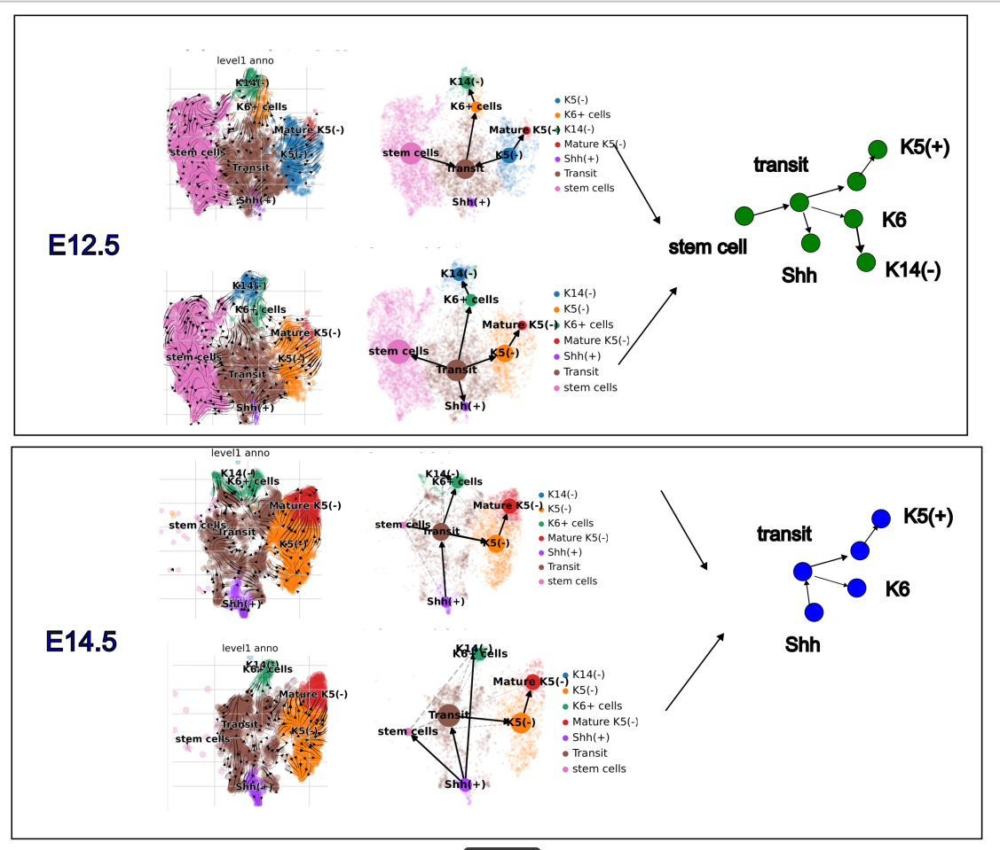
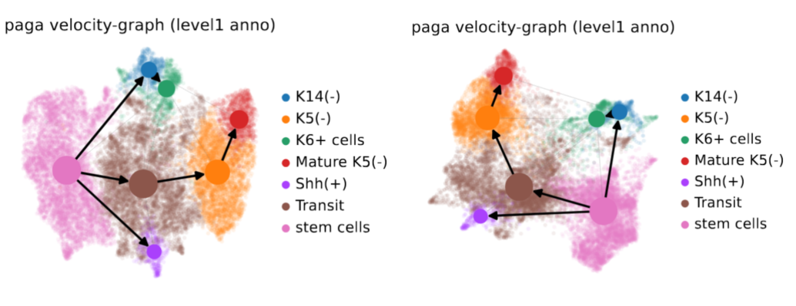
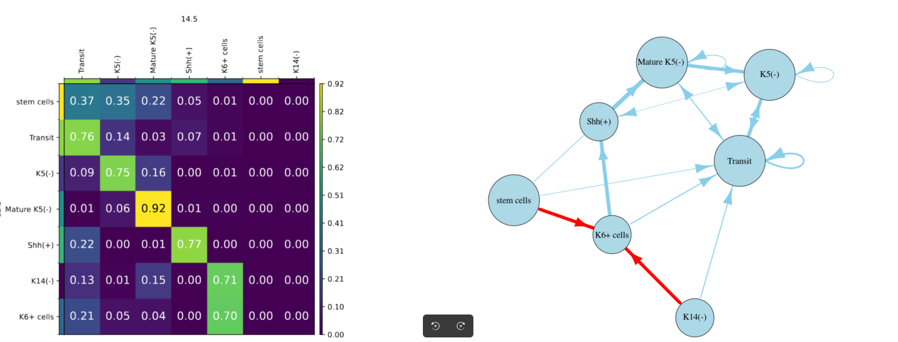
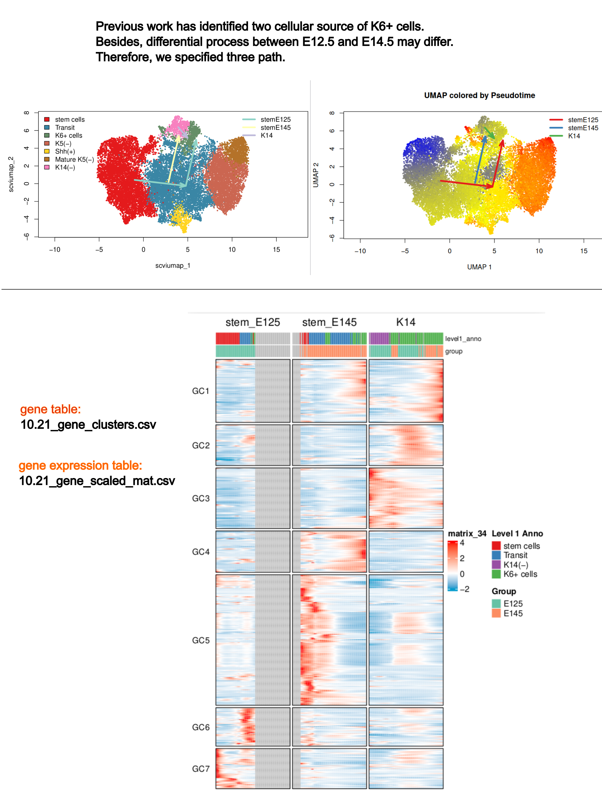
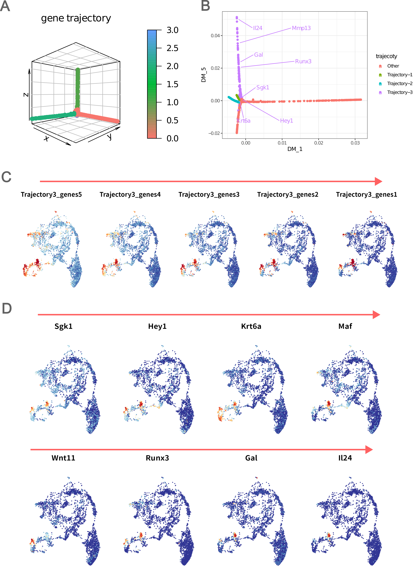

# Trajectory

## Lineage inference

### scVelo
Run scVelo by sample.
See [script](script/20240525_scVelo/5.25_velo)

Run scVelo with integrated samples. See [script](script/20241005_scVelo/20241005_velo).

### Muscot
See this [script](script/20241005_muscot/20241005_moscot) and this script for visualization in [R](script/20241005_moscot_vis).

## Gene expression along trajectory

The script is available [here](script/20241019_traj_gene).

# Gene trajectory
The script is available [here](script/20240423_genetraj).
