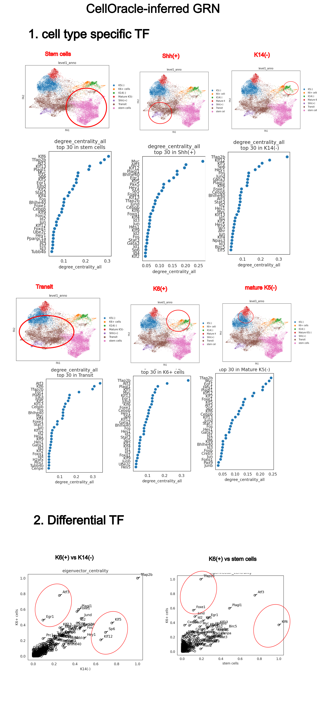
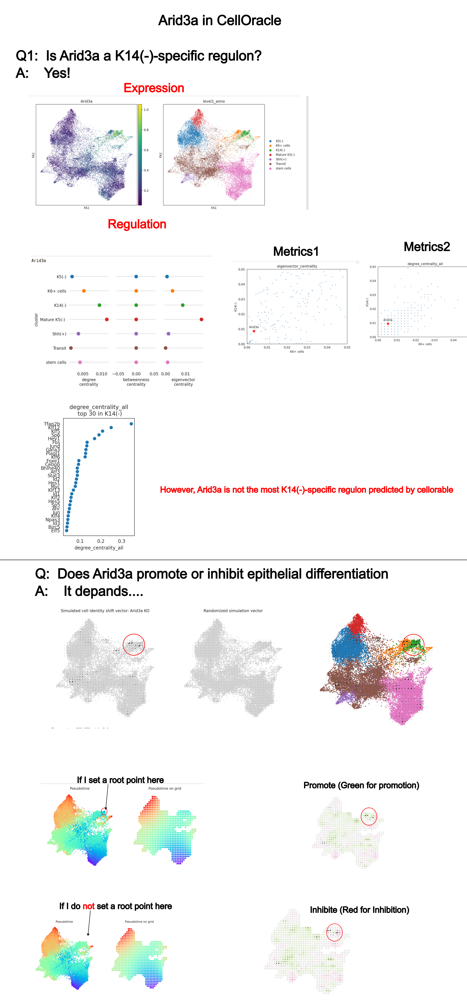
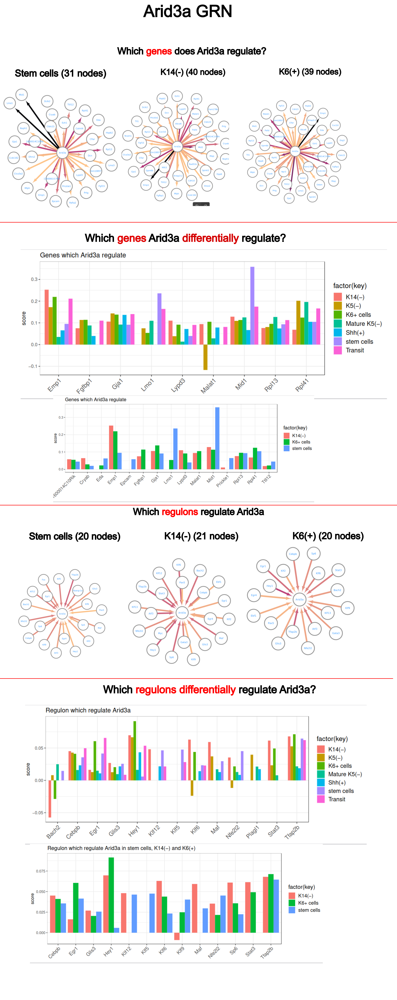
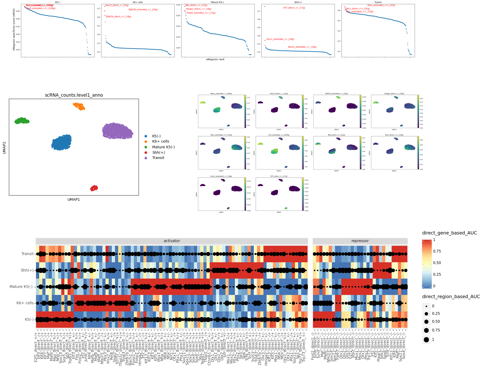
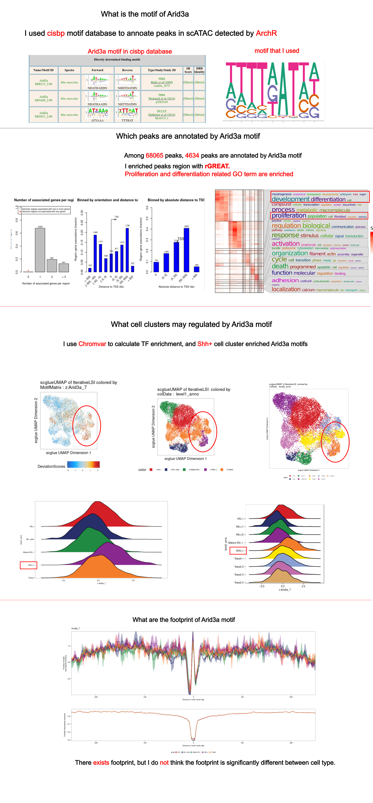

# GRN infered by celloracle

## GRN network

[script](script/20240501_celloracle_GRN/4.30_celloracle_network_construction)

## Arid3a regulation
[pertubation script](script/20240501_celloracle_pertubation/5.1_celloracle_pertubation)

The script is [here](script/20240502_regulon_arid3a).

# Scenic+ regulon

[script](script/20240504_scenic_plus)

# Motif

## Arid3a motif

[Motif detected by ArchR](script/20240505_archr_motif)

[Peak enrichment](script/20240505_rgreat_enrichment)

# DORC
[Detect DORC with cicero](script/20240430_coaccessibility).
[Detect DORC with archr](script/20240430_coaccessibility).