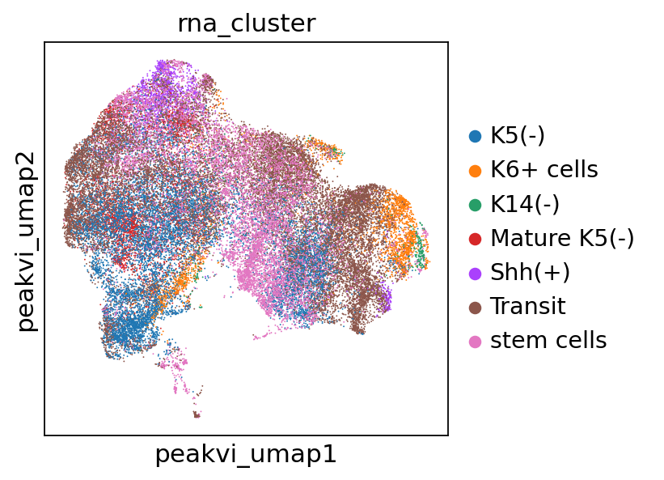

# Combine scRNA to annotate scATAC

I compared two methods.

- [Integrate four samples together with scglue](script/20240816_scATAC_integrate_combine/8.16_scATAC_integrate_all). 

-  [Integrate by timepoint with scglue](script/20241203_integrate_rna/20241202_scATAC_integration)

It turns out that the second method is better, as some cell type only occurs at one timepoint.

