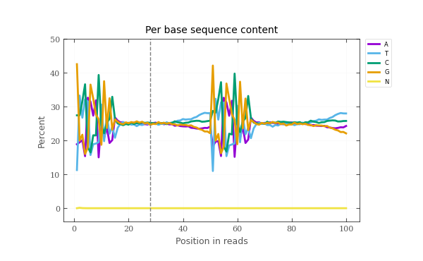
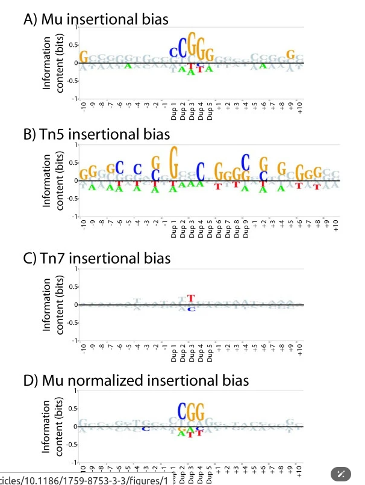
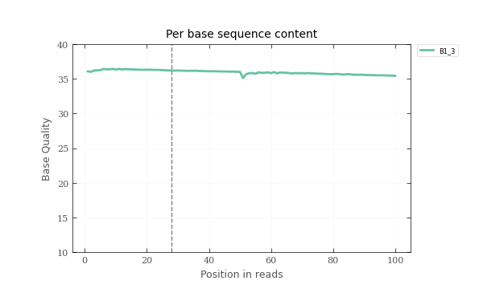

# Quality Control in Upstream

## Basic quality

## E12.5

| SampleName | LibName | ReadNum | BaseCount(bp) | ReadLength(bp) | Q20(%) | Q30(%) | GC Content(%) |
|------------|---------|---------|---------------|----------------|---------|---------|---------------|
| E12.5_1 | 1 | 146180206 | 7309010300;7309010300 | 50.0;50.0 | 98.5;98.2 | 94.8;94.7 | 53.9;54.1 |
| E12.5_1 | 2 | 116132034 | 5806601700;5806601700 | 50.0;50.0 | 98.6;98.2 | 94.9;94.8 | 54.0;54.1 |
| E12.5_1 | 3 | 140766208 | 7038310400;7038310400 | 50.0;50.0 | 98.6;98.0 | 95.0;94.3 | 54.0;54.2 |
| E12.5_1 | 4 | 142450258 | 7122512900;7122512900 | 50.0;50.0 | 98.5;98.1 | 94.7;94.5 | 54.0;54.2 |
| E12.5_2 | 1 | 95737274 | 4786863700;4786863700 | 50.0;50.0 | 98.6;98.6 | 95.1;95.8 | 50.6;50.7 |
| E12.5_2 | 2 | 92928271 | 4646413550;4646413550 | 50.0;50.0 | 98.5;98.1 | 94.8;94.5 | 50.6;50.8 |
| E12.5_2 | 3 | 125979819 | 6298990950;6298990950 | 50.0;50.0 | 98.6;98.3 | 95.0;95.1 | 50.4;50.6 |
| E12.5_2 | 4 | 172450665 | 8622533250;8622533250 | 50.0;50.0 | 98.6;98.2 | 95.0;94.7 | 50.6;50.7 |

## E14.5

| SampleName | LibName | ReadNum | BaseCount(bp) | ReadLength(bp) | Q20(%) | Q30(%) | GC Content(%) |
|------------|---------|---------|---------------|----------------|---------|---------|---------------|
| B1 | 1 | 73339481 | 3666974050;3666974050 | 50.0;50.0 | 98.3;97.0 | 95.0;92.3 | 50.9;51.0 |
| B1 | 2 | 57587238 | 2879361900;2879361900 | 50.0;50.0 | 98.5;97.8 | 95.3;94.1 | 50.9;51.1 |
| B1 | 3 | 69820706 | 3491035300;3491035300 | 50.0;50.0 | 98.4;97.0 | 95.2;92.5 | 50.8;51.0 |
| B1 | 4 | 71560709 | 3578035450;3578035450 | 50.0;50.0 | 98.4;97.6 | 95.1;93.6 | 50.9;51.1 |
| B1 | 5 | 55435628 | 2771781400;2771781400 | 50.0;50.0 | 98.9;98.5 | 96.4;95.6 | 50.9;51.2 |
| B1 | 6 | 43460764 | 2173038200;2173038200 | 50.0;50.0 | 99.1;99.0 | 97.0;96.9 | 50.9;51.1 |
| B1 | 7 | 53457235 | 2672861750;2672861750 | 50.0;50.0 | 99.1;98.5 | 96.9;95.6 | 50.9;51.2 |
| B1 | 8 | 54150857 | 2707542850;2707542850 | 50.0;50.0 | 99.0;98.9 | 96.7;96.5 | 50.9;51.1 |
| B2 | 1 | 58627626 | 2931381300;2931381300 | 50.0;50.0 | 98.8;97.8 | 96.1;93.8 | 48.6;48.8 |
| B2 | 2 | 64527957 | 3226397850;3226397850 | 50.0;50.0 | 98.5;97.7 | 95.4;93.6 | 48.6;48.8 |
| B2 | 3 | 58480736 | 2924036800;2924036800 | 50.0;50.0 | 98.6;97.9 | 95.6;94.2 | 48.6;48.8 |
| B2 | 4 | 62911132 | 3145556600;3145556600 | 50.0;50.0 | 98.5;97.7 | 95.4;93.7 | 48.6;48.8 |
| B2 | 5 | 47235049 | 2361752450;2361752450 | 50.0;50.0 | 99.3;98.7 | 97.4;96.1 | 48.5;48.7 |
| B2 | 6 | 52660687 | 2633034350;2633034350 | 50.0;50.0 | 98.9;98.6 | 96.2;95.7 | 48.5;48.7 |
| B2 | 7 | 47937360 | 2396868000;2396868000 | 50.0;50.0 | 99.1;98.8 | 96.9;96.4 | 48.5;48.8 |
| B2 | 8 | 51030207 | 2551510350;2551510350 | 50.0;50.0 | 99.0;98.6 | 96.6;96.0 | 48.6;48.8 |

# Per base sequence content

The reason of GC bias in 0-10 bp and 50-60 bp is that the Tn5 have sequence bias. See this [article](https://mobilednajournal.biomedcentral.com/articles/10.1186/1759-8753-3-3) for more information.

## Per base sequence quality

## Cell range quality
| Type | E14.5_1 | E14.5_2 |
|------|----|----|
| Estimated number of cells | 12004 | 12006 |
| Confidently mapped read pairs | 0.9126 | 0.8783 |
| Estimated bulk library complexity | 384042839.6 | 420625228.2 |
| Fraction of genome in peaks | 0.0626 | 0.0392 |
| Fraction of high-quality fragments in cells | 0.4868 | 0.2926 |
| Fraction of high-quality fragments overlapping TSS | 0.3477 | 0.2686 |
| Fraction of high-quality fragments overlapping peaks | 0.5895 | 0.3854 |
| Fraction of transposition events in peaks in cells | 0.5591 | 0.3639 |
| Fragments flanking a single nucleosome | 0.3508 | 0.2787 |
| Mean raw read pairs per cell | 39887.7556 | 36932.43 |
| Median high-quality fragments per cell | 8905.5 | 5160 |
| Non-nuclear read pairs | 0.0022 | 0.001 |
| Number of peaks | 197462 | 118277 |
| Percent duplicates | 0.4504 | 0.3993 |
| Sequencing saturation | 0.5957 | 0.5318 |
| TSS enrichment score | 8.8489 | 5.9783 |
| Valid barcodes | 0.9593 | 0.9628 |
