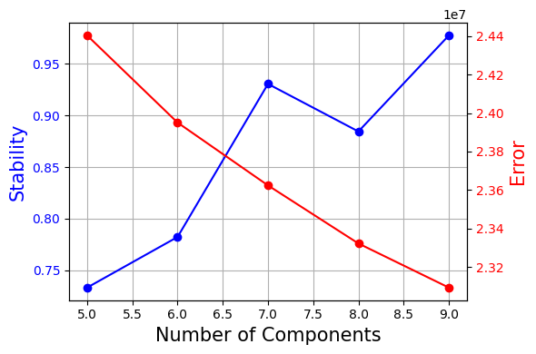
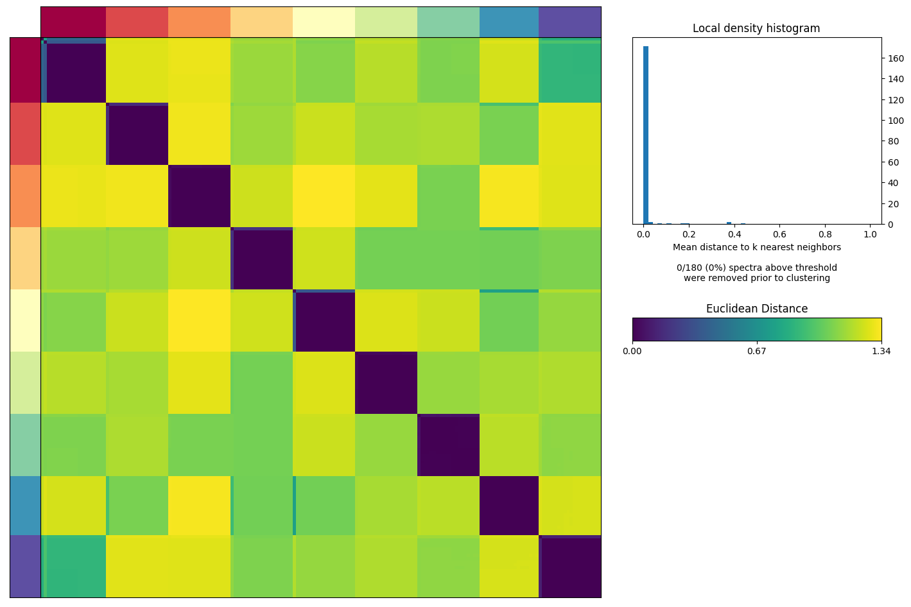
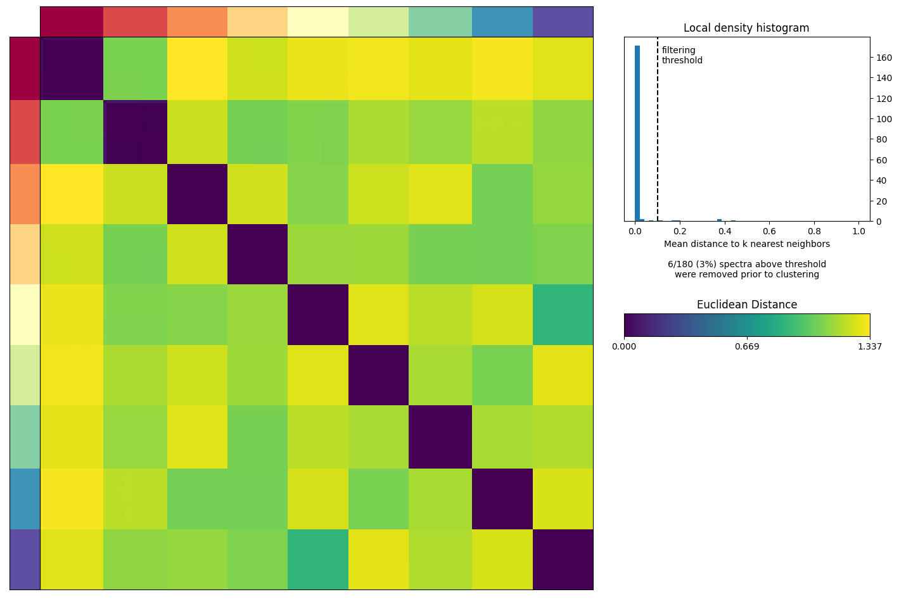
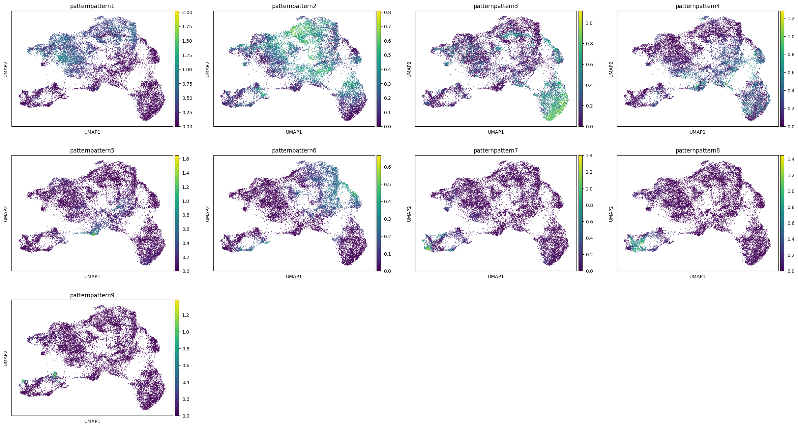

```python
!pip install cnmf
```

    Requirement already satisfied: cnmf in /home/zhanglab/mambaforge/envs/celloracle/lib/python3.9/site-packages (1.4.1)
    Requirement already satisfied: scikit-learn>=1.0 in /home/zhanglab/mambaforge/envs/celloracle/lib/python3.9/site-packages (from cnmf) (1.3.0)
    Requirement already satisfied: scanpy in /home/zhanglab/mambaforge/envs/celloracle/lib/python3.9/site-packages (from cnmf) (1.9.4)
    Requirement already satisfied: pandas in /home/zhanglab/mambaforge/envs/celloracle/lib/python3.9/site-packages (from cnmf) (2.1.1)
    Requirement already satisfied: numpy in /home/zhanglab/mambaforge/envs/celloracle/lib/python3.9/site-packages (from cnmf) (1.26.4)
    Requirement already satisfied: fastcluster in /home/zhanglab/mambaforge/envs/celloracle/lib/python3.9/site-packages (from cnmf) (1.2.6)
    Requirement already satisfied: matplotlib in /home/zhanglab/mambaforge/envs/celloracle/lib/python3.9/site-packages (from cnmf) (3.6.3)
    Requirement already satisfied: palettable in /home/zhanglab/mambaforge/envs/celloracle/lib/python3.9/site-packages (from cnmf) (3.3.0)
    Requirement already satisfied: scipy in /home/zhanglab/mambaforge/envs/celloracle/lib/python3.9/site-packages (from cnmf) (1.13.0)
    Requirement already satisfied: pyyaml in /home/zhanglab/mambaforge/envs/celloracle/lib/python3.9/site-packages (from cnmf) (6.0)
    Requirement already satisfied: joblib>=1.1.1 in /home/zhanglab/mambaforge/envs/celloracle/lib/python3.9/site-packages (from scikit-learn>=1.0->cnmf) (1.2.0)
    Requirement already satisfied: threadpoolctl>=2.0.0 in /home/zhanglab/mambaforge/envs/celloracle/lib/python3.9/site-packages (from scikit-learn>=1.0->cnmf) (2.2.0)
    Requirement already satisfied: contourpy>=1.0.1 in /home/zhanglab/mambaforge/envs/celloracle/lib/python3.9/site-packages (from matplotlib->cnmf) (1.1.0)
    Requirement already satisfied: cycler>=0.10 in /home/zhanglab/mambaforge/envs/celloracle/lib/python3.9/site-packages (from matplotlib->cnmf) (0.11.0)
    Requirement already satisfied: fonttools>=4.22.0 in /home/zhanglab/mambaforge/envs/celloracle/lib/python3.9/site-packages (from matplotlib->cnmf) (4.42.1)
    Requirement already satisfied: kiwisolver>=1.0.1 in /home/zhanglab/mambaforge/envs/celloracle/lib/python3.9/site-packages (from matplotlib->cnmf) (1.4.4)
    Requirement already satisfied: packaging>=20.0 in /home/zhanglab/mambaforge/envs/celloracle/lib/python3.9/site-packages (from matplotlib->cnmf) (23.1)
    Requirement already satisfied: pillow>=6.2.0 in /home/zhanglab/mambaforge/envs/celloracle/lib/python3.9/site-packages (from matplotlib->cnmf) (9.4.0)
    Requirement already satisfied: pyparsing>=2.2.1 in /home/zhanglab/mambaforge/envs/celloracle/lib/python3.9/site-packages (from matplotlib->cnmf) (3.0.9)
    Requirement already satisfied: python-dateutil>=2.7 in /home/zhanglab/mambaforge/envs/celloracle/lib/python3.9/site-packages (from matplotlib->cnmf) (2.8.2)
    Requirement already satisfied: pytz>=2020.1 in /home/zhanglab/mambaforge/envs/celloracle/lib/python3.9/site-packages (from pandas->cnmf) (2022.7)
    Requirement already satisfied: tzdata>=2022.1 in /home/zhanglab/mambaforge/envs/celloracle/lib/python3.9/site-packages (from pandas->cnmf) (2024.1)
    Requirement already satisfied: anndata>=0.7.4 in /home/zhanglab/mambaforge/envs/celloracle/lib/python3.9/site-packages (from scanpy->cnmf) (0.10.6)
    Requirement already satisfied: seaborn in /home/zhanglab/mambaforge/envs/celloracle/lib/python3.9/site-packages (from scanpy->cnmf) (0.11.2)
    Requirement already satisfied: h5py>=3 in /home/zhanglab/mambaforge/envs/celloracle/lib/python3.9/site-packages (from scanpy->cnmf) (3.9.0)
    Requirement already satisfied: tqdm in /home/zhanglab/mambaforge/envs/celloracle/lib/python3.9/site-packages (from scanpy->cnmf) (4.65.0)
    Requirement already satisfied: statsmodels>=0.10.0rc2 in /home/zhanglab/mambaforge/envs/celloracle/lib/python3.9/site-packages (from scanpy->cnmf) (0.14.0)
    Requirement already satisfied: patsy in /home/zhanglab/mambaforge/envs/celloracle/lib/python3.9/site-packages (from scanpy->cnmf) (0.5.3)
    Requirement already satisfied: networkx>=2.3 in /home/zhanglab/mambaforge/envs/celloracle/lib/python3.9/site-packages (from scanpy->cnmf) (2.8.8)
    Requirement already satisfied: natsort in /home/zhanglab/mambaforge/envs/celloracle/lib/python3.9/site-packages (from scanpy->cnmf) (8.4.0)
    Requirement already satisfied: numba>=0.41.0 in /home/zhanglab/mambaforge/envs/celloracle/lib/python3.9/site-packages (from scanpy->cnmf) (0.57.1)
    Requirement already satisfied: umap-learn>=0.3.10 in /home/zhanglab/mambaforge/envs/celloracle/lib/python3.9/site-packages (from scanpy->cnmf) (0.5.3)
    Requirement already satisfied: session-info in /home/zhanglab/mambaforge/envs/celloracle/lib/python3.9/site-packages (from scanpy->cnmf) (1.0.0)
    Requirement already satisfied: array-api-compat!=1.5,>1.4 in /home/zhanglab/mambaforge/envs/celloracle/lib/python3.9/site-packages (from anndata>=0.7.4->scanpy->cnmf) (1.6)
    Requirement already satisfied: exceptiongroup in /home/zhanglab/mambaforge/envs/celloracle/lib/python3.9/site-packages (from anndata>=0.7.4->scanpy->cnmf) (1.1.3)
    Requirement already satisfied: llvmlite<0.41,>=0.40.0dev0 in /home/zhanglab/mambaforge/envs/celloracle/lib/python3.9/site-packages (from numba>=0.41.0->scanpy->cnmf) (0.40.1)


```python

import scanpy as sc
from cnmf import cNMF
import numpy as np
import pandas as pd
```


```python
!mkdir ../result/geneModule
```


```python
sc.settings.figdir = "../result/geneModule"
```


```python
numiter=20 ## Set this to a larger value for real data. We set this to a low value here for illustration
numworkers=1 ## Set this to a larger value and use the parallel code cells to try out parallelization
numhvgenes=1500 ## Number of over-dispersed genes to use for running the factorizations
K = np.arange(5,10)

## Results will be saved to [output_directory]/[run_name] which in this example is simulated_example_data/example_cNMF
output_directory = '../processed_data/geneModule/cNMF/'
run_name = '424_cNMF'

countfn = '../data/palate_epi_MAGIC_periderm_MAGIC_harmony_renamed.h5ad'
seed = 14
```


```python
adata = sc.read('../data/palate_epi_MAGIC_periderm_MAGIC_harmony_renamed.h5ad')
```

    /home/zhanglab/mambaforge/envs/py311/lib/python3.11/site-packages/anndata/__init__.py:51: FutureWarning: `anndata.read` is deprecated, use `anndata.read_h5ad` instead. `ad.read` will be removed in mid 2024.
      warnings.warn(


```python
cnmf_obj = cNMF(output_dir=output_directory, name=run_name)
```


```python
cnmf_obj.prepare(counts_fn=countfn, components=K, n_iter=numiter, seed=seed, num_highvar_genes=numhvgenes)
```

    /home/zhanglab/mambaforge/envs/py311/lib/python3.11/site-packages/anndata/__init__.py:51: FutureWarning: `anndata.read` is deprecated, use `anndata.read_h5ad` instead. `ad.read` will be removed in mid 2024.
      warnings.warn(
    /home/zhanglab/mambaforge/envs/py311/lib/python3.11/site-packages/cnmf/cnmf.py:83: FutureWarning: The behavior of `series[i:j]` with an integer-dtype index is deprecated. In a future version, this will be treated as *label-based* indexing, consistent with e.g. `series[i]` lookups. To retain the old behavior, use `series.iloc[i:j]`. To get the future behavior, use `series.loc[i:j]`.
      top_genes = gene_mean.sort_values(ascending=False)[:20].index
    /home/zhanglab/mambaforge/envs/py311/lib/python3.11/site-packages/scanpy/preprocessing/_simple.py:843: UserWarning: Revieved a view of an AnnData. Making a copy.
      view_to_actual(adata)


```python
cnmf_obj.factorize()
```

    /home/zhanglab/mambaforge/envs/py311/lib/python3.11/site-packages/anndata/__init__.py:51: FutureWarning: `anndata.read` is deprecated, use `anndata.read_h5ad` instead. `ad.read` will be removed in mid 2024.
      warnings.warn(


    [Worker 0]. Starting task 0.
    [Worker 0]. Starting task 1.
    [Worker 0]. Starting task 2.
    [Worker 0]. Starting task 3.
    [Worker 0]. Starting task 4.
    [Worker 0]. Starting task 5.
    [Worker 0]. Starting task 6.
    [Worker 0]. Starting task 7.
    [Worker 0]. Starting task 8.
    [Worker 0]. Starting task 9.
    [Worker 0]. Starting task 10.
    [Worker 0]. Starting task 11.
    [Worker 0]. Starting task 12.
    [Worker 0]. Starting task 13.
    [Worker 0]. Starting task 14.
    [Worker 0]. Starting task 15.
    [Worker 0]. Starting task 16.
    [Worker 0]. Starting task 17.
    [Worker 0]. Starting task 18.
    [Worker 0]. Starting task 19.
    [Worker 0]. Starting task 20.
    [Worker 0]. Starting task 21.
    [Worker 0]. Starting task 22.
    [Worker 0]. Starting task 23.
    [Worker 0]. Starting task 24.
    [Worker 0]. Starting task 25.
    [Worker 0]. Starting task 26.
    [Worker 0]. Starting task 27.
    [Worker 0]. Starting task 28.
    [Worker 0]. Starting task 29.
    [Worker 0]. Starting task 30.
    [Worker 0]. Starting task 31.
    [Worker 0]. Starting task 32.
    [Worker 0]. Starting task 33.
    [Worker 0]. Starting task 34.
    [Worker 0]. Starting task 35.
    [Worker 0]. Starting task 36.
    [Worker 0]. Starting task 37.
    [Worker 0]. Starting task 38.
    [Worker 0]. Starting task 39.
    [Worker 0]. Starting task 40.
    [Worker 0]. Starting task 41.
    [Worker 0]. Starting task 42.
    [Worker 0]. Starting task 43.
    [Worker 0]. Starting task 44.
    [Worker 0]. Starting task 45.
    [Worker 0]. Starting task 46.
    [Worker 0]. Starting task 47.
    [Worker 0]. Starting task 48.
    [Worker 0]. Starting task 49.
    [Worker 0]. Starting task 50.
    [Worker 0]. Starting task 51.
    [Worker 0]. Starting task 52.
    [Worker 0]. Starting task 53.
    [Worker 0]. Starting task 54.
    [Worker 0]. Starting task 55.
    [Worker 0]. Starting task 56.
    [Worker 0]. Starting task 57.
    [Worker 0]. Starting task 58.
    [Worker 0]. Starting task 59.
    [Worker 0]. Starting task 60.
    [Worker 0]. Starting task 61.
    [Worker 0]. Starting task 62.
    [Worker 0]. Starting task 63.
    [Worker 0]. Starting task 64.
    [Worker 0]. Starting task 65.
    [Worker 0]. Starting task 66.
    [Worker 0]. Starting task 67.
    [Worker 0]. Starting task 68.
    [Worker 0]. Starting task 69.
    [Worker 0]. Starting task 70.
    [Worker 0]. Starting task 71.
    [Worker 0]. Starting task 72.
    [Worker 0]. Starting task 73.
    [Worker 0]. Starting task 74.
    [Worker 0]. Starting task 75.
    [Worker 0]. Starting task 76.
    [Worker 0]. Starting task 77.
    [Worker 0]. Starting task 78.
    [Worker 0]. Starting task 79.
    [Worker 0]. Starting task 80.
    [Worker 0]. Starting task 81.
    [Worker 0]. Starting task 82.
    [Worker 0]. Starting task 83.
    [Worker 0]. Starting task 84.
    [Worker 0]. Starting task 85.
    [Worker 0]. Starting task 86.
    [Worker 0]. Starting task 87.
    [Worker 0]. Starting task 88.
    [Worker 0]. Starting task 89.
    [Worker 0]. Starting task 90.
    [Worker 0]. Starting task 91.
    [Worker 0]. Starting task 92.
    [Worker 0]. Starting task 93.
    [Worker 0]. Starting task 94.
    [Worker 0]. Starting task 95.
    [Worker 0]. Starting task 96.
    [Worker 0]. Starting task 97.
    [Worker 0]. Starting task 98.
    [Worker 0]. Starting task 99.


```python
cnmf_obj.combine(skip_missing_files=True)
```

    Combining factorizations for k=5.
    Combining factorizations for k=6.
    Combining factorizations for k=7.
    Combining factorizations for k=8.
    Combining factorizations for k=9.


```python
cnmf_obj.k_selection_plot()
```

    /home/zhanglab/mambaforge/envs/py311/lib/python3.11/site-packages/anndata/__init__.py:51: FutureWarning: `anndata.read` is deprecated, use `anndata.read_h5ad` instead. `ad.read` will be removed in mid 2024.
      warnings.warn(
    /home/zhanglab/mambaforge/envs/py311/lib/python3.11/site-packages/anndata/__init__.py:51: FutureWarning: `anndata.read` is deprecated, use `anndata.read_h5ad` instead. `ad.read` will be removed in mid 2024.
      warnings.warn(
    /home/zhanglab/mambaforge/envs/py311/lib/python3.11/site-packages/anndata/__init__.py:51: FutureWarning: `anndata.read` is deprecated, use `anndata.read_h5ad` instead. `ad.read` will be removed in mid 2024.
      warnings.warn(
    /home/zhanglab/mambaforge/envs/py311/lib/python3.11/site-packages/anndata/__init__.py:51: FutureWarning: `anndata.read` is deprecated, use `anndata.read_h5ad` instead. `ad.read` will be removed in mid 2024.
      warnings.warn(
    /home/zhanglab/mambaforge/envs/py311/lib/python3.11/site-packages/anndata/__init__.py:51: FutureWarning: `anndata.read` is deprecated, use `anndata.read_h5ad` instead. `ad.read` will be removed in mid 2024.
      warnings.warn(


    

    


```python
selected_K = 9
## Setting density_threshold to 2.0 avoids any filtering
cnmf_obj.consensus(k=selected_K, density_threshold=2.0, show_clustering=True)
```

    /home/zhanglab/mambaforge/envs/py311/lib/python3.11/site-packages/anndata/__init__.py:51: FutureWarning: `anndata.read` is deprecated, use `anndata.read_h5ad` instead. `ad.read` will be removed in mid 2024.
      warnings.warn(
    /home/zhanglab/mambaforge/envs/py311/lib/python3.11/site-packages/anndata/__init__.py:51: FutureWarning: `anndata.read` is deprecated, use `anndata.read_h5ad` instead. `ad.read` will be removed in mid 2024.
      warnings.warn(
    /home/zhanglab/mambaforge/envs/py311/lib/python3.11/site-packages/cnmf/cnmf.py:835: RuntimeWarning: invalid value encountered in divide
      norm_tpm = (np.array(tpm.X.todense()) - tpm_stats['__mean'].values) / tpm_stats['__std'].values
    /home/zhanglab/mambaforge/envs/py311/lib/python3.11/site-packages/scanpy/preprocessing/_simple.py:843: UserWarning: Revieved a view of an AnnData. Making a copy.
      view_to_actual(adata)


    

    


```python
cnmf_obj.consensus(k=selected_K, density_threshold=0.1, show_clustering=True)
```

    /home/zhanglab/mambaforge/envs/py311/lib/python3.11/site-packages/anndata/__init__.py:51: FutureWarning: `anndata.read` is deprecated, use `anndata.read_h5ad` instead. `ad.read` will be removed in mid 2024.
      warnings.warn(
    /home/zhanglab/mambaforge/envs/py311/lib/python3.11/site-packages/anndata/__init__.py:51: FutureWarning: `anndata.read` is deprecated, use `anndata.read_h5ad` instead. `ad.read` will be removed in mid 2024.
      warnings.warn(
    /home/zhanglab/mambaforge/envs/py311/lib/python3.11/site-packages/cnmf/cnmf.py:835: RuntimeWarning: invalid value encountered in divide
      norm_tpm = (np.array(tpm.X.todense()) - tpm_stats['__mean'].values) / tpm_stats['__std'].values
    /home/zhanglab/mambaforge/envs/py311/lib/python3.11/site-packages/scanpy/preprocessing/_simple.py:843: UserWarning: Revieved a view of an AnnData. Making a copy.
      view_to_actual(adata)


    

    


```python
usage_matrix_file = cnmf_obj.paths['consensus_usages__txt'] % (selected_K, '0_1')
gene_scores_file = cnmf_obj.paths['gene_spectra_score__txt'] % (selected_K, '0_1')
usage=pd.read_table(usage_matrix_file,index_col=0)
genescore=pd.read_table(gene_scores_file,index_col=0)
```


```python
genescore = genescore.T
```


```python
genescore.to_csv("../processed_data/geneModule/cNMF/424_cNMF/geneModule.csv")
```


```python
adata.obsm["X_umap"] = adata.obsm["UMAP"]
```


```python
usage.columns = "pattern" + usage.columns.astype("str")
adata.obs[usage.columns] = usage
sc.pl.umap(adata,color=usage.columns)
```


    

    


```python
sc.pl.umap(adata,color=usage.columns,save="_cNMF_gene_pattern")
```

    WARNING: saving figure to file ../result/geneModule/umap_cNMF_gene_pattern.pdf


    

    


