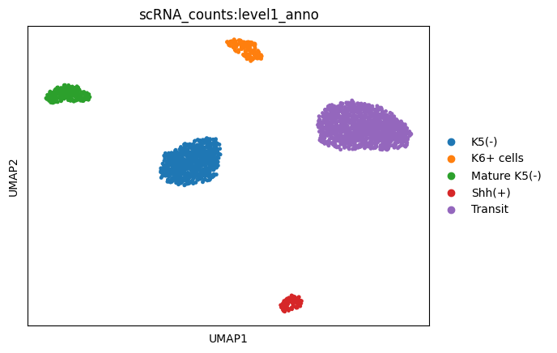
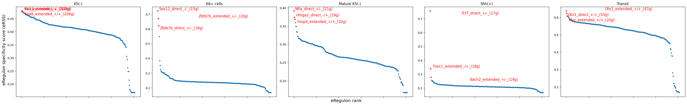
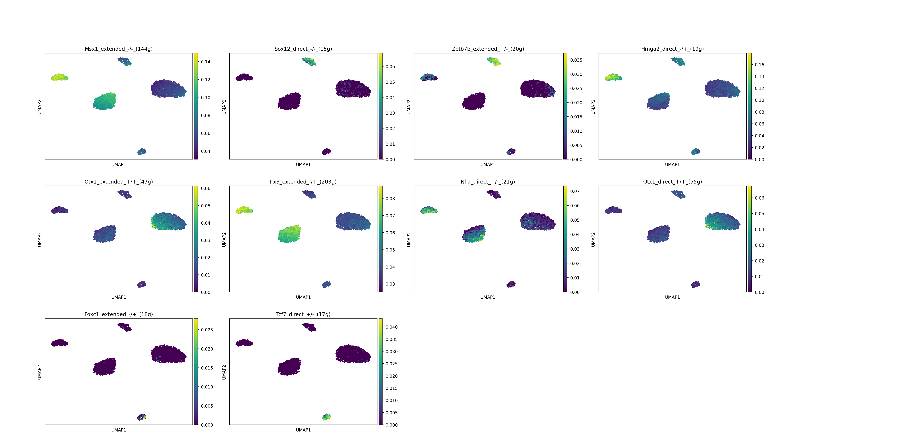
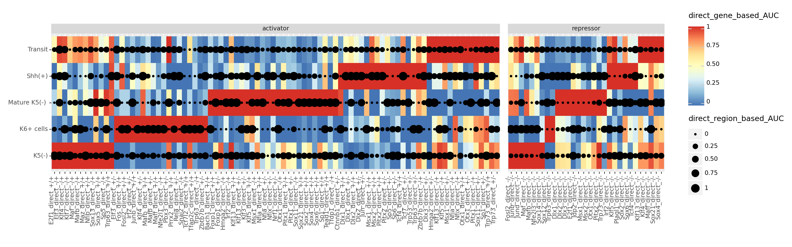

```python
import mudata
scplus_mdata = mudata.read("../result/scenic_plus/ACC_GEX.h5mu")
```

    /home/gilberthan/anaconda3/envs/py311/lib/python3.11/site-packages/anndata/_core/anndata.py:522: FutureWarning: The dtype argument is deprecated and will be removed in late 2024.
      warnings.warn(
    /home/gilberthan/anaconda3/envs/py311/lib/python3.11/site-packages/anndata/_core/anndata.py:522: FutureWarning: The dtype argument is deprecated and will be removed in late 2024.
      warnings.warn(


```python
scplus_mdata = mudata.read("../result/scenic_plus/scplusmdata.h5mu")
```

    /home/gilberthan/anaconda3/envs/py311/lib/python3.11/site-packages/anndata/_core/anndata.py:522: FutureWarning: The dtype argument is deprecated and will be removed in late 2024.
      warnings.warn(
    /home/gilberthan/anaconda3/envs/py311/lib/python3.11/site-packages/anndata/_core/anndata.py:522: FutureWarning: The dtype argument is deprecated and will be removed in late 2024.
      warnings.warn(
    /home/gilberthan/anaconda3/envs/py311/lib/python3.11/site-packages/anndata/_core/anndata.py:522: FutureWarning: The dtype argument is deprecated and will be removed in late 2024.
      warnings.warn(
    /home/gilberthan/anaconda3/envs/py311/lib/python3.11/site-packages/anndata/_core/anndata.py:522: FutureWarning: The dtype argument is deprecated and will be removed in late 2024.
      warnings.warn(
    /home/gilberthan/anaconda3/envs/py311/lib/python3.11/site-packages/anndata/_core/anndata.py:522: FutureWarning: The dtype argument is deprecated and will be removed in late 2024.
      warnings.warn(
    /home/gilberthan/anaconda3/envs/py311/lib/python3.11/site-packages/anndata/_core/anndata.py:522: FutureWarning: The dtype argument is deprecated and will be removed in late 2024.
      warnings.warn(


```python
scplus_mdata
```


<pre>MuData object with n_obs × n_vars = 2450 × 407439
  uns:	&#x27;direct_e_regulon_metadata&#x27;, &#x27;extended_e_regulon_metadata&#x27;
  6 modalities
    scRNA_counts:	2450 x 23143
      obs:	&#x27;level1_anno&#x27;
    scATAC_counts:	2450 x 383748
      obs:	&#x27;level1_anno&#x27;
      var:	&#x27;Chromosome&#x27;, &#x27;Start&#x27;, &#x27;End&#x27;, &#x27;Width&#x27;, &#x27;cisTopic_nr_frag&#x27;, &#x27;cisTopic_log_nr_frag&#x27;, &#x27;cisTopic_nr_acc&#x27;, &#x27;cisTopic_log_nr_acc&#x27;
    direct_gene_based_AUC:	2450 x 124
    direct_region_based_AUC:	2450 x 124
    extended_gene_based_AUC:	2450 x 150
    extended_region_based_AUC:	2450 x 150</pre>


```python
scplus_mdata.uns["direct_e_regulon_metadata"]
```


<div>
<style scoped>
    .dataframe tbody tr th:only-of-type {
        vertical-align: middle;
    }

    .dataframe tbody tr th {
        vertical-align: top;
    }

    .dataframe thead th {
        text-align: right;
    }
</style>
<table border="1" class="dataframe">
  <thead>
    <tr style="text-align: right;">
      <th></th>
      <th>Region</th>
      <th>Gene</th>
      <th>importance_R2G</th>
      <th>rho_R2G</th>
      <th>importance_x_rho</th>
      <th>importance_x_abs_rho</th>
      <th>TF</th>
      <th>is_extended</th>
      <th>eRegulon_name</th>
      <th>Gene_signature_name</th>
      <th>Region_signature_name</th>
      <th>importance_TF2G</th>
      <th>regulation</th>
      <th>rho_TF2G</th>
      <th>triplet_rank</th>
    </tr>
  </thead>
  <tbody>
    <tr>
      <th>0</th>
      <td>chr18:11999511-12000011</td>
      <td>Tmem241</td>
      <td>0.012982</td>
      <td>0.084915</td>
      <td>0.001102</td>
      <td>0.001102</td>
      <td>Bach1</td>
      <td>False</td>
      <td>Bach1_direct_+/+</td>
      <td>Bach1_direct_+/+_(57g)</td>
      <td>Bach1_direct_+/+_(109r)</td>
      <td>0.256760</td>
      <td>1</td>
      <td>0.076844</td>
      <td>19957</td>
    </tr>
    <tr>
      <th>1</th>
      <td>chr4:40821498-40821998</td>
      <td>B4galt1</td>
      <td>0.018922</td>
      <td>0.070728</td>
      <td>0.001338</td>
      <td>0.001338</td>
      <td>Bach1</td>
      <td>False</td>
      <td>Bach1_direct_+/+</td>
      <td>Bach1_direct_+/+_(57g)</td>
      <td>Bach1_direct_+/+_(109r)</td>
      <td>0.255826</td>
      <td>1</td>
      <td>0.066270</td>
      <td>21914</td>
    </tr>
    <tr>
      <th>2</th>
      <td>chr12:74160785-74161285</td>
      <td>Snapc1</td>
      <td>0.039339</td>
      <td>0.060104</td>
      <td>0.002364</td>
      <td>0.002364</td>
      <td>Bach1</td>
      <td>False</td>
      <td>Bach1_direct_+/+</td>
      <td>Bach1_direct_+/+_(57g)</td>
      <td>Bach1_direct_+/+_(109r)</td>
      <td>0.207735</td>
      <td>1</td>
      <td>0.060181</td>
      <td>13574</td>
    </tr>
    <tr>
      <th>3</th>
      <td>chr16:87658414-87658914</td>
      <td>Bach1</td>
      <td>0.020186</td>
      <td>0.180827</td>
      <td>0.003650</td>
      <td>0.003650</td>
      <td>Bach1</td>
      <td>False</td>
      <td>Bach1_direct_+/+</td>
      <td>Bach1_direct_+/+_(57g)</td>
      <td>Bach1_direct_+/+_(109r)</td>
      <td>5.168038</td>
      <td>1</td>
      <td>1.000000</td>
      <td>1832</td>
    </tr>
    <tr>
      <th>4</th>
      <td>chr7:43399455-43399955</td>
      <td>Klk4</td>
      <td>0.021354</td>
      <td>0.095418</td>
      <td>0.002038</td>
      <td>0.002038</td>
      <td>Bach1</td>
      <td>False</td>
      <td>Bach1_direct_+/+</td>
      <td>Bach1_direct_+/+_(57g)</td>
      <td>Bach1_direct_+/+_(109r)</td>
      <td>0.293177</td>
      <td>1</td>
      <td>0.077021</td>
      <td>4652</td>
    </tr>
    <tr>
      <th>...</th>
      <td>...</td>
      <td>...</td>
      <td>...</td>
      <td>...</td>
      <td>...</td>
      <td>...</td>
      <td>...</td>
      <td>...</td>
      <td>...</td>
      <td>...</td>
      <td>...</td>
      <td>...</td>
      <td>...</td>
      <td>...</td>
      <td>...</td>
    </tr>
    <tr>
      <th>23854</th>
      <td>chr11:115957972-115958472</td>
      <td>Mrpl38</td>
      <td>0.008459</td>
      <td>-0.057464</td>
      <td>-0.000486</td>
      <td>0.000486</td>
      <td>Trp73</td>
      <td>False</td>
      <td>Trp73_direct_-/-</td>
      <td>Trp73_direct_-/-_(186g)</td>
      <td>Trp73_direct_-/-_(228r)</td>
      <td>0.589785</td>
      <td>-1</td>
      <td>-0.081691</td>
      <td>18536</td>
    </tr>
    <tr>
      <th>23855</th>
      <td>chr4:140665693-140666193</td>
      <td>Atp13a2</td>
      <td>0.005701</td>
      <td>-0.151556</td>
      <td>-0.000864</td>
      <td>0.000864</td>
      <td>Trp73</td>
      <td>False</td>
      <td>Trp73_direct_-/-</td>
      <td>Trp73_direct_-/-_(186g)</td>
      <td>Trp73_direct_-/-_(228r)</td>
      <td>0.286929</td>
      <td>-1</td>
      <td>-0.144744</td>
      <td>22575</td>
    </tr>
    <tr>
      <th>23856</th>
      <td>chr2:155885078-155885578</td>
      <td>Rbm39</td>
      <td>0.026072</td>
      <td>-0.206381</td>
      <td>-0.005381</td>
      <td>0.005381</td>
      <td>Trp73</td>
      <td>False</td>
      <td>Trp73_direct_-/-</td>
      <td>Trp73_direct_-/-_(186g)</td>
      <td>Trp73_direct_-/-_(228r)</td>
      <td>0.989342</td>
      <td>-1</td>
      <td>-0.204798</td>
      <td>16603</td>
    </tr>
    <tr>
      <th>23857</th>
      <td>chr13:46598970-46599470</td>
      <td>Rbm24</td>
      <td>0.070009</td>
      <td>-0.175083</td>
      <td>-0.012257</td>
      <td>0.012257</td>
      <td>Trp73</td>
      <td>False</td>
      <td>Trp73_direct_-/-</td>
      <td>Trp73_direct_-/-_(186g)</td>
      <td>Trp73_direct_-/-_(228r)</td>
      <td>0.287142</td>
      <td>-1</td>
      <td>-0.163071</td>
      <td>9573</td>
    </tr>
    <tr>
      <th>23858</th>
      <td>chr14:67216376-67216876</td>
      <td>Bnip3l</td>
      <td>0.020319</td>
      <td>-0.154238</td>
      <td>-0.003134</td>
      <td>0.003134</td>
      <td>Trp73</td>
      <td>False</td>
      <td>Trp73_direct_-/-</td>
      <td>Trp73_direct_-/-_(186g)</td>
      <td>Trp73_direct_-/-_(228r)</td>
      <td>0.331134</td>
      <td>-1</td>
      <td>-0.207646</td>
      <td>15469</td>
    </tr>
  </tbody>
</table>
<p>23859 rows × 15 columns</p>
</div>


```python
scplus_mdata["direct_gene_based_AUC"].var_names
```


    Index(['Bach1_direct_+/+_(57g)', 'Ctnnb1_direct_+/-_(17g)',
           'Ctnnb1_direct_-/+_(29g)', 'Dlx1_direct_+/+_(302g)',
           'Dlx1_direct_+/-_(63g)', 'Dlx1_direct_-/-_(283g)',
           'Dlx2_direct_+/+_(608g)', 'Dlx2_direct_+/-_(105g)',
           'Dlx2_direct_-/-_(533g)', 'Dlx3_direct_+/-_(16g)',
           ...
           'Trp63_direct_+/+_(169g)', 'Trp63_direct_+/-_(125g)',
           'Trp63_direct_-/+_(362g)', 'Trp63_direct_-/-_(304g)',
           'Trp73_direct_+/+_(263g)', 'Trp73_direct_+/-_(94g)',
           'Trp73_direct_-/-_(186g)', 'Twist1_direct_+/+_(16g)',
           'Zbtb7b_direct_+/-_(18g)', 'Zbtb7b_direct_-/+_(24g)'],
          dtype='object', length=124)


```python
eRegulon_gene_AUC.var_names[0:50]
```


    Index(['Bach1_direct_+/+_(57g)', 'Ctnnb1_direct_+/-_(17g)',
           'Ctnnb1_direct_-/+_(29g)', 'Dlx1_direct_+/+_(302g)',
           'Dlx1_direct_+/-_(63g)', 'Dlx1_direct_-/-_(283g)',
           'Dlx2_direct_+/+_(608g)', 'Dlx2_direct_+/-_(105g)',
           'Dlx2_direct_-/-_(533g)', 'Dlx3_direct_+/-_(16g)',
           'Dlx3_direct_-/-_(271g)', 'E2f1_direct_+/+_(80g)',
           'E2f1_direct_-/-_(22g)', 'Elf3_direct_+/-_(124g)',
           'Elf3_direct_-/+_(53g)', 'Fos_direct_+/+_(154g)',
           'Fosl2_direct_+/+_(286g)', 'Fosl2_direct_-/-_(18g)',
           'Foxp1_direct_+/+_(49g)', 'Foxp1_direct_+/-_(86g)',
           'Gbx1_direct_+/+_(16g)', 'Hmga2_direct_+/-_(23g)',
           'Hmga2_direct_-/+_(19g)', 'Hoxa3_direct_+/-_(11g)',
           'Irf2_direct_+/-_(112g)', 'Irf2_direct_-/+_(58g)',
           'Irf2_direct_-/-_(20g)', 'Jdp2_direct_-/-_(33g)',
           'Jun_direct_+/-_(47g)', 'Junb_direct_+/+_(417g)',
           'Junb_direct_-/-_(226g)', 'Jund_direct_-/-_(162g)',
           'Klf13_direct_+/+_(347g)', 'Klf13_direct_+/-_(233g)',
           'Klf13_direct_-/+_(255g)', 'Klf13_direct_-/-_(318g)',
           'Klf3_direct_+/-_(134g)', 'Klf4_direct_+/-_(115g)',
           'Klf4_direct_-/+_(244g)', 'Klf4_direct_-/-_(253g)',
           'Klf5_direct_+/+_(313g)', 'Klf5_direct_-/+_(103g)',
           'Klf5_direct_-/-_(332g)', 'Klf7_direct_-/+_(174g)',
           'Lhx1_direct_+/+_(11g)', 'Lhx4_direct_+/+_(27g)',
           'Maf_direct_-/+_(19g)', 'Maf_direct_-/-_(279g)',
           'Mafb_direct_+/+_(376g)', 'Mafb_direct_+/-_(18g)'],
          dtype='object')


```python
eRegulon_gene_AUC.var_names[51:100]
```


    Index(['Mafb_direct_-/-_(303g)', 'Maff_direct_+/+_(256g)',
           'Maff_direct_-/-_(28g)', 'Maz_direct_+/+_(51g)',
           'Msx1_direct_+/+_(218g)', 'Msx1_direct_+/-_(48g)',
           'Msx1_direct_-/+_(16g)', 'Msx1_direct_-/-_(167g)',
           'Msx2_direct_+/+_(199g)', 'Msx2_direct_-/-_(208g)',
           'Nfe2l1_direct_-/+_(33g)', 'Nfe2l3_direct_-/-_(59g)',
           'Nfia_direct_+/+_(56g)', 'Nfia_direct_+/-_(21g)',
           'Nfia_direct_-/+_(17g)', 'Nfib_direct_+/+_(98g)',
           'Nfix_direct_+/-_(63g)', 'Nfix_direct_-/+_(97g)',
           'Nrf1_direct_+/-_(21g)', 'Otx1_direct_+/+_(55g)',
           'Otx1_direct_+/-_(71g)', 'Otx1_direct_-/+_(36g)',
           'Otx1_direct_-/-_(43g)', 'Pbx3_direct_+/-_(24g)',
           'Pitx1_direct_+/+_(404g)', 'Pitx1_direct_+/-_(582g)',
           'Pitx1_direct_-/+_(496g)', 'Pitx2_direct_+/+_(112g)',
           'Pitx2_direct_+/-_(101g)', 'Pitx2_direct_-/-_(136g)',
           'Plagl1_direct_-/-_(90g)', 'Prrx1_direct_+/+_(19g)',
           'Prrx2_direct_+/+_(26g)', 'Rela_direct_+/-_(32g)',
           'Shox2_direct_+/+_(13g)', 'Snai2_direct_-/+_(17g)',
           'Sox11_direct_+/-_(240g)', 'Sox11_direct_-/+_(252g)',
           'Sox12_direct_-/-_(15g)', 'Sox13_direct_-/+_(24g)',
           'Sox14_direct_-/-_(28g)', 'Sox21_direct_+/+_(283g)',
           'Sox21_direct_-/-_(256g)', 'Sox2_direct_+/+_(272g)',
           'Sox2_direct_-/-_(250g)', 'Sox4_direct_+/+_(281g)',
           'Sox4_direct_-/-_(363g)', 'Sox5_direct_+/+_(39g)',
           'Sox6_direct_+/+_(363g)'],
          dtype='object')


```python
eRegulon_gene_AUC.var_names[101:150]
```


    Index(['Sp1_direct_+/+_(37g)', 'Sp1_direct_+/-_(14g)', 'Sp5_direct_+/-_(240g)',
           'Sp5_direct_-/+_(123g)', 'Sp6_direct_+/-_(176g)',
           'Tcf4_direct_+/+_(87g)', 'Tcf4_direct_-/-_(38g)',
           'Tcf7_direct_+/-_(17g)', 'Tcf7l2_direct_+/+_(11g)',
           'Tead1_direct_+/+_(54g)', 'Tfap2c_direct_+/+_(29g)',
           'Tfdp1_direct_-/+_(31g)', 'Trp53_direct_+/-_(25g)',
           'Trp63_direct_+/+_(169g)', 'Trp63_direct_+/-_(125g)',
           'Trp63_direct_-/+_(362g)', 'Trp63_direct_-/-_(304g)',
           'Trp73_direct_+/+_(263g)', 'Trp73_direct_+/-_(94g)',
           'Trp73_direct_-/-_(186g)', 'Twist1_direct_+/+_(16g)',
           'Zbtb7b_direct_+/-_(18g)', 'Zbtb7b_direct_-/+_(24g)',
           'Aff4_extended_+/+_(12g)', 'Atf3_extended_+/-_(84g)',
           'Bach1_extended_+/+_(43g)', 'Bach2_extended_+/-_(19g)',
           'Barx1_extended_+/-_(361g)', 'Barx1_extended_-/+_(446g)',
           'Barx2_extended_+/+_(277g)', 'Barx2_extended_-/-_(311g)',
           'Batf3_extended_-/-_(32g)', 'Bhlhe40_extended_+/+_(36g)',
           'Bnc2_extended_+/-_(60g)', 'Bnc2_extended_-/-_(252g)',
           'Dlx1_extended_+/+_(380g)', 'Dlx1_extended_+/-_(71g)',
           'Dlx1_extended_-/-_(340g)', 'Dlx2_extended_+/+_(666g)',
           'Dlx2_extended_+/-_(124g)', 'Dlx2_extended_-/-_(591g)',
           'Dlx3_extended_-/-_(274g)', 'E2f1_extended_+/+_(70g)',
           'E2f1_extended_+/-_(33g)', 'E2f4_extended_+/+_(19g)',
           'Emx1_extended_-/-_(11g)', 'Fosl2_extended_+/+_(257g)',
           'Foxc1_extended_-/+_(18g)', 'Foxe1_extended_+/+_(242g)'],
          dtype='object')


```python
eRegulon_gene_AUC.var_names[151:200]
```


    Index(['Foxe1_extended_-/+_(205g)', 'Foxg1_extended_+/+_(12g)',
           'Foxm1_extended_+/-_(110g)', 'Foxn2_extended_+/+_(19g)',
           'Foxo1_extended_+/+_(12g)', 'Foxp1_extended_+/+_(190g)',
           'Foxp1_extended_-/+_(41g)', 'Foxp4_extended_+/+_(32g)',
           'Foxp4_extended_-/-_(71g)', 'Foxq1_extended_+/-_(190g)',
           'Foxq1_extended_-/+_(105g)', 'Gbx1_extended_+/+_(17g)',
           'Grhl1_extended_+/+_(453g)', 'Grhl1_extended_+/-_(166g)',
           'Grhl1_extended_-/-_(106g)', 'Grhl3_extended_+/+_(182g)',
           'Grhl3_extended_-/-_(72g)', 'Hbp1_extended_+/+_(20g)',
           'Hdac2_extended_+/+_(11g)', 'Hmga2_extended_+/+_(12g)',
           'Ilf2_extended_+/-_(23g)', 'Irx2_extended_+/-_(45g)',
           'Irx2_extended_-/+_(75g)', 'Irx3_extended_+/+_(282g)',
           'Irx3_extended_+/-_(260g)', 'Irx3_extended_-/+_(203g)',
           'Jdp2_extended_-/-_(39g)', 'Junb_extended_+/+_(417g)',
           'Junb_extended_-/-_(213g)', 'Jund_extended_-/-_(207g)',
           'Klf13_extended_+/+_(387g)', 'Klf13_extended_+/-_(214g)',
           'Klf13_extended_-/+_(314g)', 'Klf13_extended_-/-_(376g)',
           'Klf2_extended_-/+_(41g)', 'Klf3_extended_-/-_(39g)',
           'Klf4_extended_+/-_(98g)', 'Klf4_extended_-/+_(138g)',
           'Klf4_extended_-/-_(265g)', 'Klf5_extended_+/+_(324g)',
           'Klf5_extended_-/-_(359g)', 'Klf6_extended_+/+_(192g)',
           'Klf6_extended_-/+_(253g)', 'Klf7_extended_-/+_(161g)',
           'Klf9_extended_+/-_(183g)', 'Klf9_extended_-/+_(54g)',
           'Klf9_extended_-/-_(206g)', 'Lhx4_extended_+/+_(36g)',
           'Maz_extended_+/+_(77g)'],
          dtype='object')


```python
eRegulon_gene_AUC.var_names[250:300]
```


    Index(['Tcf4_extended_+/+_(142g)', 'Tcf4_extended_-/-_(49g)',
           'Tcf7l2_extended_+/+_(10g)', 'Tead1_extended_+/+_(80g)',
           'Tfap2c_extended_+/+_(156g)', 'Tfap2c_extended_-/+_(87g)',
           'Tfap2c_extended_-/-_(36g)', 'Tfeb_extended_-/+_(59g)',
           'Trp63_extended_+/+_(178g)', 'Trp63_extended_+/-_(169g)',
           'Trp63_extended_-/+_(528g)', 'Trp63_extended_-/-_(437g)',
           'Trp73_extended_+/+_(326g)', 'Trp73_extended_-/-_(174g)',
           'Twist1_extended_+/+_(29g)', 'Vezf1_extended_-/-_(43g)',
           'Yy1_extended_+/+_(20g)', 'Yy1_extended_+/-_(59g)',
           'Zbtb7a_extended_+/+_(101g)', 'Zbtb7a_extended_+/-_(24g)',
           'Zbtb7b_extended_+/-_(20g)', 'Zbtb7b_extended_-/+_(29g)',
           'Zbtb7b_extended_-/-_(34g)', 'Zscan5b_extended_+/+_(12g)'],
          dtype='object')


```python
scplus_mdata
```


<pre>MuData object with n_obs × n_vars = 2450 × 407439
  uns:	&#x27;direct_e_regulon_metadata&#x27;, &#x27;extended_e_regulon_metadata&#x27;
  6 modalities
    scRNA_counts:	2450 x 23143
      obs:	&#x27;level1_anno&#x27;
    scATAC_counts:	2450 x 383748
      obs:	&#x27;level1_anno&#x27;
      var:	&#x27;Chromosome&#x27;, &#x27;Start&#x27;, &#x27;End&#x27;, &#x27;Width&#x27;, &#x27;cisTopic_nr_frag&#x27;, &#x27;cisTopic_log_nr_frag&#x27;, &#x27;cisTopic_nr_acc&#x27;, &#x27;cisTopic_log_nr_acc&#x27;
    direct_gene_based_AUC:	2450 x 124
    direct_region_based_AUC:	2450 x 124
    extended_gene_based_AUC:	2450 x 150
    extended_region_based_AUC:	2450 x 150</pre>


```python
import scanpy as sc
import anndata
eRegulon_gene_AUC = anndata.concat(
    [scplus_mdata["direct_gene_based_AUC"], scplus_mdata["extended_gene_based_AUC"]],
    axis = 1,
)
```


```python
eRegulon_gene_AUC.obs = scplus_mdata.obs.loc[eRegulon_gene_AUC.obs_names]

```


```python
sc.pp.neighbors(eRegulon_gene_AUC, use_rep = "X")
```


```python
sc.tl.umap(eRegulon_gene_AUC)
```


```python
eRegulon_gene_AUC
```


    AnnData object with n_obs × n_vars = 2450 × 274
        obs: 'scRNA_counts:level1_anno', 'scATAC_counts:level1_anno'
        uns: 'neighbors', 'umap'
        obsm: 'X_umap'
        obsp: 'distances', 'connectivities'


```python
sc.pl.umap(eRegulon_gene_AUC, color = "scRNA_counts:level1_anno")
```

    /home/gilberthan/anaconda3/envs/py311/lib/python3.11/site-packages/scanpy/plotting/_tools/scatterplots.py:378: UserWarning: No data for colormapping provided via 'c'. Parameters 'cmap' will be ignored
      cax = scatter(


    

    


```python
from scenicplus.RSS import (regulon_specificity_scores, plot_rss)
```


```python
rss = regulon_specificity_scores(
    scplus_mudata = scplus_mdata,
    variable = "scRNA_counts:level1_anno",
    modalities = ["direct_gene_based_AUC", "extended_gene_based_AUC"]
)
```


```python
plot_rss(
    data_matrix = rss,
    top_n = 3,
    num_columns = 5
)
```


    

    


```python
rss
```


<div>
<style scoped>
    .dataframe tbody tr th:only-of-type {
        vertical-align: middle;
    }

    .dataframe tbody tr th {
        vertical-align: top;
    }

    .dataframe thead th {
        text-align: right;
    }
</style>
<table border="1" class="dataframe">
  <thead>
    <tr style="text-align: right;">
      <th></th>
      <th>Bach1_direct_+/+_(57g)</th>
      <th>Ctnnb1_direct_+/-_(17g)</th>
      <th>Ctnnb1_direct_-/+_(29g)</th>
      <th>Dlx1_direct_+/+_(302g)</th>
      <th>Dlx1_direct_+/-_(63g)</th>
      <th>Dlx1_direct_-/-_(283g)</th>
      <th>Dlx2_direct_+/+_(608g)</th>
      <th>Dlx2_direct_+/-_(105g)</th>
      <th>Dlx2_direct_-/-_(533g)</th>
      <th>Dlx3_direct_+/-_(16g)</th>
      <th>...</th>
      <th>Twist1_extended_+/+_(29g)</th>
      <th>Vezf1_extended_-/-_(43g)</th>
      <th>Yy1_extended_+/+_(20g)</th>
      <th>Yy1_extended_+/-_(59g)</th>
      <th>Zbtb7a_extended_+/+_(101g)</th>
      <th>Zbtb7a_extended_+/-_(24g)</th>
      <th>Zbtb7b_extended_+/-_(20g)</th>
      <th>Zbtb7b_extended_-/+_(29g)</th>
      <th>Zbtb7b_extended_-/-_(34g)</th>
      <th>Zscan5b_extended_+/+_(12g)</th>
    </tr>
  </thead>
  <tbody>
    <tr>
      <th>K5(-)</th>
      <td>0.196571</td>
      <td>0.215201</td>
      <td>0.417659</td>
      <td>0.389932</td>
      <td>0.387384</td>
      <td>0.466454</td>
      <td>0.389049</td>
      <td>0.387996</td>
      <td>0.452410</td>
      <td>0.167445</td>
      <td>...</td>
      <td>NaN</td>
      <td>0.404149</td>
      <td>0.423040</td>
      <td>0.425904</td>
      <td>0.396820</td>
      <td>0.247932</td>
      <td>0.167445</td>
      <td>0.445900</td>
      <td>0.411736</td>
      <td>NaN</td>
    </tr>
    <tr>
      <th>K6+ cells</th>
      <td>0.183784</td>
      <td>0.167445</td>
      <td>0.233655</td>
      <td>0.234294</td>
      <td>0.239998</td>
      <td>0.244454</td>
      <td>0.236816</td>
      <td>0.239187</td>
      <td>0.243132</td>
      <td>0.167445</td>
      <td>...</td>
      <td>NaN</td>
      <td>0.247597</td>
      <td>0.233001</td>
      <td>0.237392</td>
      <td>0.263540</td>
      <td>0.385014</td>
      <td>0.670711</td>
      <td>0.213667</td>
      <td>0.230386</td>
      <td>NaN</td>
    </tr>
    <tr>
      <th>Mature K5(-)</th>
      <td>0.277593</td>
      <td>0.277982</td>
      <td>0.243186</td>
      <td>0.253096</td>
      <td>0.261781</td>
      <td>0.304854</td>
      <td>0.252839</td>
      <td>0.248585</td>
      <td>0.296493</td>
      <td>0.167445</td>
      <td>...</td>
      <td>NaN</td>
      <td>0.249276</td>
      <td>0.273361</td>
      <td>0.274667</td>
      <td>0.333263</td>
      <td>0.359840</td>
      <td>0.256391</td>
      <td>0.261076</td>
      <td>0.263131</td>
      <td>NaN</td>
    </tr>
    <tr>
      <th>Shh(+)</th>
      <td>0.191539</td>
      <td>0.241301</td>
      <td>0.206476</td>
      <td>0.224008</td>
      <td>0.220427</td>
      <td>0.199965</td>
      <td>0.226009</td>
      <td>0.235524</td>
      <td>0.203226</td>
      <td>0.167445</td>
      <td>...</td>
      <td>NaN</td>
      <td>0.215416</td>
      <td>0.211982</td>
      <td>0.211582</td>
      <td>0.214855</td>
      <td>0.233450</td>
      <td>0.189238</td>
      <td>0.204699</td>
      <td>0.215785</td>
      <td>NaN</td>
    </tr>
    <tr>
      <th>Transit</th>
      <td>0.262682</td>
      <td>0.202517</td>
      <td>0.563277</td>
      <td>0.574810</td>
      <td>0.569032</td>
      <td>0.470201</td>
      <td>0.573179</td>
      <td>0.568637</td>
      <td>0.490055</td>
      <td>0.180696</td>
      <td>...</td>
      <td>NaN</td>
      <td>0.560321</td>
      <td>0.531305</td>
      <td>0.527990</td>
      <td>0.487434</td>
      <td>0.395434</td>
      <td>0.193427</td>
      <td>0.538030</td>
      <td>0.554753</td>
      <td>NaN</td>
    </tr>
  </tbody>
</table>
<p>5 rows × 274 columns</p>
</div>


```python
list(set([x for xs in [rss.loc[ct].sort_values()[0:3].index for ct in rss.index] for x in xs ]))
```


    ['Foxn2_extended_+/+_(19g)',
     'Emx1_extended_-/-_(11g)',
     'Snai2_direct_-/+_(17g)',
     'Pax6_extended_+/+_(16g)',
     'Zbtb7b_extended_+/-_(20g)',
     'Ctnnb1_direct_+/-_(17g)',
     'Mafb_direct_+/-_(18g)',
     'Prrx2_direct_+/+_(26g)',
     'Foxc1_extended_-/+_(18g)',
     'Tcf7_direct_+/-_(17g)']


```python
rss.loc["Shh(+)"].sort_values(ascending=False)
```


    Tcf7_direct_+/-_(17g)        0.756413
    Foxc1_extended_-/+_(18g)     0.339550
    Bach2_extended_+/-_(19g)     0.278496
    Sp5_direct_+/-_(240g)        0.256603
    Sp5_extended_+/-_(208g)      0.253551
    Sp6_extended_+/-_(263g)      0.249723
    Tcf12_extended_+/-_(237g)    0.249683
    Sp6_direct_+/-_(176g)        0.245337
    Ctnnb1_direct_+/-_(17g)      0.241301
    Trp53_direct_+/-_(25g)       0.237802
    Plagl1_direct_-/-_(90g)      0.237679
    Dlx2_direct_+/-_(105g)       0.235524
    Irx2_extended_+/-_(45g)      0.234699
    Rcor1_extended_+/-_(10g)     0.234318
    Zbtb7a_extended_+/-_(24g)    0.233450
    Jun_direct_+/-_(47g)         0.229913
    Fos_direct_+/+_(154g)        0.228530
    Foxp4_extended_+/+_(32g)     0.228207
    Atf3_extended_+/-_(84g)      0.228139
    Batf3_extended_-/-_(32g)     0.227680
    Name: Shh(+), dtype: float64


```python
sc.pl.umap(eRegulon_gene_AUC, color = list(set([x for xs in [rss.loc[ct].sort_values(ascending=False)[0:2].index for ct in rss.index] for x in xs ])))
```

    /home/gilberthan/anaconda3/envs/py311/lib/python3.11/site-packages/IPython/core/pylabtools.py:152: UserWarning: This figure includes Axes that are not compatible with tight_layout, so results might be incorrect.


    

    


```python
from scenicplus.plotting.dotplot import heatmap_dotplot
heatmap_dotplot(
    scplus_mudata = scplus_mdata,
    color_modality = "direct_gene_based_AUC",
    size_modality = "direct_region_based_AUC",
    group_variable = "scRNA_counts:level1_anno",
    eRegulon_metadata_key = "direct_e_regulon_metadata",
    color_feature_key = "Gene_signature_name",
    size_feature_key = "Region_signature_name",
    feature_name_key = "eRegulon_name",
    sort_data_by = "direct_gene_based_AUC",
    orientation = "horizontal",
    figsize = (16, 5)
)
```


    

    


    <Figure Size: (1600 x 500)>


```python
rss.T.to_csv("../result/scenic_plus/rss_table.csv")
```


```python
rss.T
```


<div>
<style scoped>
    .dataframe tbody tr th:only-of-type {
        vertical-align: middle;
    }

    .dataframe tbody tr th {
        vertical-align: top;
    }

    .dataframe thead th {
        text-align: right;
    }
</style>
<table border="1" class="dataframe">
  <thead>
    <tr style="text-align: right;">
      <th></th>
      <th>K5(-)</th>
      <th>K6+ cells</th>
      <th>Mature K5(-)</th>
      <th>Shh(+)</th>
      <th>Transit</th>
    </tr>
  </thead>
  <tbody>
    <tr>
      <th>Bach1_direct_+/+_(57g)</th>
      <td>0.196571</td>
      <td>0.183784</td>
      <td>0.277593</td>
      <td>0.191539</td>
      <td>0.262682</td>
    </tr>
    <tr>
      <th>Ctnnb1_direct_+/-_(17g)</th>
      <td>0.215201</td>
      <td>0.167445</td>
      <td>0.277982</td>
      <td>0.241301</td>
      <td>0.202517</td>
    </tr>
    <tr>
      <th>Ctnnb1_direct_-/+_(29g)</th>
      <td>0.417659</td>
      <td>0.233655</td>
      <td>0.243186</td>
      <td>0.206476</td>
      <td>0.563277</td>
    </tr>
    <tr>
      <th>Dlx1_direct_+/+_(302g)</th>
      <td>0.389932</td>
      <td>0.234294</td>
      <td>0.253096</td>
      <td>0.224008</td>
      <td>0.574810</td>
    </tr>
    <tr>
      <th>Dlx1_direct_+/-_(63g)</th>
      <td>0.387384</td>
      <td>0.239998</td>
      <td>0.261781</td>
      <td>0.220427</td>
      <td>0.569032</td>
    </tr>
    <tr>
      <th>...</th>
      <td>...</td>
      <td>...</td>
      <td>...</td>
      <td>...</td>
      <td>...</td>
    </tr>
    <tr>
      <th>Zbtb7a_extended_+/-_(24g)</th>
      <td>0.247932</td>
      <td>0.385014</td>
      <td>0.359840</td>
      <td>0.233450</td>
      <td>0.395434</td>
    </tr>
    <tr>
      <th>Zbtb7b_extended_+/-_(20g)</th>
      <td>0.167445</td>
      <td>0.670711</td>
      <td>0.256391</td>
      <td>0.189238</td>
      <td>0.193427</td>
    </tr>
    <tr>
      <th>Zbtb7b_extended_-/+_(29g)</th>
      <td>0.445900</td>
      <td>0.213667</td>
      <td>0.261076</td>
      <td>0.204699</td>
      <td>0.538030</td>
    </tr>
    <tr>
      <th>Zbtb7b_extended_-/-_(34g)</th>
      <td>0.411736</td>
      <td>0.230386</td>
      <td>0.263131</td>
      <td>0.215785</td>
      <td>0.554753</td>
    </tr>
    <tr>
      <th>Zscan5b_extended_+/+_(12g)</th>
      <td>NaN</td>
      <td>NaN</td>
      <td>NaN</td>
      <td>NaN</td>
      <td>NaN</td>
    </tr>
  </tbody>
</table>
<p>274 rows × 5 columns</p>
</div>


```python
from scenicplus.scenicplus_class import mudata_to_scenicplus
```


```python
scplus_obj = mudata_to_scenicplus(
    mdata = scplus_mdata,
    path_to_cistarget_h5 = "../result/scenic_plus//ctx_results.hdf5",
    path_to_dem_h5 = "../result/scenic_plus//dem_results.hdf5"
)
```


```python
scplus_obj.
```


    SCENIC+ object with n_cells x n_genes = 2450 x 23143 and n_cells x n_regions = 2450 x 383748
    	metadata_regions:'Chromosome', 'Start', 'End', 'Width', 'cisTopic_nr_frag', 'cisTopic_log_nr_frag', 'cisTopic_nr_acc', 'cisTopic_log_nr_acc'
    	metadata_cell:'level1_anno'
    	menr:'cistarget_DARs_cell_type_K5(-)', 'cistarget_DARs_cell_type_K6+ cells', 'cistarget_DARs_cell_type_Mature K5(-) ', 'cistarget_DARs_cell_type_Shh(+)', 'cistarget_DARs_cell_type_Transit', 'cistarget_Topics_otsu_Topic1', 'cistarget_Topics_otsu_Topic2', 'cistarget_Topics_otsu_Topic3', 'cistarget_Topics_otsu_Topic4', 'cistarget_Topics_otsu_Topic5', 'cistarget_Topics_top_3k_Topic1', 'cistarget_Topics_top_3k_Topic2', 'cistarget_Topics_top_3k_Topic3', 'cistarget_Topics_top_3k_Topic4', 'cistarget_Topics_top_3k_Topic5', 'dem_DARs_cell_type_K5(-)_vs_all', 'dem_DARs_cell_type_K6+ cells_vs_all', 'dem_DARs_cell_type_Mature K5(-) _vs_all', 'dem_DARs_cell_type_Shh(+)_vs_all', 'dem_DARs_cell_type_Transit_vs_all', 'dem_Topics_otsu_Topic1_vs_all', 'dem_Topics_otsu_Topic2_vs_all', 'dem_Topics_otsu_Topic3_vs_all', 'dem_Topics_otsu_Topic4_vs_all', 'dem_Topics_otsu_Topic5_vs_all', 'dem_Topics_top_3k_Topic1_vs_all', 'dem_Topics_top_3k_Topic2_vs_all', 'dem_Topics_top_3k_Topic3_vs_all', 'dem_Topics_top_3k_Topic4_vs_all', 'dem_Topics_top_3k_Topic5_vs_all'


