## Setup


```python
from moscot.problems.time import TemporalProblem

import cellrank as cr
import scanpy as sc
from cellrank.kernels import RealTimeKernel
import pandas as pd
import numpy as np
import scvelo as scv

sc.settings.set_figure_params(frameon=False, dpi=100)
cr.settings.verbosity = 2
```


```python
sc.settings.figdir = "../result/trajectory/cell_transition/"
cr.settings.figdir = "../result/trajectory/cell_transition/"
```


```python
scv.settings.figdir = "../result/trajectory/cell_transition/"
```

## Read data


```python
E12_1= sc.read_loom("../data/rna/E12.5_K5mTmG_1.loom")
```

    /home/zhanglab/mambaforge/envs/py311/lib/python3.11/site-packages/anndata/_core/anndata.py:1908: UserWarning: Variable names are not unique. To make them unique, call `.var_names_make_unique`.
      utils.warn_names_duplicates("var")


```python
E12_2= sc.read_loom("../data/rna/E12.5_K5mTmG_2.loom")
E14_1= sc.read_loom("../data/rna/E14.5_K5mTmG_1.loom")
E14_2= sc.read_loom("../data/rna/E14.5_K5mTmG_2.loom")
```

    /home/zhanglab/mambaforge/envs/py311/lib/python3.11/site-packages/anndata/_core/anndata.py:1908: UserWarning: Variable names are not unique. To make them unique, call `.var_names_make_unique`.
      utils.warn_names_duplicates("var")
    /home/zhanglab/mambaforge/envs/py311/lib/python3.11/site-packages/anndata/_core/anndata.py:1908: UserWarning: Variable names are not unique. To make them unique, call `.var_names_make_unique`.
      utils.warn_names_duplicates("var")
    /home/zhanglab/mambaforge/envs/py311/lib/python3.11/site-packages/anndata/_core/anndata.py:1908: UserWarning: Variable names are not unique. To make them unique, call `.var_names_make_unique`.
      utils.warn_names_duplicates("var")


```python
newumap=pd.read_csv("../processed_data/embedding/RNA_scvi_umap.csv",index_col=0)
adata.obsm["X_umap"] = np.array(newumap)
```


```python
drawgraph_emb = pd.read_csv("../processed_data/embedding/RNA_scvi_20neibor_drawgraph.csv",index_col=0)
adata.obsm["X_draw_graph"] = np.array(drawgraph_emb)
```


```python
adata.obsm["X_draw_graph"][newnames]
```


    AnnData object with n_obs × n_vars = 19404 × 2000
        obs: 'orig.ident', 'nCount_RNA', 'nFeature_RNA', 'percent.mt', 'nCount_SCT', 'nFeature_SCT', 'SCT_snn_res.0.8', 'seurat_clusters', 'group', 'SCT_snn_res.0.6', 'celltype', 'SCT_snn_res.0.4', 'S.Score', 'G2M.Score', 'Phase', 'old.ident', 'ident', '_scvi_batch', '_scvi_labels'
        var: 'highly_variable', 'highly_variable_rank', 'means', 'variances', 'variances_norm', 'highly_variable_nbatches'
        uns: 'X_name', '_scvi_manager_uuid', '_scvi_uuid', 'hvg'
        obsm: 'HARMONY', 'PCA', 'UMAP', 'X_scVI', 'X_umap', 'X_draw_graph'
        layers: 'counts', 'logcounts'


```python
def get_indices(lst, search_lst):
    indices = []
    for item in search_lst:
        try:
            index = lst.index(item)
            indices.append(index)
        except ValueError:
            pass
    return indices
```


```python
result1 = get_indices(newnames, E12_1.obs_names)
result2 = get_indices(newnames, E12_2.obs_names)
result3 = get_indices(newnamesE14, E14_1.obs_names)
result4 = get_indices(newnamesE14, E14_2.obs_names)
```


```python
E12_1.obsm["X_draw_graph"] = adata.obsm["X_draw_graph"][result1]
E12_2.obsm["X_draw_graph"] = adata.obsm["X_draw_graph"][result2]
E14_1.obsm["X_draw_graph"] = adata.obsm["X_draw_graph"][result3]
E14_2.obsm["X_draw_graph"] = adata.obsm["X_draw_graph"][result4]
```


```python
E12_1.obsm["X_umap"] = adata.obsm["X_umap"][result1]
E12_2.obsm["X_umap"] = adata.obsm["X_umap"][result2]
E14_1.obsm["X_umap"] = adata.obsm["X_umap"][result3]
E14_2.obsm["X_umap"] = adata.obsm["X_umap"][result4]
```


```python
annotation = pd.read_csv("../processed_data/cluster/rna_annotation_scvi_mod.csv",index_col=0)
```


```python

E12_1.obs["level1_anno"] = np.array(annotation["level1_anno"][result1])
E12_2.obs["level1_anno"] = np.array(annotation["level1_anno"][result2])
E14_1.obs["level1_anno"] = np.array(annotation["level1_anno"][result3])
E14_2.obs["level1_anno"] = np.array(annotation["level1_anno"][result4])
```


```python
len(set(E14_1.var_names))
```


    28000


```python
E12_1.var_names_make_unique()
E12_2.var_names_make_unique()
E14_1.var_names_make_unique()
E14_2.var_names_make_unique()
```


```python
adata_velo = sc.concat([E12_1,E12_2,E14_1,E14_2])
```


```python
scv.pl.proportions(adata_velo)
adata_velo
```


    

    


    AnnData object with n_obs × n_vars = 47677 × 25954
        layers: 'matrix', 'ambiguous', 'spliced', 'unspliced'


```python
scv.pl.proportions(E12_1)
```


    
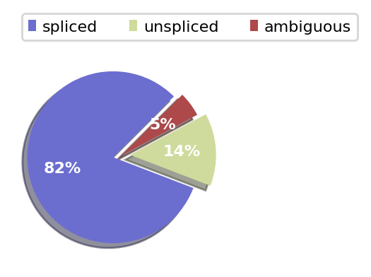
    


```python
scv.pl.proportions(E12_2)
```


    

    


```python
scv.pl.proportions(E14_1)
```


    
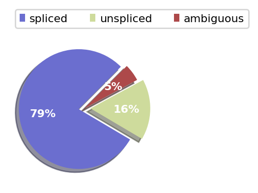
    


```python
scv.pl.proportions(E14_2)
```


    
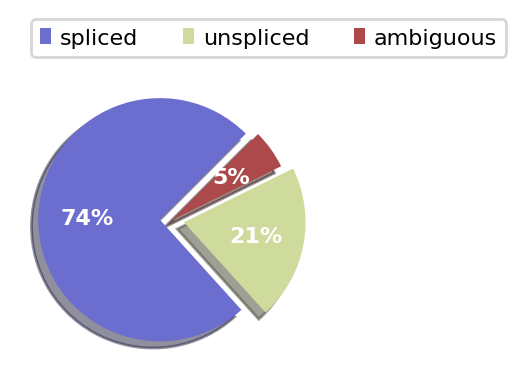
    


```python
E12_1.obs_names
```


    Index(['E125_K5_mTmG_1:AAAGGATCACAGTGTTx', 'E125_K5_mTmG_1:AAACCCAAGTCATGAAx',
           'E125_K5_mTmG_1:AAAGGTAAGCTAATCCx', 'E125_K5_mTmG_1:AAAGAACGTCGACTTAx',
           'E125_K5_mTmG_1:AAACGAACAGCTCCTTx', 'E125_K5_mTmG_1:AAAGAACGTGTTAACCx',
           'E125_K5_mTmG_1:AAAGGTACAATACCTGx', 'E125_K5_mTmG_1:AAAGGATCATTAAAGGx',
           'E125_K5_mTmG_1:AAAGGTATCCCGTGTTx', 'E125_K5_mTmG_1:AAAGAACCAGTTTGGTx',
           ...
           'E125_K5_mTmG_1:TTTGATCTCCCTGTTGx', 'E125_K5_mTmG_1:TTTGTTGCAGTAGTTCx',
           'E125_K5_mTmG_1:TTTGATCTCTTAAGGCx', 'E125_K5_mTmG_1:TTTGATCTCCATTCATx',
           'E125_K5_mTmG_1:TTTGTTGAGAGAGGTAx', 'E125_K5_mTmG_1:TTTGGAGAGGAACGCTx',
           'E125_K5_mTmG_1:TTTGGTTTCAGCTAGTx', 'E125_K5_mTmG_1:TTTGTTGCAGAACTCTx',
           'E125_K5_mTmG_1:TTTGTTGTCTGAGATCx', 'E125_K5_mTmG_1:TTTGGAGGTGACGCCTx'],
          dtype='object', name='CellID', length=13654)


```python
adata = sc.read("../processed_data/framework/4.29_scvi.h5ad")
```

The indice of loom files have some difference with scRNA, so I write a function to rename indice.


```python
input_strings = ['E125_1_AAAGGATCACAGTGTT-1', 'E125_1_AAACCCAAGTCATGAA-1']

def reverse_transform(input_str):
    parts = input_str.split('_')
    sequence = parts[2].split('-')[0]
    
    new_string = f"{parts[0]}_K5_mTmG_{parts[1]}:{sequence}x"
    
    return new_string

output_strings = [reverse_transform(s) for s in input_strings]
print(output_strings)
```

    ['E125_K5_mTmG_1:AAAGGATCACAGTGTTx', 'E125_K5_mTmG_1:AAACCCAAGTCATGAAx']


```python
def reverse_transform2(input_str):
    parts = input_str.split('_')
    sequence = parts[2].split('-')[0]
    
    new_string = f"K5mTmG_{parts[1]}:{sequence}x"
    
    return new_string

output_strings = [reverse_transform(s) for s in input_strings]
print(output_strings)
```

    ['E125_K5_mTmG_1:AAAGGATCACAGTGTTx', 'E125_K5_mTmG_1:AAACCCAAGTCATGAAx']


```python
newnames = [reverse_transform(s) for s in adata.obs_names]
newnamesE14 = [reverse_transform2(s) for s in adata.obs_names]
```


```python
len(np.intersect1d(newnamesE14,E14_1.obs_names))
```


    4075


```python
E12_1 = E12_1[np.intersect1d(newnames,E12_1.obs_names)].copy()
E12_2 = E12_2[np.intersect1d(newnames,E12_2.obs_names)].copy()
```


```python
E14_1 = E14_1[np.intersect1d(newnamesE14,E14_1.obs_names)].copy()
E14_2 = E14_2[np.intersect1d(newnamesE14,E14_2.obs_names)].copy()
```

## Run scVelo

This is core code. Because I have multiple files, I wrote a function to run a batch.


```python
def velo(run_adata):
    scv.pp.filter_and_normalize(
        run_adata, min_shared_counts=20, n_top_genes=2000, subset_highly_variable=False
    )
    
    sc.tl.pca(run_adata)
    sc.pp.neighbors(run_adata, n_pcs=30, n_neighbors=30, random_state=0)
    scv.pp.moments(run_adata, n_pcs=None, n_neighbors=None)
    scv.tl.recover_dynamics(run_adata, n_jobs=18)
    scv.tl.velocity(run_adata, mode="dynamical")


```


```python
velo(E12_1)
velo(E12_2)
velo(E14_1)
velo(E14_2)

```

    Filtered out 22805 genes that are detected 20 counts (shared).
    Normalized count data: X, spliced, unspliced.
    Extracted 2000 highly variable genes.


    /home/zhanglab/mambaforge/envs/py311/lib/python3.11/site-packages/scvelo/preprocessing/utils.py:705: DeprecationWarning: `log1p` is deprecated since scVelo v0.3.0 and will be removed in a future version. Please use `log1p` from `scanpy.pp` instead.
      log1p(adata)


    Logarithmized X.
    computing moments based on connectivities
        finished (0:00:08) --> added 
        'Ms' and 'Mu', moments of un/spliced abundances (adata.layers)
    recovering dynamics (using 18/48 cores)


      0%|          | 0/1002 [00:00<?, ?gene/s]


        finished (0:04:12) --> added 
        'fit_pars', fitted parameters for splicing dynamics (adata.var)
    computing velocities
        finished (0:00:13) --> added 
        'velocity', velocity vectors for each individual cell (adata.layers)
    Filtered out 22582 genes that are detected 20 counts (shared).
    Normalized count data: X, spliced, unspliced.
    Extracted 2000 highly variable genes.


    /home/zhanglab/mambaforge/envs/py311/lib/python3.11/site-packages/scvelo/preprocessing/utils.py:705: DeprecationWarning: `log1p` is deprecated since scVelo v0.3.0 and will be removed in a future version. Please use `log1p` from `scanpy.pp` instead.
      log1p(adata)


    Logarithmized X.
    computing moments based on connectivities
        finished (0:00:08) --> added 
        'Ms' and 'Mu', moments of un/spliced abundances (adata.layers)
    recovering dynamics (using 18/48 cores)


      0%|          | 0/1100 [00:00<?, ?gene/s]


        finished (0:04:04) --> added 
        'fit_pars', fitted parameters for splicing dynamics (adata.var)
    computing velocities
        finished (0:00:14) --> added 
        'velocity', velocity vectors for each individual cell (adata.layers)
    Filtered out 17467 genes that are detected 20 counts (shared).
    Normalized count data: X, spliced, unspliced.
    Extracted 2000 highly variable genes.


    /home/zhanglab/mambaforge/envs/py311/lib/python3.11/site-packages/scvelo/preprocessing/utils.py:705: DeprecationWarning: `log1p` is deprecated since scVelo v0.3.0 and will be removed in a future version. Please use `log1p` from `scanpy.pp` instead.
      log1p(adata)


    Logarithmized X.
    computing moments based on connectivities
        finished (0:00:06) --> added 
        'Ms' and 'Mu', moments of un/spliced abundances (adata.layers)
    recovering dynamics (using 18/48 cores)


      0%|          | 0/1375 [00:00<?, ?gene/s]


        finished (0:03:52) --> added 
        'fit_pars', fitted parameters for splicing dynamics (adata.var)
    computing velocities
        finished (0:00:11) --> added 
        'velocity', velocity vectors for each individual cell (adata.layers)
    Filtered out 18431 genes that are detected 20 counts (shared).
    Normalized count data: X, spliced, unspliced.
    Extracted 2000 highly variable genes.
    Logarithmized X.


    /home/zhanglab/mambaforge/envs/py311/lib/python3.11/site-packages/scvelo/preprocessing/utils.py:705: DeprecationWarning: `log1p` is deprecated since scVelo v0.3.0 and will be removed in a future version. Please use `log1p` from `scanpy.pp` instead.
      log1p(adata)


    computing moments based on connectivities
        finished (0:00:02) --> added 
        'Ms' and 'Mu', moments of un/spliced abundances (adata.layers)
    recovering dynamics (using 18/48 cores)


      0%|          | 0/1433 [00:00<?, ?gene/s]


        finished (0:02:22) --> added 
        'fit_pars', fitted parameters for splicing dynamics (adata.var)
    computing velocities
        finished (0:00:06) --> added 
        'velocity', velocity vectors for each individual cell (adata.layers)


## Combine cellrank


```python
vk = cr.kernels.VelocityKernel(E12_1)
vk.compute_transition_matrix()
```

    Computing transition matrix using `'deterministic'` model


      0%|          | 0/6543 [00:00<?, ?cell/s]


    Using `softmax_scale=4.1511`


      0%|          | 0/6543 [00:00<?, ?cell/s]


        Finish (0:01:03)


    VelocityKernel[n=6543, model='deterministic', similarity='correlation', softmax_scale=4.151]


```python
ck = cr.kernels.ConnectivityKernel(E12_1)
ck.compute_transition_matrix()

combined_kernel = 0.8 * vk + 0.2 * ck
```

    Computing transition matrix based on `adata.obsp['connectivities']`
        Finish (0:00:00)


```python
vk.plot_projection(color = "level1_anno",save="E125_1_umap")
```

    Using precomputed projection `adata.obsm['T_fwd_umap']`


    /home/zhanglab/mambaforge/envs/py311/lib/python3.11/site-packages/scvelo/plotting/utils.py:63: DeprecationWarning: is_categorical_dtype is deprecated and will be removed in a future version. Use isinstance(dtype, pd.CategoricalDtype) instead
      return isinstance(c, str) and c in data.obs.keys() and cat(data.obs[c])
    /home/zhanglab/mambaforge/envs/py311/lib/python3.11/site-packages/scvelo/plotting/utils.py:63: DeprecationWarning: is_categorical_dtype is deprecated and will be removed in a future version. Use isinstance(dtype, pd.CategoricalDtype) instead
      return isinstance(c, str) and c in data.obs.keys() and cat(data.obs[c])
    /home/zhanglab/mambaforge/envs/py311/lib/python3.11/site-packages/scvelo/plotting/utils.py:63: DeprecationWarning: is_categorical_dtype is deprecated and will be removed in a future version. Use isinstance(dtype, pd.CategoricalDtype) instead
      return isinstance(c, str) and c in data.obs.keys() and cat(data.obs[c])
    /home/zhanglab/mambaforge/envs/py311/lib/python3.11/site-packages/scvelo/plotting/utils.py:63: DeprecationWarning: is_categorical_dtype is deprecated and will be removed in a future version. Use isinstance(dtype, pd.CategoricalDtype) instead
      return isinstance(c, str) and c in data.obs.keys() and cat(data.obs[c])
    /home/zhanglab/mambaforge/envs/py311/lib/python3.11/site-packages/scvelo/plotting/utils.py:63: DeprecationWarning: is_categorical_dtype is deprecated and will be removed in a future version. Use isinstance(dtype, pd.CategoricalDtype) instead
      return isinstance(c, str) and c in data.obs.keys() and cat(data.obs[c])
    /home/zhanglab/mambaforge/envs/py311/lib/python3.11/site-packages/scvelo/plotting/utils.py:63: DeprecationWarning: is_categorical_dtype is deprecated and will be removed in a future version. Use isinstance(dtype, pd.CategoricalDtype) instead
      return isinstance(c, str) and c in data.obs.keys() and cat(data.obs[c])
    /home/zhanglab/mambaforge/envs/py311/lib/python3.11/site-packages/scvelo/plotting/utils.py:63: DeprecationWarning: is_categorical_dtype is deprecated and will be removed in a future version. Use isinstance(dtype, pd.CategoricalDtype) instead
      return isinstance(c, str) and c in data.obs.keys() and cat(data.obs[c])
    /home/zhanglab/mambaforge/envs/py311/lib/python3.11/site-packages/scvelo/plotting/utils.py:63: DeprecationWarning: is_categorical_dtype is deprecated and will be removed in a future version. Use isinstance(dtype, pd.CategoricalDtype) instead
      return isinstance(c, str) and c in data.obs.keys() and cat(data.obs[c])


    figure cannot be saved as pdf, using png instead (can only output finite numbers in pdf).
    saving figure to file ../result/trajectory/cell_transition/scvelo_E125_1_umap.png


    
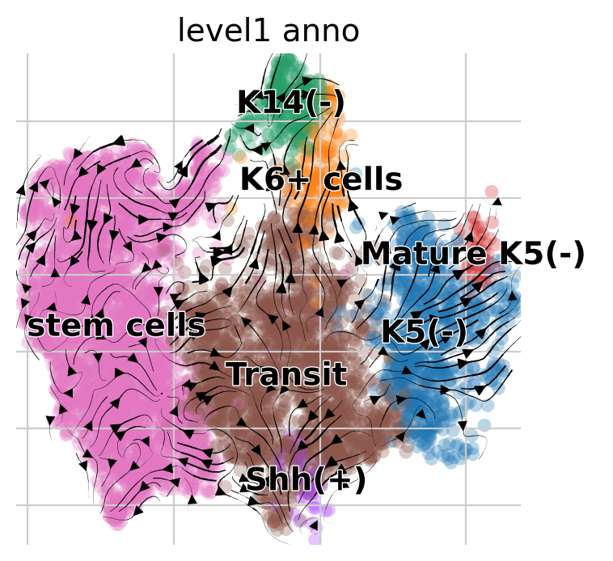
    


```python
vk.plot_projection(basis="X_draw_graph",color = "level1_anno",save="E125_1_drawgraph")
```

    Using precomputed projection `adata.obsm['T_fwd_draw_graph']`


    /home/zhanglab/mambaforge/envs/py311/lib/python3.11/site-packages/scvelo/plotting/utils.py:63: DeprecationWarning: is_categorical_dtype is deprecated and will be removed in a future version. Use isinstance(dtype, pd.CategoricalDtype) instead
      return isinstance(c, str) and c in data.obs.keys() and cat(data.obs[c])
    /home/zhanglab/mambaforge/envs/py311/lib/python3.11/site-packages/scvelo/plotting/utils.py:63: DeprecationWarning: is_categorical_dtype is deprecated and will be removed in a future version. Use isinstance(dtype, pd.CategoricalDtype) instead
      return isinstance(c, str) and c in data.obs.keys() and cat(data.obs[c])
    /home/zhanglab/mambaforge/envs/py311/lib/python3.11/site-packages/scvelo/plotting/utils.py:63: DeprecationWarning: is_categorical_dtype is deprecated and will be removed in a future version. Use isinstance(dtype, pd.CategoricalDtype) instead
      return isinstance(c, str) and c in data.obs.keys() and cat(data.obs[c])
    /home/zhanglab/mambaforge/envs/py311/lib/python3.11/site-packages/scvelo/plotting/utils.py:63: DeprecationWarning: is_categorical_dtype is deprecated and will be removed in a future version. Use isinstance(dtype, pd.CategoricalDtype) instead
      return isinstance(c, str) and c in data.obs.keys() and cat(data.obs[c])
    /home/zhanglab/mambaforge/envs/py311/lib/python3.11/site-packages/scvelo/plotting/utils.py:63: DeprecationWarning: is_categorical_dtype is deprecated and will be removed in a future version. Use isinstance(dtype, pd.CategoricalDtype) instead
      return isinstance(c, str) and c in data.obs.keys() and cat(data.obs[c])
    /home/zhanglab/mambaforge/envs/py311/lib/python3.11/site-packages/scvelo/plotting/utils.py:63: DeprecationWarning: is_categorical_dtype is deprecated and will be removed in a future version. Use isinstance(dtype, pd.CategoricalDtype) instead
      return isinstance(c, str) and c in data.obs.keys() and cat(data.obs[c])
    /home/zhanglab/mambaforge/envs/py311/lib/python3.11/site-packages/scvelo/plotting/utils.py:63: DeprecationWarning: is_categorical_dtype is deprecated and will be removed in a future version. Use isinstance(dtype, pd.CategoricalDtype) instead
      return isinstance(c, str) and c in data.obs.keys() and cat(data.obs[c])
    /home/zhanglab/mambaforge/envs/py311/lib/python3.11/site-packages/scvelo/plotting/utils.py:63: DeprecationWarning: is_categorical_dtype is deprecated and will be removed in a future version. Use isinstance(dtype, pd.CategoricalDtype) instead
      return isinstance(c, str) and c in data.obs.keys() and cat(data.obs[c])


    saving figure to file ./figures/scvelo_E125_1_drawgraph.pdf


    
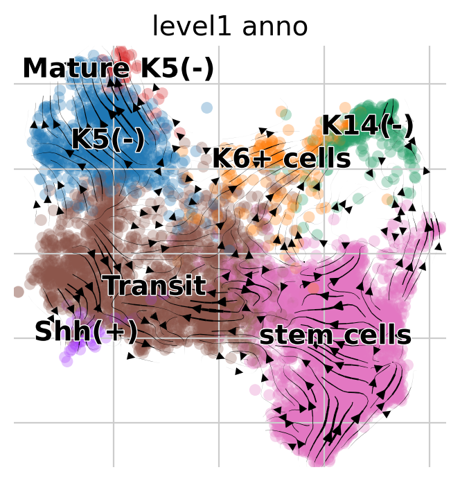
    


```python
vk.write_to_adata()
```


```python
!mkdir ../processed_data/framework/velocity
```


```python
del E12_1.obs["X_umap"]
```


```python
E12_1.write_h5ad("../processed_data/framework/velocity/E12_1_velo.h5ad")
```


```python
def run_plot(adata_run):
    vk_run = cr.kernels.VelocityKernel(adata_run)
    vk_run.compute_transition_matrix()
    return(vk_run)
```


```python
vk_E12_2 = run_plot(E12_2)
vk_E14_1 = run_plot(E14_1)
vk_E14_2 = run_plot(E14_2)
```

    Computing transition matrix using `'deterministic'` model


      0%|          | 0/6455 [00:00<?, ?cell/s]


    Using `softmax_scale=3.6593`


      0%|          | 0/6455 [00:00<?, ?cell/s]


        Finish (0:01:20)
    Computing transition matrix using `'deterministic'` model


      0%|          | 0/4075 [00:00<?, ?cell/s]


    Using `softmax_scale=6.2855`


      0%|          | 0/4075 [00:00<?, ?cell/s]


        Finish (0:00:33)
    Computing transition matrix using `'deterministic'` model


      0%|          | 0/2349 [00:00<?, ?cell/s]


    Using `softmax_scale=1.4283`


      0%|          | 0/2349 [00:00<?, ?cell/s]


        Finish (0:00:18)


```python
vk_E12_2.plot_projection(color = "level1_anno",save="E125_2_umap.pdf")
vk_E14_1.plot_projection(color = "level1_anno",save="E145_1_umap.pdf")
vk_E14_2.plot_projection(color = "level1_anno",save="E125_2_umap.pdf")
```

    Using precomputed projection `adata.obsm['T_fwd_umap']`


    /home/zhanglab/mambaforge/envs/py311/lib/python3.11/site-packages/scvelo/plotting/utils.py:63: DeprecationWarning: is_categorical_dtype is deprecated and will be removed in a future version. Use isinstance(dtype, pd.CategoricalDtype) instead
      return isinstance(c, str) and c in data.obs.keys() and cat(data.obs[c])
    /home/zhanglab/mambaforge/envs/py311/lib/python3.11/site-packages/scvelo/plotting/utils.py:63: DeprecationWarning: is_categorical_dtype is deprecated and will be removed in a future version. Use isinstance(dtype, pd.CategoricalDtype) instead
      return isinstance(c, str) and c in data.obs.keys() and cat(data.obs[c])
    /home/zhanglab/mambaforge/envs/py311/lib/python3.11/site-packages/scvelo/plotting/utils.py:63: DeprecationWarning: is_categorical_dtype is deprecated and will be removed in a future version. Use isinstance(dtype, pd.CategoricalDtype) instead
      return isinstance(c, str) and c in data.obs.keys() and cat(data.obs[c])
    /home/zhanglab/mambaforge/envs/py311/lib/python3.11/site-packages/scvelo/plotting/utils.py:63: DeprecationWarning: is_categorical_dtype is deprecated and will be removed in a future version. Use isinstance(dtype, pd.CategoricalDtype) instead
      return isinstance(c, str) and c in data.obs.keys() and cat(data.obs[c])
    /home/zhanglab/mambaforge/envs/py311/lib/python3.11/site-packages/scvelo/plotting/utils.py:63: DeprecationWarning: is_categorical_dtype is deprecated and will be removed in a future version. Use isinstance(dtype, pd.CategoricalDtype) instead
      return isinstance(c, str) and c in data.obs.keys() and cat(data.obs[c])
    /home/zhanglab/mambaforge/envs/py311/lib/python3.11/site-packages/scvelo/plotting/utils.py:63: DeprecationWarning: is_categorical_dtype is deprecated and will be removed in a future version. Use isinstance(dtype, pd.CategoricalDtype) instead
      return isinstance(c, str) and c in data.obs.keys() and cat(data.obs[c])
    /home/zhanglab/mambaforge/envs/py311/lib/python3.11/site-packages/scvelo/plotting/utils.py:63: DeprecationWarning: is_categorical_dtype is deprecated and will be removed in a future version. Use isinstance(dtype, pd.CategoricalDtype) instead
      return isinstance(c, str) and c in data.obs.keys() and cat(data.obs[c])
    /home/zhanglab/mambaforge/envs/py311/lib/python3.11/site-packages/scvelo/plotting/utils.py:63: DeprecationWarning: is_categorical_dtype is deprecated and will be removed in a future version. Use isinstance(dtype, pd.CategoricalDtype) instead
      return isinstance(c, str) and c in data.obs.keys() and cat(data.obs[c])


    saving figure to file ./figures/scvelo_E125_2_umap.pdf


    
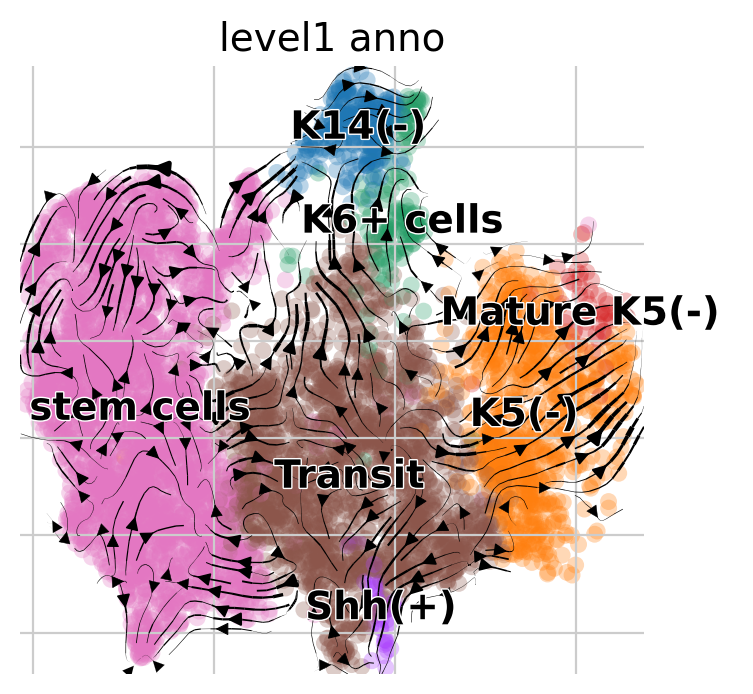
    


    Using precomputed projection `adata.obsm['T_fwd_umap']`


    /home/zhanglab/mambaforge/envs/py311/lib/python3.11/site-packages/scvelo/plotting/utils.py:63: DeprecationWarning: is_categorical_dtype is deprecated and will be removed in a future version. Use isinstance(dtype, pd.CategoricalDtype) instead
      return isinstance(c, str) and c in data.obs.keys() and cat(data.obs[c])
    /home/zhanglab/mambaforge/envs/py311/lib/python3.11/site-packages/scvelo/plotting/utils.py:63: DeprecationWarning: is_categorical_dtype is deprecated and will be removed in a future version. Use isinstance(dtype, pd.CategoricalDtype) instead
      return isinstance(c, str) and c in data.obs.keys() and cat(data.obs[c])
    /home/zhanglab/mambaforge/envs/py311/lib/python3.11/site-packages/scvelo/plotting/utils.py:63: DeprecationWarning: is_categorical_dtype is deprecated and will be removed in a future version. Use isinstance(dtype, pd.CategoricalDtype) instead
      return isinstance(c, str) and c in data.obs.keys() and cat(data.obs[c])
    /home/zhanglab/mambaforge/envs/py311/lib/python3.11/site-packages/scvelo/plotting/utils.py:63: DeprecationWarning: is_categorical_dtype is deprecated and will be removed in a future version. Use isinstance(dtype, pd.CategoricalDtype) instead
      return isinstance(c, str) and c in data.obs.keys() and cat(data.obs[c])
    /home/zhanglab/mambaforge/envs/py311/lib/python3.11/site-packages/scvelo/plotting/utils.py:63: DeprecationWarning: is_categorical_dtype is deprecated and will be removed in a future version. Use isinstance(dtype, pd.CategoricalDtype) instead
      return isinstance(c, str) and c in data.obs.keys() and cat(data.obs[c])
    /home/zhanglab/mambaforge/envs/py311/lib/python3.11/site-packages/scvelo/plotting/utils.py:63: DeprecationWarning: is_categorical_dtype is deprecated and will be removed in a future version. Use isinstance(dtype, pd.CategoricalDtype) instead
      return isinstance(c, str) and c in data.obs.keys() and cat(data.obs[c])
    /home/zhanglab/mambaforge/envs/py311/lib/python3.11/site-packages/scvelo/plotting/utils.py:63: DeprecationWarning: is_categorical_dtype is deprecated and will be removed in a future version. Use isinstance(dtype, pd.CategoricalDtype) instead
      return isinstance(c, str) and c in data.obs.keys() and cat(data.obs[c])
    /home/zhanglab/mambaforge/envs/py311/lib/python3.11/site-packages/scvelo/plotting/utils.py:63: DeprecationWarning: is_categorical_dtype is deprecated and will be removed in a future version. Use isinstance(dtype, pd.CategoricalDtype) instead
      return isinstance(c, str) and c in data.obs.keys() and cat(data.obs[c])


    figure cannot be saved as pdf, using png instead (can only output finite numbers in pdf).
    saving figure to file ./figures/scvelo_E145_1_umap.png


    
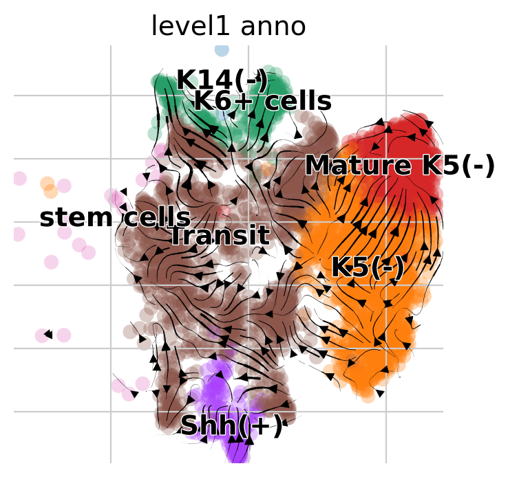
    


    Using precomputed projection `adata.obsm['T_fwd_umap']`


    /home/zhanglab/mambaforge/envs/py311/lib/python3.11/site-packages/scvelo/plotting/utils.py:63: DeprecationWarning: is_categorical_dtype is deprecated and will be removed in a future version. Use isinstance(dtype, pd.CategoricalDtype) instead
      return isinstance(c, str) and c in data.obs.keys() and cat(data.obs[c])
    /home/zhanglab/mambaforge/envs/py311/lib/python3.11/site-packages/scvelo/plotting/utils.py:63: DeprecationWarning: is_categorical_dtype is deprecated and will be removed in a future version. Use isinstance(dtype, pd.CategoricalDtype) instead
      return isinstance(c, str) and c in data.obs.keys() and cat(data.obs[c])
    /home/zhanglab/mambaforge/envs/py311/lib/python3.11/site-packages/scvelo/plotting/utils.py:63: DeprecationWarning: is_categorical_dtype is deprecated and will be removed in a future version. Use isinstance(dtype, pd.CategoricalDtype) instead
      return isinstance(c, str) and c in data.obs.keys() and cat(data.obs[c])
    /home/zhanglab/mambaforge/envs/py311/lib/python3.11/site-packages/scvelo/plotting/utils.py:63: DeprecationWarning: is_categorical_dtype is deprecated and will be removed in a future version. Use isinstance(dtype, pd.CategoricalDtype) instead
      return isinstance(c, str) and c in data.obs.keys() and cat(data.obs[c])
    /home/zhanglab/mambaforge/envs/py311/lib/python3.11/site-packages/scvelo/plotting/utils.py:63: DeprecationWarning: is_categorical_dtype is deprecated and will be removed in a future version. Use isinstance(dtype, pd.CategoricalDtype) instead
      return isinstance(c, str) and c in data.obs.keys() and cat(data.obs[c])
    /home/zhanglab/mambaforge/envs/py311/lib/python3.11/site-packages/scvelo/plotting/utils.py:63: DeprecationWarning: is_categorical_dtype is deprecated and will be removed in a future version. Use isinstance(dtype, pd.CategoricalDtype) instead
      return isinstance(c, str) and c in data.obs.keys() and cat(data.obs[c])
    /home/zhanglab/mambaforge/envs/py311/lib/python3.11/site-packages/scvelo/plotting/utils.py:63: DeprecationWarning: is_categorical_dtype is deprecated and will be removed in a future version. Use isinstance(dtype, pd.CategoricalDtype) instead
      return isinstance(c, str) and c in data.obs.keys() and cat(data.obs[c])
    /home/zhanglab/mambaforge/envs/py311/lib/python3.11/site-packages/scvelo/plotting/utils.py:63: DeprecationWarning: is_categorical_dtype is deprecated and will be removed in a future version. Use isinstance(dtype, pd.CategoricalDtype) instead
      return isinstance(c, str) and c in data.obs.keys() and cat(data.obs[c])


    saving figure to file ./figures/scvelo_E145_2_umap.pdf


    
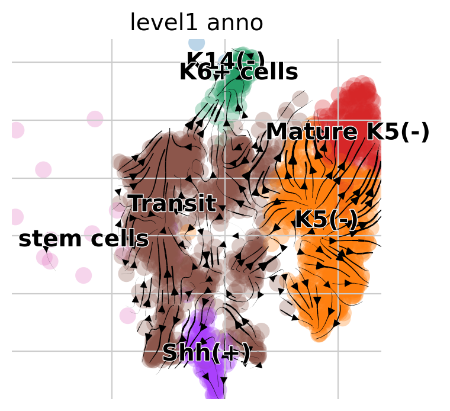
    


```python
vk_E12_2.plot_projection(basis="X_draw_graph",color = "level1_anno",save="E125_2_drawgraph.pdf")
vk_E14_1.plot_projection(basis="X_draw_graph",color = "level1_anno",save="E145_1_drawgraph.pdf")
vk_E14_2.plot_projection(basis="X_draw_graph",color = "level1_anno",save="E145_2_drawgraph.pdf")
```

    Projecting transition matrix onto `draw_graph`
    Adding `adata.obsm['T_fwd_draw_graph']`
        Finish (0:00:07)


    /home/zhanglab/mambaforge/envs/py311/lib/python3.11/site-packages/scvelo/plotting/utils.py:63: DeprecationWarning: is_categorical_dtype is deprecated and will be removed in a future version. Use isinstance(dtype, pd.CategoricalDtype) instead
      return isinstance(c, str) and c in data.obs.keys() and cat(data.obs[c])
    /home/zhanglab/mambaforge/envs/py311/lib/python3.11/site-packages/scvelo/plotting/utils.py:63: DeprecationWarning: is_categorical_dtype is deprecated and will be removed in a future version. Use isinstance(dtype, pd.CategoricalDtype) instead
      return isinstance(c, str) and c in data.obs.keys() and cat(data.obs[c])
    /home/zhanglab/mambaforge/envs/py311/lib/python3.11/site-packages/scvelo/plotting/utils.py:63: DeprecationWarning: is_categorical_dtype is deprecated and will be removed in a future version. Use isinstance(dtype, pd.CategoricalDtype) instead
      return isinstance(c, str) and c in data.obs.keys() and cat(data.obs[c])
    /home/zhanglab/mambaforge/envs/py311/lib/python3.11/site-packages/scvelo/plotting/utils.py:63: DeprecationWarning: is_categorical_dtype is deprecated and will be removed in a future version. Use isinstance(dtype, pd.CategoricalDtype) instead
      return isinstance(c, str) and c in data.obs.keys() and cat(data.obs[c])
    /home/zhanglab/mambaforge/envs/py311/lib/python3.11/site-packages/scvelo/plotting/utils.py:63: DeprecationWarning: is_categorical_dtype is deprecated and will be removed in a future version. Use isinstance(dtype, pd.CategoricalDtype) instead
      return isinstance(c, str) and c in data.obs.keys() and cat(data.obs[c])
    /home/zhanglab/mambaforge/envs/py311/lib/python3.11/site-packages/scvelo/plotting/utils.py:63: DeprecationWarning: is_categorical_dtype is deprecated and will be removed in a future version. Use isinstance(dtype, pd.CategoricalDtype) instead
      return isinstance(c, str) and c in data.obs.keys() and cat(data.obs[c])
    /home/zhanglab/mambaforge/envs/py311/lib/python3.11/site-packages/scvelo/plotting/utils.py:63: DeprecationWarning: is_categorical_dtype is deprecated and will be removed in a future version. Use isinstance(dtype, pd.CategoricalDtype) instead
      return isinstance(c, str) and c in data.obs.keys() and cat(data.obs[c])
    /home/zhanglab/mambaforge/envs/py311/lib/python3.11/site-packages/scvelo/plotting/utils.py:63: DeprecationWarning: is_categorical_dtype is deprecated and will be removed in a future version. Use isinstance(dtype, pd.CategoricalDtype) instead
      return isinstance(c, str) and c in data.obs.keys() and cat(data.obs[c])


    saving figure to file ./figures/scvelo_E125_2_drawgraph.pdf


    
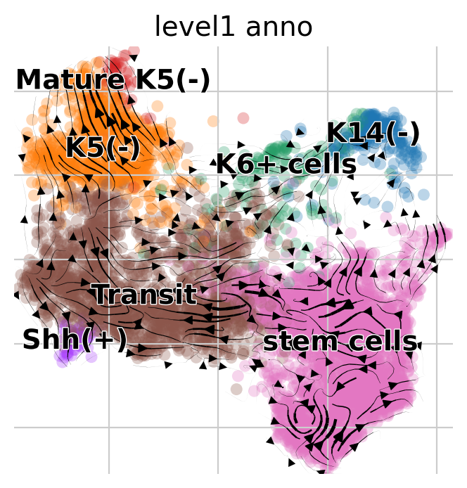
    


    Projecting transition matrix onto `draw_graph`
    Adding `adata.obsm['T_fwd_draw_graph']`
        Finish (0:00:02)


    /home/zhanglab/mambaforge/envs/py311/lib/python3.11/site-packages/scvelo/plotting/utils.py:63: DeprecationWarning: is_categorical_dtype is deprecated and will be removed in a future version. Use isinstance(dtype, pd.CategoricalDtype) instead
      return isinstance(c, str) and c in data.obs.keys() and cat(data.obs[c])
    /home/zhanglab/mambaforge/envs/py311/lib/python3.11/site-packages/scvelo/plotting/utils.py:63: DeprecationWarning: is_categorical_dtype is deprecated and will be removed in a future version. Use isinstance(dtype, pd.CategoricalDtype) instead
      return isinstance(c, str) and c in data.obs.keys() and cat(data.obs[c])
    /home/zhanglab/mambaforge/envs/py311/lib/python3.11/site-packages/scvelo/plotting/utils.py:63: DeprecationWarning: is_categorical_dtype is deprecated and will be removed in a future version. Use isinstance(dtype, pd.CategoricalDtype) instead
      return isinstance(c, str) and c in data.obs.keys() and cat(data.obs[c])
    /home/zhanglab/mambaforge/envs/py311/lib/python3.11/site-packages/scvelo/plotting/utils.py:63: DeprecationWarning: is_categorical_dtype is deprecated and will be removed in a future version. Use isinstance(dtype, pd.CategoricalDtype) instead
      return isinstance(c, str) and c in data.obs.keys() and cat(data.obs[c])
    /home/zhanglab/mambaforge/envs/py311/lib/python3.11/site-packages/scvelo/plotting/utils.py:63: DeprecationWarning: is_categorical_dtype is deprecated and will be removed in a future version. Use isinstance(dtype, pd.CategoricalDtype) instead
      return isinstance(c, str) and c in data.obs.keys() and cat(data.obs[c])
    /home/zhanglab/mambaforge/envs/py311/lib/python3.11/site-packages/scvelo/plotting/utils.py:63: DeprecationWarning: is_categorical_dtype is deprecated and will be removed in a future version. Use isinstance(dtype, pd.CategoricalDtype) instead
      return isinstance(c, str) and c in data.obs.keys() and cat(data.obs[c])
    /home/zhanglab/mambaforge/envs/py311/lib/python3.11/site-packages/scvelo/plotting/utils.py:63: DeprecationWarning: is_categorical_dtype is deprecated and will be removed in a future version. Use isinstance(dtype, pd.CategoricalDtype) instead
      return isinstance(c, str) and c in data.obs.keys() and cat(data.obs[c])
    /home/zhanglab/mambaforge/envs/py311/lib/python3.11/site-packages/scvelo/plotting/utils.py:63: DeprecationWarning: is_categorical_dtype is deprecated and will be removed in a future version. Use isinstance(dtype, pd.CategoricalDtype) instead
      return isinstance(c, str) and c in data.obs.keys() and cat(data.obs[c])


    saving figure to file ./figures/scvelo_E145_1_drawgraph.pdf


    
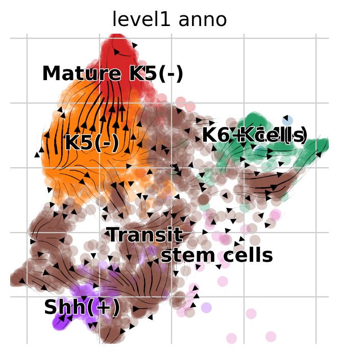
    


    Projecting transition matrix onto `draw_graph`
    Adding `adata.obsm['T_fwd_draw_graph']`
        Finish (0:00:01)


    /home/zhanglab/mambaforge/envs/py311/lib/python3.11/site-packages/scvelo/plotting/utils.py:63: DeprecationWarning: is_categorical_dtype is deprecated and will be removed in a future version. Use isinstance(dtype, pd.CategoricalDtype) instead
      return isinstance(c, str) and c in data.obs.keys() and cat(data.obs[c])
    /home/zhanglab/mambaforge/envs/py311/lib/python3.11/site-packages/scvelo/plotting/utils.py:63: DeprecationWarning: is_categorical_dtype is deprecated and will be removed in a future version. Use isinstance(dtype, pd.CategoricalDtype) instead
      return isinstance(c, str) and c in data.obs.keys() and cat(data.obs[c])
    /home/zhanglab/mambaforge/envs/py311/lib/python3.11/site-packages/scvelo/plotting/utils.py:63: DeprecationWarning: is_categorical_dtype is deprecated and will be removed in a future version. Use isinstance(dtype, pd.CategoricalDtype) instead
      return isinstance(c, str) and c in data.obs.keys() and cat(data.obs[c])
    /home/zhanglab/mambaforge/envs/py311/lib/python3.11/site-packages/scvelo/plotting/utils.py:63: DeprecationWarning: is_categorical_dtype is deprecated and will be removed in a future version. Use isinstance(dtype, pd.CategoricalDtype) instead
      return isinstance(c, str) and c in data.obs.keys() and cat(data.obs[c])
    /home/zhanglab/mambaforge/envs/py311/lib/python3.11/site-packages/scvelo/plotting/utils.py:63: DeprecationWarning: is_categorical_dtype is deprecated and will be removed in a future version. Use isinstance(dtype, pd.CategoricalDtype) instead
      return isinstance(c, str) and c in data.obs.keys() and cat(data.obs[c])
    /home/zhanglab/mambaforge/envs/py311/lib/python3.11/site-packages/scvelo/plotting/utils.py:63: DeprecationWarning: is_categorical_dtype is deprecated and will be removed in a future version. Use isinstance(dtype, pd.CategoricalDtype) instead
      return isinstance(c, str) and c in data.obs.keys() and cat(data.obs[c])
    /home/zhanglab/mambaforge/envs/py311/lib/python3.11/site-packages/scvelo/plotting/utils.py:63: DeprecationWarning: is_categorical_dtype is deprecated and will be removed in a future version. Use isinstance(dtype, pd.CategoricalDtype) instead
      return isinstance(c, str) and c in data.obs.keys() and cat(data.obs[c])
    /home/zhanglab/mambaforge/envs/py311/lib/python3.11/site-packages/scvelo/plotting/utils.py:63: DeprecationWarning: is_categorical_dtype is deprecated and will be removed in a future version. Use isinstance(dtype, pd.CategoricalDtype) instead
      return isinstance(c, str) and c in data.obs.keys() and cat(data.obs[c])


    figure cannot be saved as pdf, using png instead (can only output finite numbers in pdf).
    saving figure to file ./figures/scvelo_E145_2_drawgraph.png


    
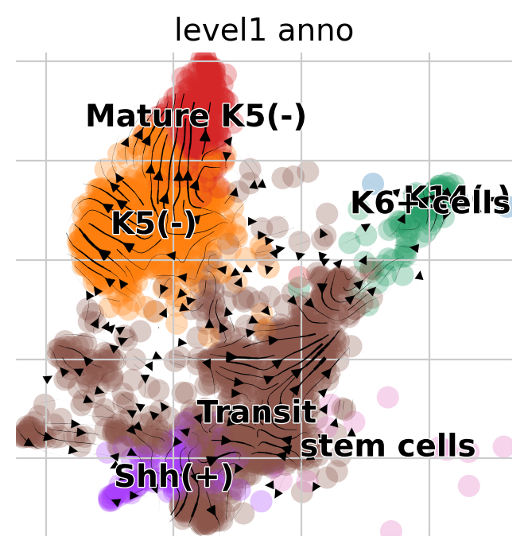
    


```python
vk_E12_2.write_to_adata()
vk_E14_1.write_to_adata()
vk_E14_2.write_to_adata()
```


```python
del E12_2.obs["X_umap"]
del E14_1.obs["X_umap"]
del E14_2.obs["X_umap"]
```


```python
E12_2.write_h5ad("../processed_data/framework/velocity/E12_2_velo.h5ad")
E14_1.write_h5ad("../processed_data/framework/velocity/E14_1_velo.h5ad")
E14_2.write_h5ad("../processed_data/framework/velocity/E14_2_velo.h5ad")
```


```python
scv.tl.velocity_graph(E12_1)
```

    computing velocity graph (using 1/48 cores)


      0%|          | 0/6543 [00:00<?, ?cells/s]


        finished (0:01:19) --> added 
        'velocity_graph', sparse matrix with cosine correlations (adata.uns)


## Plot PAGA results


```python
scv.pl.paga(E12_1, basis='umap', size=50, alpha=.1,
            min_edge_width=2, node_size_scale=1.5,save="E121_scv_paga")
```

    /home/zhanglab/mambaforge/envs/py311/lib/python3.11/site-packages/scvelo/plotting/utils.py:63: DeprecationWarning: is_categorical_dtype is deprecated and will be removed in a future version. Use isinstance(dtype, pd.CategoricalDtype) instead
      return isinstance(c, str) and c in data.obs.keys() and cat(data.obs[c])
    /home/zhanglab/mambaforge/envs/py311/lib/python3.11/site-packages/scvelo/plotting/utils.py:63: DeprecationWarning: is_categorical_dtype is deprecated and will be removed in a future version. Use isinstance(dtype, pd.CategoricalDtype) instead
      return isinstance(c, str) and c in data.obs.keys() and cat(data.obs[c])
    /home/zhanglab/mambaforge/envs/py311/lib/python3.11/site-packages/scvelo/plotting/utils.py:63: DeprecationWarning: is_categorical_dtype is deprecated and will be removed in a future version. Use isinstance(dtype, pd.CategoricalDtype) instead
      return isinstance(c, str) and c in data.obs.keys() and cat(data.obs[c])
    /home/zhanglab/mambaforge/envs/py311/lib/python3.11/site-packages/scvelo/plotting/utils.py:63: DeprecationWarning: is_categorical_dtype is deprecated and will be removed in a future version. Use isinstance(dtype, pd.CategoricalDtype) instead
      return isinstance(c, str) and c in data.obs.keys() and cat(data.obs[c])
    /home/zhanglab/mambaforge/envs/py311/lib/python3.11/site-packages/scvelo/plotting/utils.py:63: DeprecationWarning: is_categorical_dtype is deprecated and will be removed in a future version. Use isinstance(dtype, pd.CategoricalDtype) instead
      return isinstance(c, str) and c in data.obs.keys() and cat(data.obs[c])
    /home/zhanglab/mambaforge/envs/py311/lib/python3.11/site-packages/scvelo/plotting/utils.py:63: DeprecationWarning: is_categorical_dtype is deprecated and will be removed in a future version. Use isinstance(dtype, pd.CategoricalDtype) instead
      return isinstance(c, str) and c in data.obs.keys() and cat(data.obs[c])
    /home/zhanglab/mambaforge/envs/py311/lib/python3.11/site-packages/scvelo/plotting/utils.py:63: DeprecationWarning: is_categorical_dtype is deprecated and will be removed in a future version. Use isinstance(dtype, pd.CategoricalDtype) instead
      return isinstance(c, str) and c in data.obs.keys() and cat(data.obs[c])
    /home/zhanglab/mambaforge/envs/py311/lib/python3.11/site-packages/scvelo/plotting/utils.py:63: DeprecationWarning: is_categorical_dtype is deprecated and will be removed in a future version. Use isinstance(dtype, pd.CategoricalDtype) instead
      return isinstance(c, str) and c in data.obs.keys() and cat(data.obs[c])
    /home/zhanglab/mambaforge/envs/py311/lib/python3.11/site-packages/scvelo/plotting/utils.py:63: DeprecationWarning: is_categorical_dtype is deprecated and will be removed in a future version. Use isinstance(dtype, pd.CategoricalDtype) instead
      return isinstance(c, str) and c in data.obs.keys() and cat(data.obs[c])
    /home/zhanglab/mambaforge/envs/py311/lib/python3.11/site-packages/scvelo/plotting/utils.py:63: DeprecationWarning: is_categorical_dtype is deprecated and will be removed in a future version. Use isinstance(dtype, pd.CategoricalDtype) instead
      return isinstance(c, str) and c in data.obs.keys() and cat(data.obs[c])
    /home/zhanglab/mambaforge/envs/py311/lib/python3.11/site-packages/scvelo/plotting/utils.py:63: DeprecationWarning: is_categorical_dtype is deprecated and will be removed in a future version. Use isinstance(dtype, pd.CategoricalDtype) instead
      return isinstance(c, str) and c in data.obs.keys() and cat(data.obs[c])
    /home/zhanglab/mambaforge/envs/py311/lib/python3.11/site-packages/scvelo/plotting/utils.py:63: DeprecationWarning: is_categorical_dtype is deprecated and will be removed in a future version. Use isinstance(dtype, pd.CategoricalDtype) instead
      return isinstance(c, str) and c in data.obs.keys() and cat(data.obs[c])
    /home/zhanglab/mambaforge/envs/py311/lib/python3.11/site-packages/scvelo/plotting/utils.py:63: DeprecationWarning: is_categorical_dtype is deprecated and will be removed in a future version. Use isinstance(dtype, pd.CategoricalDtype) instead
      return isinstance(c, str) and c in data.obs.keys() and cat(data.obs[c])


    WARNING: Invalid color key. Using grey instead.
    saving figure to file ../result/trajectory/cell_transition/scvelo_E121_scv_paga.pdf


    
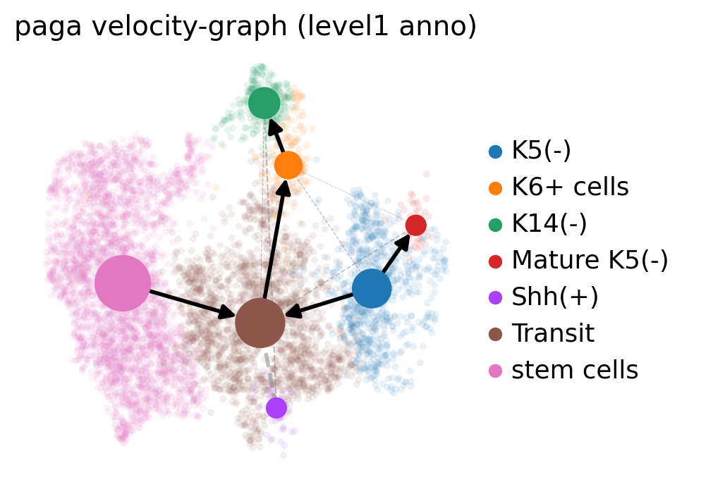
    


```python
def runVeloPaga(adata_run):
    scv.tl.velocity_graph(adata_run,n_jobs=20)
    adata_run.uns['neighbors']['distances'] = adata_run.obsp['distances']
    adata_run.uns['neighbors']['connectivities'] = adata_run.obsp['connectivities']
    
    scv.tl.paga(adata_run, groups='level1_anno')
    df = scv.get_df(adata_run, 'paga/transitions_confidence', precision=2).T
    return df
    #df.style.background_gradient(cmap='Blues').format('{:.2g}')
```


```python
dfE122 = runVeloPaga(E12_2)
dfE141 = runVeloPaga(E14_1)
dfE142 = runVeloPaga(E14_2)
```

    computing velocity graph (using 20/48 cores)


      0%|          | 0/6455 [00:00<?, ?cells/s]


        finished (0:00:57) --> added 
        'velocity_graph', sparse matrix with cosine correlations (adata.uns)
    computing terminal states
    WARNING: Uncertain or fuzzy root cell identification. Please verify.
        identified 2 regions of root cells and 1 region of end points .
        finished (0:00:04) --> added
        'root_cells', root cells of Markov diffusion process (adata.obs)
        'end_points', end points of Markov diffusion process (adata.obs)
    running PAGA using priors: ['velocity_pseudotime']
        finished (0:00:03) --> added
        'paga/connectivities', connectivities adjacency (adata.uns)
        'paga/connectivities_tree', connectivities subtree (adata.uns)
        'paga/transitions_confidence', velocity transitions (adata.uns)


    /home/zhanglab/mambaforge/envs/py311/lib/python3.11/site-packages/scvelo/core/_anndata.py:245: DeprecationWarning: is_categorical_dtype is deprecated and will be removed in a future version. Use isinstance(dtype, pd.CategoricalDtype) instead
      if is_categorical_dtype(data.obs[key])


    computing velocity graph (using 20/48 cores)


      0%|          | 0/4075 [00:00<?, ?cells/s]


        finished (0:00:19) --> added 
        'velocity_graph', sparse matrix with cosine correlations (adata.uns)
    computing terminal states
    WARNING: Uncertain or fuzzy root cell identification. Please verify.
        identified 1 region of root cells and 1 region of end points .
        finished (0:00:01) --> added
        'root_cells', root cells of Markov diffusion process (adata.obs)
        'end_points', end points of Markov diffusion process (adata.obs)
    running PAGA using priors: ['velocity_pseudotime']
        finished (0:00:02) --> added
        'paga/connectivities', connectivities adjacency (adata.uns)
        'paga/connectivities_tree', connectivities subtree (adata.uns)
        'paga/transitions_confidence', velocity transitions (adata.uns)


    /home/zhanglab/mambaforge/envs/py311/lib/python3.11/site-packages/scvelo/core/_anndata.py:245: DeprecationWarning: is_categorical_dtype is deprecated and will be removed in a future version. Use isinstance(dtype, pd.CategoricalDtype) instead
      if is_categorical_dtype(data.obs[key])


    computing velocity graph (using 20/48 cores)


      0%|          | 0/2349 [00:00<?, ?cells/s]


        finished (0:00:12) --> added 
        'velocity_graph', sparse matrix with cosine correlations (adata.uns)
    computing terminal states
        identified 2 regions of root cells and 1 region of end points .
        finished (0:00:00) --> added
        'root_cells', root cells of Markov diffusion process (adata.obs)
        'end_points', end points of Markov diffusion process (adata.obs)
    running PAGA using priors: ['velocity_pseudotime']
        finished (0:00:01) --> added
        'paga/connectivities', connectivities adjacency (adata.uns)
        'paga/connectivities_tree', connectivities subtree (adata.uns)
        'paga/transitions_confidence', velocity transitions (adata.uns)


    /home/zhanglab/mambaforge/envs/py311/lib/python3.11/site-packages/scvelo/core/_anndata.py:245: DeprecationWarning: is_categorical_dtype is deprecated and will be removed in a future version. Use isinstance(dtype, pd.CategoricalDtype) instead
      if is_categorical_dtype(data.obs[key])


```python
scv.pl.paga(E12_2, basis='umap', size=50, alpha=.1,
            min_edge_width=2, node_size_scale=1.5,save="E12_2_scv_paga")
```

    /home/zhanglab/mambaforge/envs/py311/lib/python3.11/site-packages/scvelo/plotting/utils.py:63: DeprecationWarning: is_categorical_dtype is deprecated and will be removed in a future version. Use isinstance(dtype, pd.CategoricalDtype) instead
      return isinstance(c, str) and c in data.obs.keys() and cat(data.obs[c])
    /home/zhanglab/mambaforge/envs/py311/lib/python3.11/site-packages/scvelo/plotting/utils.py:63: DeprecationWarning: is_categorical_dtype is deprecated and will be removed in a future version. Use isinstance(dtype, pd.CategoricalDtype) instead
      return isinstance(c, str) and c in data.obs.keys() and cat(data.obs[c])
    /home/zhanglab/mambaforge/envs/py311/lib/python3.11/site-packages/scvelo/plotting/utils.py:63: DeprecationWarning: is_categorical_dtype is deprecated and will be removed in a future version. Use isinstance(dtype, pd.CategoricalDtype) instead
      return isinstance(c, str) and c in data.obs.keys() and cat(data.obs[c])
    /home/zhanglab/mambaforge/envs/py311/lib/python3.11/site-packages/scvelo/plotting/utils.py:63: DeprecationWarning: is_categorical_dtype is deprecated and will be removed in a future version. Use isinstance(dtype, pd.CategoricalDtype) instead
      return isinstance(c, str) and c in data.obs.keys() and cat(data.obs[c])
    /home/zhanglab/mambaforge/envs/py311/lib/python3.11/site-packages/scvelo/plotting/utils.py:63: DeprecationWarning: is_categorical_dtype is deprecated and will be removed in a future version. Use isinstance(dtype, pd.CategoricalDtype) instead
      return isinstance(c, str) and c in data.obs.keys() and cat(data.obs[c])
    /home/zhanglab/mambaforge/envs/py311/lib/python3.11/site-packages/scvelo/plotting/utils.py:63: DeprecationWarning: is_categorical_dtype is deprecated and will be removed in a future version. Use isinstance(dtype, pd.CategoricalDtype) instead
      return isinstance(c, str) and c in data.obs.keys() and cat(data.obs[c])
    /home/zhanglab/mambaforge/envs/py311/lib/python3.11/site-packages/scvelo/plotting/utils.py:63: DeprecationWarning: is_categorical_dtype is deprecated and will be removed in a future version. Use isinstance(dtype, pd.CategoricalDtype) instead
      return isinstance(c, str) and c in data.obs.keys() and cat(data.obs[c])
    /home/zhanglab/mambaforge/envs/py311/lib/python3.11/site-packages/scvelo/plotting/utils.py:63: DeprecationWarning: is_categorical_dtype is deprecated and will be removed in a future version. Use isinstance(dtype, pd.CategoricalDtype) instead
      return isinstance(c, str) and c in data.obs.keys() and cat(data.obs[c])
    /home/zhanglab/mambaforge/envs/py311/lib/python3.11/site-packages/scvelo/plotting/utils.py:63: DeprecationWarning: is_categorical_dtype is deprecated and will be removed in a future version. Use isinstance(dtype, pd.CategoricalDtype) instead
      return isinstance(c, str) and c in data.obs.keys() and cat(data.obs[c])
    /home/zhanglab/mambaforge/envs/py311/lib/python3.11/site-packages/scvelo/plotting/utils.py:63: DeprecationWarning: is_categorical_dtype is deprecated and will be removed in a future version. Use isinstance(dtype, pd.CategoricalDtype) instead
      return isinstance(c, str) and c in data.obs.keys() and cat(data.obs[c])
    /home/zhanglab/mambaforge/envs/py311/lib/python3.11/site-packages/scvelo/plotting/utils.py:63: DeprecationWarning: is_categorical_dtype is deprecated and will be removed in a future version. Use isinstance(dtype, pd.CategoricalDtype) instead
      return isinstance(c, str) and c in data.obs.keys() and cat(data.obs[c])
    /home/zhanglab/mambaforge/envs/py311/lib/python3.11/site-packages/scvelo/plotting/utils.py:63: DeprecationWarning: is_categorical_dtype is deprecated and will be removed in a future version. Use isinstance(dtype, pd.CategoricalDtype) instead
      return isinstance(c, str) and c in data.obs.keys() and cat(data.obs[c])
    /home/zhanglab/mambaforge/envs/py311/lib/python3.11/site-packages/scvelo/plotting/utils.py:63: DeprecationWarning: is_categorical_dtype is deprecated and will be removed in a future version. Use isinstance(dtype, pd.CategoricalDtype) instead
      return isinstance(c, str) and c in data.obs.keys() and cat(data.obs[c])


    WARNING: Invalid color key. Using grey instead.
    saving figure to file ../result/trajectory/cell_transition/scvelo_E12_2_scv_paga.pdf


    
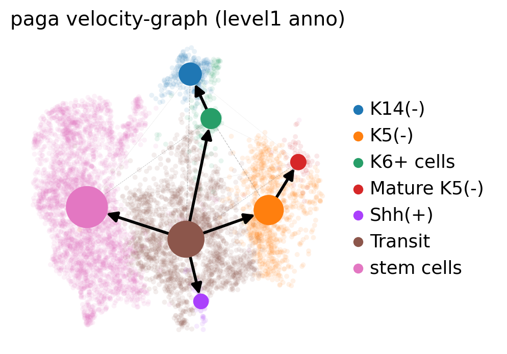
    


```python
scv.pl.paga(E14_1, basis='umap', size=50, alpha=.1,
            min_edge_width=2, node_size_scale=1.5,save="E141_scv_paga")
```

    /home/zhanglab/mambaforge/envs/py311/lib/python3.11/site-packages/scvelo/plotting/utils.py:63: DeprecationWarning: is_categorical_dtype is deprecated and will be removed in a future version. Use isinstance(dtype, pd.CategoricalDtype) instead
      return isinstance(c, str) and c in data.obs.keys() and cat(data.obs[c])
    /home/zhanglab/mambaforge/envs/py311/lib/python3.11/site-packages/scvelo/plotting/utils.py:63: DeprecationWarning: is_categorical_dtype is deprecated and will be removed in a future version. Use isinstance(dtype, pd.CategoricalDtype) instead
      return isinstance(c, str) and c in data.obs.keys() and cat(data.obs[c])
    /home/zhanglab/mambaforge/envs/py311/lib/python3.11/site-packages/scvelo/plotting/utils.py:63: DeprecationWarning: is_categorical_dtype is deprecated and will be removed in a future version. Use isinstance(dtype, pd.CategoricalDtype) instead
      return isinstance(c, str) and c in data.obs.keys() and cat(data.obs[c])
    /home/zhanglab/mambaforge/envs/py311/lib/python3.11/site-packages/scvelo/plotting/utils.py:63: DeprecationWarning: is_categorical_dtype is deprecated and will be removed in a future version. Use isinstance(dtype, pd.CategoricalDtype) instead
      return isinstance(c, str) and c in data.obs.keys() and cat(data.obs[c])
    /home/zhanglab/mambaforge/envs/py311/lib/python3.11/site-packages/scvelo/plotting/utils.py:63: DeprecationWarning: is_categorical_dtype is deprecated and will be removed in a future version. Use isinstance(dtype, pd.CategoricalDtype) instead
      return isinstance(c, str) and c in data.obs.keys() and cat(data.obs[c])
    /home/zhanglab/mambaforge/envs/py311/lib/python3.11/site-packages/scvelo/plotting/utils.py:63: DeprecationWarning: is_categorical_dtype is deprecated and will be removed in a future version. Use isinstance(dtype, pd.CategoricalDtype) instead
      return isinstance(c, str) and c in data.obs.keys() and cat(data.obs[c])
    /home/zhanglab/mambaforge/envs/py311/lib/python3.11/site-packages/scvelo/plotting/utils.py:63: DeprecationWarning: is_categorical_dtype is deprecated and will be removed in a future version. Use isinstance(dtype, pd.CategoricalDtype) instead
      return isinstance(c, str) and c in data.obs.keys() and cat(data.obs[c])
    /home/zhanglab/mambaforge/envs/py311/lib/python3.11/site-packages/scvelo/plotting/utils.py:63: DeprecationWarning: is_categorical_dtype is deprecated and will be removed in a future version. Use isinstance(dtype, pd.CategoricalDtype) instead
      return isinstance(c, str) and c in data.obs.keys() and cat(data.obs[c])
    /home/zhanglab/mambaforge/envs/py311/lib/python3.11/site-packages/scvelo/plotting/utils.py:63: DeprecationWarning: is_categorical_dtype is deprecated and will be removed in a future version. Use isinstance(dtype, pd.CategoricalDtype) instead
      return isinstance(c, str) and c in data.obs.keys() and cat(data.obs[c])
    /home/zhanglab/mambaforge/envs/py311/lib/python3.11/site-packages/scvelo/plotting/utils.py:63: DeprecationWarning: is_categorical_dtype is deprecated and will be removed in a future version. Use isinstance(dtype, pd.CategoricalDtype) instead
      return isinstance(c, str) and c in data.obs.keys() and cat(data.obs[c])
    /home/zhanglab/mambaforge/envs/py311/lib/python3.11/site-packages/scvelo/plotting/utils.py:63: DeprecationWarning: is_categorical_dtype is deprecated and will be removed in a future version. Use isinstance(dtype, pd.CategoricalDtype) instead
      return isinstance(c, str) and c in data.obs.keys() and cat(data.obs[c])
    /home/zhanglab/mambaforge/envs/py311/lib/python3.11/site-packages/scvelo/plotting/utils.py:63: DeprecationWarning: is_categorical_dtype is deprecated and will be removed in a future version. Use isinstance(dtype, pd.CategoricalDtype) instead
      return isinstance(c, str) and c in data.obs.keys() and cat(data.obs[c])
    /home/zhanglab/mambaforge/envs/py311/lib/python3.11/site-packages/scvelo/plotting/utils.py:63: DeprecationWarning: is_categorical_dtype is deprecated and will be removed in a future version. Use isinstance(dtype, pd.CategoricalDtype) instead
      return isinstance(c, str) and c in data.obs.keys() and cat(data.obs[c])


    WARNING: Invalid color key. Using grey instead.
    saving figure to file ../result/trajectory/cell_transition/scvelo_E141_scv_paga.pdf


    
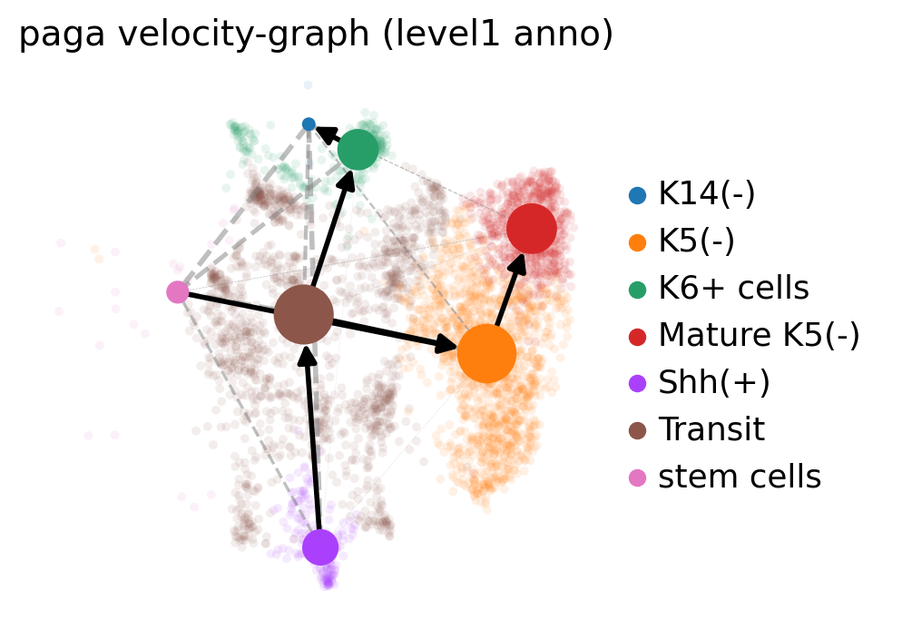
    


```python
scv.pl.paga(E14_2, basis='umap', size=50, alpha=.1,
            min_edge_width=2, node_size_scale=1.5,save="E142_scv_paga")
```

    /home/zhanglab/mambaforge/envs/py311/lib/python3.11/site-packages/scvelo/plotting/utils.py:63: DeprecationWarning: is_categorical_dtype is deprecated and will be removed in a future version. Use isinstance(dtype, pd.CategoricalDtype) instead
      return isinstance(c, str) and c in data.obs.keys() and cat(data.obs[c])
    /home/zhanglab/mambaforge/envs/py311/lib/python3.11/site-packages/scvelo/plotting/utils.py:63: DeprecationWarning: is_categorical_dtype is deprecated and will be removed in a future version. Use isinstance(dtype, pd.CategoricalDtype) instead
      return isinstance(c, str) and c in data.obs.keys() and cat(data.obs[c])
    /home/zhanglab/mambaforge/envs/py311/lib/python3.11/site-packages/scvelo/plotting/utils.py:63: DeprecationWarning: is_categorical_dtype is deprecated and will be removed in a future version. Use isinstance(dtype, pd.CategoricalDtype) instead
      return isinstance(c, str) and c in data.obs.keys() and cat(data.obs[c])
    /home/zhanglab/mambaforge/envs/py311/lib/python3.11/site-packages/scvelo/plotting/utils.py:63: DeprecationWarning: is_categorical_dtype is deprecated and will be removed in a future version. Use isinstance(dtype, pd.CategoricalDtype) instead
      return isinstance(c, str) and c in data.obs.keys() and cat(data.obs[c])
    /home/zhanglab/mambaforge/envs/py311/lib/python3.11/site-packages/scvelo/plotting/utils.py:63: DeprecationWarning: is_categorical_dtype is deprecated and will be removed in a future version. Use isinstance(dtype, pd.CategoricalDtype) instead
      return isinstance(c, str) and c in data.obs.keys() and cat(data.obs[c])
    /home/zhanglab/mambaforge/envs/py311/lib/python3.11/site-packages/scvelo/plotting/utils.py:63: DeprecationWarning: is_categorical_dtype is deprecated and will be removed in a future version. Use isinstance(dtype, pd.CategoricalDtype) instead
      return isinstance(c, str) and c in data.obs.keys() and cat(data.obs[c])
    /home/zhanglab/mambaforge/envs/py311/lib/python3.11/site-packages/scvelo/plotting/utils.py:63: DeprecationWarning: is_categorical_dtype is deprecated and will be removed in a future version. Use isinstance(dtype, pd.CategoricalDtype) instead
      return isinstance(c, str) and c in data.obs.keys() and cat(data.obs[c])
    /home/zhanglab/mambaforge/envs/py311/lib/python3.11/site-packages/scvelo/plotting/utils.py:63: DeprecationWarning: is_categorical_dtype is deprecated and will be removed in a future version. Use isinstance(dtype, pd.CategoricalDtype) instead
      return isinstance(c, str) and c in data.obs.keys() and cat(data.obs[c])
    /home/zhanglab/mambaforge/envs/py311/lib/python3.11/site-packages/scvelo/plotting/utils.py:63: DeprecationWarning: is_categorical_dtype is deprecated and will be removed in a future version. Use isinstance(dtype, pd.CategoricalDtype) instead
      return isinstance(c, str) and c in data.obs.keys() and cat(data.obs[c])
    /home/zhanglab/mambaforge/envs/py311/lib/python3.11/site-packages/scvelo/plotting/utils.py:63: DeprecationWarning: is_categorical_dtype is deprecated and will be removed in a future version. Use isinstance(dtype, pd.CategoricalDtype) instead
      return isinstance(c, str) and c in data.obs.keys() and cat(data.obs[c])
    /home/zhanglab/mambaforge/envs/py311/lib/python3.11/site-packages/scvelo/plotting/utils.py:63: DeprecationWarning: is_categorical_dtype is deprecated and will be removed in a future version. Use isinstance(dtype, pd.CategoricalDtype) instead
      return isinstance(c, str) and c in data.obs.keys() and cat(data.obs[c])
    /home/zhanglab/mambaforge/envs/py311/lib/python3.11/site-packages/scvelo/plotting/utils.py:63: DeprecationWarning: is_categorical_dtype is deprecated and will be removed in a future version. Use isinstance(dtype, pd.CategoricalDtype) instead
      return isinstance(c, str) and c in data.obs.keys() and cat(data.obs[c])
    /home/zhanglab/mambaforge/envs/py311/lib/python3.11/site-packages/scvelo/plotting/utils.py:63: DeprecationWarning: is_categorical_dtype is deprecated and will be removed in a future version. Use isinstance(dtype, pd.CategoricalDtype) instead
      return isinstance(c, str) and c in data.obs.keys() and cat(data.obs[c])


    WARNING: Invalid color key. Using grey instead.
    saving figure to file ../result/trajectory/cell_transition/scvelo_E142_scv_paga.pdf


    
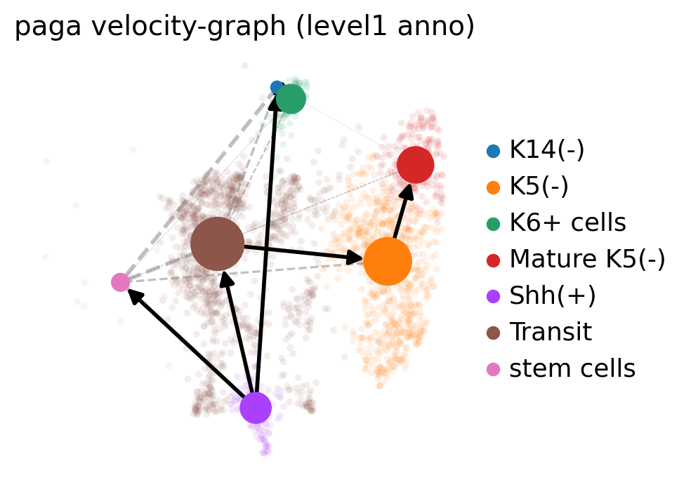
    


```python
E12_1.obs["level1_anno"]
```


    CellID
    E125_K5_mTmG_1:AAACCCAAGTCATGAAx    NaN
    E125_K5_mTmG_1:AAACCCACAAGACCGAx    NaN
    E125_K5_mTmG_1:AAACCCACATGCACTAx    NaN
    E125_K5_mTmG_1:AAACCCAGTCAGTCGCx    NaN
    E125_K5_mTmG_1:AAACCCAGTCCACGCAx    NaN
                                       ... 
    E125_K5_mTmG_1:TTTGTTGCAGAACTCTx    NaN
    E125_K5_mTmG_1:TTTGTTGCAGTAGTTCx    NaN
    E125_K5_mTmG_1:TTTGTTGTCACTTGTTx    NaN
    E125_K5_mTmG_1:TTTGTTGTCATCTATCx    NaN
    E125_K5_mTmG_1:TTTGTTGTCCCGATCTx    NaN
    Name: level1_anno, Length: 6543, dtype: object


```python
sc.pl.embedding(E12_1,color="level1_anno",basis="X_draw_graph")
```


    
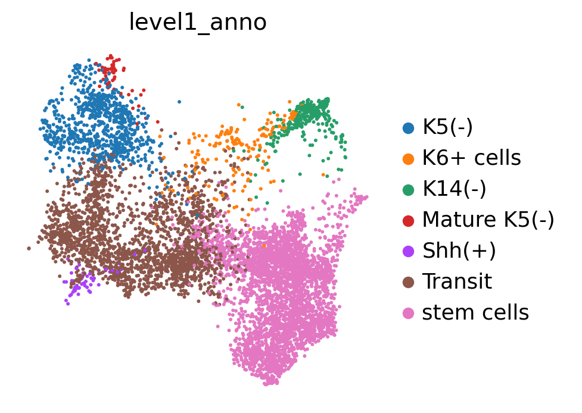
    


```python
adata
```


    AnnData object with n_obs × n_vars = 19404 × 2000
        obs: 'orig.ident', 'nCount_RNA', 'nFeature_RNA', 'percent.mt', 'nCount_SCT', 'nFeature_SCT', 'SCT_snn_res.0.8', 'seurat_clusters', 'group', 'SCT_snn_res.0.6', 'celltype', 'SCT_snn_res.0.4', 'S.Score', 'G2M.Score', 'Phase', 'old.ident', 'ident', '_scvi_batch', '_scvi_labels'
        var: 'highly_variable', 'highly_variable_rank', 'means', 'variances', 'variances_norm', 'highly_variable_nbatches'
        uns: 'X_name', '_scvi_manager_uuid', '_scvi_uuid', 'hvg'
        obsm: 'HARMONY', 'PCA', 'UMAP', 'X_scVI'
        layers: 'counts', 'logcounts'


```python
g = cr.estimators.GPCCA(vk)
print(g)
```

    GPCCA[kernel=VelocityKernel[n=6543], initial_states=None, terminal_states=None]


```python
g.fit(cluster_key="level1_anno", n_states=[4, 12])
g.plot_macrostates(which="all", discrete=True, legend_loc="right", s=100)
```

    WARNING: Unable to import `petsc4py` or `slepc4py`. Using `method='brandts'`
    WARNING: For `method='brandts'`, dense matrix is required. Densifying
    Computing Schur decomposition
    When computing macrostates, choose a number of states NOT in `[7, 10]`
    Adding `adata.uns['eigendecomposition_fwd']`
           `.schur_vectors`
           `.schur_matrix`
           `.eigendecomposition`
        Finish (0:04:22)
    Calculating minChi criterion in interval `[4, 12]`
    Computing `6` macrostates
    Adding `.macrostates`
           `.macrostates_memberships`
           `.coarse_T`
           `.coarse_initial_distribution
           `.coarse_stationary_distribution`
           `.schur_vectors`
           `.schur_matrix`
           `.eigendecomposition`
        Finish (0:00:16)


    /home/zhanglab/mambaforge/envs/py311/lib/python3.11/site-packages/scvelo/plotting/utils.py:63: DeprecationWarning: is_categorical_dtype is deprecated and will be removed in a future version. Use isinstance(dtype, pd.CategoricalDtype) instead
      return isinstance(c, str) and c in data.obs.keys() and cat(data.obs[c])
    /home/zhanglab/mambaforge/envs/py311/lib/python3.11/site-packages/scvelo/plotting/utils.py:63: DeprecationWarning: is_categorical_dtype is deprecated and will be removed in a future version. Use isinstance(dtype, pd.CategoricalDtype) instead
      return isinstance(c, str) and c in data.obs.keys() and cat(data.obs[c])
    /home/zhanglab/mambaforge/envs/py311/lib/python3.11/site-packages/scvelo/plotting/utils.py:63: DeprecationWarning: is_categorical_dtype is deprecated and will be removed in a future version. Use isinstance(dtype, pd.CategoricalDtype) instead
      return isinstance(c, str) and c in data.obs.keys() and cat(data.obs[c])
    /home/zhanglab/mambaforge/envs/py311/lib/python3.11/site-packages/scvelo/plotting/utils.py:63: DeprecationWarning: is_categorical_dtype is deprecated and will be removed in a future version. Use isinstance(dtype, pd.CategoricalDtype) instead
      return isinstance(c, str) and c in data.obs.keys() and cat(data.obs[c])
    /home/zhanglab/mambaforge/envs/py311/lib/python3.11/site-packages/scvelo/plotting/scatter.py:656: UserWarning: No data for colormapping provided via 'c'. Parameters 'cmap' will be ignored
      smp = ax.scatter(
    /home/zhanglab/mambaforge/envs/py311/lib/python3.11/site-packages/scvelo/plotting/scatter.py:694: UserWarning: No data for colormapping provided via 'c'. Parameters 'cmap' will be ignored
      ax.scatter(
    /home/zhanglab/mambaforge/envs/py311/lib/python3.11/site-packages/scvelo/plotting/utils.py:1391: UserWarning: No data for colormapping provided via 'c'. Parameters 'cmap' will be ignored
      ax.scatter(x, y, s=bg_size, marker=".", c=bg_color, zorder=zord - 2, **kwargs)
    /home/zhanglab/mambaforge/envs/py311/lib/python3.11/site-packages/scvelo/plotting/utils.py:1392: UserWarning: No data for colormapping provided via 'c'. Parameters 'cmap' will be ignored
      ax.scatter(x, y, s=gp_size, marker=".", c=gp_color, zorder=zord - 1, **kwargs)
    /home/zhanglab/mambaforge/envs/py311/lib/python3.11/site-packages/scvelo/plotting/utils.py:63: DeprecationWarning: is_categorical_dtype is deprecated and will be removed in a future version. Use isinstance(dtype, pd.CategoricalDtype) instead
      return isinstance(c, str) and c in data.obs.keys() and cat(data.obs[c])
    /home/zhanglab/mambaforge/envs/py311/lib/python3.11/site-packages/scvelo/plotting/utils.py:63: DeprecationWarning: is_categorical_dtype is deprecated and will be removed in a future version. Use isinstance(dtype, pd.CategoricalDtype) instead
      return isinstance(c, str) and c in data.obs.keys() and cat(data.obs[c])
    /home/zhanglab/mambaforge/envs/py311/lib/python3.11/site-packages/scvelo/plotting/utils.py:63: DeprecationWarning: is_categorical_dtype is deprecated and will be removed in a future version. Use isinstance(dtype, pd.CategoricalDtype) instead
      return isinstance(c, str) and c in data.obs.keys() and cat(data.obs[c])


    
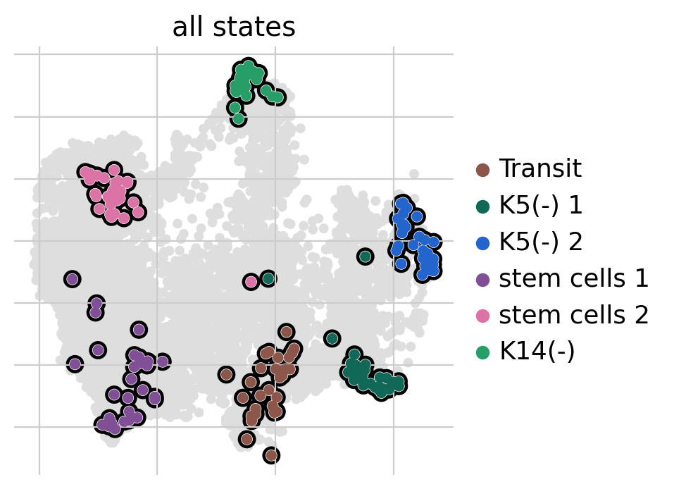
    


```python
g.predict_terminal_states()
g.plot_macrostates(which="terminal", legend_loc="right", s=100)
```

    Adding `adata.obs['term_states_fwd']`
           `adata.obs['term_states_fwd_probs']`
           `.terminal_states`
           `.terminal_states_probabilities`
           `.terminal_states_memberships
        Finish`


    /home/zhanglab/mambaforge/envs/py311/lib/python3.11/site-packages/scvelo/plotting/utils.py:63: DeprecationWarning: is_categorical_dtype is deprecated and will be removed in a future version. Use isinstance(dtype, pd.CategoricalDtype) instead
      return isinstance(c, str) and c in data.obs.keys() and cat(data.obs[c])
    /home/zhanglab/mambaforge/envs/py311/lib/python3.11/site-packages/scvelo/plotting/utils.py:63: DeprecationWarning: is_categorical_dtype is deprecated and will be removed in a future version. Use isinstance(dtype, pd.CategoricalDtype) instead
      return isinstance(c, str) and c in data.obs.keys() and cat(data.obs[c])
    /home/zhanglab/mambaforge/envs/py311/lib/python3.11/site-packages/scvelo/plotting/utils.py:63: DeprecationWarning: is_categorical_dtype is deprecated and will be removed in a future version. Use isinstance(dtype, pd.CategoricalDtype) instead
      return isinstance(c, str) and c in data.obs.keys() and cat(data.obs[c])
    /home/zhanglab/mambaforge/envs/py311/lib/python3.11/site-packages/scvelo/plotting/utils.py:63: DeprecationWarning: is_categorical_dtype is deprecated and will be removed in a future version. Use isinstance(dtype, pd.CategoricalDtype) instead
      return isinstance(c, str) and c in data.obs.keys() and cat(data.obs[c])
    /home/zhanglab/mambaforge/envs/py311/lib/python3.11/site-packages/scvelo/plotting/scatter.py:656: UserWarning: No data for colormapping provided via 'c'. Parameters 'cmap' will be ignored
      smp = ax.scatter(
    /home/zhanglab/mambaforge/envs/py311/lib/python3.11/site-packages/scvelo/plotting/scatter.py:694: UserWarning: No data for colormapping provided via 'c'. Parameters 'cmap' will be ignored
      ax.scatter(
    /home/zhanglab/mambaforge/envs/py311/lib/python3.11/site-packages/scvelo/plotting/utils.py:1391: UserWarning: No data for colormapping provided via 'c'. Parameters 'cmap' will be ignored
      ax.scatter(x, y, s=bg_size, marker=".", c=bg_color, zorder=zord - 2, **kwargs)
    /home/zhanglab/mambaforge/envs/py311/lib/python3.11/site-packages/scvelo/plotting/utils.py:1392: UserWarning: No data for colormapping provided via 'c'. Parameters 'cmap' will be ignored
      ax.scatter(x, y, s=gp_size, marker=".", c=gp_color, zorder=zord - 1, **kwargs)
    /home/zhanglab/mambaforge/envs/py311/lib/python3.11/site-packages/scvelo/plotting/utils.py:63: DeprecationWarning: is_categorical_dtype is deprecated and will be removed in a future version. Use isinstance(dtype, pd.CategoricalDtype) instead
      return isinstance(c, str) and c in data.obs.keys() and cat(data.obs[c])
    /home/zhanglab/mambaforge/envs/py311/lib/python3.11/site-packages/scvelo/plotting/utils.py:63: DeprecationWarning: is_categorical_dtype is deprecated and will be removed in a future version. Use isinstance(dtype, pd.CategoricalDtype) instead
      return isinstance(c, str) and c in data.obs.keys() and cat(data.obs[c])
    /home/zhanglab/mambaforge/envs/py311/lib/python3.11/site-packages/scvelo/plotting/utils.py:63: DeprecationWarning: is_categorical_dtype is deprecated and will be removed in a future version. Use isinstance(dtype, pd.CategoricalDtype) instead
      return isinstance(c, str) and c in data.obs.keys() and cat(data.obs[c])


    
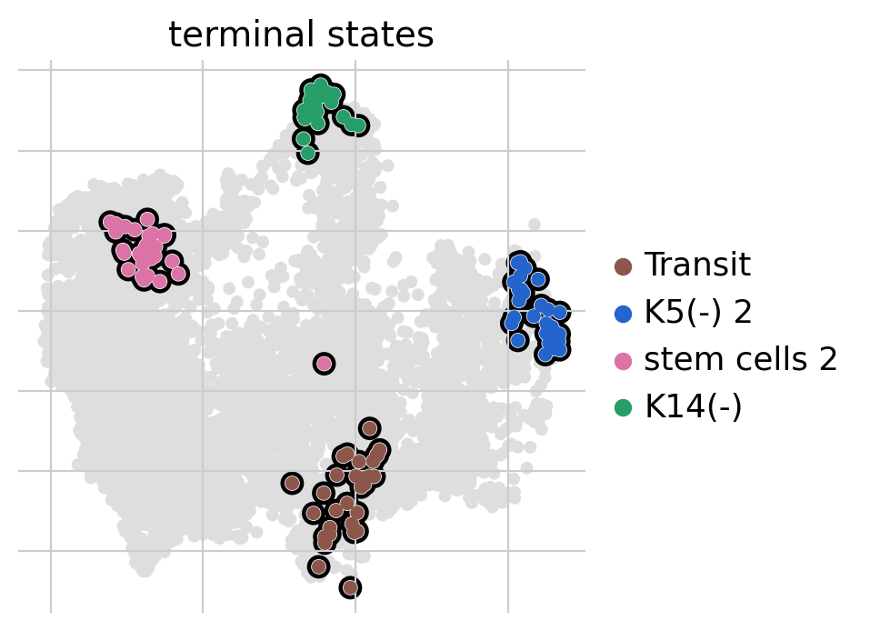
    


```python
g.predict_initial_states(allow_overlap=True)
g.plot_macrostates(which="initial", legend_loc="right", s=100)
```

    Adding `adata.obs['init_states_fwd']`
           `adata.obs['init_states_fwd_probs']`
           `.initial_states`
           `.initial_states_probabilities`
           `.initial_states_memberships
        Finish`


    /home/zhanglab/mambaforge/envs/py311/lib/python3.11/site-packages/scvelo/plotting/utils.py:63: DeprecationWarning: is_categorical_dtype is deprecated and will be removed in a future version. Use isinstance(dtype, pd.CategoricalDtype) instead
      return isinstance(c, str) and c in data.obs.keys() and cat(data.obs[c])
    /home/zhanglab/mambaforge/envs/py311/lib/python3.11/site-packages/scvelo/plotting/utils.py:63: DeprecationWarning: is_categorical_dtype is deprecated and will be removed in a future version. Use isinstance(dtype, pd.CategoricalDtype) instead
      return isinstance(c, str) and c in data.obs.keys() and cat(data.obs[c])
    /home/zhanglab/mambaforge/envs/py311/lib/python3.11/site-packages/scvelo/plotting/utils.py:63: DeprecationWarning: is_categorical_dtype is deprecated and will be removed in a future version. Use isinstance(dtype, pd.CategoricalDtype) instead
      return isinstance(c, str) and c in data.obs.keys() and cat(data.obs[c])
    /home/zhanglab/mambaforge/envs/py311/lib/python3.11/site-packages/scvelo/plotting/utils.py:63: DeprecationWarning: is_categorical_dtype is deprecated and will be removed in a future version. Use isinstance(dtype, pd.CategoricalDtype) instead
      return isinstance(c, str) and c in data.obs.keys() and cat(data.obs[c])
    /home/zhanglab/mambaforge/envs/py311/lib/python3.11/site-packages/scvelo/plotting/scatter.py:656: UserWarning: No data for colormapping provided via 'c'. Parameters 'cmap' will be ignored
      smp = ax.scatter(
    /home/zhanglab/mambaforge/envs/py311/lib/python3.11/site-packages/scvelo/plotting/utils.py:63: DeprecationWarning: is_categorical_dtype is deprecated and will be removed in a future version. Use isinstance(dtype, pd.CategoricalDtype) instead
      return isinstance(c, str) and c in data.obs.keys() and cat(data.obs[c])
    /home/zhanglab/mambaforge/envs/py311/lib/python3.11/site-packages/scvelo/plotting/scatter.py:694: UserWarning: No data for colormapping provided via 'c'. Parameters 'cmap' will be ignored
      ax.scatter(
    /home/zhanglab/mambaforge/envs/py311/lib/python3.11/site-packages/scvelo/plotting/utils.py:1391: UserWarning: No data for colormapping provided via 'c'. Parameters 'cmap' will be ignored
      ax.scatter(x, y, s=bg_size, marker=".", c=bg_color, zorder=zord - 2, **kwargs)
    /home/zhanglab/mambaforge/envs/py311/lib/python3.11/site-packages/scvelo/plotting/utils.py:1392: UserWarning: No data for colormapping provided via 'c'. Parameters 'cmap' will be ignored
      ax.scatter(x, y, s=gp_size, marker=".", c=gp_color, zorder=zord - 1, **kwargs)
    /home/zhanglab/mambaforge/envs/py311/lib/python3.11/site-packages/scvelo/plotting/utils.py:63: DeprecationWarning: is_categorical_dtype is deprecated and will be removed in a future version. Use isinstance(dtype, pd.CategoricalDtype) instead
      return isinstance(c, str) and c in data.obs.keys() and cat(data.obs[c])
    /home/zhanglab/mambaforge/envs/py311/lib/python3.11/site-packages/scvelo/plotting/utils.py:63: DeprecationWarning: is_categorical_dtype is deprecated and will be removed in a future version. Use isinstance(dtype, pd.CategoricalDtype) instead
      return isinstance(c, str) and c in data.obs.keys() and cat(data.obs[c])
    /home/zhanglab/mambaforge/envs/py311/lib/python3.11/site-packages/scvelo/plotting/utils.py:63: DeprecationWarning: is_categorical_dtype is deprecated and will be removed in a future version. Use isinstance(dtype, pd.CategoricalDtype) instead
      return isinstance(c, str) and c in data.obs.keys() and cat(data.obs[c])
    /home/zhanglab/mambaforge/envs/py311/lib/python3.11/site-packages/scvelo/plotting/utils.py:63: DeprecationWarning: is_categorical_dtype is deprecated and will be removed in a future version. Use isinstance(dtype, pd.CategoricalDtype) instead
      return isinstance(c, str) and c in data.obs.keys() and cat(data.obs[c])
    /home/zhanglab/mambaforge/envs/py311/lib/python3.11/site-packages/scvelo/plotting/utils.py:63: DeprecationWarning: is_categorical_dtype is deprecated and will be removed in a future version. Use isinstance(dtype, pd.CategoricalDtype) instead
      return isinstance(c, str) and c in data.obs.keys() and cat(data.obs[c])


    
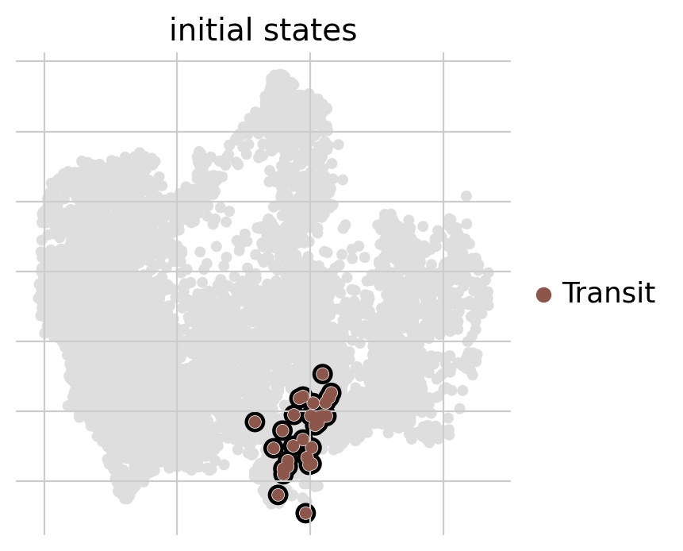
    


```python
E12_1
```


    AnnData object with n_obs × n_vars = 6543 × 9480
        obs: 'initial_size_unspliced', 'initial_size_spliced', 'initial_size', 'n_counts', 'level1_anno', 'macrostates_fwd', 'term_states_fwd', 'term_states_fwd_probs', 'init_states_fwd', 'init_states_fwd_probs'
        var: 'Accession', 'Chromosome', 'End', 'Start', 'Strand', 'gene_count_corr', 'means', 'dispersions', 'dispersions_norm', 'highly_variable', 'fit_r2', 'fit_alpha', 'fit_beta', 'fit_gamma', 'fit_t_', 'fit_scaling', 'fit_std_u', 'fit_std_s', 'fit_likelihood', 'fit_u0', 'fit_s0', 'fit_pval_steady', 'fit_steady_u', 'fit_steady_s', 'fit_variance', 'fit_alignment_scaling', 'velocity_genes'
        uns: 'log1p', 'pca', 'neighbors', 'recover_dynamics', 'velocity_params', 'T_fwd_params', 'level1_anno_colors', 'schur_matrix_fwd', 'eigendecomposition_fwd', 'macrostates_fwd_colors', 'coarse_fwd', 'term_states_fwd_colors', 'init_states_fwd_colors'
        obsm: 'X_pca', 'X_draw_graph', 'X_umap', 'T_fwd_umap', 'T_fwd_draw_graph', 'schur_vectors_fwd', 'macrostates_fwd_memberships', 'term_states_fwd_memberships', 'init_states_fwd_memberships'
        varm: 'PCs', 'loss'
        layers: 'matrix', 'ambiguous', 'spliced', 'unspliced', 'Ms', 'Mu', 'fit_t', 'fit_tau', 'fit_tau_', 'velocity', 'velocity_u'
        obsp: 'distances', 'connectivities', 'T_fwd'


```python
mat2 = g.transition_matrix
```


```python
mat2
```


    <6543x6543 sparse matrix of type '<class 'numpy.float64'>'
    	with 263018 stored elements in Compressed Sparse Row format>


```python
mat = mat.toarray()
```


```python
mat
```


    array([[0., 0., 0., ..., 0., 0., 0.],
           [0., 0., 0., ..., 0., 0., 0.],
           [0., 0., 0., ..., 0., 0., 0.],
           ...,
           [0., 0., 0., ..., 0., 0., 0.],
           [0., 0., 0., ..., 0., 0., 0.],
           [0., 0., 0., ..., 0., 0., 0.]])


```python
g.plot_coarse_T()
```

    /home/zhanglab/mambaforge/envs/py311/lib/python3.11/site-packages/cellrank/estimators/terminal_states/_gpcca.py:955: MatplotlibDeprecationWarning: Auto-removal of grids by pcolor() and pcolormesh() is deprecated since 3.5 and will be removed two minor releases later; please call grid(False) first.
      _ = ColorbarBase(


    
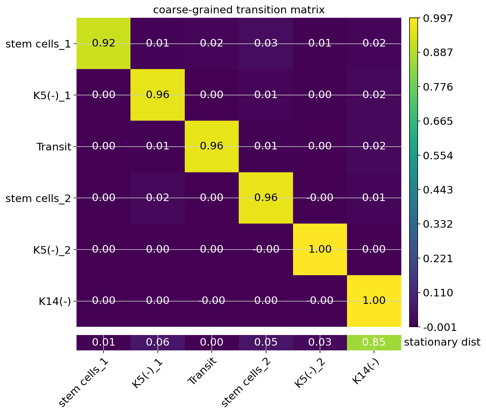
    


```python
g.plot_coarse_T()
```


```python
g2 = cr.estimators.GPCCA(vk)
print(g2)
```

    GPCCA[kernel=VelocityKernel[n=6543], initial_states=None, terminal_states=None]


```python
np.sum(adata.obs["orig.ident"] =="E125_1")
```


    6543


```python
output_strings = [transform_string(s) for s in adata_velo.obs_names]
```


```python
adata_velo
```


    AnnData object with n_obs × n_vars = 47677 × 25954
        layers: 'matrix', 'ambiguous', 'spliced', 'unspliced'


```python
E14_1
```


    AnnData object with n_obs × n_vars = 10374 × 28000
        obs: 'Clusters', '_X', '_Y'
        var: 'Accession', 'Chromosome', 'End', 'Start', 'Strand'
        layers: 'matrix', 'ambiguous', 'spliced', 'unspliced'


```python
E12_1.obsp["T_fwd"]
```


    <6543x6543 sparse matrix of type '<class 'numpy.float64'>'
    	with 263018 stored elements in Compressed Sparse Row format>


```python

```
