```python
import os
import tempfile
from pathlib import Path

import matplotlib.pyplot as plt
import numpy as np
#import pooch
import scanpy as sc
import scvi
import torch
import pandas as pd
```


```python
scvi.settings.seed = 0
print("Last run with scvi-tools version:", scvi.__version__)
sc.set_figure_params(figsize=(4, 4), frameon=False)
torch.set_float32_matmul_precision("high")
save_dir = tempfile.TemporaryDirectory()

%config InlineBackend.print_figure_kwargs={"facecolor" : "w"}
%config InlineBackend.figure_format="retina"
```

    Seed set to 0


    Last run with scvi-tools version: 1.1.2


```python
sc.settings.figdir = "../result/intergrate/"
```


```python
adata = sc.read("../process/framework/obj/combined_E12_E14_signc_sceasy.h5ad")
```


```python
print("# regions before filtering:", adata.shape[-1])

# compute the threshold: 5% of the cells
min_cells = int(adata.shape[0] * 0.05)
# in-place filtering of regions
sc.pp.filter_genes(adata, min_cells=min_cells)

print("# regions after filtering:", adata.shape[-1])
```

    # regions before filtering: 297386
    # regions after filtering: 32923


```python
scvi.model.PEAKVI.setup_anndata(adata,batch_key = "batch")
```

    An NVIDIA GPU may be present on this machine, but a CUDA-enabled jaxlib is not installed. Falling back to cpu.
    /home/zhangyufeng/miniconda3/envs/scarches/lib/python3.10/site-packages/scvi/data/fields/_layer_field.py:115: UserWarning: Training will be faster when sparse matrix is formatted as CSR. It is safe to cast before model initialization.
      _verify_and_correct_data_format(adata, self.attr_name, self.attr_key)


```python
model = scvi.model.PEAKVI(adata)
model.train(max_epochs = 20)
```

    GPU available: True (cuda), used: True
    TPU available: False, using: 0 TPU cores
    IPU available: False, using: 0 IPUs
    HPU available: False, using: 0 HPUs
    LOCAL_RANK: 0 - CUDA_VISIBLE_DEVICES: [0]
    /home/zhangyufeng/miniconda3/envs/scarches/lib/python3.10/site-packages/lightning/pytorch/trainer/connectors/data_connector.py:441: The 'train_dataloader' does not have many workers which may be a bottleneck. Consider increasing the value of the `num_workers` argument` to `num_workers=63` in the `DataLoader` to improve performance.
    /home/zhangyufeng/miniconda3/envs/scarches/lib/python3.10/site-packages/lightning/pytorch/trainer/connectors/data_connector.py:441: The 'val_dataloader' does not have many workers which may be a bottleneck. Consider increasing the value of the `num_workers` argument` to `num_workers=63` in the `DataLoader` to improve performance.


    Epoch 20/20: 100%|██████████| 20/20 [49:05<00:00, 146.99s/it, v_num=1, train_loss_step=6.01e+7, train_loss_epoch=1.69e+8]

    `Trainer.fit` stopped: `max_epochs=20` reached.


    Epoch 20/20: 100%|██████████| 20/20 [49:05<00:00, 147.25s/it, v_num=1, train_loss_step=6.01e+7, train_loss_epoch=1.69e+8]


```python
model
```


<pre style="white-space:pre;overflow-x:auto;line-height:normal;font-family:Menlo,'DejaVu Sans Mono',consolas,'Courier New',monospace">PeakVI Model with params: 
n_hidden: <span style="color: #008080; text-decoration-color: #008080; font-weight: bold">181</span>, n_latent: <span style="color: #008080; text-decoration-color: #008080; font-weight: bold">13</span>, n_layers_encoder: <span style="color: #008080; text-decoration-color: #008080; font-weight: bold">2</span>, n_layers_decoder: <span style="color: #008080; text-decoration-color: #008080; font-weight: bold">2</span> , dropout_rate: <span style="color: #008080; text-decoration-color: #008080; font-weight: bold">0.1</span>, latent_distribution: 
normal, deep injection: <span style="color: #ff0000; text-decoration-color: #ff0000; font-style: italic">False</span>, encode_covariates: <span style="color: #ff0000; text-decoration-color: #ff0000; font-style: italic">False</span>
Training status: Trained
</pre>


    


```python
model
```


<pre style="white-space:pre;overflow-x:auto;line-height:normal;font-family:Menlo,'DejaVu Sans Mono',consolas,'Courier New',monospace">PeakVI Model with params: 
n_hidden: <span style="color: #008080; text-decoration-color: #008080; font-weight: bold">181</span>, n_latent: <span style="color: #008080; text-decoration-color: #008080; font-weight: bold">13</span>, n_layers_encoder: <span style="color: #008080; text-decoration-color: #008080; font-weight: bold">2</span>, n_layers_decoder: <span style="color: #008080; text-decoration-color: #008080; font-weight: bold">2</span> , dropout_rate: <span style="color: #008080; text-decoration-color: #008080; font-weight: bold">0.1</span>, latent_distribution: 
normal, deep injection: <span style="color: #ff0000; text-decoration-color: #ff0000; font-style: italic">False</span>, encode_covariates: <span style="color: #ff0000; text-decoration-color: #ff0000; font-style: italic">False</span>
Training status: Trained
</pre>


    


```python
!mkdir ../process/integration
```


```python
!mkdir ../process/integration/peakvi
```


```python
model_dir = os.path.join("../process/integration/peakvi", "peakvi_20_epoch")
model.save(model_dir, overwrite=True)
```


```python
PEAKVI_LATENT_KEY = "X_peakvi"

latent = model.get_latent_representation()
adata.obsm[PEAKVI_LATENT_KEY] = latent
latent.shape
```


    (42042, 13)


```python
PEAKVI_CLUSTERS_KEY = "clusters_peakvi"

# compute the k-nearest-neighbor graph that is used in both clustering and umap algorithms
sc.pp.neighbors(adata, use_rep=PEAKVI_LATENT_KEY)
# compute the umap
sc.tl.umap(adata, min_dist=0.2)
# cluster the space (we use a lower resolution to get fewer clusters than the default)
sc.tl.leiden(adata, key_added=PEAKVI_CLUSTERS_KEY, resolution=0.2)
```

    /tmp/ipykernel_1023017/192297472.py:8: FutureWarning: In the future, the default backend for leiden will be igraph instead of leidenalg.
    
     To achieve the future defaults please pass: flavor="igraph" and n_iterations=2.  directed must also be False to work with igraph's implementation.
      sc.tl.leiden(adata, key_added=PEAKVI_CLUSTERS_KEY, resolution=0.2)


```python
sc.pl.umap(adata, color=PEAKVI_CLUSTERS_KEY)
```


    
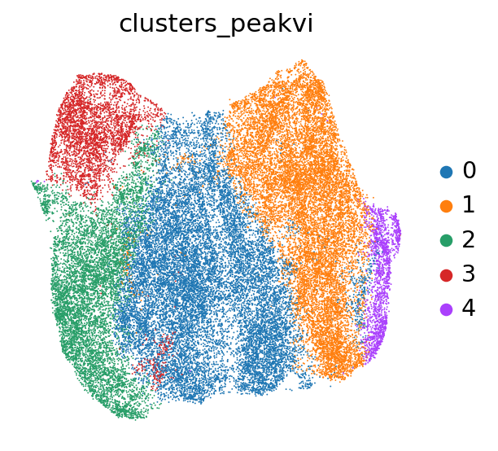
    


```python
sc.pl.umap(adata, color="batch")
```


    
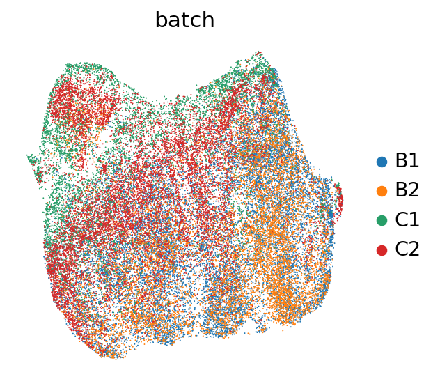
    


```python
!mkdir ../process/framework/reduction
```


```python
umap_df = pd.DataFrame(adata.obsm["X_umap"])
umap_df.index = adata.obs_names
umap_df.to_csv("../process/framework/reduction/7.17_combined_umap_20epcho.csv")
```


```python
peakvi_df = pd.DataFrame(adata.obsm["X_peakvi"])
peakvi_df.index = adata.obs_names
peakvi_df.to_csv("../process/framework/reduction/7.17_combined_peakvi_20epcho.csv")
```


```python
model_full = scvi.model.PEAKVI(adata)
model_full.train()
```

    GPU available: True (cuda), used: True
    TPU available: False, using: 0 TPU cores
    IPU available: False, using: 0 IPUs
    HPU available: False, using: 0 HPUs
    LOCAL_RANK: 0 - CUDA_VISIBLE_DEVICES: [0]
    /home/zhangyufeng/miniconda3/envs/scarches/lib/python3.10/site-packages/lightning/pytorch/trainer/connectors/data_connector.py:441: The 'train_dataloader' does not have many workers which may be a bottleneck. Consider increasing the value of the `num_workers` argument` to `num_workers=63` in the `DataLoader` to improve performance.
    /home/zhangyufeng/miniconda3/envs/scarches/lib/python3.10/site-packages/lightning/pytorch/trainer/connectors/data_connector.py:441: The 'val_dataloader' does not have many workers which may be a bottleneck. Consider increasing the value of the `num_workers` argument` to `num_workers=63` in the `DataLoader` to improve performance.


    Epoch 42/500:   8%|▊         | 41/500 [1:38:49<18:11:56, 142.74s/it, v_num=1, train_loss_step=6.31e+7, train_loss_epoch=1.68e+8]


```python
model_dir = os.path.join("../process/integration/peakvi", "peakvi_full_epoch")
model_full.save(model_dir, overwrite=True)
```


```python
PEAKVI_LATENT_KEY = "X_peakvi_full"

latent = model_full.get_latent_representation()
adata.obsm[PEAKVI_LATENT_KEY] = latent
latent.shape
```


    (42042, 13)


```python
PEAKVI_CLUSTERS_KEY = "clusters_peakvi_full"

# compute the k-nearest-neighbor graph that is used in both clustering and umap algorithms
sc.pp.neighbors(adata, use_rep=PEAKVI_LATENT_KEY)
# compute the umap
sc.tl.umap(adata, min_dist=0.2)
# cluster the space (we use a lower resolution to get fewer clusters than the default)
sc.tl.leiden(adata, key_added=PEAKVI_CLUSTERS_KEY, resolution=0.2)
```


```python
sc.pl.umap(adata, color=["batch","clusters_peakvi_full","clusters_peakvi"])
```


    
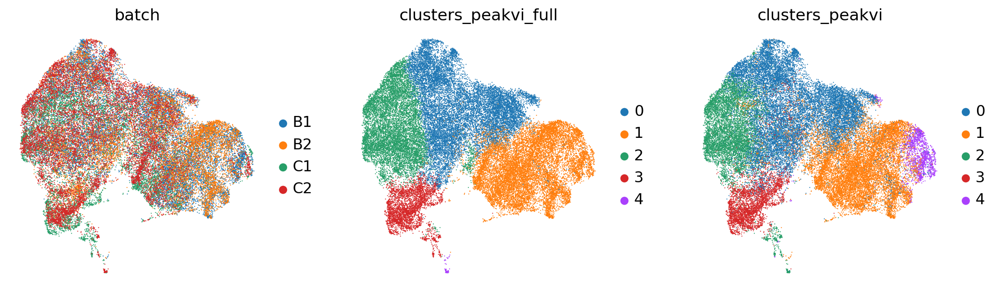
    


```python
sc.pl.umap(adata, color=["batch","clusters_peakvi_full"],save="_peakvi_umap_batch")
```

    WARNING: saving figure to file ../result/intergrate/umap_peakvi_umap_batch.pdf


    
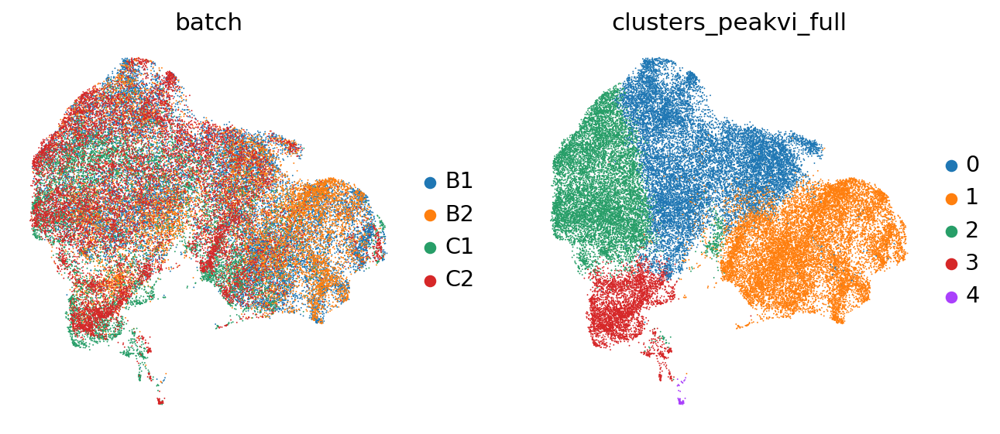
    


```python
peakvi_df = pd.DataFrame(adata.obsm["X_peakvi_full"])
peakvi_df.index = adata.obs_names
peakvi_df.to_csv("../process/framework/reduction/7.17_combined_peakvi_full.csv")
```


```python
umap_df = pd.DataFrame(adata.obsm["X_umap"])
umap_df.index = adata.obs_names
umap_df.to_csv("../process/framework/reduction/7.17_combined_umap_full.csv")
```


```python
pd.DataFrame(adata.obs["clusters_peakvi_full"]).to_csv("../process/framework/cluster/combine_peakvi.csv")
```


```python
grouped=adata.obs.groupby(["clusters_peakvi_full","batch"]).size().reset_index(name='count')
```


```python
grouped
```


<div>
<style scoped>
    .dataframe tbody tr th:only-of-type {
        vertical-align: middle;
    }

    .dataframe tbody tr th {
        vertical-align: top;
    }

    .dataframe thead th {
        text-align: right;
    }
</style>
<table border="1" class="dataframe">
  <thead>
    <tr style="text-align: right;">
      <th></th>
      <th>clusters_peakvi_full</th>
      <th>batch</th>
      <th>count</th>
      <th>total</th>
      <th>percent</th>
    </tr>
  </thead>
  <tbody>
    <tr>
      <th>0</th>
      <td>0</td>
      <td>B1</td>
      <td>5901</td>
      <td>14322</td>
      <td>41.202346</td>
    </tr>
    <tr>
      <th>1</th>
      <td>0</td>
      <td>B2</td>
      <td>3462</td>
      <td>14322</td>
      <td>24.172602</td>
    </tr>
    <tr>
      <th>2</th>
      <td>0</td>
      <td>C1</td>
      <td>1386</td>
      <td>14322</td>
      <td>9.677419</td>
    </tr>
    <tr>
      <th>3</th>
      <td>0</td>
      <td>C2</td>
      <td>3573</td>
      <td>14322</td>
      <td>24.947633</td>
    </tr>
    <tr>
      <th>4</th>
      <td>1</td>
      <td>B1</td>
      <td>6107</td>
      <td>13993</td>
      <td>43.643250</td>
    </tr>
    <tr>
      <th>5</th>
      <td>1</td>
      <td>B2</td>
      <td>4702</td>
      <td>13993</td>
      <td>33.602516</td>
    </tr>
    <tr>
      <th>6</th>
      <td>1</td>
      <td>C1</td>
      <td>1433</td>
      <td>13993</td>
      <td>10.240835</td>
    </tr>
    <tr>
      <th>7</th>
      <td>1</td>
      <td>C2</td>
      <td>1751</td>
      <td>13993</td>
      <td>12.513400</td>
    </tr>
    <tr>
      <th>8</th>
      <td>2</td>
      <td>B1</td>
      <td>2659</td>
      <td>9926</td>
      <td>26.788233</td>
    </tr>
    <tr>
      <th>9</th>
      <td>2</td>
      <td>B2</td>
      <td>1475</td>
      <td>9926</td>
      <td>14.859964</td>
    </tr>
    <tr>
      <th>10</th>
      <td>2</td>
      <td>C1</td>
      <td>2342</td>
      <td>9926</td>
      <td>23.594600</td>
    </tr>
    <tr>
      <th>11</th>
      <td>2</td>
      <td>C2</td>
      <td>3450</td>
      <td>9926</td>
      <td>34.757203</td>
    </tr>
    <tr>
      <th>12</th>
      <td>3</td>
      <td>B1</td>
      <td>66</td>
      <td>3690</td>
      <td>1.788618</td>
    </tr>
    <tr>
      <th>13</th>
      <td>3</td>
      <td>B2</td>
      <td>668</td>
      <td>3690</td>
      <td>18.102981</td>
    </tr>
    <tr>
      <th>14</th>
      <td>3</td>
      <td>C1</td>
      <td>1471</td>
      <td>3690</td>
      <td>39.864499</td>
    </tr>
    <tr>
      <th>15</th>
      <td>3</td>
      <td>C2</td>
      <td>1485</td>
      <td>3690</td>
      <td>40.243902</td>
    </tr>
    <tr>
      <th>16</th>
      <td>4</td>
      <td>B1</td>
      <td>5</td>
      <td>111</td>
      <td>4.504505</td>
    </tr>
    <tr>
      <th>17</th>
      <td>4</td>
      <td>B2</td>
      <td>2</td>
      <td>111</td>
      <td>1.801802</td>
    </tr>
    <tr>
      <th>18</th>
      <td>4</td>
      <td>C1</td>
      <td>17</td>
      <td>111</td>
      <td>15.315315</td>
    </tr>
    <tr>
      <th>19</th>
      <td>4</td>
      <td>C2</td>
      <td>87</td>
      <td>111</td>
      <td>78.378378</td>
    </tr>
  </tbody>
</table>
</div>


```python

```


```python
grouped2=adata.obs.groupby(["clusters_peakvi_full","batch"]).size().reset_index(name='count')
df = grouped2
df_pivot = df.pivot_table(values='count', index='batch', columns='clusters_peakvi_full', aggfunc='sum', fill_value=0)
df_pivot = df_pivot.div(df_pivot.sum(axis=0), axis=1) * 100

df = df_pivot
# Plotting
plt.figure(figsize=(10, 6))

# Stacked bar plot
bottom = None
for batch in df.index:
    plt.bar(df.columns, df.loc[batch], bottom=bottom, label=batch)
    if bottom is None:
        bottom = df.loc[batch].values
    else:
        bottom += df.loc[batch].values

plt.xlabel('clusters_poissonvi')
plt.ylabel('Percentage')
plt.title('Stacked Bar Plot of Batch by Clusters_poissonvi')
plt.xticks(df.columns)
plt.legend(title='Batch')
plt.tight_layout()
plt.savefig("../result/intergrate/peakvi_integrate.pdf")
plt.show()
```


    
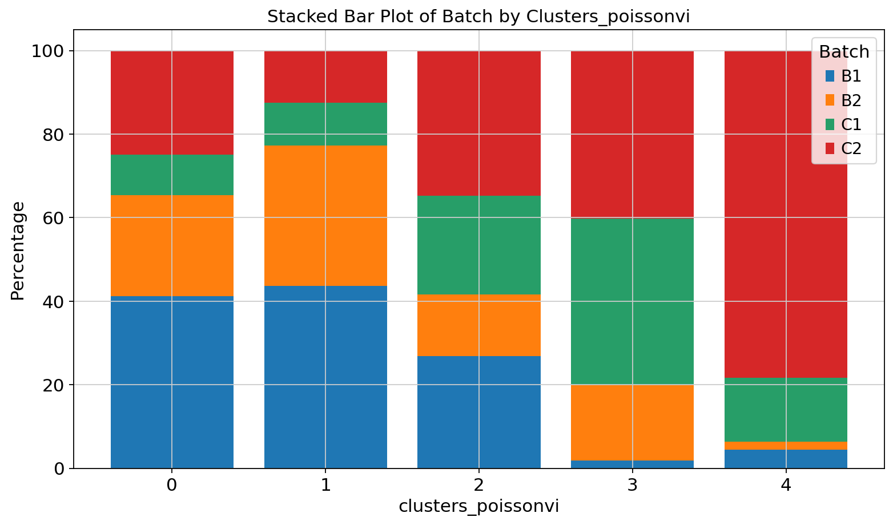
    


```python
# Pivot the table to have 'clusters_peakvi_full' as rows, 'batch' as columns, and 'count' as values
pivot_table = grouped.pivot(index='clusters_peakvi_full', columns='batch', values='count')

# Normalize each row to sum up to 1
pivot_table = pivot_table.div(pivot_table.sum(axis=1), axis=0)

# Plotting heatmap
plt.figure(figsize=(12, 8))
sns.heatmap(pivot_table, annot=True, cmap="YlGnBu", cbar=True)
plt.title('Normalized Frequency of Batches by Clusters')
plt.xlabel('Batch')
plt.ylabel('Clusters_peakvi_full')
plt.xticks(rotation=45)
plt.tight_layout()
plt.show()
```


    
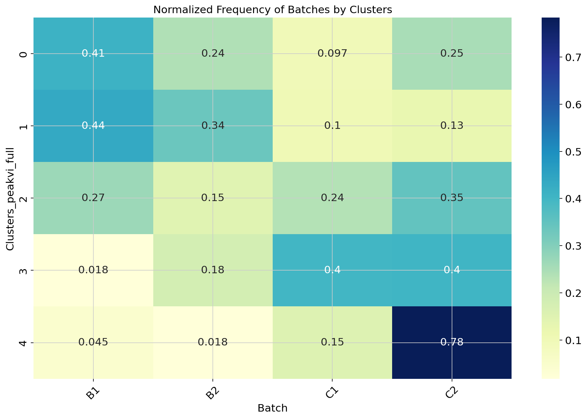
    


```python

```


```python
da_peaks_1 = model.differential_accessibility(
    adata, groupby="clusters_peakvi_full", group1="1", two_sided=False
)
```

    DE...: 100%|██████████| 1/1 [01:15<00:00, 75.64s/it]


```python
da_peaks_1
```


<div>
<style scoped>
    .dataframe tbody tr th:only-of-type {
        vertical-align: middle;
    }

    .dataframe tbody tr th {
        vertical-align: top;
    }

    .dataframe thead th {
        text-align: right;
    }
</style>
<table border="1" class="dataframe">
  <thead>
    <tr style="text-align: right;">
      <th></th>
      <th>prob_da</th>
      <th>is_da_fdr</th>
      <th>bayes_factor</th>
      <th>effect_size</th>
      <th>emp_effect</th>
      <th>est_prob1</th>
      <th>est_prob2</th>
      <th>emp_prob1</th>
      <th>emp_prob2</th>
    </tr>
  </thead>
  <tbody>
    <tr>
      <th>chr13-72710863-72711739</th>
      <td>0.9372</td>
      <td>False</td>
      <td>2.702941</td>
      <td>-0.358292</td>
      <td>-0.092104</td>
      <td>0.458604</td>
      <td>0.100312</td>
      <td>0.118059</td>
      <td>0.025955</td>
    </tr>
    <tr>
      <th>chr13-72763087-72764133</th>
      <td>0.9330</td>
      <td>False</td>
      <td>2.633712</td>
      <td>-0.280817</td>
      <td>-0.069561</td>
      <td>0.370750</td>
      <td>0.089933</td>
      <td>0.097263</td>
      <td>0.027702</td>
    </tr>
    <tr>
      <th>chr4-117104913-117105883</th>
      <td>0.9132</td>
      <td>False</td>
      <td>2.353348</td>
      <td>-0.306544</td>
      <td>-0.071224</td>
      <td>0.423453</td>
      <td>0.116909</td>
      <td>0.107125</td>
      <td>0.035901</td>
    </tr>
    <tr>
      <th>chr14-56240913-56241856</th>
      <td>0.9086</td>
      <td>False</td>
      <td>2.296659</td>
      <td>-0.310439</td>
      <td>-0.077075</td>
      <td>0.403799</td>
      <td>0.093360</td>
      <td>0.109340</td>
      <td>0.032265</td>
    </tr>
    <tr>
      <th>chr11-33871850-33873566</th>
      <td>0.9028</td>
      <td>False</td>
      <td>2.228730</td>
      <td>-0.369154</td>
      <td>-0.084029</td>
      <td>0.602052</td>
      <td>0.232898</td>
      <td>0.157436</td>
      <td>0.073407</td>
    </tr>
    <tr>
      <th>...</th>
      <td>...</td>
      <td>...</td>
      <td>...</td>
      <td>...</td>
      <td>...</td>
      <td>...</td>
      <td>...</td>
      <td>...</td>
      <td>...</td>
    </tr>
    <tr>
      <th>chr5-20881414-20882724</th>
      <td>0.0000</td>
      <td>False</td>
      <td>-18.420681</td>
      <td>0.002510</td>
      <td>0.115730</td>
      <td>0.996102</td>
      <td>0.998612</td>
      <td>0.331380</td>
      <td>0.447110</td>
    </tr>
    <tr>
      <th>chr12-70824819-70826005</th>
      <td>0.0000</td>
      <td>False</td>
      <td>-18.420681</td>
      <td>0.005881</td>
      <td>0.109612</td>
      <td>0.991189</td>
      <td>0.997070</td>
      <td>0.309512</td>
      <td>0.419124</td>
    </tr>
    <tr>
      <th>chr12-71015182-71016196</th>
      <td>0.0000</td>
      <td>False</td>
      <td>-18.420681</td>
      <td>0.000742</td>
      <td>0.104468</td>
      <td>0.997922</td>
      <td>0.998664</td>
      <td>0.329808</td>
      <td>0.434276</td>
    </tr>
    <tr>
      <th>chr12-72085286-72086302</th>
      <td>0.0000</td>
      <td>False</td>
      <td>-18.420681</td>
      <td>0.001065</td>
      <td>0.106062</td>
      <td>0.997882</td>
      <td>0.998946</td>
      <td>0.350389</td>
      <td>0.456451</td>
    </tr>
    <tr>
      <th>JH584304.1-58341-60256</th>
      <td>0.0000</td>
      <td>False</td>
      <td>-18.420681</td>
      <td>0.000105</td>
      <td>0.063888</td>
      <td>0.999363</td>
      <td>0.999468</td>
      <td>0.698349</td>
      <td>0.762238</td>
    </tr>
  </tbody>
</table>
<p>32923 rows × 9 columns</p>
</div>


```python
da_peaks_1_filt = da_peaks_1[(da_peaks_1.emp_prob1 >= 0.05)]
```


```python
da_peaks_1_filt
```


<div>
<style scoped>
    .dataframe tbody tr th:only-of-type {
        vertical-align: middle;
    }

    .dataframe tbody tr th {
        vertical-align: top;
    }

    .dataframe thead th {
        text-align: right;
    }
</style>
<table border="1" class="dataframe">
  <thead>
    <tr style="text-align: right;">
      <th></th>
      <th>prob_da</th>
      <th>is_da_fdr</th>
      <th>bayes_factor</th>
      <th>effect_size</th>
      <th>emp_effect</th>
      <th>est_prob1</th>
      <th>est_prob2</th>
      <th>emp_prob1</th>
      <th>emp_prob2</th>
    </tr>
  </thead>
  <tbody>
    <tr>
      <th>chr13-72710863-72711739</th>
      <td>0.9372</td>
      <td>False</td>
      <td>2.702941</td>
      <td>-0.358292</td>
      <td>-0.092104</td>
      <td>0.458604</td>
      <td>0.100312</td>
      <td>0.118059</td>
      <td>0.025955</td>
    </tr>
    <tr>
      <th>chr13-72763087-72764133</th>
      <td>0.9330</td>
      <td>False</td>
      <td>2.633712</td>
      <td>-0.280817</td>
      <td>-0.069561</td>
      <td>0.370750</td>
      <td>0.089933</td>
      <td>0.097263</td>
      <td>0.027702</td>
    </tr>
    <tr>
      <th>chr4-117104913-117105883</th>
      <td>0.9132</td>
      <td>False</td>
      <td>2.353348</td>
      <td>-0.306544</td>
      <td>-0.071224</td>
      <td>0.423453</td>
      <td>0.116909</td>
      <td>0.107125</td>
      <td>0.035901</td>
    </tr>
    <tr>
      <th>chr14-56240913-56241856</th>
      <td>0.9086</td>
      <td>False</td>
      <td>2.296659</td>
      <td>-0.310439</td>
      <td>-0.077075</td>
      <td>0.403799</td>
      <td>0.093360</td>
      <td>0.109340</td>
      <td>0.032265</td>
    </tr>
    <tr>
      <th>chr11-33871850-33873566</th>
      <td>0.9028</td>
      <td>False</td>
      <td>2.228730</td>
      <td>-0.369154</td>
      <td>-0.084029</td>
      <td>0.602052</td>
      <td>0.232898</td>
      <td>0.157436</td>
      <td>0.073407</td>
    </tr>
    <tr>
      <th>...</th>
      <td>...</td>
      <td>...</td>
      <td>...</td>
      <td>...</td>
      <td>...</td>
      <td>...</td>
      <td>...</td>
      <td>...</td>
      <td>...</td>
    </tr>
    <tr>
      <th>chr5-20881414-20882724</th>
      <td>0.0000</td>
      <td>False</td>
      <td>-18.420681</td>
      <td>0.002510</td>
      <td>0.115730</td>
      <td>0.996102</td>
      <td>0.998612</td>
      <td>0.331380</td>
      <td>0.447110</td>
    </tr>
    <tr>
      <th>chr12-70824819-70826005</th>
      <td>0.0000</td>
      <td>False</td>
      <td>-18.420681</td>
      <td>0.005881</td>
      <td>0.109612</td>
      <td>0.991189</td>
      <td>0.997070</td>
      <td>0.309512</td>
      <td>0.419124</td>
    </tr>
    <tr>
      <th>chr12-71015182-71016196</th>
      <td>0.0000</td>
      <td>False</td>
      <td>-18.420681</td>
      <td>0.000742</td>
      <td>0.104468</td>
      <td>0.997922</td>
      <td>0.998664</td>
      <td>0.329808</td>
      <td>0.434276</td>
    </tr>
    <tr>
      <th>chr12-72085286-72086302</th>
      <td>0.0000</td>
      <td>False</td>
      <td>-18.420681</td>
      <td>0.001065</td>
      <td>0.106062</td>
      <td>0.997882</td>
      <td>0.998946</td>
      <td>0.350389</td>
      <td>0.456451</td>
    </tr>
    <tr>
      <th>JH584304.1-58341-60256</th>
      <td>0.0000</td>
      <td>False</td>
      <td>-18.420681</td>
      <td>0.000105</td>
      <td>0.063888</td>
      <td>0.999363</td>
      <td>0.999468</td>
      <td>0.698349</td>
      <td>0.762238</td>
    </tr>
  </tbody>
</table>
<p>24924 rows × 9 columns</p>
</div>


```python
da_peaks_1_filt.index[:4]
```


    Index(['chr13-72710863-72711739', 'chr13-72763087-72764133',
           'chr4-117104913-117105883', 'chr14-56240913-56241856'],
          dtype='object')


```python
da_res1_vs_3 = model.differential_accessibility(
    groupby=PEAKVI_CLUSTERS_KEY, group1="1", group2="3", two_sided=True
)
```

    DE...: 100%|██████████| 1/1 [00:42<00:00, 42.39s/it]


```python
da_res1_vs_3
```


<div>
<style scoped>
    .dataframe tbody tr th:only-of-type {
        vertical-align: middle;
    }

    .dataframe tbody tr th {
        vertical-align: top;
    }

    .dataframe thead th {
        text-align: right;
    }
</style>
<table border="1" class="dataframe">
  <thead>
    <tr style="text-align: right;">
      <th></th>
      <th>prob_da</th>
      <th>is_da_fdr</th>
      <th>bayes_factor</th>
      <th>effect_size</th>
      <th>emp_effect</th>
      <th>est_prob1</th>
      <th>est_prob2</th>
      <th>emp_prob1</th>
      <th>emp_prob2</th>
    </tr>
  </thead>
  <tbody>
    <tr>
      <th>chr13-60044696-60045726</th>
      <td>0.9988</td>
      <td>True</td>
      <td>6.724225</td>
      <td>-0.619479</td>
      <td>-0.181109</td>
      <td>0.700905</td>
      <td>0.081426</td>
      <td>0.197099</td>
      <td>0.015989</td>
    </tr>
    <tr>
      <th>chr3-127842873-127843800</th>
      <td>0.9986</td>
      <td>True</td>
      <td>6.569875</td>
      <td>-0.559301</td>
      <td>-0.145470</td>
      <td>0.618145</td>
      <td>0.058844</td>
      <td>0.157936</td>
      <td>0.012466</td>
    </tr>
    <tr>
      <th>chr7-28083907-28085230</th>
      <td>0.9980</td>
      <td>True</td>
      <td>6.212601</td>
      <td>-0.506045</td>
      <td>-0.124382</td>
      <td>0.602937</td>
      <td>0.096891</td>
      <td>0.161509</td>
      <td>0.037127</td>
    </tr>
    <tr>
      <th>chr5-128700373-128701298</th>
      <td>0.9976</td>
      <td>True</td>
      <td>6.029880</td>
      <td>-0.406769</td>
      <td>-0.091468</td>
      <td>0.484865</td>
      <td>0.078097</td>
      <td>0.116129</td>
      <td>0.024661</td>
    </tr>
    <tr>
      <th>chr15-5446289-5447585</th>
      <td>0.9974</td>
      <td>True</td>
      <td>5.949637</td>
      <td>-0.464834</td>
      <td>-0.105315</td>
      <td>0.516242</td>
      <td>0.051408</td>
      <td>0.128350</td>
      <td>0.023035</td>
    </tr>
    <tr>
      <th>...</th>
      <td>...</td>
      <td>...</td>
      <td>...</td>
      <td>...</td>
      <td>...</td>
      <td>...</td>
      <td>...</td>
      <td>...</td>
      <td>...</td>
    </tr>
    <tr>
      <th>chr9-14675645-14676881</th>
      <td>0.0000</td>
      <td>False</td>
      <td>-18.420681</td>
      <td>0.006977</td>
      <td>0.178788</td>
      <td>0.990101</td>
      <td>0.997078</td>
      <td>0.290860</td>
      <td>0.469648</td>
    </tr>
    <tr>
      <th>chr9-20642414-20643465</th>
      <td>0.0000</td>
      <td>False</td>
      <td>-18.420681</td>
      <td>0.002396</td>
      <td>0.130238</td>
      <td>0.994409</td>
      <td>0.996805</td>
      <td>0.296863</td>
      <td>0.427100</td>
    </tr>
    <tr>
      <th>chr9-20651500-20652422</th>
      <td>0.0000</td>
      <td>False</td>
      <td>-18.420681</td>
      <td>0.003803</td>
      <td>0.156350</td>
      <td>0.991208</td>
      <td>0.995010</td>
      <td>0.305438</td>
      <td>0.461789</td>
    </tr>
    <tr>
      <th>chr9-21290882-21291834</th>
      <td>0.0000</td>
      <td>False</td>
      <td>-18.420681</td>
      <td>0.000983</td>
      <td>0.226951</td>
      <td>0.997440</td>
      <td>0.998424</td>
      <td>0.334024</td>
      <td>0.560976</td>
    </tr>
    <tr>
      <th>JH584304.1-58341-60256</th>
      <td>0.0000</td>
      <td>False</td>
      <td>-18.420681</td>
      <td>-0.000235</td>
      <td>0.111407</td>
      <td>0.999357</td>
      <td>0.999122</td>
      <td>0.698349</td>
      <td>0.809756</td>
    </tr>
  </tbody>
</table>
<p>32923 rows × 9 columns</p>
</div>


```python
plt.scatter(da_res1_vs_3.effect_size, da_res1_vs_3.prob_da, s=1)
plt.xlabel("effect size")
plt.ylabel("probability of DA")
plt.show()

da_res1_vs_3.loc[da_res1_vs_3.is_da_fdr].sort_values("prob_da", ascending=False).head(10)
```


    
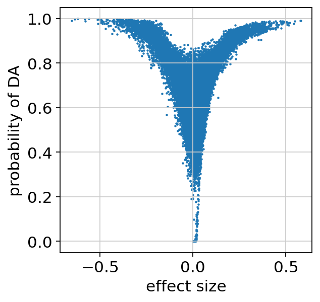
    


<div>
<style scoped>
    .dataframe tbody tr th:only-of-type {
        vertical-align: middle;
    }

    .dataframe tbody tr th {
        vertical-align: top;
    }

    .dataframe thead th {
        text-align: right;
    }
</style>
<table border="1" class="dataframe">
  <thead>
    <tr style="text-align: right;">
      <th></th>
      <th>prob_da</th>
      <th>is_da_fdr</th>
      <th>bayes_factor</th>
      <th>effect_size</th>
      <th>emp_effect</th>
      <th>est_prob1</th>
      <th>est_prob2</th>
      <th>emp_prob1</th>
      <th>emp_prob2</th>
    </tr>
  </thead>
  <tbody>
    <tr>
      <th>chr13-60044696-60045726</th>
      <td>0.9988</td>
      <td>True</td>
      <td>6.724225</td>
      <td>-0.619479</td>
      <td>-0.181109</td>
      <td>0.700905</td>
      <td>0.081426</td>
      <td>0.197099</td>
      <td>0.015989</td>
    </tr>
    <tr>
      <th>chr3-127842873-127843800</th>
      <td>0.9986</td>
      <td>True</td>
      <td>6.569875</td>
      <td>-0.559301</td>
      <td>-0.145470</td>
      <td>0.618145</td>
      <td>0.058844</td>
      <td>0.157936</td>
      <td>0.012466</td>
    </tr>
    <tr>
      <th>chr7-28083907-28085230</th>
      <td>0.9980</td>
      <td>True</td>
      <td>6.212601</td>
      <td>-0.506045</td>
      <td>-0.124382</td>
      <td>0.602937</td>
      <td>0.096891</td>
      <td>0.161509</td>
      <td>0.037127</td>
    </tr>
    <tr>
      <th>chr5-128700373-128701298</th>
      <td>0.9976</td>
      <td>True</td>
      <td>6.029880</td>
      <td>-0.406769</td>
      <td>-0.091468</td>
      <td>0.484865</td>
      <td>0.078097</td>
      <td>0.116129</td>
      <td>0.024661</td>
    </tr>
    <tr>
      <th>chr15-5446289-5447585</th>
      <td>0.9974</td>
      <td>True</td>
      <td>5.949637</td>
      <td>-0.464834</td>
      <td>-0.105315</td>
      <td>0.516242</td>
      <td>0.051408</td>
      <td>0.128350</td>
      <td>0.023035</td>
    </tr>
    <tr>
      <th>chr10-110750777-110751698</th>
      <td>0.9972</td>
      <td>True</td>
      <td>5.875328</td>
      <td>-0.336183</td>
      <td>-0.081836</td>
      <td>0.403043</td>
      <td>0.066860</td>
      <td>0.100264</td>
      <td>0.018428</td>
    </tr>
    <tr>
      <th>chr6-117246879-117247858</th>
      <td>0.9968</td>
      <td>True</td>
      <td>5.741396</td>
      <td>-0.411292</td>
      <td>-0.103898</td>
      <td>0.466774</td>
      <td>0.055482</td>
      <td>0.119345</td>
      <td>0.015447</td>
    </tr>
    <tr>
      <th>chr4-107819845-107821200</th>
      <td>0.9966</td>
      <td>True</td>
      <td>5.680571</td>
      <td>-0.394884</td>
      <td>-0.094672</td>
      <td>0.477916</td>
      <td>0.083032</td>
      <td>0.120417</td>
      <td>0.025745</td>
    </tr>
    <tr>
      <th>chr8-106768867-106769962</th>
      <td>0.9966</td>
      <td>True</td>
      <td>5.680571</td>
      <td>-0.581821</td>
      <td>-0.138570</td>
      <td>0.681654</td>
      <td>0.099833</td>
      <td>0.180304</td>
      <td>0.041734</td>
    </tr>
    <tr>
      <th>chr5-128649314-128650229</th>
      <td>0.9964</td>
      <td>True</td>
      <td>5.623212</td>
      <td>-0.636500</td>
      <td>-0.167708</td>
      <td>0.763651</td>
      <td>0.127151</td>
      <td>0.220825</td>
      <td>0.053117</td>
    </tr>
  </tbody>
</table>
</div>


```python
da_res1_vs_3.to_csv()
```


<div>
<style scoped>
    .dataframe tbody tr th:only-of-type {
        vertical-align: middle;
    }

    .dataframe tbody tr th {
        vertical-align: top;
    }

    .dataframe thead th {
        text-align: right;
    }
</style>
<table border="1" class="dataframe">
  <thead>
    <tr style="text-align: right;">
      <th></th>
      <th>prob_da</th>
      <th>is_da_fdr</th>
      <th>bayes_factor</th>
      <th>effect_size</th>
      <th>emp_effect</th>
      <th>est_prob1</th>
      <th>est_prob2</th>
      <th>emp_prob1</th>
      <th>emp_prob2</th>
    </tr>
  </thead>
  <tbody>
    <tr>
      <th>chr13-60044696-60045726</th>
      <td>0.9988</td>
      <td>True</td>
      <td>6.724225</td>
      <td>-0.619479</td>
      <td>-0.181109</td>
      <td>0.700905</td>
      <td>0.081426</td>
      <td>0.197099</td>
      <td>0.015989</td>
    </tr>
    <tr>
      <th>chr3-127842873-127843800</th>
      <td>0.9986</td>
      <td>True</td>
      <td>6.569875</td>
      <td>-0.559301</td>
      <td>-0.145470</td>
      <td>0.618145</td>
      <td>0.058844</td>
      <td>0.157936</td>
      <td>0.012466</td>
    </tr>
    <tr>
      <th>chr7-28083907-28085230</th>
      <td>0.9980</td>
      <td>True</td>
      <td>6.212601</td>
      <td>-0.506045</td>
      <td>-0.124382</td>
      <td>0.602937</td>
      <td>0.096891</td>
      <td>0.161509</td>
      <td>0.037127</td>
    </tr>
    <tr>
      <th>chr5-128700373-128701298</th>
      <td>0.9976</td>
      <td>True</td>
      <td>6.029880</td>
      <td>-0.406769</td>
      <td>-0.091468</td>
      <td>0.484865</td>
      <td>0.078097</td>
      <td>0.116129</td>
      <td>0.024661</td>
    </tr>
    <tr>
      <th>chr15-5446289-5447585</th>
      <td>0.9974</td>
      <td>True</td>
      <td>5.949637</td>
      <td>-0.464834</td>
      <td>-0.105315</td>
      <td>0.516242</td>
      <td>0.051408</td>
      <td>0.128350</td>
      <td>0.023035</td>
    </tr>
    <tr>
      <th>...</th>
      <td>...</td>
      <td>...</td>
      <td>...</td>
      <td>...</td>
      <td>...</td>
      <td>...</td>
      <td>...</td>
      <td>...</td>
      <td>...</td>
    </tr>
    <tr>
      <th>chr9-14675645-14676881</th>
      <td>0.0000</td>
      <td>False</td>
      <td>-18.420681</td>
      <td>0.006977</td>
      <td>0.178788</td>
      <td>0.990101</td>
      <td>0.997078</td>
      <td>0.290860</td>
      <td>0.469648</td>
    </tr>
    <tr>
      <th>chr9-20642414-20643465</th>
      <td>0.0000</td>
      <td>False</td>
      <td>-18.420681</td>
      <td>0.002396</td>
      <td>0.130238</td>
      <td>0.994409</td>
      <td>0.996805</td>
      <td>0.296863</td>
      <td>0.427100</td>
    </tr>
    <tr>
      <th>chr9-20651500-20652422</th>
      <td>0.0000</td>
      <td>False</td>
      <td>-18.420681</td>
      <td>0.003803</td>
      <td>0.156350</td>
      <td>0.991208</td>
      <td>0.995010</td>
      <td>0.305438</td>
      <td>0.461789</td>
    </tr>
    <tr>
      <th>chr9-21290882-21291834</th>
      <td>0.0000</td>
      <td>False</td>
      <td>-18.420681</td>
      <td>0.000983</td>
      <td>0.226951</td>
      <td>0.997440</td>
      <td>0.998424</td>
      <td>0.334024</td>
      <td>0.560976</td>
    </tr>
    <tr>
      <th>JH584304.1-58341-60256</th>
      <td>0.0000</td>
      <td>False</td>
      <td>-18.420681</td>
      <td>-0.000235</td>
      <td>0.111407</td>
      <td>0.999357</td>
      <td>0.999122</td>
      <td>0.698349</td>
      <td>0.809756</td>
    </tr>
  </tbody>
</table>
<p>32923 rows × 9 columns</p>
</div>


```python
da_res1_vs_3.to_csv("../process/differential_peak/7.18_peak_vi_cluster1_vs_3.csv")
```


```python
sc.pl.umap(adata, color=da_peaks_1_filt.index[:4], vmax="p99.0")
```


    
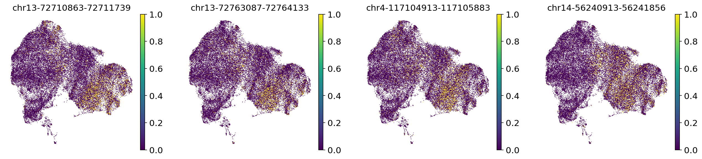
    


```python
sc.pl.umap(adata, color=da_res1_vs_3.index[:4], vmax="p99.0")
```


    
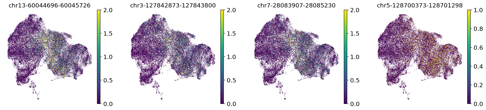
    


```python
adata.obs["batch"].isin(['C1', 'C2'])
```


    B1_AAACGAAAGAATACTG-1    False
    B1_AAACGAAAGACGACTG-1    False
    B1_AAACGAAAGAGAGTTT-1    False
    B1_AAACGAAAGCCTTTGA-1    False
    B1_AAACGAAAGCGTGTTT-1    False
                             ...  
    C2_TTTGTGTGTAGCGAGT-1     True
    C2_TTTGTGTGTCCTATTT-1     True
    C2_TTTGTGTTCCATCTAT-1     True
    C2_TTTGTGTTCCGTGCAG-1     True
    C2_TTTGTGTTCGTTGTAG-1     True
    Name: batch, Length: 42042, dtype: bool


```python
da_resE12_vs_E14 = model.differential_accessibility(
    groupby="batch",idx1=adata.obs["batch"].isin(['C1', 'C2']),
    idx2=adata.obs["batch"].isin(['B1', 'B2']), two_sided=True
)
```

    DE...: 100%|██████████| 1/1 [01:24<00:00, 84.89s/it]


```python
da_resE12_vs_E14.to_csv("../process/differential_peak/E12_E14_diff.csv")
```


```python
sc.pl.violin(adata,groupby="batch",keys="chr7-81493071-81494163")
```


    
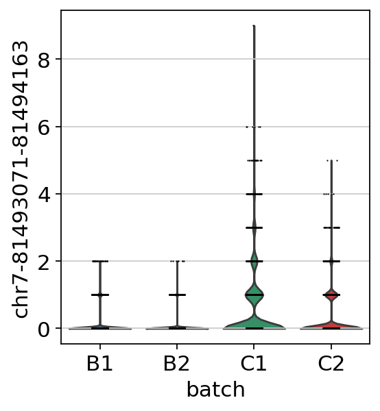
    


```python
sc.pl.violin(adata,groupby="batch",keys="chr11-69401004-69401904")
```


    
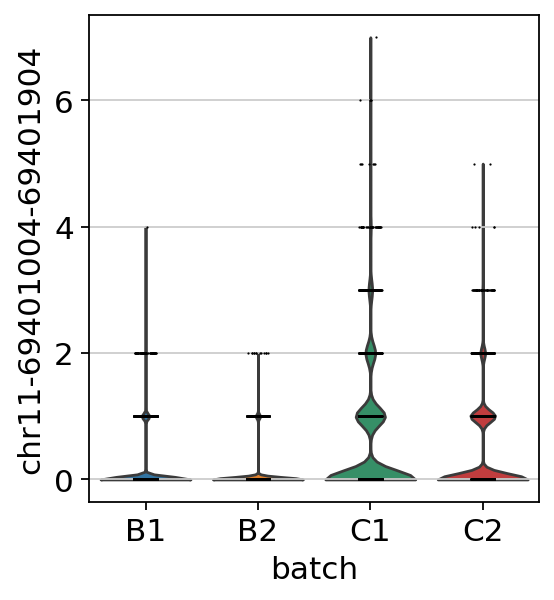
    


```python
da_peaks_0 = model.differential_accessibility(
    adata, groupby="clusters_peakvi_full", group1="0", two_sided=False
)
da_peaks_2 = model.differential_accessibility(
    adata, groupby="clusters_peakvi_full", group1="2", two_sided=False
)
```

    DE...: 100%|██████████| 1/1 [01:20<00:00, 80.02s/it]
    DE...: 100%|██████████| 1/1 [01:12<00:00, 72.26s/it]


```python
da_peaks_3 = model.differential_accessibility(
    adata, groupby="clusters_peakvi_full", group1="3", two_sided=False
)
da_peaks_4 = model.differential_accessibility(
    adata, groupby="clusters_peakvi_full", group1="4", two_sided=False
)
```

    DE...: 100%|██████████| 1/1 [01:11<00:00, 71.71s/it]
    DE...: 100%|██████████| 1/1 [00:58<00:00, 58.93s/it]


```python
da_peaks_0_filt = da_peaks_0[(da_peaks_0.emp_prob1 >= 0.1)]
da_peaks_2_filt = da_peaks_2[(da_peaks_2.emp_prob1 >= 0.1)]
da_peaks_3_filt = da_peaks_3[(da_peaks_3.emp_prob1 >= 0.1)]
da_peaks_4_filt = da_peaks_4[(da_peaks_4.emp_prob1 >= 0.1)]
```


```python
da_peaks_2_filt
```


<div>
<style scoped>
    .dataframe tbody tr th:only-of-type {
        vertical-align: middle;
    }

    .dataframe tbody tr th {
        vertical-align: top;
    }

    .dataframe thead th {
        text-align: right;
    }
</style>
<table border="1" class="dataframe">
  <thead>
    <tr style="text-align: right;">
      <th></th>
      <th>prob_da</th>
      <th>is_da_fdr</th>
      <th>bayes_factor</th>
      <th>effect_size</th>
      <th>emp_effect</th>
      <th>est_prob1</th>
      <th>est_prob2</th>
      <th>emp_prob1</th>
      <th>emp_prob2</th>
    </tr>
  </thead>
  <tbody>
    <tr>
      <th>chr8-102116473-102117965</th>
      <td>0.9248</td>
      <td>False</td>
      <td>2.509426</td>
      <td>-0.374838</td>
      <td>-0.157379</td>
      <td>0.443176</td>
      <td>0.068338</td>
      <td>0.181946</td>
      <td>0.024567</td>
    </tr>
    <tr>
      <th>chr6-6658833-6659980</th>
      <td>0.9172</td>
      <td>False</td>
      <td>2.404897</td>
      <td>-0.362917</td>
      <td>-0.147239</td>
      <td>0.457698</td>
      <td>0.094782</td>
      <td>0.176103</td>
      <td>0.028864</td>
    </tr>
    <tr>
      <th>chr13-9973511-9974777</th>
      <td>0.9146</td>
      <td>False</td>
      <td>2.371141</td>
      <td>-0.333925</td>
      <td>-0.125013</td>
      <td>0.429462</td>
      <td>0.095537</td>
      <td>0.155652</td>
      <td>0.030639</td>
    </tr>
    <tr>
      <th>chr17-67226780-67227801</th>
      <td>0.9126</td>
      <td>False</td>
      <td>2.345802</td>
      <td>-0.371214</td>
      <td>-0.164840</td>
      <td>0.495474</td>
      <td>0.124260</td>
      <td>0.209148</td>
      <td>0.044308</td>
    </tr>
    <tr>
      <th>chr16-57235380-57236492</th>
      <td>0.9110</td>
      <td>False</td>
      <td>2.325906</td>
      <td>-0.333707</td>
      <td>-0.133084</td>
      <td>0.434839</td>
      <td>0.101133</td>
      <td>0.168144</td>
      <td>0.035060</td>
    </tr>
    <tr>
      <th>...</th>
      <td>...</td>
      <td>...</td>
      <td>...</td>
      <td>...</td>
      <td>...</td>
      <td>...</td>
      <td>...</td>
      <td>...</td>
      <td>...</td>
    </tr>
    <tr>
      <th>chr7-19715252-19716345</th>
      <td>0.0000</td>
      <td>False</td>
      <td>-18.420681</td>
      <td>-0.000183</td>
      <td>-0.099162</td>
      <td>0.999307</td>
      <td>0.999124</td>
      <td>0.543925</td>
      <td>0.444763</td>
    </tr>
    <tr>
      <th>chr7-24883855-24884820</th>
      <td>0.0000</td>
      <td>False</td>
      <td>-18.420681</td>
      <td>-0.000144</td>
      <td>-0.084046</td>
      <td>0.999111</td>
      <td>0.998968</td>
      <td>0.500101</td>
      <td>0.416054</td>
    </tr>
    <tr>
      <th>chr7-25076723-25077747</th>
      <td>0.0000</td>
      <td>False</td>
      <td>-18.420681</td>
      <td>-0.000539</td>
      <td>-0.099774</td>
      <td>0.998475</td>
      <td>0.997936</td>
      <td>0.492444</td>
      <td>0.392670</td>
    </tr>
    <tr>
      <th>chr7-25267721-25268694</th>
      <td>0.0000</td>
      <td>False</td>
      <td>-18.420681</td>
      <td>-0.000090</td>
      <td>-0.108584</td>
      <td>0.999168</td>
      <td>0.999079</td>
      <td>0.515515</td>
      <td>0.406931</td>
    </tr>
    <tr>
      <th>JH584304.1-58341-60256</th>
      <td>0.0000</td>
      <td>False</td>
      <td>-18.420681</td>
      <td>0.000053</td>
      <td>-0.027313</td>
      <td>0.999393</td>
      <td>0.999445</td>
      <td>0.761838</td>
      <td>0.734525</td>
    </tr>
  </tbody>
</table>
<p>18024 rows × 9 columns</p>
</div>


```python
da_peaks_0_filt.to_csv("../process/differential_peak/peakvi_cluster0_diff.csv")
da_peaks_1_filt.to_csv("../process/differential_peak/peakvi_cluster1_diff.csv")
da_peaks_2_filt.to_csv("../process/differential_peak/peakvi_cluster2_diff.csv")
da_peaks_3_filt.to_csv("../process/differential_peak/peakvi_cluster3_diff.csv")
```
