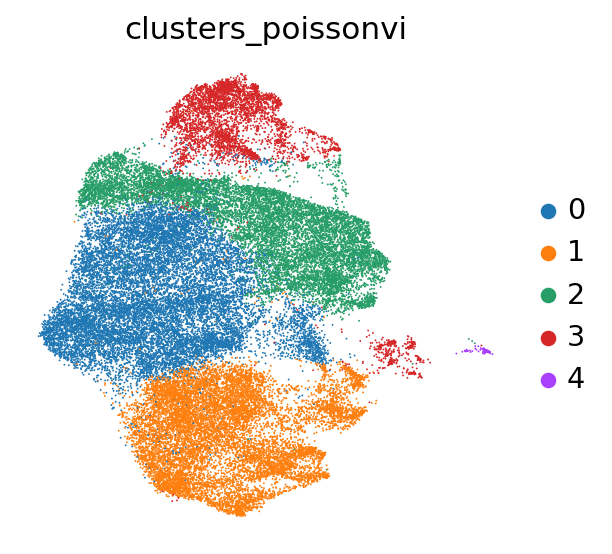
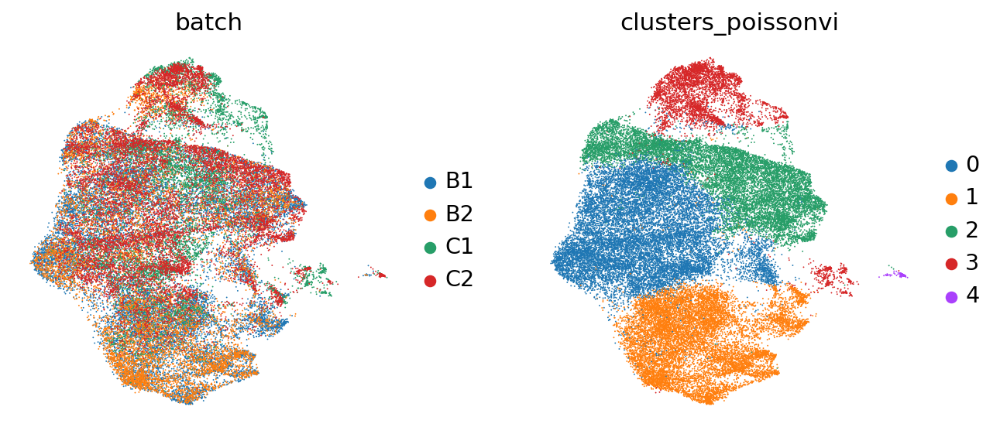
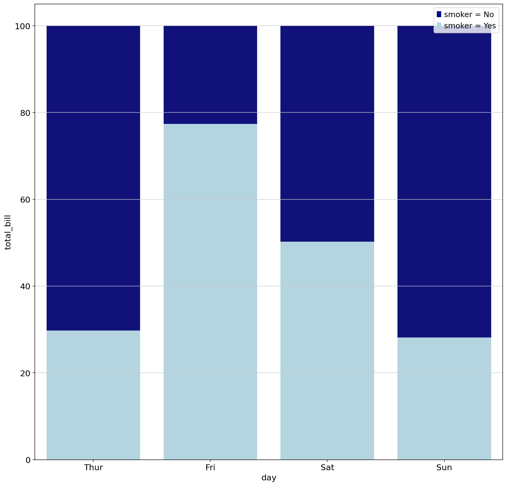
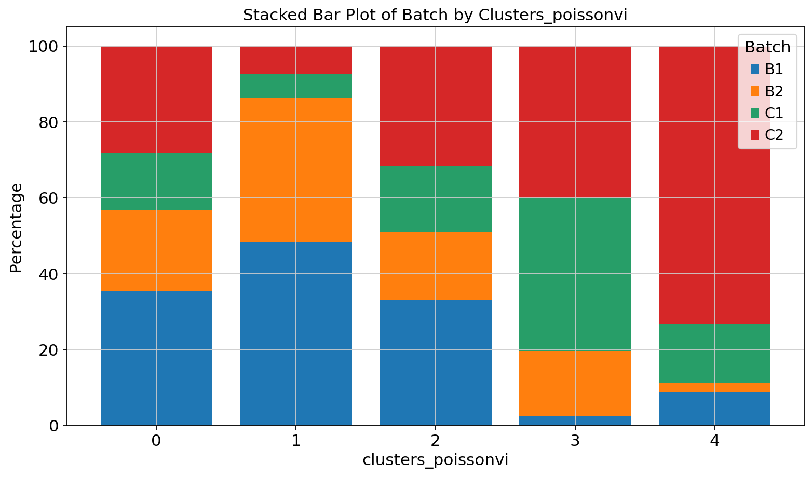
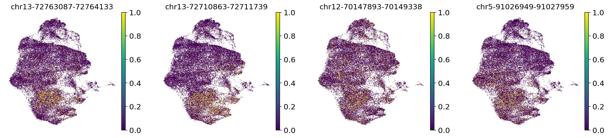
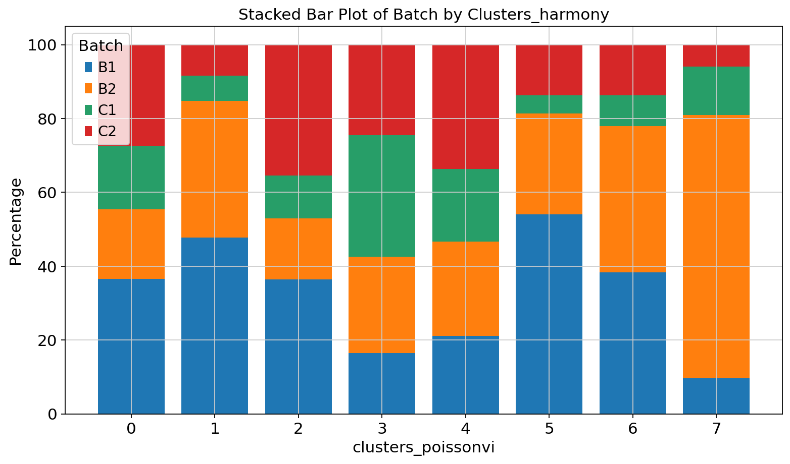

```python
import os
import tempfile
from pathlib import Path

#import pooch
import scanpy as sc
import scvi
import torch
```

    /home/zhangyufeng/miniconda3/envs/scarches/lib/python3.10/site-packages/torchvision/io/image.py:13: UserWarning: Failed to load image Python extension: /home/zhangyufeng/miniconda3/envs/scarches/lib/python3.10/site-packages/torchvision/image.so: undefined symbol: _ZN5torch3jit17parseSchemaOrNameERKNSt7__cxx1112basic_stringIcSt11char_traitsIcESaIcEEE
      warn(f"Failed to load image Python extension: {e}")
    /home/zhangyufeng/miniconda3/envs/scarches/lib/python3.10/site-packages/tqdm/auto.py:22: TqdmWarning: IProgress not found. Please update jupyter and ipywidgets. See https://ipywidgets.readthedocs.io/en/stable/user_install.html
      from .autonotebook import tqdm as notebook_tqdm


```python
scvi.settings.seed = 0
print("Last run with scvi-tools version:", scvi.__version__)
```

    Seed set to 0


    Last run with scvi-tools version: 1.1.2


```python
sc.settings.figdir = "../result/intergrate/"
```


```python
sc.set_figure_params(figsize=(4, 4), frameon=False)
torch.set_float32_matmul_precision("high")
save_dir = tempfile.TemporaryDirectory()

%config InlineBackend.print_figure_kwargs={"facecolor" : "w"}
%config InlineBackend.figure_format="retina"
```


```python
adata = sc.read("../process/framework/obj/combined_E12_E14_signc_sceasy.h5ad")
adata
```


    AnnData object with n_obs × n_vars = 42042 × 297386
        obs: 'nCount_ATAC', 'nFeature_ATAC', 'nCount_peaks', 'nFeature_peaks', 'nucleosome_signal', 'nucleosome_percentile', 'nucleosome_group', 'TSS.enrichment', 'TSS.percentile', 'high.tss', 'total', 'duplicate', 'chimeric', 'unmapped', 'lowmapq', 'mitochondrial', 'nonprimary', 'passed_filters', 'is__cell_barcode', 'excluded_reason', 'TSS_fragments', 'DNase_sensitive_region_fragments', 'enhancer_region_fragments', 'promoter_region_fragments', 'on_target_fragments', 'blacklist_region_fragments', 'peak_region_fragments', 'peak_region_cutsites', 'pct_reads_in_peaks', 'blacklist_ratio', 'n_fragment', 'frac_dup', 'scDblFinderScore', 'peaks_snn_res.0.8', 'seurat_clusters', 'nCount_RNA', 'nFeature_RNA', 'predicted.id', 'prediction.score.pe4', 'prediction.score.pe2', 'prediction.score.pe3', 'prediction.score.pe1', 'prediction.score.pe6', 'prediction.score.pe11', 'prediction.score.pe5', 'prediction.score.pe10', 'prediction.score.pe8', 'prediction.score.pe13', 'prediction.score.pe7', 'prediction.score.pe12', 'prediction.score.pe9', 'prediction.score.max', 'archR_label', 'coarseLabel', 'batch', 'FRIP', 'logCount', 'group', 'coarse_label'
        var: 'name'
        obsm: 'X_harmony', 'X_lsi', 'X_umap', 'X_umap_after', 'X_umap_before'


```python
(adata.X == 1).sum()
```


    261420050


```python
(adata.X == 2).sum()
```


    38221180


```python
(adata.X == 3).sum()
```


    9529840


```python
(adata.X == 4).sum()
```


    3180074


```python
scvi.data.reads_to_fragments(adata)
```


```python
(adata.layers["fragments"] == 1).sum()
```


    299641230


```python
(adata.layers["fragments"] == 2).sum()
```


    12709914


```python
print("# regions before filtering:", adata.shape[-1])

# compute the threshold: 5% of the cells
min_cells = int(adata.shape[0] * 0.05)
# in-place filtering of regions
sc.pp.filter_genes(adata, min_cells=min_cells)

print("# regions after filtering:", adata.shape[-1])
```

    # regions before filtering: 297386
    # regions after filtering: 32923


```python
scvi.external.POISSONVI.setup_anndata(adata, layer="fragments",batch_key="batch")
```

    An NVIDIA GPU may be present on this machine, but a CUDA-enabled jaxlib is not installed. Falling back to cpu.
    /home/zhangyufeng/miniconda3/envs/scarches/lib/python3.10/site-packages/scvi/data/fields/_layer_field.py:115: UserWarning: Training will be faster when sparse matrix is formatted as CSR. It is safe to cast before model initialization.
      _verify_and_correct_data_format(adata, self.attr_name, self.attr_key)


```python
model = scvi.external.POISSONVI(adata)
model.train()
```

    GPU available: True (cuda), used: True
    TPU available: False, using: 0 TPU cores
    IPU available: False, using: 0 IPUs
    HPU available: False, using: 0 HPUs
    LOCAL_RANK: 0 - CUDA_VISIBLE_DEVICES: [0]
    /home/zhangyufeng/miniconda3/envs/scarches/lib/python3.10/site-packages/lightning/pytorch/trainer/connectors/data_connector.py:441: The 'train_dataloader' does not have many workers which may be a bottleneck. Consider increasing the value of the `num_workers` argument` to `num_workers=63` in the `DataLoader` to improve performance.
    /home/zhangyufeng/miniconda3/envs/scarches/lib/python3.10/site-packages/lightning/pytorch/trainer/connectors/data_connector.py:441: The 'val_dataloader' does not have many workers which may be a bottleneck. Consider increasing the value of the `num_workers` argument` to `num_workers=63` in the `DataLoader` to improve performance.


    Epoch 8/500:   1%|▏         | 7/500 [17:05<20:10:38, 147.34s/it, v_num=1, train_loss_step=1.17e+4, train_loss_epoch=1.16e+4]


```python
model_dir = os.path.join("../process/integration/peakvi", "peakPossion_epoch")
model.save(model_dir, overwrite=True)
```


```python
model
```


<pre style="white-space:pre;overflow-x:auto;line-height:normal;font-family:Menlo,'DejaVu Sans Mono',consolas,'Courier New',monospace">PoissonVI Model with the following params: 
n_hidden: <span style="color: #800080; text-decoration-color: #800080; font-style: italic">None</span>, n_latent: <span style="color: #800080; text-decoration-color: #800080; font-style: italic">None</span>, n_layers: <span style="color: #008080; text-decoration-color: #008080; font-weight: bold">2</span>, dropout_rate: <span style="color: #008080; text-decoration-color: #008080; font-weight: bold">0.1</span>, peak_likelihood: poisson, latent_distribution: 
normal
Training status: Trained
</pre>


    


```python
POISSONVI_LATENT_KEY = "X_poissonvi"

latent = model.get_latent_representation()
adata.obsm[POISSONVI_LATENT_KEY] = latent
latent.shape
```


    (42042, 13)


```python
POISSONVI_CLUSTERS_KEY = "clusters_poissonvi"

# compute the k-nearest-neighbor graph that is used in both clustering and umap algorithms
sc.pp.neighbors(adata, use_rep=POISSONVI_LATENT_KEY)
# compute the umap
sc.tl.umap(adata, min_dist=0.2)
# cluster the space (we use a lower resolution to get fewer clusters than the default)
sc.tl.leiden(adata, key_added=POISSONVI_CLUSTERS_KEY, resolution=0.2)
```

    /tmp/ipykernel_1387814/2628586055.py:8: FutureWarning: In the future, the default backend for leiden will be igraph instead of leidenalg.
    
     To achieve the future defaults please pass: flavor="igraph" and n_iterations=2.  directed must also be False to work with igraph's implementation.
      sc.tl.leiden(adata, key_added=POISSONVI_CLUSTERS_KEY, resolution=0.2)


```python
sc.pl.umap(adata, color=POISSONVI_CLUSTERS_KEY)
```


    

    


```python
sc.pl.umap(adata, color=["batch",POISSONVI_CLUSTERS_KEY],save="_possion_umap_batch")
```

    WARNING: saving figure to file ../result/intergrate/umap_possion_umap_batch.pdf


    

    


```python
import pandas as pd
possionvi_df = pd.DataFrame(adata.obsm[POISSONVI_LATENT_KEY])
possionvi_df.index = adata.obs_names
possionvi_df.to_csv("../process/framework/reduction/7.17_combined_possionvi.csv")
```


```python
umap_df = pd.DataFrame(adata.obsm["X_umap"])
umap_df.index = adata.obs_names
umap_df.to_csv("../process/framework/reduction/7.17_possion_umap_full.csv")
```


```python
pd.DataFrame(adata.obs["clusters_poissonvi"]).to_csv("../process/framework/cluster/combine_possionvi.csv")
```


```python

```


```python
# import libraries
import seaborn as sns
import numpy as np
import matplotlib.pyplot as plt
import matplotlib.patches as mpatches

# load dataset
tips = sns.load_dataset("tips")

# set the figure size
plt.figure(figsize=(14, 14))

# from raw value to percentage
total = tips.groupby('day')['total_bill'].sum().reset_index()
smoker = tips[tips.smoker=='Yes'].groupby('day')['total_bill'].sum().reset_index()
smoker['total_bill'] = [i / j * 100 for i,j in zip(smoker['total_bill'], total['total_bill'])]
total['total_bill'] = [i / j * 100 for i,j in zip(total['total_bill'], total['total_bill'])]

# bar chart 1 -> top bars (group of 'smoker=No')
bar1 = sns.barplot(x="day",  y="total_bill", data=total, color='darkblue')

# bar chart 2 -> bottom bars (group of 'smoker=Yes')
bar2 = sns.barplot(x="day", y="total_bill", data=smoker, color='lightblue')

# add legend
top_bar = mpatches.Patch(color='darkblue', label='smoker = No')
bottom_bar = mpatches.Patch(color='lightblue', label='smoker = Yes')
plt.legend(handles=[top_bar, bottom_bar])

# show the graph
plt.show()
```


    

    


```python
grouped=adata.obs.groupby("clusters_poissonvi")["batch"].size().reset_index(name='count')
```


```python
grouped2=adata.obs.groupby(["clusters_poissonvi","batch"]).size().reset_index(name='count')
```


```python
df = grouped2
df_pivot = df.pivot_table(values='count', index='batch', columns='clusters_poissonvi', aggfunc='sum', fill_value=0)
```


```python
df_pivot = df_pivot.div(df_pivot.sum(axis=0), axis=1) * 100

```


```python
grouped2=adata.obs.groupby(["clusters_poissonvi","batch"]).size().reset_index(name='count')
df = grouped2
df_pivot = df.pivot_table(values='count', index='batch', columns='clusters_poissonvi', aggfunc='sum', fill_value=0)
df_pivot = df_pivot.div(df_pivot.sum(axis=0), axis=1) * 100

df = df_pivot
# Plotting
plt.figure(figsize=(10, 6))

# Stacked bar plot
bottom = None
for batch in df.index:
    plt.bar(df.columns, df.loc[batch], bottom=bottom, label=batch)
    if bottom is None:
        bottom = df.loc[batch].values
    else:
        bottom += df.loc[batch].values

plt.xlabel('clusters_poissonvi')
plt.ylabel('Percentage')
plt.title('Stacked Bar Plot of Batch by Clusters_poissonvi')
plt.xticks(df.columns)
plt.legend(title='Batch')
plt.tight_layout()
plt.savefig("../result/intergrate/possionvi_integrate.pdf")
plt.show()
```


    

    


```python
da_peaks_1 = model.differential_accessibility(
    adata, groupby=POISSONVI_CLUSTERS_KEY, group1="1", two_sided=False
)
```

    DE...: 100%|██████████| 1/1 [02:46<00:00, 166.90s/it]


```python
da_peaks_filt = da_peaks_1[(da_peaks_1.emp_prob1 >= 0.05)]
```


```python
da_peaks_filt.head(10)
```


<div>
<style scoped>
    .dataframe tbody tr th:only-of-type {
        vertical-align: middle;
    }

    .dataframe tbody tr th {
        vertical-align: top;
    }

    .dataframe thead th {
        text-align: right;
    }
</style>
<table border="1" class="dataframe">
  <thead>
    <tr style="text-align: right;">
      <th></th>
      <th>proba_de</th>
      <th>proba_not_de</th>
      <th>bayes_factor</th>
      <th>scale1</th>
      <th>scale2</th>
      <th>pseudocounts</th>
      <th>delta</th>
      <th>lfc_mean</th>
      <th>lfc_median</th>
      <th>lfc_std</th>
      <th>lfc_min</th>
      <th>lfc_max</th>
      <th>emp_prob1</th>
      <th>emp_prob2</th>
      <th>emp_effect</th>
      <th>is_de_fdr_0.05</th>
      <th>comparison</th>
      <th>group1</th>
      <th>group2</th>
    </tr>
  </thead>
  <tbody>
    <tr>
      <th>chr13-72763087-72764133</th>
      <td>0.9756</td>
      <td>0.0244</td>
      <td>3.688469</td>
      <td>0.000041</td>
      <td>0.000007</td>
      <td>0.0</td>
      <td>0.05</td>
      <td>2.717000</td>
      <td>2.708151</td>
      <td>1.381930</td>
      <td>-2.147926</td>
      <td>8.186774</td>
      <td>0.108740</td>
      <td>0.028369</td>
      <td>0.080371</td>
      <td>True</td>
      <td>1 vs Rest</td>
      <td>1</td>
      <td>Rest</td>
    </tr>
    <tr>
      <th>chr13-72710863-72711739</th>
      <td>0.9730</td>
      <td>0.0270</td>
      <td>3.584547</td>
      <td>0.000054</td>
      <td>0.000007</td>
      <td>0.0</td>
      <td>0.05</td>
      <td>3.413886</td>
      <td>3.418018</td>
      <td>1.689662</td>
      <td>-2.359035</td>
      <td>8.245896</td>
      <td>0.138412</td>
      <td>0.024835</td>
      <td>0.113577</td>
      <td>True</td>
      <td>1 vs Rest</td>
      <td>1</td>
      <td>Rest</td>
    </tr>
    <tr>
      <th>chr12-70147893-70149338</th>
      <td>0.9504</td>
      <td>0.0496</td>
      <td>2.952892</td>
      <td>0.000036</td>
      <td>0.000013</td>
      <td>0.0</td>
      <td>0.05</td>
      <td>1.492107</td>
      <td>1.518608</td>
      <td>0.865135</td>
      <td>-2.092785</td>
      <td>4.737653</td>
      <td>0.097943</td>
      <td>0.062682</td>
      <td>0.035261</td>
      <td>True</td>
      <td>1 vs Rest</td>
      <td>1</td>
      <td>Rest</td>
    </tr>
    <tr>
      <th>chr5-91026949-91027959</th>
      <td>0.9496</td>
      <td>0.0504</td>
      <td>2.936049</td>
      <td>0.000042</td>
      <td>0.000010</td>
      <td>0.0</td>
      <td>0.05</td>
      <td>2.592845</td>
      <td>2.558352</td>
      <td>1.630075</td>
      <td>-3.746915</td>
      <td>7.646481</td>
      <td>0.101173</td>
      <td>0.036063</td>
      <td>0.065110</td>
      <td>True</td>
      <td>1 vs Rest</td>
      <td>1</td>
      <td>Rest</td>
    </tr>
    <tr>
      <th>chr11-50398241-50399156</th>
      <td>0.9478</td>
      <td>0.0522</td>
      <td>2.899061</td>
      <td>0.000028</td>
      <td>0.000009</td>
      <td>0.0</td>
      <td>0.05</td>
      <td>1.780533</td>
      <td>1.807984</td>
      <td>1.049859</td>
      <td>-1.984995</td>
      <td>5.466333</td>
      <td>0.082044</td>
      <td>0.042404</td>
      <td>0.039640</td>
      <td>True</td>
      <td>1 vs Rest</td>
      <td>1</td>
      <td>Rest</td>
    </tr>
    <tr>
      <th>chr6-113480302-113481398</th>
      <td>0.9470</td>
      <td>0.0530</td>
      <td>2.883007</td>
      <td>0.000038</td>
      <td>0.000019</td>
      <td>0.0</td>
      <td>0.05</td>
      <td>1.064359</td>
      <td>1.042078</td>
      <td>0.654378</td>
      <td>-1.901871</td>
      <td>4.183201</td>
      <td>0.115882</td>
      <td>0.097292</td>
      <td>0.018590</td>
      <td>True</td>
      <td>1 vs Rest</td>
      <td>1</td>
      <td>Rest</td>
    </tr>
    <tr>
      <th>chr6-52115904-52116976</th>
      <td>0.9422</td>
      <td>0.0578</td>
      <td>2.791229</td>
      <td>0.000044</td>
      <td>0.000014</td>
      <td>0.0</td>
      <td>0.05</td>
      <td>1.816963</td>
      <td>1.854860</td>
      <td>1.074805</td>
      <td>-1.784283</td>
      <td>5.553963</td>
      <td>0.131185</td>
      <td>0.072094</td>
      <td>0.059091</td>
      <td>True</td>
      <td>1 vs Rest</td>
      <td>1</td>
      <td>Rest</td>
    </tr>
    <tr>
      <th>chr16-31459622-31460714</th>
      <td>0.9422</td>
      <td>0.0578</td>
      <td>2.791229</td>
      <td>0.000045</td>
      <td>0.000015</td>
      <td>0.0</td>
      <td>0.05</td>
      <td>1.675951</td>
      <td>1.620786</td>
      <td>1.064759</td>
      <td>-1.577925</td>
      <td>5.518177</td>
      <td>0.127274</td>
      <td>0.080581</td>
      <td>0.046693</td>
      <td>True</td>
      <td>1 vs Rest</td>
      <td>1</td>
      <td>Rest</td>
    </tr>
    <tr>
      <th>chr9-45953074-45953943</th>
      <td>0.9402</td>
      <td>0.0598</td>
      <td>2.755087</td>
      <td>0.000029</td>
      <td>0.000010</td>
      <td>0.0</td>
      <td>0.05</td>
      <td>1.720666</td>
      <td>1.715649</td>
      <td>1.063864</td>
      <td>-1.935410</td>
      <td>5.885857</td>
      <td>0.084169</td>
      <td>0.050694</td>
      <td>0.033476</td>
      <td>True</td>
      <td>1 vs Rest</td>
      <td>1</td>
      <td>Rest</td>
    </tr>
    <tr>
      <th>chr1-191692396-191693709</th>
      <td>0.9380</td>
      <td>0.0620</td>
      <td>2.716615</td>
      <td>0.000052</td>
      <td>0.000015</td>
      <td>0.0</td>
      <td>0.05</td>
      <td>2.333774</td>
      <td>2.199029</td>
      <td>1.631090</td>
      <td>-3.163039</td>
      <td>8.025508</td>
      <td>0.145043</td>
      <td>0.060601</td>
      <td>0.084442</td>
      <td>True</td>
      <td>1 vs Rest</td>
      <td>1</td>
      <td>Rest</td>
    </tr>
  </tbody>
</table>
</div>


```python
da_peaks_filt
```


<div>
<style scoped>
    .dataframe tbody tr th:only-of-type {
        vertical-align: middle;
    }

    .dataframe tbody tr th {
        vertical-align: top;
    }

    .dataframe thead th {
        text-align: right;
    }
</style>
<table border="1" class="dataframe">
  <thead>
    <tr style="text-align: right;">
      <th></th>
      <th>proba_de</th>
      <th>proba_not_de</th>
      <th>bayes_factor</th>
      <th>scale1</th>
      <th>scale2</th>
      <th>pseudocounts</th>
      <th>delta</th>
      <th>lfc_mean</th>
      <th>lfc_median</th>
      <th>lfc_std</th>
      <th>lfc_min</th>
      <th>lfc_max</th>
      <th>emp_prob1</th>
      <th>emp_prob2</th>
      <th>emp_effect</th>
      <th>is_de_fdr_0.05</th>
      <th>comparison</th>
      <th>group1</th>
      <th>group2</th>
    </tr>
  </thead>
  <tbody>
    <tr>
      <th>chr13-72763087-72764133</th>
      <td>0.9756</td>
      <td>0.0244</td>
      <td>3.688469</td>
      <td>0.000041</td>
      <td>0.000007</td>
      <td>0.0</td>
      <td>0.05</td>
      <td>2.717000</td>
      <td>2.708151</td>
      <td>1.381930</td>
      <td>-2.147926</td>
      <td>8.186774</td>
      <td>0.108740</td>
      <td>0.028369</td>
      <td>0.080371</td>
      <td>True</td>
      <td>1 vs Rest</td>
      <td>1</td>
      <td>Rest</td>
    </tr>
    <tr>
      <th>chr13-72710863-72711739</th>
      <td>0.9730</td>
      <td>0.0270</td>
      <td>3.584547</td>
      <td>0.000054</td>
      <td>0.000007</td>
      <td>0.0</td>
      <td>0.05</td>
      <td>3.413886</td>
      <td>3.418018</td>
      <td>1.689662</td>
      <td>-2.359035</td>
      <td>8.245896</td>
      <td>0.138412</td>
      <td>0.024835</td>
      <td>0.113577</td>
      <td>True</td>
      <td>1 vs Rest</td>
      <td>1</td>
      <td>Rest</td>
    </tr>
    <tr>
      <th>chr12-70147893-70149338</th>
      <td>0.9504</td>
      <td>0.0496</td>
      <td>2.952892</td>
      <td>0.000036</td>
      <td>0.000013</td>
      <td>0.0</td>
      <td>0.05</td>
      <td>1.492107</td>
      <td>1.518608</td>
      <td>0.865135</td>
      <td>-2.092785</td>
      <td>4.737653</td>
      <td>0.097943</td>
      <td>0.062682</td>
      <td>0.035261</td>
      <td>True</td>
      <td>1 vs Rest</td>
      <td>1</td>
      <td>Rest</td>
    </tr>
    <tr>
      <th>chr5-91026949-91027959</th>
      <td>0.9496</td>
      <td>0.0504</td>
      <td>2.936049</td>
      <td>0.000042</td>
      <td>0.000010</td>
      <td>0.0</td>
      <td>0.05</td>
      <td>2.592845</td>
      <td>2.558352</td>
      <td>1.630075</td>
      <td>-3.746915</td>
      <td>7.646481</td>
      <td>0.101173</td>
      <td>0.036063</td>
      <td>0.065110</td>
      <td>True</td>
      <td>1 vs Rest</td>
      <td>1</td>
      <td>Rest</td>
    </tr>
    <tr>
      <th>chr11-50398241-50399156</th>
      <td>0.9478</td>
      <td>0.0522</td>
      <td>2.899061</td>
      <td>0.000028</td>
      <td>0.000009</td>
      <td>0.0</td>
      <td>0.05</td>
      <td>1.780533</td>
      <td>1.807984</td>
      <td>1.049859</td>
      <td>-1.984995</td>
      <td>5.466333</td>
      <td>0.082044</td>
      <td>0.042404</td>
      <td>0.039640</td>
      <td>True</td>
      <td>1 vs Rest</td>
      <td>1</td>
      <td>Rest</td>
    </tr>
    <tr>
      <th>...</th>
      <td>...</td>
      <td>...</td>
      <td>...</td>
      <td>...</td>
      <td>...</td>
      <td>...</td>
      <td>...</td>
      <td>...</td>
      <td>...</td>
      <td>...</td>
      <td>...</td>
      <td>...</td>
      <td>...</td>
      <td>...</td>
      <td>...</td>
      <td>...</td>
      <td>...</td>
      <td>...</td>
      <td>...</td>
    </tr>
    <tr>
      <th>chr5-129585785-129586718</th>
      <td>0.0672</td>
      <td>0.9328</td>
      <td>-2.630517</td>
      <td>0.000023</td>
      <td>0.000032</td>
      <td>0.0</td>
      <td>0.05</td>
      <td>-0.477658</td>
      <td>-0.475813</td>
      <td>0.361995</td>
      <td>-1.774080</td>
      <td>1.073103</td>
      <td>0.076263</td>
      <td>0.168626</td>
      <td>-0.092364</td>
      <td>False</td>
      <td>1 vs Rest</td>
      <td>1</td>
      <td>Rest</td>
    </tr>
    <tr>
      <th>chr13-54371096-54372590</th>
      <td>0.0660</td>
      <td>0.9340</td>
      <td>-2.649822</td>
      <td>0.000033</td>
      <td>0.000056</td>
      <td>0.0</td>
      <td>0.05</td>
      <td>-0.746885</td>
      <td>-0.740694</td>
      <td>0.539431</td>
      <td>-2.772078</td>
      <td>1.312144</td>
      <td>0.101003</td>
      <td>0.267602</td>
      <td>-0.166599</td>
      <td>False</td>
      <td>1 vs Rest</td>
      <td>1</td>
      <td>Rest</td>
    </tr>
    <tr>
      <th>chr3-129199448-129200365</th>
      <td>0.0602</td>
      <td>0.9398</td>
      <td>-2.747995</td>
      <td>0.000028</td>
      <td>0.000046</td>
      <td>0.0</td>
      <td>0.05</td>
      <td>-0.689871</td>
      <td>-0.701395</td>
      <td>0.467900</td>
      <td>-2.163693</td>
      <td>1.664416</td>
      <td>0.085530</td>
      <td>0.211063</td>
      <td>-0.125534</td>
      <td>False</td>
      <td>1 vs Rest</td>
      <td>1</td>
      <td>Rest</td>
    </tr>
    <tr>
      <th>chr6-108212554-108213421</th>
      <td>0.0534</td>
      <td>0.9466</td>
      <td>-2.875066</td>
      <td>0.000032</td>
      <td>0.000053</td>
      <td>0.0</td>
      <td>0.05</td>
      <td>-0.737693</td>
      <td>-0.757799</td>
      <td>0.469958</td>
      <td>-2.526505</td>
      <td>1.130907</td>
      <td>0.096497</td>
      <td>0.254921</td>
      <td>-0.158424</td>
      <td>False</td>
      <td>1 vs Rest</td>
      <td>1</td>
      <td>Rest</td>
    </tr>
    <tr>
      <th>chr13-55831052-55832083</th>
      <td>0.0462</td>
      <td>0.9538</td>
      <td>-3.027474</td>
      <td>0.000029</td>
      <td>0.000049</td>
      <td>0.0</td>
      <td>0.05</td>
      <td>-0.793289</td>
      <td>-0.824689</td>
      <td>0.464495</td>
      <td>-2.119206</td>
      <td>0.985703</td>
      <td>0.087995</td>
      <td>0.246896</td>
      <td>-0.158900</td>
      <td>False</td>
      <td>1 vs Rest</td>
      <td>1</td>
      <td>Rest</td>
    </tr>
  </tbody>
</table>
<p>22548 rows × 19 columns</p>
</div>


```python
!mkdir ../process/differential_peak
```


```python
da_peaks_filt.to_csv("../process/differential_peak/7.18_possion_vi_cluster1.csv")
```


```python
sc.pl.umap(adata, color=da_peaks_filt.index[:4], layer="fragments", vmax="p99.0")
```


    

    


```python
harmonyCluster= pd.read_csv("../process/framework/cluster/combine_harmony.csv",index_col=0)
```


```python
adata.obs["harmony_cluster"] = harmonyCluster['x']
```


```python
grouped2=adata.obs.groupby(["harmony_cluster","batch"]).size().reset_index(name='count')
df = grouped2
df_pivot = df.pivot_table(values='count', index='batch', columns='harmony_cluster', aggfunc='sum', fill_value=0)
df_pivot = df_pivot.div(df_pivot.sum(axis=0), axis=1) * 100

df = df_pivot
# Plotting
plt.figure(figsize=(10, 6))

# Stacked bar plot
bottom = None
for batch in df.index:
    plt.bar(df.columns, df.loc[batch], bottom=bottom, label=batch)
    if bottom is None:
        bottom = df.loc[batch].values
    else:
        bottom += df.loc[batch].values

plt.xlabel('clusters_poissonvi')
plt.ylabel('Percentage')
plt.title('Stacked Bar Plot of Batch by Clusters_harmony')
plt.xticks(df.columns)
plt.legend(title='Batch')
plt.tight_layout()
plt.savefig("../result/intergrate/harmony_integrate.pdf")
plt.show()
```


    

    


```python

```
