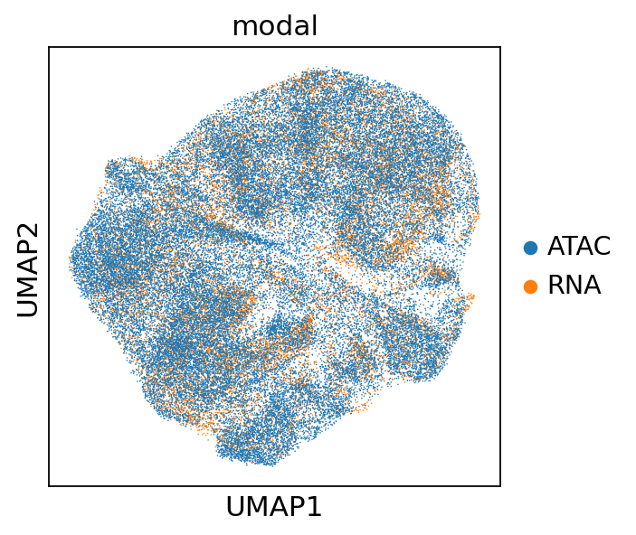
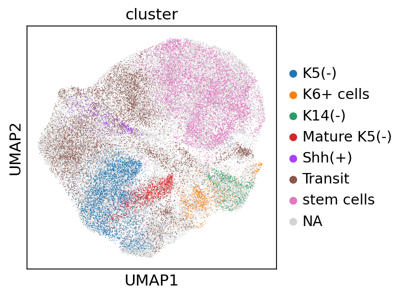
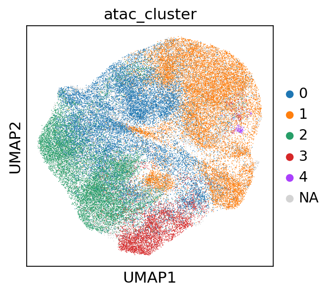
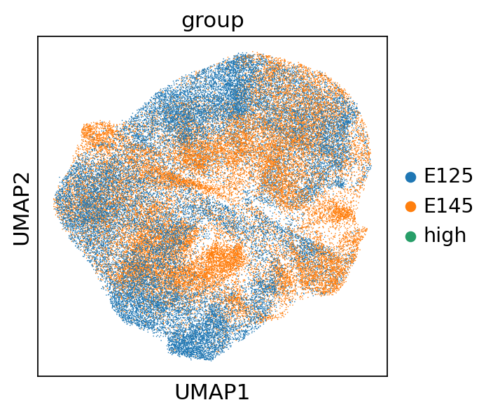
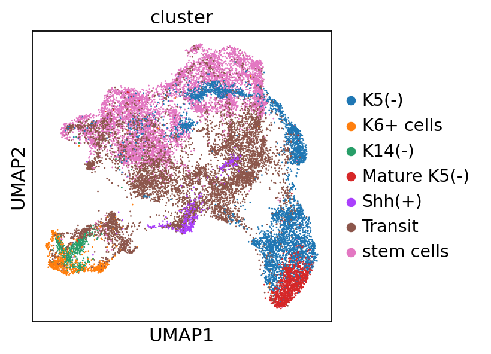
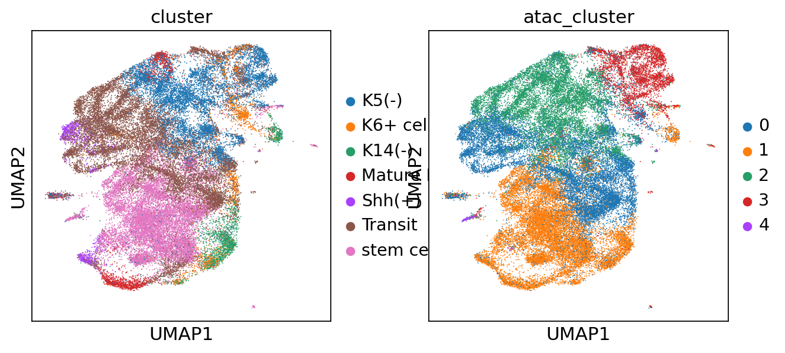
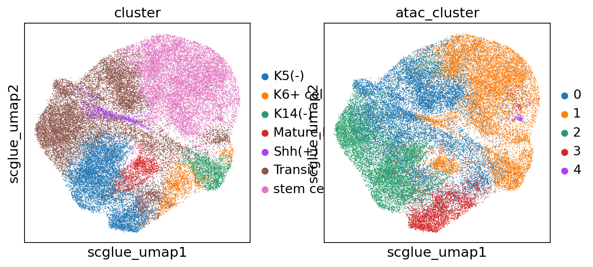
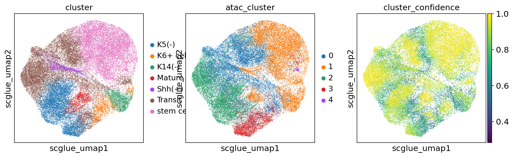
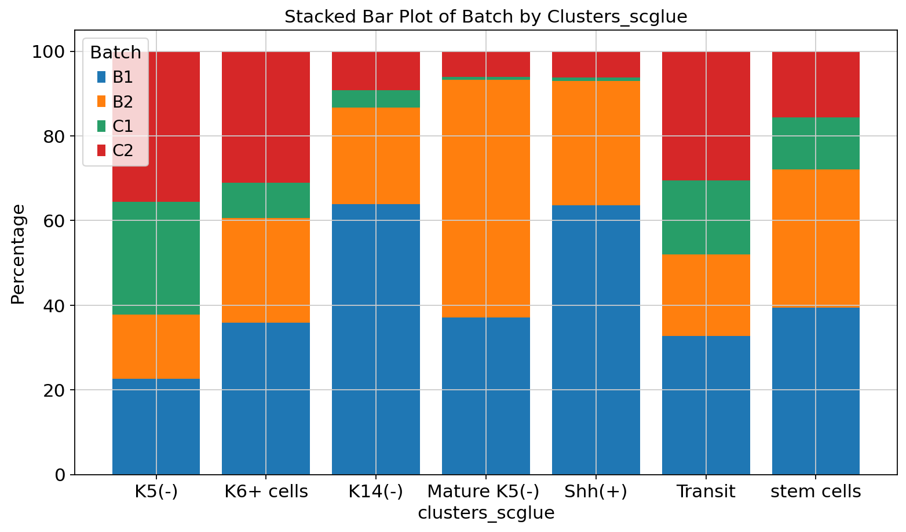

```python
import anndata as ad
import networkx as nx
import scanpy as sc
import scglue
from matplotlib import rcParams
scglue.plot.set_publication_params()
rcParams["figure.figsize"] = (4, 4)
from itertools import chain
import pandas as pd
import matplotlib.pyplot as plt

sc.settings.figdir = "../result/scglue/"
```

    /home/zhangyufeng/miniconda3/envs/scarches/lib/python3.10/site-packages/torchvision/io/image.py:13: UserWarning: Failed to load image Python extension: /home/zhangyufeng/miniconda3/envs/scarches/lib/python3.10/site-packages/torchvision/image.so: undefined symbol: _ZN5torch3jit17parseSchemaOrNameERKNSt7__cxx1112basic_stringIcSt11char_traitsIcESaIcEEE
      warn(f"Failed to load image Python extension: {e}")


    ---------------------------------------------------------------------------

    AttributeError                            Traceback (most recent call last)

    Cell In[131], line 11
          9 import pandas as pd
         10 import matplotlib.pyplot as plt
    ---> 11 import scvi
         12 sc.settings.figdir = "../result/scglue/"


    File ~/miniconda3/envs/scarches/lib/python3.10/site-packages/scvi/__init__.py:11
          8 from ._settings import settings
         10 # this import needs to come after prior imports to prevent circular import
    ---> 11 from . import data, model, external, utils
         13 from importlib.metadata import version
         15 package_name = "scvi-tools"


    File ~/miniconda3/envs/scarches/lib/python3.10/site-packages/scvi/data/__init__.py:25
          4 from ._datasets import (
          5     annotation_simulation,
          6     brainlarge_dataset,
       (...)
         22     synthetic_iid,
         23 )
         24 from ._manager import AnnDataManager, AnnDataManagerValidationCheck
    ---> 25 from ._preprocessing import (
         26     add_dna_sequence,
         27     organize_cite_seq_10x,
         28     organize_multiome_anndatas,
         29     poisson_gene_selection,
         30     reads_to_fragments,
         31 )
         32 from ._read import read_10x_atac, read_10x_multiome
         34 __all__ = [
         35     "AnnTorchDataset",
         36     "AnnDataManagerValidationCheck",
       (...)
         66     "cellxgene",
         67 ]


    File ~/miniconda3/envs/scarches/lib/python3.10/site-packages/scvi/data/_preprocessing.py:12
          9 import torch
         10 from scipy.sparse import issparse
    ---> 12 from scvi.model._utils import parse_device_args
         13 from scvi.utils import dependencies, track
         14 from scvi.utils._docstrings import devices_dsp


    File ~/miniconda3/envs/scarches/lib/python3.10/site-packages/scvi/model/__init__.py:2
          1 from . import utils
    ----> 2 from ._amortizedlda import AmortizedLDA
          3 from ._autozi import AUTOZI
          4 from ._condscvi import CondSCVI


    File ~/miniconda3/envs/scarches/lib/python3.10/site-packages/scvi/model/_amortizedlda.py:15
         13 from scvi.data import AnnDataManager
         14 from scvi.data.fields import LayerField
    ---> 15 from scvi.module import AmortizedLDAPyroModule
         16 from scvi.utils import setup_anndata_dsp
         18 from .base import BaseModelClass, PyroSviTrainMixin


    File ~/miniconda3/envs/scarches/lib/python3.10/site-packages/scvi/module/__init__.py:1
    ----> 1 from ._amortizedlda import AmortizedLDAPyroModule
          2 from ._autozivae import AutoZIVAE
          3 from ._classifier import Classifier


    File ~/miniconda3/envs/scarches/lib/python3.10/site-packages/scvi/module/_amortizedlda.py:15
         13 from scvi._constants import REGISTRY_KEYS
         14 from scvi._types import Tunable
    ---> 15 from scvi.module.base import PyroBaseModuleClass, auto_move_data
         16 from scvi.nn import Encoder
         18 _AMORTIZED_LDA_PYRO_MODULE_NAME = "amortized_lda"


    File ~/miniconda3/envs/scarches/lib/python3.10/site-packages/scvi/module/base/__init__.py:1
    ----> 1 from ._base_module import (
          2     BaseMinifiedModeModuleClass,
          3     BaseModuleClass,
          4     JaxBaseModuleClass,
          5     LossOutput,
          6     PyroBaseModuleClass,
          7     TrainStateWithState,
          8 )
          9 from ._decorators import auto_move_data, flax_configure
         11 __all__ = [
         12     "BaseModuleClass",
         13     "LossOutput",
       (...)
         19     "BaseMinifiedModeModuleClass",
         20 ]


    File ~/miniconda3/envs/scarches/lib/python3.10/site-packages/scvi/module/base/_base_module.py:14
         12 import pyro
         13 import torch
    ---> 14 from flax.training import train_state
         15 from jax import random
         16 from jaxlib.xla_extension import Device


    File ~/miniconda3/envs/scarches/lib/python3.10/site-packages/flax/training/train_state.py:17
          1 # Copyright 2024 The Flax Authors.
          2 #
          3 # Licensed under the Apache License, Version 2.0 (the "License");
       (...)
         12 # See the License for the specific language governing permissions and
         13 # limitations under the License.
         15 from typing import Any, Callable
    ---> 17 import optax
         19 from flax import core, struct
         20 from flax.linen.fp8_ops import OVERWRITE_WITH_GRADIENT


    File ~/miniconda3/envs/scarches/lib/python3.10/site-packages/optax/__init__.py:17
          1 # Copyright 2019 DeepMind Technologies Limited. All Rights Reserved.
          2 #
          3 # Licensed under the Apache License, Version 2.0 (the "License");
       (...)
         13 # limitations under the License.
         14 # ==============================================================================
         15 """Optax: composable gradient processing and optimization, in JAX."""
    ---> 17 from optax import contrib
         18 from optax import losses
         19 from optax import monte_carlo


    File ~/miniconda3/envs/scarches/lib/python3.10/site-packages/optax/contrib/__init__.py:17
          1 # Copyright 2021 DeepMind Technologies Limited. All Rights Reserved.
          2 #
          3 # Licensed under the Apache License, Version 2.0 (the "License");
       (...)
         13 # limitations under the License.
         14 # ==============================================================================
         15 """Contributed optimizers in Optax."""
    ---> 17 from optax.contrib.cocob import cocob
         18 from optax.contrib.cocob import COCOBState
         19 from optax.contrib.complex_valued import split_real_and_imaginary


    File ~/miniconda3/envs/scarches/lib/python3.10/site-packages/optax/contrib/cocob.py:25
         23 import jax.numpy as jnp
         24 import jax.tree_util as jtu
    ---> 25 from optax._src import base
         28 class COCOBState(NamedTuple):
         29   """State for COntinuous COin Betting."""


    File ~/miniconda3/envs/scarches/lib/python3.10/site-packages/optax/_src/base.py:19
         15 """Base interfaces and datatypes."""
         17 from typing import Any, Callable, NamedTuple, Optional, Protocol, runtime_checkable, Sequence, Union
    ---> 19 import chex
         20 import jax
         21 import jax.numpy as jnp


    File ~/miniconda3/envs/scarches/lib/python3.10/site-packages/chex/__init__.py:17
          1 # Copyright 2020 DeepMind Technologies Limited. All Rights Reserved.
          2 #
          3 # Licensed under the Apache License, Version 2.0 (the "License");
       (...)
         13 # limitations under the License.
         14 # ==============================================================================
         15 """Chex: Testing made fun, in JAX!"""
    ---> 17 from chex._src.asserts import assert_axis_dimension
         18 from chex._src.asserts import assert_axis_dimension_comparator
         19 from chex._src.asserts import assert_axis_dimension_gt


    File ~/miniconda3/envs/scarches/lib/python3.10/site-packages/chex/_src/asserts.py:26
         23 import unittest
         24 from unittest import mock
    ---> 26 from chex._src import asserts_internal as _ai
         27 from chex._src import pytypes
         28 import jax


    File ~/miniconda3/envs/scarches/lib/python3.10/site-packages/chex/_src/asserts_internal.py:34
         31 from typing import Any, Sequence, Union, Callable, List, Optional, Set, Tuple, Type
         33 from absl import logging
    ---> 34 from chex._src import pytypes
         35 import jax
         36 from jax.experimental import checkify


    File ~/miniconda3/envs/scarches/lib/python3.10/site-packages/chex/_src/pytypes.py:53
         51 Scalar = Union[float, int]
         52 Numeric = Union[Array, Scalar]
    ---> 53 Shape = jax.core.Shape
         54 PRNGKey = jax.random.KeyArray
         55 PyTreeDef = jax.tree_util.PyTreeDef


    File ~/miniconda3/envs/scarches/lib/python3.10/site-packages/jax/_src/deprecations.py:52, in deprecation_getattr.<locals>.getattr(name)
         50 message, fn = deprecations[name]
         51 if fn is None:  # Is the deprecation accelerated?
    ---> 52   raise AttributeError(message)
         53 warnings.warn(message, DeprecationWarning, stacklevel=2)
         54 return fn


    AttributeError: jax.core.Shape is deprecated. Use Shape = Sequence[int | Any].


```python
atac= sc.read("../process/framework/obj/atac_scglue_prepare.h5ad")
```


```python
rna_raw = sc.read("../process/framework/obj/rna_raw_scglue_prepare.h5ad")
```


```python
guidance = nx.read_graphml("../process/scglue/guidance.graphml.gz")
```


```python
split = atac.var_names.str.split(r"[:-]")
atac.var["chrom"] = split.map(lambda x: x[0])
atac.var["chromStart"] = split.map(lambda x: x[1]).astype(int)
atac.var["chromEnd"] = split.map(lambda x: x[2]).astype(int)
atac.var.head()
```


<div>
<style scoped>
    .dataframe tbody tr th:only-of-type {
        vertical-align: middle;
    }

    .dataframe tbody tr th {
        vertical-align: top;
    }

    .dataframe thead th {
        text-align: right;
    }
</style>
<table border="1" class="dataframe">
  <thead>
    <tr style="text-align: right;">
      <th></th>
      <th>name</th>
      <th>chrom</th>
      <th>chromStart</th>
      <th>chromEnd</th>
    </tr>
  </thead>
  <tbody>
    <tr>
      <th>chr1-3046200-3047106</th>
      <td>chr1-3046200-3047106</td>
      <td>chr1</td>
      <td>3046200</td>
      <td>3047106</td>
    </tr>
    <tr>
      <th>chr1-3094219-3095343</th>
      <td>chr1-3094219-3095343</td>
      <td>chr1</td>
      <td>3094219</td>
      <td>3095343</td>
    </tr>
    <tr>
      <th>chr1-3165484-3166526</th>
      <td>chr1-3165484-3166526</td>
      <td>chr1</td>
      <td>3165484</td>
      <td>3166526</td>
    </tr>
    <tr>
      <th>chr1-3184626-3185668</th>
      <td>chr1-3184626-3185668</td>
      <td>chr1</td>
      <td>3184626</td>
      <td>3185668</td>
    </tr>
    <tr>
      <th>chr1-3185936-3186838</th>
      <td>chr1-3185936-3186838</td>
      <td>chr1</td>
      <td>3185936</td>
      <td>3186838</td>
    </tr>
  </tbody>
</table>
</div>


```python
scglue.data.get_gene_annotation(
    rna_raw, gtf="../../../database/gencode.vM25.chr_patch_hapl_scaff.annotation.gtf.gz",
    gtf_by="gene_name"
)
rna_raw.var.loc[:, ["chrom", "chromStart", "chromEnd"]].head()
```


<div>
<style scoped>
    .dataframe tbody tr th:only-of-type {
        vertical-align: middle;
    }

    .dataframe tbody tr th {
        vertical-align: top;
    }

    .dataframe thead th {
        text-align: right;
    }
</style>
<table border="1" class="dataframe">
  <thead>
    <tr style="text-align: right;">
      <th></th>
      <th>chrom</th>
      <th>chromStart</th>
      <th>chromEnd</th>
    </tr>
  </thead>
  <tbody>
    <tr>
      <th>Xkr4</th>
      <td>chr1</td>
      <td>3205900</td>
      <td>3671498</td>
    </tr>
    <tr>
      <th>Gm1992</th>
      <td>chr1</td>
      <td>3466586</td>
      <td>3513553</td>
    </tr>
    <tr>
      <th>Rp1</th>
      <td>chr1</td>
      <td>3999556</td>
      <td>4409241</td>
    </tr>
    <tr>
      <th>Sox17</th>
      <td>chr1</td>
      <td>4490930</td>
      <td>4497354</td>
    </tr>
    <tr>
      <th>Mrpl15</th>
      <td>chr1</td>
      <td>4773205</td>
      <td>4785739</td>
    </tr>
  </tbody>
</table>
</div>


```python
sc.pp.highly_variable_genes(rna_raw, n_top_genes=2000)
```


```python
rna_raw
```


    AnnData object with n_obs × n_vars = 19404 × 21638
        obs: 'orig.ident', 'nCount_RNA', 'nFeature_RNA', 'percent.mt', 'nCount_SCT', 'nFeature_SCT', 'SCT_snn_res.0.8', 'seurat_clusters', 'group', 'SCT_snn_res.0.6', 'celltype', 'SCT_snn_res.0.4', 'S.Score', 'G2M.Score', 'Phase', 'old.ident', 'ident'
        var: 'mean', 'std', 'chrom', 'chromStart', 'chromEnd', 'name', 'score', 'strand', 'thickStart', 'thickEnd', 'itemRgb', 'blockCount', 'blockSizes', 'blockStarts', 'gene_id', 'gene_type', 'mgi_id', 'havana_gene', 'tag', 'highly_variable', 'means', 'dispersions', 'dispersions_norm'
        uns: 'X_name', 'log1p', 'pca', 'hvg'
        obsm: 'HARMONY', 'PCA', 'UMAP', 'X_pca'
        varm: 'PCs'
        layers: 'counts', 'logcounts'


```python
rna_raw.var
```


<div>
<style scoped>
    .dataframe tbody tr th:only-of-type {
        vertical-align: middle;
    }

    .dataframe tbody tr th {
        vertical-align: top;
    }

    .dataframe thead th {
        text-align: right;
    }
</style>
<table border="1" class="dataframe">
  <thead>
    <tr style="text-align: right;">
      <th></th>
      <th>mean</th>
      <th>std</th>
      <th>chrom</th>
      <th>chromStart</th>
      <th>chromEnd</th>
      <th>name</th>
      <th>score</th>
      <th>strand</th>
      <th>thickStart</th>
      <th>thickEnd</th>
      <th>...</th>
      <th>blockStarts</th>
      <th>gene_id</th>
      <th>gene_type</th>
      <th>mgi_id</th>
      <th>havana_gene</th>
      <th>tag</th>
      <th>highly_variable</th>
      <th>means</th>
      <th>dispersions</th>
      <th>dispersions_norm</th>
    </tr>
  </thead>
  <tbody>
    <tr>
      <th>Xkr4</th>
      <td>0.090731</td>
      <td>0.294324</td>
      <td>chr1</td>
      <td>3205900</td>
      <td>3671498</td>
      <td>Xkr4</td>
      <td>.</td>
      <td>-</td>
      <td>.</td>
      <td>.</td>
      <td>...</td>
      <td>.</td>
      <td>ENSMUSG00000051951.5</td>
      <td>protein_coding</td>
      <td>MGI:3528744</td>
      <td>OTTMUSG00000026353.2</td>
      <td>NaN</td>
      <td>False</td>
      <td>2.194943e+00</td>
      <td>8.213339</td>
      <td>0.919694</td>
    </tr>
    <tr>
      <th>Gm1992</th>
      <td>0.001959</td>
      <td>0.037397</td>
      <td>chr1</td>
      <td>3466586</td>
      <td>3513553</td>
      <td>Gm1992</td>
      <td>.</td>
      <td>+</td>
      <td>.</td>
      <td>.</td>
      <td>...</td>
      <td>.</td>
      <td>ENSMUSG00000089699.1</td>
      <td>antisense</td>
      <td>MGI:3780162</td>
      <td>OTTMUSG00000026352.1</td>
      <td>NaN</td>
      <td>False</td>
      <td>2.220315e+01</td>
      <td>32.035802</td>
      <td>0.004547</td>
    </tr>
    <tr>
      <th>Rp1</th>
      <td>0.000157</td>
      <td>0.009544</td>
      <td>chr1</td>
      <td>3999556</td>
      <td>4409241</td>
      <td>Rp1</td>
      <td>.</td>
      <td>-</td>
      <td>.</td>
      <td>.</td>
      <td>...</td>
      <td>.</td>
      <td>ENSMUSG00000025900.13</td>
      <td>protein_coding</td>
      <td>MGI:1341105</td>
      <td>OTTMUSG00000049985.3</td>
      <td>overlapping_locus</td>
      <td>False</td>
      <td>8.141959e+01</td>
      <td>91.292820</td>
      <td>0.357677</td>
    </tr>
    <tr>
      <th>Sox17</th>
      <td>0.000286</td>
      <td>0.017124</td>
      <td>chr1</td>
      <td>4490930</td>
      <td>4497354</td>
      <td>Sox17</td>
      <td>.</td>
      <td>-</td>
      <td>.</td>
      <td>.</td>
      <td>...</td>
      <td>.</td>
      <td>ENSMUSG00000025902.13</td>
      <td>protein_coding</td>
      <td>MGI:107543</td>
      <td>OTTMUSG00000050014.7</td>
      <td>NaN</td>
      <td>False</td>
      <td>8.785623e+01</td>
      <td>97.729460</td>
      <td>0.192238</td>
    </tr>
    <tr>
      <th>Mrpl15</th>
      <td>0.905821</td>
      <td>0.545134</td>
      <td>chr1</td>
      <td>4773205</td>
      <td>4785739</td>
      <td>Mrpl15</td>
      <td>.</td>
      <td>-</td>
      <td>.</td>
      <td>.</td>
      <td>...</td>
      <td>.</td>
      <td>ENSMUSG00000033845.13</td>
      <td>protein_coding</td>
      <td>MGI:1351639</td>
      <td>OTTMUSG00000029329.3</td>
      <td>NaN</td>
      <td>False</td>
      <td>4.342242e-01</td>
      <td>1.423055</td>
      <td>-0.925168</td>
    </tr>
    <tr>
      <th>...</th>
      <td>...</td>
      <td>...</td>
      <td>...</td>
      <td>...</td>
      <td>...</td>
      <td>...</td>
      <td>...</td>
      <td>...</td>
      <td>...</td>
      <td>...</td>
      <td>...</td>
      <td>...</td>
      <td>...</td>
      <td>...</td>
      <td>...</td>
      <td>...</td>
      <td>...</td>
      <td>...</td>
      <td>...</td>
      <td>...</td>
      <td>...</td>
    </tr>
    <tr>
      <th>Olfr1500</th>
      <td>0.000044</td>
      <td>0.006076</td>
      <td>chr19</td>
      <td>13826881</td>
      <td>13830488</td>
      <td>Olfr1500</td>
      <td>.</td>
      <td>-</td>
      <td>.</td>
      <td>.</td>
      <td>...</td>
      <td>.</td>
      <td>ENSMUSG00000054526.5</td>
      <td>protein_coding</td>
      <td>MGI:3031334</td>
      <td>OTTMUSG00000059637.3</td>
      <td>NaN</td>
      <td>False</td>
      <td>1.294178e+02</td>
      <td>139.291062</td>
      <td>0.091584</td>
    </tr>
    <tr>
      <th>Olfr1501</th>
      <td>0.000000</td>
      <td>1.000000</td>
      <td>chr19</td>
      <td>13835032</td>
      <td>13850692</td>
      <td>Olfr1501</td>
      <td>.</td>
      <td>-</td>
      <td>.</td>
      <td>.</td>
      <td>...</td>
      <td>.</td>
      <td>ENSMUSG00000057270.3</td>
      <td>protein_coding</td>
      <td>MGI:3031335</td>
      <td>OTTMUSG00000059638.2</td>
      <td>NaN</td>
      <td>False</td>
      <td>1.000000e-12</td>
      <td>NaN</td>
      <td>NaN</td>
    </tr>
    <tr>
      <th>4933411K16Rik</th>
      <td>0.000000</td>
      <td>1.000000</td>
      <td>chr19</td>
      <td>42052247</td>
      <td>42053627</td>
      <td>4933411K16Rik</td>
      <td>.</td>
      <td>+</td>
      <td>.</td>
      <td>.</td>
      <td>...</td>
      <td>.</td>
      <td>ENSMUSG00000090369.3</td>
      <td>protein_coding</td>
      <td>MGI:1914015</td>
      <td>OTTMUSG00000035807.1</td>
      <td>overlapping_locus</td>
      <td>False</td>
      <td>1.000000e-12</td>
      <td>NaN</td>
      <td>NaN</td>
    </tr>
    <tr>
      <th>Gm10197</th>
      <td>0.000000</td>
      <td>1.000000</td>
      <td>chr19</td>
      <td>53371565</td>
      <td>53371766</td>
      <td>Gm10197</td>
      <td>.</td>
      <td>-</td>
      <td>.</td>
      <td>.</td>
      <td>...</td>
      <td>.</td>
      <td>ENSMUSG00000067085.1</td>
      <td>protein_coding</td>
      <td>MGI:3704501</td>
      <td>NaN</td>
      <td>NaN</td>
      <td>False</td>
      <td>1.000000e-12</td>
      <td>NaN</td>
      <td>NaN</td>
    </tr>
    <tr>
      <th>AC132444.1</th>
      <td>0.000016</td>
      <td>0.002193</td>
      <td>GL456221.1</td>
      <td>17590</td>
      <td>30203</td>
      <td>AC132444.1</td>
      <td>.</td>
      <td>-</td>
      <td>.</td>
      <td>.</td>
      <td>...</td>
      <td>.</td>
      <td>ENSMUSG00000079222.2</td>
      <td>protein_coding</td>
      <td>NaN</td>
      <td>NaN</td>
      <td>NaN</td>
      <td>False</td>
      <td>1.294178e+02</td>
      <td>139.291062</td>
      <td>0.091584</td>
    </tr>
  </tbody>
</table>
<p>21638 rows × 23 columns</p>
</div>


```python
guidance = scglue.genomics.rna_anchored_guidance_graph(rna_raw, atac)
guidance
```

    window_graph: 100%|██████████| 21638/21638 [00:06<00:00, 3577.34it/s]


    <networkx.classes.multidigraph.MultiDiGraph at 0x7f737a8f4610>


```python
atac.obs["batch"]
```


    B1_AAACGAAAGAATACTG-1    B1
    B1_AAACGAAAGACGACTG-1    B1
    B1_AAACGAAAGAGAGTTT-1    B1
    B1_AAACGAAAGCCTTTGA-1    B1
    B1_AAACGAAAGCGTGTTT-1    B1
                             ..
    C2_TTTGTGTGTAGCGAGT-1    C2
    C2_TTTGTGTGTCCTATTT-1    C2
    C2_TTTGTGTTCCATCTAT-1    C2
    C2_TTTGTGTTCCGTGCAG-1    C2
    C2_TTTGTGTTCGTTGTAG-1    C2
    Name: batch, Length: 42042, dtype: category
    Categories (4, object): ['B1', 'B2', 'C1', 'C2']


```python
scglue.models.configure_dataset(
    rna_raw, "NB", use_highly_variable=True,use_batch="orig.ident",
    use_layer="counts", use_rep="X_pca"
)
```

    [WARNING] configure_dataset: `configure_dataset` has already been called. Previous configuration will be overwritten!


```python
scglue.models.configure_dataset(
    atac, "NB", use_highly_variable=True,use_batch="batch",
    use_rep="X_lsi"
)
```

    [WARNING] configure_dataset: `configure_dataset` has already been called. Previous configuration will be overwritten!


```python
guidance_hvf = guidance.subgraph(chain(
    rna_raw.var.query("highly_variable").index,
    atac.var.query("highly_variable").index
)).copy()
```


```python
glue = scglue.models.fit_SCGLUE(
    {"rna": rna_raw, "atac": atac}, guidance_hvf,
    fit_kws={"directory": "glue"}
)
```

    [INFO] fit_SCGLUE: Pretraining SCGLUE model...
    [INFO] autodevice: Using GPU 0 as computation device.


    /home/zhangyufeng/miniconda3/envs/scarches/lib/python3.10/abc.py:119: FutureWarning: SparseDataset is deprecated and will be removed in late 2024. It has been replaced by the public classes CSRDataset and CSCDataset.
    
    For instance checks, use `isinstance(X, (anndata.experimental.CSRDataset, anndata.experimental.CSCDataset))` instead.
    
    For creation, use `anndata.experimental.sparse_dataset(X)` instead.
    
      return _abc_instancecheck(cls, instance)


    [INFO] check_graph: Checking variable coverage...
    [INFO] check_graph: Checking edge attributes...
    [INFO] check_graph: Checking self-loops...
    [INFO] check_graph: Checking graph symmetry...
    [INFO] SCGLUEModel: Setting `graph_batch_size` = 18466
    [INFO] SCGLUEModel: Setting `max_epochs` = 56
    [INFO] SCGLUEModel: Setting `patience` = 5
    [INFO] SCGLUEModel: Setting `reduce_lr_patience` = 3
    [INFO] SCGLUETrainer: Using training directory: "glue/pretrain"


    /home/zhangyufeng/miniconda3/envs/scarches/lib/python3.10/abc.py:119: FutureWarning: SparseDataset is deprecated and will be removed in late 2024. It has been replaced by the public classes CSRDataset and CSCDataset.
    
    For instance checks, use `isinstance(X, (anndata.experimental.CSRDataset, anndata.experimental.CSCDataset))` instead.
    
    For creation, use `anndata.experimental.sparse_dataset(X)` instead.
    
      return _abc_instancecheck(cls, instance)


    [INFO] SCGLUETrainer: [Epoch 10] train={'g_nll': 0.437, 'g_kl': 0.009, 'g_elbo': 0.446, 'x_rna_nll': 0.156, 'x_rna_kl': 0.003, 'x_rna_elbo': 0.159, 'x_atac_nll': 0.115, 'x_atac_kl': 0.001, 'x_atac_elbo': 0.116, 'dsc_loss': 0.692, 'vae_loss': 0.293, 'gen_loss': 0.258}, val={'g_nll': 0.436, 'g_kl': 0.009, 'g_elbo': 0.445, 'x_rna_nll': 0.155, 'x_rna_kl': 0.003, 'x_rna_elbo': 0.158, 'x_atac_nll': 0.115, 'x_atac_kl': 0.001, 'x_atac_elbo': 0.116, 'dsc_loss': 0.693, 'vae_loss': 0.291, 'gen_loss': 0.257}, 17.8s elapsed
    Epoch 00014: reducing learning rate of group 0 to 2.0000e-04.
    Epoch 00014: reducing learning rate of group 0 to 2.0000e-04.
    [INFO] LRScheduler: Learning rate reduction: step 1
    [INFO] SCGLUETrainer: [Epoch 20] train={'g_nll': 0.432, 'g_kl': 0.009, 'g_elbo': 0.44, 'x_rna_nll': 0.155, 'x_rna_kl': 0.003, 'x_rna_elbo': 0.158, 'x_atac_nll': 0.115, 'x_atac_kl': 0.001, 'x_atac_elbo': 0.116, 'dsc_loss': 0.693, 'vae_loss': 0.291, 'gen_loss': 0.256}, val={'g_nll': 0.432, 'g_kl': 0.009, 'g_elbo': 0.44, 'x_rna_nll': 0.156, 'x_rna_kl': 0.003, 'x_rna_elbo': 0.159, 'x_atac_nll': 0.114, 'x_atac_kl': 0.001, 'x_atac_elbo': 0.114, 'dsc_loss': 0.692, 'vae_loss': 0.291, 'gen_loss': 0.256}, 18.6s elapsed
    Epoch 00024: reducing learning rate of group 0 to 2.0000e-05.
    Epoch 00024: reducing learning rate of group 0 to 2.0000e-05.
    [INFO] LRScheduler: Learning rate reduction: step 2


    2024-08-16 22:52:16,896 ignite.handlers.early_stopping.EarlyStopping INFO: EarlyStopping: Stop training


    [INFO] EarlyStopping: Restoring checkpoint "25"...
    [INFO] EarlyStopping: Restoring checkpoint "25"...
    [INFO] fit_SCGLUE: Estimating balancing weight...
    [INFO] estimate_balancing_weight: Clustering cells...


    /home/zhangyufeng/miniconda3/envs/scarches/lib/python3.10/site-packages/scglue/data.py:469: FutureWarning: In the future, the default backend for leiden will be igraph instead of leidenalg.
    
     To achieve the future defaults please pass: flavor="igraph" and n_iterations=2.  directed must also be False to work with igraph's implementation.
      sc.tl.leiden(adata_, resolution=resolution)


    [INFO] estimate_balancing_weight: Matching clusters...
    [INFO] estimate_balancing_weight: Matching array shape = (22, 26)...
    [INFO] estimate_balancing_weight: Estimating balancing weight...
    [INFO] fit_SCGLUE: Fine-tuning SCGLUE model...


    /home/zhangyufeng/miniconda3/envs/scarches/lib/python3.10/abc.py:119: FutureWarning: SparseDataset is deprecated and will be removed in late 2024. It has been replaced by the public classes CSRDataset and CSCDataset.
    
    For instance checks, use `isinstance(X, (anndata.experimental.CSRDataset, anndata.experimental.CSCDataset))` instead.
    
    For creation, use `anndata.experimental.sparse_dataset(X)` instead.
    
      return _abc_instancecheck(cls, instance)


    [INFO] check_graph: Checking variable coverage...
    [INFO] check_graph: Checking edge attributes...
    [INFO] check_graph: Checking self-loops...
    [INFO] check_graph: Checking graph symmetry...
    [INFO] SCGLUEModel: Setting `graph_batch_size` = 18466
    [INFO] SCGLUEModel: Setting `align_burnin` = 10
    [INFO] SCGLUEModel: Setting `max_epochs` = 56
    [INFO] SCGLUEModel: Setting `patience` = 5
    [INFO] SCGLUEModel: Setting `reduce_lr_patience` = 3
    [INFO] SCGLUETrainer: Using training directory: "glue/fine-tune"
    [INFO] SCGLUETrainer: [Epoch 10] train={'g_nll': 0.427, 'g_kl': 0.007, 'g_elbo': 0.434, 'x_rna_nll': 0.156, 'x_rna_kl': 0.002, 'x_rna_elbo': 0.158, 'x_atac_nll': 0.115, 'x_atac_kl': 0.001, 'x_atac_elbo': 0.116, 'dsc_loss': 0.688, 'vae_loss': 0.291, 'gen_loss': 0.257}, val={'g_nll': 0.429, 'g_kl': 0.007, 'g_elbo': 0.436, 'x_rna_nll': 0.156, 'x_rna_kl': 0.002, 'x_rna_elbo': 0.159, 'x_atac_nll': 0.114, 'x_atac_kl': 0.001, 'x_atac_elbo': 0.115, 'dsc_loss': 0.7, 'vae_loss': 0.291, 'gen_loss': 0.256}, 32.7s elapsed
    Epoch 00017: reducing learning rate of group 0 to 2.0000e-04.
    Epoch 00017: reducing learning rate of group 0 to 2.0000e-04.
    [INFO] LRScheduler: Learning rate reduction: step 1
    [INFO] SCGLUETrainer: [Epoch 20] train={'g_nll': 0.42, 'g_kl': 0.007, 'g_elbo': 0.427, 'x_rna_nll': 0.155, 'x_rna_kl': 0.002, 'x_rna_elbo': 0.158, 'x_atac_nll': 0.115, 'x_atac_kl': 0.001, 'x_atac_elbo': 0.116, 'dsc_loss': 0.69, 'vae_loss': 0.29, 'gen_loss': 0.256}, val={'g_nll': 0.421, 'g_kl': 0.007, 'g_elbo': 0.428, 'x_rna_nll': 0.156, 'x_rna_kl': 0.002, 'x_rna_elbo': 0.158, 'x_atac_nll': 0.115, 'x_atac_kl': 0.001, 'x_atac_elbo': 0.115, 'dsc_loss': 0.696, 'vae_loss': 0.291, 'gen_loss': 0.256}, 32.1s elapsed
    Epoch 00021: reducing learning rate of group 0 to 2.0000e-05.
    Epoch 00021: reducing learning rate of group 0 to 2.0000e-05.
    [INFO] LRScheduler: Learning rate reduction: step 2
    Epoch 00025: reducing learning rate of group 0 to 2.0000e-06.
    Epoch 00025: reducing learning rate of group 0 to 2.0000e-06.
    [INFO] LRScheduler: Learning rate reduction: step 3
    [INFO] SCGLUETrainer: [Epoch 30] train={'g_nll': 0.42, 'g_kl': 0.007, 'g_elbo': 0.427, 'x_rna_nll': 0.155, 'x_rna_kl': 0.002, 'x_rna_elbo': 0.158, 'x_atac_nll': 0.115, 'x_atac_kl': 0.001, 'x_atac_elbo': 0.115, 'dsc_loss': 0.689, 'vae_loss': 0.29, 'gen_loss': 0.255}, val={'g_nll': 0.42, 'g_kl': 0.007, 'g_elbo': 0.427, 'x_rna_nll': 0.155, 'x_rna_kl': 0.002, 'x_rna_elbo': 0.157, 'x_atac_nll': 0.115, 'x_atac_kl': 0.001, 'x_atac_elbo': 0.116, 'dsc_loss': 0.696, 'vae_loss': 0.29, 'gen_loss': 0.255}, 31.9s elapsed
    Epoch 00032: reducing learning rate of group 0 to 2.0000e-07.
    Epoch 00032: reducing learning rate of group 0 to 2.0000e-07.
    [INFO] LRScheduler: Learning rate reduction: step 4


    2024-08-16 23:12:57,475 ignite.handlers.early_stopping.EarlyStopping INFO: EarlyStopping: Stop training


    [INFO] EarlyStopping: Restoring checkpoint "29"...
    [INFO] EarlyStopping: Restoring checkpoint "29"...


```python
glue.save("../process/scglue/E12_E14_scATAC_rna_glue.dill")
```


```python
rna_raw.obsm["X_glue"] = glue.encode_data("rna", rna_raw)
atac.obsm["X_glue"] = glue.encode_data("atac", atac)
```


```python
combined = ad.concat([rna_raw, atac])
```


```python
sc.pp.neighbors(combined, use_rep="X_glue", metric="cosine")
sc.tl.umap(combined)
```


```python
sc.pl.umap(combined)
```


    

    


```python
combined
```


    AnnData object with n_obs × n_vars = 61446 × 0
        obs: 'nCount_RNA', 'nFeature_RNA', 'seurat_clusters', 'group', 'balancing_weight'
        uns: 'neighbors', 'umap'
        obsm: 'X_glue', 'X_umap'
        obsp: 'distances', 'connectivities'


```python
rna_raw.obs_names
```


    Index(['E125_1_AAACCCAAGTCATGAA-1', 'E125_1_AAACCCACAAGACCGA-1',
           'E125_1_AAACCCACATGCACTA-1', 'E125_1_AAACCCAGTCAGTCGC-1',
           'E125_1_AAACCCAGTCCACGCA-1', 'E125_1_AAACCCAGTCCGTACG-1',
           'E125_1_AAACCCAGTCGACTTA-1', 'E125_1_AAACGAAAGCCTATTG-1',
           'E125_1_AAACGAACAGCTCCTT-1', 'E125_1_AAACGAAGTGCGGTAA-1',
           ...
           'E145_2_TTTGGAGAGGGATGTC-1', 'E145_2_TTTGGAGCACAGTACT-1',
           'E145_2_TTTGGAGCATGACAGG-1', 'E145_2_TTTGGTTAGAGGTCAC-1',
           'E145_2_TTTGGTTCAGTTGTTG-1', 'E145_2_TTTGGTTCATACCATG-1',
           'E145_2_TTTGGTTCATGCCGGT-1', 'E145_2_TTTGGTTTCGTAGGAG-1',
           'E145_2_TTTGTTGCACACCGAC-1', 'E145_2_TTTGTTGTCAACTGGT-1'],
          dtype='object', length=19404)


```python
combined.obs["modal"] = "ATAC"
combined.obs["modal"][rna_raw.obs_names] = "RNA"
```

    /tmp/ipykernel_1025185/1954996199.py:2: FutureWarning: ChainedAssignmentError: behaviour will change in pandas 3.0!
    You are setting values through chained assignment. Currently this works in certain cases, but when using Copy-on-Write (which will become the default behaviour in pandas 3.0) this will never work to update the original DataFrame or Series, because the intermediate object on which we are setting values will behave as a copy.
    A typical example is when you are setting values in a column of a DataFrame, like:
    
    df["col"][row_indexer] = value
    
    Use `df.loc[row_indexer, "col"] = values` instead, to perform the assignment in a single step and ensure this keeps updating the original `df`.
    
    See the caveats in the documentation: https://pandas.pydata.org/pandas-docs/stable/user_guide/indexing.html#returning-a-view-versus-a-copy
    
      combined.obs["modal"][rna_raw.obs_names] = "RNA"
    /tmp/ipykernel_1025185/1954996199.py:2: SettingWithCopyWarning: 
    A value is trying to be set on a copy of a slice from a DataFrame
    
    See the caveats in the documentation: https://pandas.pydata.org/pandas-docs/stable/user_guide/indexing.html#returning-a-view-versus-a-copy
      combined.obs["modal"][rna_raw.obs_names] = "RNA"


```python
sc.pl.umap(combined,color="modal",save="_modal")
```

    WARNING: saving figure to file ../result/scglue/umap_modal.pdf


    

    


```python
clustering = pd.read_csv("../../2024.4_scATAC/processed_data/cluster/rna_annotation_scvi_mod.csv",index_col=0)
```


```python
clustering
```


<div>
<style scoped>
    .dataframe tbody tr th:only-of-type {
        vertical-align: middle;
    }

    .dataframe tbody tr th {
        vertical-align: top;
    }

    .dataframe thead th {
        text-align: right;
    }
</style>
<table border="1" class="dataframe">
  <thead>
    <tr style="text-align: right;">
      <th></th>
      <th>level1_anno</th>
      <th>level2_anno</th>
    </tr>
  </thead>
  <tbody>
    <tr>
      <th>E125_1_AAACCCAAGTCATGAA-1</th>
      <td>stem cells</td>
      <td>stem1</td>
    </tr>
    <tr>
      <th>E125_1_AAACCCACAAGACCGA-1</th>
      <td>stem cells</td>
      <td>stem1</td>
    </tr>
    <tr>
      <th>E125_1_AAACCCACATGCACTA-1</th>
      <td>Transit</td>
      <td>Transit 4</td>
    </tr>
    <tr>
      <th>E125_1_AAACCCAGTCAGTCGC-1</th>
      <td>stem cells</td>
      <td>stem2</td>
    </tr>
    <tr>
      <th>E125_1_AAACCCAGTCCACGCA-1</th>
      <td>stem cells</td>
      <td>stem1</td>
    </tr>
    <tr>
      <th>...</th>
      <td>...</td>
      <td>...</td>
    </tr>
    <tr>
      <th>E145_2_TTTGGTTCATACCATG-1</th>
      <td>K5(-)</td>
      <td>K5(-)</td>
    </tr>
    <tr>
      <th>E145_2_TTTGGTTCATGCCGGT-1</th>
      <td>K5(-)</td>
      <td>K5(-)</td>
    </tr>
    <tr>
      <th>E145_2_TTTGGTTTCGTAGGAG-1</th>
      <td>Transit</td>
      <td>Transit 2</td>
    </tr>
    <tr>
      <th>E145_2_TTTGTTGCACACCGAC-1</th>
      <td>Transit</td>
      <td>Transit 2</td>
    </tr>
    <tr>
      <th>E145_2_TTTGTTGTCAACTGGT-1</th>
      <td>Transit</td>
      <td>Transit 1</td>
    </tr>
  </tbody>
</table>
<p>19404 rows × 2 columns</p>
</div>


```python
level1_anno = clustering.loc[rna_raw.obs_names]["level1_anno"]
```


```python
level1_anno
```


    E125_1_AAACCCAAGTCATGAA-1    stem cells
    E125_1_AAACCCACAAGACCGA-1    stem cells
    E125_1_AAACCCACATGCACTA-1       Transit
    E125_1_AAACCCAGTCAGTCGC-1    stem cells
    E125_1_AAACCCAGTCCACGCA-1    stem cells
                                    ...    
    E145_2_TTTGGTTCATACCATG-1         K5(-)
    E145_2_TTTGGTTCATGCCGGT-1         K5(-)
    E145_2_TTTGGTTTCGTAGGAG-1       Transit
    E145_2_TTTGTTGCACACCGAC-1       Transit
    E145_2_TTTGTTGTCAACTGGT-1       Transit
    Name: level1_anno, Length: 19404, dtype: object


```python
rna_raw.obs["group"]
```


    E125_1_AAACCCAAGTCATGAA-1    E125
    E125_1_AAACCCACAAGACCGA-1    E125
    E125_1_AAACCCACATGCACTA-1    E125
    E125_1_AAACCCAGTCAGTCGC-1    E125
    E125_1_AAACCCAGTCCACGCA-1    E125
                                 ... 
    E145_2_TTTGGTTCATACCATG-1    E145
    E145_2_TTTGGTTCATGCCGGT-1    E145
    E145_2_TTTGGTTTCGTAGGAG-1    E145
    E145_2_TTTGTTGCACACCGAC-1    E145
    E145_2_TTTGTTGTCAACTGGT-1    E145
    Name: group, Length: 19404, dtype: category
    Categories (2, object): ['E125', 'E145']


```python
atac.obs["group"] = "E125"
```


```python
atac.obs["batch"].isin(["B1","B2"])
```


    B1_AAACGAAAGAATACTG-1     True
    B1_AAACGAAAGACGACTG-1     True
    B1_AAACGAAAGAGAGTTT-1     True
    B1_AAACGAAAGCCTTTGA-1     True
    B1_AAACGAAAGCGTGTTT-1     True
                             ...  
    C2_TTTGTGTGTAGCGAGT-1    False
    C2_TTTGTGTGTCCTATTT-1    False
    C2_TTTGTGTTCCATCTAT-1    False
    C2_TTTGTGTTCCGTGCAG-1    False
    C2_TTTGTGTTCGTTGTAG-1    False
    Name: batch, Length: 42042, dtype: bool


```python
atac.obs["group"][atac.obs["batch"].isin(["B1","B2"])] = "E145"
```

    /tmp/ipykernel_1025185/2796357548.py:1: FutureWarning: ChainedAssignmentError: behaviour will change in pandas 3.0!
    You are setting values through chained assignment. Currently this works in certain cases, but when using Copy-on-Write (which will become the default behaviour in pandas 3.0) this will never work to update the original DataFrame or Series, because the intermediate object on which we are setting values will behave as a copy.
    A typical example is when you are setting values in a column of a DataFrame, like:
    
    df["col"][row_indexer] = value
    
    Use `df.loc[row_indexer, "col"] = values` instead, to perform the assignment in a single step and ensure this keeps updating the original `df`.
    
    See the caveats in the documentation: https://pandas.pydata.org/pandas-docs/stable/user_guide/indexing.html#returning-a-view-versus-a-copy
    
      atac.obs["group"][atac.obs["batch"].isin(["B1","B2"])] = "E145"
    /tmp/ipykernel_1025185/2796357548.py:1: SettingWithCopyWarning: 
    A value is trying to be set on a copy of a slice from a DataFrame
    
    See the caveats in the documentation: https://pandas.pydata.org/pandas-docs/stable/user_guide/indexing.html#returning-a-view-versus-a-copy
      atac.obs["group"][atac.obs["batch"].isin(["B1","B2"])] = "E145"


```python
sc.pl.umap(combined,color="cluster",save="_rnacluster")
```

    WARNING: saving figure to file ../result/scglue/umap_rnacluster.pdf


    

    


```python
clustering_ATAC = pd.read_csv("../process/framework/cluster/combine_peakvi.csv",index_col=0)
```


```python
atacName = combined.obs_names[combined.obs_names.isin(clustering_ATAC.index)]
```


```python
combined.obs['atac_cluster'] = np.nan 
combined.obs['atac_cluster'] = clustering_ATAC.loc[atacName].astype(str)
```


```python
sc.pl.umap(combined, color = "atac_cluster",save="_all_integrate_ATAC.pdf")
```

    WARNING: saving figure to file ../result/scglue/umap_all_integrate_ATAC.pdf


    

    


```python
combined.obs["group"][atac.obs_names] = atac.obs["group"]
```


```python
sc.pl.umap(combined, color = "group",save="_all_age_grou.pdf")
```

    WARNING: saving figure to file ../result/scglue/umap_all_age_grou.pdf


    

    


```python
umap_combined = pd.DataFrame(combined.obsm["X_umap"])
```


```python
umap_combined.index = combined.obs_names
```


```python
umap_combined.to_csv("../process/framework/reduction/8.17_scglue_combined_umap.csv")
```


```python
glueDF = pd.DataFrame(combined.obsm["X_glue"])
```


```python
glueDF.index = combined.obs_names
```


```python
glueDF.to_csv("../process/framework/reduction/8.17_scglue_combined_xglue.csv")
```


```python
rna_raw.obs["cluster"]= level1_anno
```


```python
rna_raw.obsm["UMAP"] = np.array(rna_raw.obsm["UMAP"] )
```


```python
atac.obs['atac_cluster'] = clustering_ATAC.astype(str)
```


```python
sc.pl.embedding(rna_raw, color = "cluster",basis="UMAP")
```


    

    


```python
scglue.data.transfer_labels(rna_raw, atac, "cluster", use_rep="X_glue")
```


```python
sc.pl.umap(atac,color=["cluster","atac_cluster"])
```


    

    


```python
atac.obsm["scglue_umap"] = np.array(umap_combined.loc[atac.obs_names])
```


```python
sc.pl.embedding(atac,color=["cluster","atac_cluster"],basis="scglue_umap")
```


    

    


```python
sc.pl.embedding(atac,color=["cluster","atac_cluster","cluster_confidence"],basis="scglue_umap")
```


    

    


```python
pd.DataFrame(atac.obs["cluster"]).to_csv("../process/framework/cluster/combine_scglue_cluster.csv")
```


```python
atac.obs["batch"]
```


    B1_AAACGAAAGAATACTG-1    B1
    B1_AAACGAAAGACGACTG-1    B1
    B1_AAACGAAAGAGAGTTT-1    B1
    B1_AAACGAAAGCCTTTGA-1    B1
    B1_AAACGAAAGCGTGTTT-1    B1
                             ..
    C2_TTTGTGTGTAGCGAGT-1    C2
    C2_TTTGTGTGTCCTATTT-1    C2
    C2_TTTGTGTTCCATCTAT-1    C2
    C2_TTTGTGTTCCGTGCAG-1    C2
    C2_TTTGTGTTCGTTGTAG-1    C2
    Name: batch, Length: 42042, dtype: category
    Categories (4, object): ['B1', 'B2', 'C1', 'C2']


```python
grouped2=atac.obs.groupby(["cluster","batch"]).size().reset_index(name='count')
df = grouped2
df_pivot = df.pivot_table(values='count', index='batch', columns='cluster', aggfunc='sum', fill_value=0)
df_pivot = df_pivot.div(df_pivot.sum(axis=0), axis=1) * 100

df = df_pivot
# Plotting
plt.figure(figsize=(10, 6))

# Stacked bar plot
bottom = None
for batch in df.index:
    plt.bar(df.columns, df.loc[batch], bottom=bottom, label=batch)
    if bottom is None:
        bottom = df.loc[batch].values
    else:
        bottom += df.loc[batch].values

plt.xlabel('clusters_scglue')
plt.ylabel('Percentage')
plt.title('Stacked Bar Plot of Batch by Clusters_scglue')
plt.xticks(df.columns)
plt.legend(title='Batch')
plt.tight_layout()
plt.savefig("../result/intergrate/scglue_integrate.pdf")
plt.show()
```

    /tmp/ipykernel_1025185/781279578.py:1: FutureWarning: The default of observed=False is deprecated and will be changed to True in a future version of pandas. Pass observed=False to retain current behavior or observed=True to adopt the future default and silence this warning.
      grouped2=atac.obs.groupby(["cluster","batch"]).size().reset_index(name='count')
    /tmp/ipykernel_1025185/781279578.py:3: FutureWarning: The default value of observed=False is deprecated and will change to observed=True in a future version of pandas. Specify observed=False to silence this warning and retain the current behavior
      df_pivot = df.pivot_table(values='count', index='batch', columns='cluster', aggfunc='sum', fill_value=0)


    

    


```python
feature_embeddings = glue.encode_graph(guidance_hvf)
feature_embeddings = pd.DataFrame(feature_embeddings, index=glue.vertices)
feature_embeddings.iloc[:5, :5]
```


<div>
<style scoped>
    .dataframe tbody tr th:only-of-type {
        vertical-align: middle;
    }

    .dataframe tbody tr th {
        vertical-align: top;
    }

    .dataframe thead th {
        text-align: right;
    }
</style>
<table border="1" class="dataframe">
  <thead>
    <tr style="text-align: right;">
      <th></th>
      <th>0</th>
      <th>1</th>
      <th>2</th>
      <th>3</th>
      <th>4</th>
    </tr>
  </thead>
  <tbody>
    <tr>
      <th>0610038B21Rik</th>
      <td>-0.000006</td>
      <td>-0.201590</td>
      <td>-0.208757</td>
      <td>-0.003686</td>
      <td>0.001254</td>
    </tr>
    <tr>
      <th>1010001B22Rik</th>
      <td>0.000170</td>
      <td>-0.514456</td>
      <td>0.495004</td>
      <td>-0.001887</td>
      <td>0.005006</td>
    </tr>
    <tr>
      <th>1110002O04Rik</th>
      <td>-0.000565</td>
      <td>0.169072</td>
      <td>-0.011505</td>
      <td>-0.001022</td>
      <td>0.004075</td>
    </tr>
    <tr>
      <th>1110006O24Rik</th>
      <td>0.000113</td>
      <td>-0.186360</td>
      <td>0.202433</td>
      <td>-0.000134</td>
      <td>0.000830</td>
    </tr>
    <tr>
      <th>1110035H17Rik</th>
      <td>0.000406</td>
      <td>-0.307113</td>
      <td>0.167526</td>
      <td>-0.000666</td>
      <td>0.002130</td>
    </tr>
  </tbody>
</table>
</div>


```python
rna_raw.varm["X_glue"] = feature_embeddings.reindex(rna_raw.var_names).to_numpy()
atac.varm["X_glue"] = feature_embeddings.reindex(atac.var_names).to_numpy()
```

# Step3 regulation infer


```python
genes = rna_raw.var.query("highly_variable").index
peaks = atac.var.query("highly_variable").index
```


```python
rna_raw
```


    AnnData object with n_obs × n_vars = 19404 × 21638
        obs: 'orig.ident', 'nCount_RNA', 'nFeature_RNA', 'percent.mt', 'nCount_SCT', 'nFeature_SCT', 'SCT_snn_res.0.8', 'seurat_clusters', 'group', 'SCT_snn_res.0.6', 'celltype', 'SCT_snn_res.0.4', 'S.Score', 'G2M.Score', 'Phase', 'old.ident', 'ident', 'balancing_weight', 'cluster'
        var: 'mean', 'std', 'chrom', 'chromStart', 'chromEnd', 'name', 'score', 'strand', 'thickStart', 'thickEnd', 'itemRgb', 'blockCount', 'blockSizes', 'blockStarts', 'gene_id', 'gene_type', 'mgi_id', 'havana_gene', 'tag', 'highly_variable', 'means', 'dispersions', 'dispersions_norm'
        uns: 'X_name', 'log1p', 'pca', 'hvg', '__scglue__', 'cluster_colors'
        obsm: 'HARMONY', 'PCA', 'UMAP', 'X_pca', 'X_glue'
        varm: 'PCs'
        layers: 'counts', 'logcounts'


```python
features = pd.Index(np.concatenate([rna_raw.var_names, atac.var_names]))
feature_embeddings = np.concatenate([rna_raw.varm["X_glue"], atac.varm["X_glue"]])
```


```python
skeleton = guidance_hvf.edge_subgraph(
    e for e, attr in dict(guidance_hvf.edges).items()
    if attr["type"] == "fwd"
).copy()
```


```python
reginf = scglue.genomics.regulatory_inference(
    features, feature_embeddings,
    skeleton=skeleton, random_state=0
)
```


```python
pd.DataFrame(reginf)
```


<div>
<style scoped>
    .dataframe tbody tr th:only-of-type {
        vertical-align: middle;
    }

    .dataframe tbody tr th {
        vertical-align: top;
    }

    .dataframe thead th {
        text-align: right;
    }
</style>
<table border="1" class="dataframe">
  <thead>
    <tr style="text-align: right;">
      <th></th>
      <th>0</th>
    </tr>
  </thead>
  <tbody>
    <tr>
      <th>0</th>
      <td>Cd27</td>
    </tr>
    <tr>
      <th>1</th>
      <td>chr6-125233870-125234978</td>
    </tr>
    <tr>
      <th>2</th>
      <td>chr6-125235995-125237060</td>
    </tr>
    <tr>
      <th>3</th>
      <td>chr6-125237366-125238156</td>
    </tr>
    <tr>
      <th>4</th>
      <td>B4galnt3</td>
    </tr>
    <tr>
      <th>...</th>
      <td>...</td>
    </tr>
    <tr>
      <th>18964</th>
      <td>chr15-100721814-100722922</td>
    </tr>
    <tr>
      <th>18965</th>
      <td>chr15-100723099-100724371</td>
    </tr>
    <tr>
      <th>18966</th>
      <td>chr15-100725259-100726178</td>
    </tr>
    <tr>
      <th>18967</th>
      <td>chr15-100727171-100728445</td>
    </tr>
    <tr>
      <th>18968</th>
      <td>chr15-100728911-100729838</td>
    </tr>
  </tbody>
</table>
<p>18969 rows × 1 columns</p>
</div>


```python
reginf.
```


    <networkx.classes.multidigraph.MultiDiGraph at 0x7f734a68fca0>


```python
list(reginf)
```


    ['Cd27',
     'chr6-125233870-125234978',
     'chr6-125235995-125237060',
     'chr6-125237366-125238156',
     'B4galnt3',
     'chr6-120204518-120205375',
     'chr6-120211248-120212260',
     'chr6-120214432-120215417',
     'chr6-120216825-120217959',
     'chr6-120218941-120219889',
     'chr6-120221572-120223308',
     'chr6-120225444-120226378',
     'chr6-120233553-120234484',
     'chr6-120237031-120237809',
     'chr6-120237922-120238567',
     'chr6-120240119-120241088',
     'chr6-120242464-120243244',
     'chr6-120243453-120244373',
     'chr6-120254357-120255806',
     'chr6-120261301-120262068',
     'chr6-120262360-120263464',
     'chr6-120263950-120264914',
     'chr6-120270605-120271511',
     'chr6-120274673-120275799',
     'chr6-120276616-120277651',
     'chr6-120279133-120281047',
     'chr6-120286880-120287591',
     'chr6-120294257-120295243',
     '1010001B22Rik',
     'chr5-109996024-109996944',
     'chr5-109997470-109998371',
     'Vax2',
     'chr6-83710666-83711598',
     'chr6-83714707-83715321',
     'chr6-83715405-83716195',
     'chr6-83717234-83718072',
     'chr6-83720222-83721115',
     'chr6-83724486-83725277',
     'chr6-83726828-83727789',
     'chr6-83728197-83729216',
     'chr6-83730839-83731773',
     'chr6-83737059-83737939',
     'chr6-83738234-83739263',
     'Stx2',
     'chr5-128983837-128984844',
     'chr5-128987291-128988199',
     'chr5-128995584-128996618',
     'chr5-129007959-129008957',
     'Irak4',
     'chr15-94543098-94544095',
     'chr15-94548504-94550171',
     'chr15-94557202-94558245',
     'chr15-94565714-94566606',
     'chr15-94573300-94574289',
     'chr15-94574495-94576062',
     'chr15-94576289-94577070',
     'chr15-94580121-94580979',
     'Adamts14',
     'chr10-61199309-61200219',
     'chr10-61200884-61201798',
     'chr10-61203741-61204649',
     'chr10-61208253-61209120',
     'chr10-61211422-61212231',
     'chr10-61212629-61214088',
     'chr10-61232840-61233777',
     'chr10-61240666-61241518',
     'chr10-61241847-61242743',
     'chr10-61248378-61249246',
     'chr10-61249613-61250414',
     'chr10-61258037-61258953',
     'chr10-61272931-61273848',
     'chr10-61275147-61276396',
     '1110002O04Rik',
     'chr1-35878807-35880410',
     'Ap3m2',
     'chr8-22789021-22790215',
     'chr8-22793789-22794681',
     'chr8-22797165-22797930',
     'chr8-22801537-22802448',
     'chr8-22805214-22806141',
     'Tm9sf1',
     'chr14-55635157-55636148',
     'chr14-55643087-55644080',
     'Cracr2a',
     'chr6-127560796-127561941',
     'chr6-127566063-127566899',
     'chr6-127572034-127573020',
     'chr6-127582456-127583577',
     'chr6-127590090-127590978',
     'chr6-127599065-127600139',
     'chr6-127600739-127601754',
     'chr6-127614315-127615413',
     'chr6-127616394-127617233',
     'chr6-127617378-127618502',
     'chr6-127624710-127625911',
     'chr6-127627215-127628041',
     'chr6-127658991-127660188',
     'chr6-127661454-127662400',
     'chr6-127664183-127666163',
     'chr6-127669067-127669932',
     'chr6-127672119-127673005',
     'Hhip',
     'chr8-79965960-79966825',
     'chr8-79971055-79971574',
     'chr8-79982950-79983831',
     'chr8-79984491-79985553',
     'chr8-79986144-79986963',
     'chr8-79991927-79993052',
     'chr8-79994875-79995806',
     'chr8-79998295-79999306',
     'chr8-80003295-80004378',
     'chr8-80006578-80007512',
     'chr8-80013607-80014427',
     'chr8-80024843-80025712',
     'chr8-80026727-80027495',
     'chr8-80029317-80030296',
     'chr8-80031057-80033392',
     'chr8-80034944-80036054',
     'chr8-80037362-80038451',
     'chr8-80046121-80047056',
     'chr8-80048989-80049975',
     'chr8-80051183-80052104',
     'chr8-80052795-80053938',
     'chr8-80057473-80058497',
     '1700102P08Rik',
     'chr9-108404458-108405290',
     'chr9-108406202-108406976',
     '4930580E04Rik',
     'chr5-23386218-23387437',
     'chr5-23388147-23388815',
     'Pnpla3',
     'chr15-84167335-84168254',
     'chr15-84168654-84169426',
     'chr15-84176456-84177826',
     'chr15-84180877-84181869',
     'chr15-84183038-84183899',
     'chr15-84184024-84184660',
     'AK157302',
     'chr13-21492701-21493688',
     'chr13-21494943-21495821',
     'Ovca2',
     'chr11-75178446-75179376',
     'Ccdc142os',
     'chr6-83107008-83108404',
     'chr6-83108775-83109652',
     'Traip',
     'chr9-107950463-107951395',
     'chr9-107960743-107961497',
     'chr9-107961641-107962463',
     'chr9-107962835-107964330',
     'Tfeb',
     'chr17-47736570-47737490',
     'chr17-47737703-47738755',
     'chr17-47739366-47740093',
     'chr17-47742756-47743645',
     'chr17-47746414-47747477',
     'chr17-47748332-47750483',
     'chr17-47754124-47754943',
     'chr17-47756205-47757737',
     'chr17-47758722-47759437',
     'chr17-47759487-47760322',
     'chr17-47763672-47764425',
     'chr17-47767321-47768274',
     'chr17-47780730-47781813',
     'chr17-47782334-47783254',
     'chr17-47788029-47788907',
     'chr17-47791095-47792940',
     'Gm12216',
     'chr11-53783525-53784475',
     'chr11-53789215-53790225',
     'chr11-53793859-53794605',
     'chr11-53795709-53796555',
     'chr11-53802809-53803840',
     'chr11-53805533-53806422',
     'chr11-53809700-53810783',
     'chr11-53810797-53811311',
     'chr11-53821067-53822352',
     'chr11-53831147-53831984',
     'chr11-53839571-53840462',
     'chr11-53841800-53842666',
     'chr11-53843091-53843825',
     'chr11-53845375-53846255',
     'chr11-53849457-53850444',
     'chr11-53851523-53852541',
     'chr11-53858728-53859701',
     'chr11-53860644-53861583',
     'Pcdhb3',
     'chr18-37300104-37301315',
     'chr18-37302416-37303455',
     '9930012K11Rik',
     'chr14-70156355-70157354',
     'chr14-70158998-70160054',
     'chr14-70160475-70161406',
     'Trim65',
     'chr11-116121593-116122571',
     'chr11-116123175-116124641',
     'chr11-116126913-116127837',
     'chr11-116130372-116131330',
     'chr11-116132492-116133640',
     'Plxnd1',
     'chr6-115955289-115956216',
     'chr6-115957473-115958296',
     'chr6-115962238-115963221',
     'chr6-115968522-115969401',
     'chr6-115971336-115972301',
     'chr6-115972544-115973531',
     'chr6-115978680-115979682',
     'chr6-115984915-115985801',
     'chr6-115991306-115992246',
     'chr6-115993205-115994019',
     'chr6-115994585-115995748',
     'Serpine3',
     'chr14-62664603-62665667',
     'chr14-62668197-62669184',
     'chr14-62671995-62673001',
     'chr14-62679640-62680678',
     'Gm26885',
     'chr17-29447939-29448935',
     'chr17-29451015-29451894',
     'chr17-29455060-29455909',
     'chr17-29456220-29457211',
     'chr17-29457759-29458697',
     'chr17-29459205-29460138',
     'chr17-29463647-29464651',
     'chr17-29467159-29468600',
     'chr17-29470259-29471051',
     'chr17-29485544-29486440',
     'chr17-29489891-29491001',
     'chr17-29492327-29493305',
     'Gm6625',
     'chr8-89146883-89147720',
     'chr8-89147849-89148499',
     'Pih1d2',
     'chr9-50616761-50617646',
     'chr9-50623745-50624645',
     'chr9-50624758-50625599',
     'Zscan2',
     'chr7-80860462-80861362',
     'chr7-80862358-80863147',
     'chr7-80866521-80867366',
     'chr7-80875003-80876320',
     'Itga1',
     'chr13-114952996-114954050',
     'chr13-114956423-114957434',
     'chr13-114961371-114962578',
     'chr13-114963813-114964872',
     'chr13-114966065-114966847',
     'chr13-114973399-114974422',
     'chr13-114980497-114981542',
     'chr13-114985513-114986400',
     'chr13-114986842-114987796',
     'chr13-114988219-114989190',
     'chr13-114992098-114993149',
     'chr13-114995317-114996299',
     'chr13-115003044-115004240',
     'chr13-115005149-115005681',
     'chr13-115005992-115006977',
     'chr13-115011237-115012425',
     'chr13-115013852-115014758',
     'chr13-115015041-115016592',
     'chr13-115020400-115022081',
     'chr13-115022254-115023018',
     'chr13-115024392-115025216',
     'chr13-115030980-115032145',
     'chr13-115032628-115033738',
     'chr13-115045082-115046009',
     'chr13-115048832-115049797',
     'chr13-115054291-115055273',
     'chr13-115073914-115075003',
     'chr13-115089819-115090749',
     'chr13-115091490-115092282',
     'chr13-115095182-115096087',
     'chr13-115096720-115097595',
     'chr13-115101458-115102385',
     'Adgrb1',
     'chr15-74514040-74515057',
     'chr15-74515803-74516989',
     'chr15-74519258-74520176',
     'chr15-74523605-74525065',
     'chr15-74528907-74529484',
     'chr15-74529624-74530479',
     'chr15-74535265-74536254',
     'chr15-74537028-74537713',
     'chr15-74538055-74538975',
     'chr15-74539658-74540956',
     'chr15-74548984-74550729',
     'chr15-74562142-74562795',
     'chr15-74563239-74564175',
     'chr15-74566232-74567332',
     'chr15-74576566-74577740',
     'chr15-74584315-74585198',
     'chr15-74585971-74587563',
     'chr15-74589349-74590160',
     '1600002D24Rik',
     'chr16-95756360-95757318',
     'chr16-95759710-95760631',
     'chr16-95761391-95762307',
     'chr16-95762988-95763884',
     'chr16-95763988-95764759',
     'chr16-95767022-95767845',
     'chr16-95769364-95770256',
     'chr16-95770614-95771617',
     'chr16-95778071-95779052',
     'chr16-95781711-95782579',
     'chr16-95788892-95789700',
     'chr16-95791180-95792129',
     'chr16-95793599-95794538',
     'chr16-95796499-95797580',
     'chr16-95798274-95799242',
     'chr16-95800537-95801446',
     'chr16-95803963-95804808',
     'chr16-95805840-95807125',
     'chr16-95808043-95809684',
     'chr16-95810777-95811668',
     'chr16-95814351-95815413',
     'chr16-95819680-95820594',
     'chr16-95824979-95825816',
     'chr16-95826750-95827926',
     'chr16-95831421-95832262',
     'chr16-95832477-95833386',
     'chr16-95834447-95835423',
     'chr16-95838833-95840529',
     'chr16-95844624-95846054',
     'chr16-95847822-95848655',
     'chr16-95852992-95853957',
     'chr16-95854654-95855650',
     'chr16-95857334-95858136',
     'chr16-95863668-95864940',
     'chr16-95885808-95886753',
     'chr16-95886797-95888181',
     'chr16-95892212-95893294',
     'chr16-95897817-95898905',
     'chr16-95899429-95900757',
     'chr16-95903091-95903939',
     'chr16-95904795-95905674',
     'chr16-95913285-95914399',
     'chr16-95916463-95917533',
     'chr16-95917646-95918526',
     'chr16-95918562-95919341',
     'chr16-95919758-95920825',
     'chr16-95922314-95923213',
     'chr16-95924594-95925457',
     'chr16-95928383-95929476',
     'chr16-95929652-95930667',
     'Gm26666',
     'chr6-145044549-145045693',
     'chr6-145047189-145048143',
     'chr6-145048239-145049402',
     'Apc2',
     'chr10-80293322-80294044',
     'chr10-80295401-80296450',
     'chr10-80298558-80299525',
     'chr10-80300481-80301400',
     'chr10-80302061-80303024',
     'chr10-80304053-80305987',
     'chr10-80310290-80312419',
     'chr10-80314706-80315660',
     'chr10-80316056-80316978',
     'Pcdhga5',
     'chr18-37694051-37694940',
     'chr18-37706773-37708075',
     'chr18-37708708-37709657',
     'chr18-37714020-37715330',
     'chr18-37719943-37720857',
     'chr18-37725385-37726312',
     'chr18-37730554-37731481',
     'chr18-37736455-37737484',
     'chr18-37741700-37742609',
     'chr18-37746635-37747602',
     'chr18-37748868-37749748',
     'chr18-37750989-37752179',
     'chr18-37752884-37754084',
     'chr18-37755479-37756437',
     'chr18-37757420-37758515',
     'chr18-37761165-37762115',
     'chr18-37765249-37766453',
     'chr18-37767651-37768692',
     'chr18-37770551-37771460',
     'chr18-37786082-37787053',
     'chr18-37787109-37787896',
     'chr18-37795732-37796514',
     'chr18-37800296-37801413',
     'chr18-37802377-37803467',
     'chr18-37805916-37806787',
     'chr18-37808431-37809293',
     'chr18-37814204-37815692',
     'chr18-37819054-37819928',
     'chr18-37822245-37823186',
     'chr18-37823551-37824480',
     'chr18-37824620-37825599',
     'chr18-37826193-37827137',
     'chr18-37829725-37830727',
     'chr18-37832262-37833202',
     'chr18-37835920-37836787',
     'chr18-37841188-37841815',
     'Tcerg1l',
     'chr7-138212100-138212886',
     'chr7-138217137-138218490',
     'chr7-138226896-138227831',
     'chr7-138246209-138247428',
     'chr7-138248048-138249005',
     'chr7-138267029-138268808',
     'chr7-138287957-138288996',
     'chr7-138328611-138329664',
     'chr7-138330428-138331397',
     'chr7-138336143-138337246',
     'chr7-138341503-138342519',
     'chr7-138350975-138352436',
     'chr7-138356733-138357804',
     'chr7-138363234-138364384',
     'chr7-138365499-138366827',
     'chr7-138396497-138398221',
     'chr7-138398350-138399104',
     'A930024E05Rik',
     'chr5-122986990-122987919',
     'chr5-122987988-122988790',
     'chr5-122988855-122989906',
     'chr5-122991082-122992003',
     'chr5-122994094-122995159',
     'Zfpm1',
     'chr8-122281240-122282905',
     'chr8-122283649-122284593',
     'chr8-122284859-122285590',
     'chr8-122291322-122292357',
     'chr8-122293963-122294916',
     'chr8-122296239-122297144',
     'chr8-122303385-122304712',
     'chr8-122310762-122311634',
     'chr8-122316796-122317646',
     'chr8-122323696-122324651',
     'chr8-122325760-122326642',
     'chr8-122332768-122334073',
     'chr8-122335893-122336908',
     'Mas1',
     'chr17-12843850-12844682',
     'chr17-12845763-12846777',
     'chr17-12847562-12848460',
     'chr17-12849192-12850461',
     'chr17-12852531-12853366',
     'chr17-12856157-12857080',
     'chr17-12857436-12858691',
     'chr17-12865213-12866118',
     'chr17-12867821-12868625',
     'Galns',
     'chr8-122578910-122579827',
     'chr8-122580574-122581499',
     'chr8-122582131-122582920',
     'chr8-122584950-122585744',
     'chr8-122603344-122604410',
     'chr8-122604763-122605839',
     'chr8-122611081-122612123',
     'Gstt1',
     'chr10-75790561-75791417',
     'chr10-75794557-75795544',
     'chr10-75797264-75798157',
     'chr10-75798190-75798789',
     'chr10-75799479-75800536',
     'Edn2',
     'chr4-120158503-120159374',
     'chr4-120160850-120161788',
     'chr4-120162334-120163071',
     'chr4-120163095-120163908',
     'chr4-120166442-120167297',
     'Gm13264',
     'chr2-11034779-11035760',
     'chr2-11036049-11037358',
     'chr2-11054774-11055796',
     'chr2-11059433-11060382',
     'Dnah7a',
     'chr1-53419538-53420432',
     'chr1-53422662-53423582',
     'chr1-53522784-53524676',
     'chr1-53527327-53528327',
     'chr1-53528565-53529409',
     'chr1-53574186-53575061',
     'chr1-53607411-53608269',
     'chr1-53620048-53621218',
     'chr1-53686520-53687655',
     'chr1-53703754-53704668',
     'chr1-53706304-53707456',
     'Gm12315',
     'chr11-70623076-70624124',
     'chr11-70625093-70626164',
     'Sapcd1',
     'chr17-35027044-35028106',
     'chr17-35029835-35030743',
     'Gprc5a',
     'chr6-135065035-135065972',
     'chr6-135066836-135067742',
     'chr6-135069709-135070968',
     'chr6-135073732-135075063',
     'chr6-135075579-135076928',
     'chr6-135078163-135079120',
     'chr6-135083575-135084456',
     '6330403L08Rik',
     'chr5-138992717-138993556',
     'chr5-138994584-138996623',
     'chr5-138997410-138998338',
     'chr5-138999041-138999864',
     'Gm13598',
     'chr2-67170496-67171402',
     'chr2-67173999-67175219',
     'chr2-67177104-67178078',
     'chr2-67180573-67181568',
     'Pdzk1',
     'chr3-96828239-96829100',
     'chr3-96829119-96830112',
     'chr3-96837443-96838284',
     'chr3-96839821-96840823',
     'chr3-96845178-96846259',
     'chr3-96848418-96849333',
     'chr3-96855243-96856372',
     'chr3-96861080-96862063',
     'chr3-96867709-96869399',
     'Lrrc27',
     'chr7-139212851-139213771',
     'chr7-139215973-139216991',
     'chr7-139233418-139234397',
     'chr7-139234706-139235554',
     'chr7-139235742-139236616',
     'chr7-139241448-139242439',
     'chr7-139242506-139243541',
     '4930486L24Rik',
     'chr13-60853208-60853895',
     'chr13-60853963-60854869',
     'Mroh5',
     'chr15-73759343-73760252',
     'chr15-73761640-73762474',
     'chr15-73786858-73788174',
     'chr15-73791418-73792462',
     'chr15-73795094-73796109',
     'chr15-73800474-73801348',
     'chr15-73811596-73812553',
     'chr15-73813704-73814610',
     'chr15-73820484-73821667',
     'chr15-73825347-73826276',
     'chr15-73827129-73828129',
     'chr15-73832914-73833948',
     'chr15-73835875-73836843',
     'chr15-73839252-73840354',
     'Rarres1',
     'chr3-67480284-67481315',
     'chr3-67483345-67484410',
     'chr3-67487331-67488449',
     'chr3-67497749-67499084',
     'chr3-67503666-67504704',
     'chr3-67505025-67506035',
     'chr3-67507852-67508753',
     'chr3-67510009-67511056',
     'chr3-67512563-67513479',
     'chr3-67514767-67515804',
     'Ostm1',
     'chr10-42581758-42582658',
     'chr10-42583244-42584132',
     'chr10-42584237-42585101',
     'chr10-42585380-42586282',
     'chr10-42590229-42591130',
     'chr10-42591690-42592880',
     'chr10-42592891-42593589',
     'chr10-42601338-42602357',
     'chr10-42606005-42606507',
     'chr10-42613721-42614616',
     'chr10-42615102-42616036',
     'chr10-42617915-42618886',
     'chr10-42619640-42620279',
     'chr10-42622555-42623440',
     'chr10-42630652-42631492',
     'chr10-42631947-42632758',
     'chr10-42635740-42636245',
     'chr10-42636917-42637865',
     'chr10-42639658-42640524',
     'chr10-42645710-42647630',
     'chr10-42649616-42650635',
     'chr10-42657530-42659286',
     'chr10-42669582-42670570',
     'chr10-42678495-42679383',
     'chr10-42680244-42681266',
     'chr10-42687890-42688766',
     'chr10-42691811-42692793',
     'chr10-42695665-42697685',
     'chr10-42698844-42699707',
     'Map3k6',
     'chr4-133240926-133242012',
     'chr4-133246870-133247730',
     'chr4-133250551-133251657',
     'chr4-133252139-133252923',
     'Gm14372',
     'chr7-144369330-144370132',
     'chr7-144380579-144381376',
     'chr7-144387608-144388585',
     'Bbs12',
     'chr3-37312038-37312976',
     'chr3-37313377-37314145',
     'BC049715',
     'chr6-136827796-136828694',
     'chr6-136830932-136832259',
     'chr6-136834018-136835595',
     'chr6-136837763-136838673',
     'Gm42848',
     'chr5-34218434-34219385',
     'chr5-34219847-34220646',
     'chr5-34223293-34224412',
     'Sacs',
     'chr14-61138105-61139068',
     'chr14-61142343-61143384',
     'chr14-61143386-61144582',
     'chr14-61144947-61145700',
     'chr14-61152689-61153651',
     'chr14-61155596-61156860',
     'chr14-61168248-61168648',
     'chr14-61168654-61169409',
     'chr14-61172400-61173297',
     'chr14-61180742-61181830',
     'chr14-61181929-61182626',
     'chr14-61185931-61186308',
     'chr14-61191951-61192943',
     'chr14-61195588-61196500',
     'chr14-61212043-61213370',
     'chr14-61220462-61221104',
     'chr14-61223396-61224414',
     'chr14-61224504-61225327',
     'chr14-61225855-61226923',
     'chr14-61233542-61234856',
     'chr14-61235934-61236795',
     'chr14-61238436-61239580',
     'Glb1l',
     'chr1-75208727-75209691',
     'chr1-75210383-75211285',
     'Glt28d2',
     'chr3-85876125-85877104',
     'chr3-85879762-85880384',
     'chr3-85880464-85881389',
     'chr3-85887141-85888048',
     'Arsb',
     'chr13-93771416-93772396',
     'chr13-93792971-93794097',
     'chr13-93816337-93817246',
     'chr13-93837305-93838221',
     'chr13-93838821-93839774',
     'chr13-93840159-93841056',
     'chr13-93843657-93844727',
     'chr13-93855407-93856595',
     'chr13-93863215-93864080',
     'chr13-93864152-93865096',
     'chr13-93865968-93867272',
     'chr13-93871098-93872872',
     'chr13-93891882-93892976',
     'chr13-93898175-93899161',
     'chr13-93909134-93909617',
     'chr13-93909625-93910425',
     'chr13-93911006-93911969',
     'chr13-93915686-93916627',
     'chr13-93924298-93925667',
     'chr13-93926645-93927556',
     'chr13-93936295-93937202',
     'chr13-93939151-93940147',
     'Ephx2',
     'chr14-66088495-66089638',
     'chr14-66094601-66096020',
     'chr14-66096562-66097570',
     'chr14-66100960-66101876',
     'chr14-66103412-66104421',
     'chr14-66110978-66112378',
     'chr14-66121292-66122510',
     'chr14-66124026-66124969',
     'Ramp1',
     'chr1-91178727-91179508',
     'chr1-91179586-91180602',
     'chr1-91182173-91182954',
     'chr1-91185642-91186548',
     'chr1-91191965-91193419',
     'chr1-91200776-91201708',
     'chr1-91206881-91207723',
     'chr1-91210845-91211875',
     'chr1-91214591-91215466',
     'chr1-91216448-91217358',
     'chr1-91218710-91220473',
     'chr1-91222680-91223538',
     'Batf',
     'chr12-85686359-85687523',
     'chr12-85691312-85692332',
     'chr12-85698161-85699247',
     'chr12-85700295-85701396',
     'chr12-85703102-85704071',
     'chr12-85705161-85706139',
     'Jph2',
     'chr2-163338943-163339864',
     'chr2-163340038-163340895',
     'chr2-163343309-163344339',
     'chr2-163352019-163352740',
     'chr2-163353417-163354940',
     'chr2-163364648-163365641',
     'chr2-163370298-163370759',
     'chr2-163375088-163376466',
     'chr2-163386501-163387562',
     'chr2-163397060-163397568',
     'chr2-163397607-163398683',
     'Rdh1',
     'chr10-127758208-127759157',
     'chr10-127759292-127760193',
     'chr10-127763902-127765042',
     'chr10-127766329-127767386',
     'Btc',
     'chr5-91359619-91360279',
     'chr5-91364103-91365231',
     'chr5-91365381-91366366',
     'chr5-91366732-91367626',
     'chr5-91371721-91372691',
     'chr5-91375529-91376524',
     'chr5-91390788-91391700',
     'chr5-91402128-91403232',
     'Gm15886',
     'chr3-103771209-103772247',
     'chr3-103782943-103783854',
     'chr3-103786970-103787858',
     'chr3-103788647-103789525',
     'Tsnaxip1',
     'chr8-105826951-105827855',
     'chr8-105835174-105836068',
     'Hexim2',
     'chr11-103132597-103133471',
     'chr11-103139629-103141620',
     'Cadps',
     'chr14-12371985-12372899',
     'chr14-12377853-12378862',
     'chr14-12383949-12385057',
     'chr14-12388723-12389677',
     'chr14-12390898-12391816',
     'chr14-12392804-12394098',
     'chr14-12394707-12395622',
     'chr14-12397287-12398200',
     'chr14-12403668-12404714',
     'chr14-12407772-12408741',
     'chr14-12409299-12410224',
     'chr14-12423111-12423468',
     'chr14-12427780-12428741',
     'chr14-12436794-12437570',
     'chr14-12439242-12440277',
     'chr14-12444604-12445625',
     'chr14-12459239-12460744',
     'chr14-12460930-12461878',
     'chr14-12461982-12462907',
     'chr14-12479740-12480829',
     'chr14-12501669-12502549',
     'chr14-12529690-12530890',
     'chr14-12531054-12532185',
     'chr14-12547797-12548808',
     'chr14-12550875-12552050',
     'chr14-12554184-12555054',
     'chr14-12558571-12559614',
     'chr14-12559917-12561020',
     'chr14-12562616-12563492',
     'chr14-12574510-12576020',
     'chr14-12580470-12581510',
     'chr14-12623975-12624880',
     'chr14-12630141-12631187',
     'chr14-12638206-12639281',
     'chr14-12643718-12644684',
     'chr14-12655567-12656676',
     'chr14-12657819-12658501',
     'chr14-12680699-12681825',
     'chr14-12689766-12690712',
     'chr14-12692973-12694168',
     'chr14-12702184-12703070',
     'chr14-12704290-12705230',
     'chr14-12715866-12716748',
     'chr14-12719900-12720806',
     'chr14-12724380-12725840',
     'chr14-12727737-12728493',
     'chr14-12775615-12776499',
     'chr14-12821575-12822728',
     'chr14-12823578-12824755',
     'Adcy10',
     'chr1-165484490-165485477',
     'chr1-165485785-165486591',
     'chr1-165492388-165493387',
     'chr1-165498302-165499484',
     'chr1-165501246-165502320',
     'chr1-165503109-165504236',
     'chr1-165525851-165526724',
     'chr1-165535832-165536681',
     'chr1-165556455-165557464',
     'chr1-165562847-165563864',
     'chr1-165564124-165564864',
     'chr1-165567218-165568046',
     'chr1-165570171-165571293',
     'chr1-165572472-165573287',
     'Smad9',
     'chr3-54755024-54755882',
     'chr3-54755943-54756494',
     'chr3-54759046-54759958',
     'chr3-54764053-54765113',
     'chr3-54765936-54767008',
     'chr3-54769061-54770102',
     'chr3-54772719-54773740',
     'chr3-54774226-54775253',
     'chr3-54775761-54777367',
     'chr3-54790519-54791396',
     'chr3-54792117-54793054',
     'chr3-54796950-54797935',
     'Slc26a10',
     'chr10-127170571-127171466',
     'chr10-127177425-127178336',
     'chr10-127178559-127179490',
     'chr10-127179872-127180809',
     'Gpx3',
     'chr11-54902400-54903326',
     'chr11-54904177-54905006',
     'Fsbp',
     'chr4-11578906-11579868',
     'chr4-11587347-11588212',
     'Mreg',
     'chr1-72160045-72161022',
     'chr1-72161359-72162572',
     'chr1-72165762-72166657',
     'chr1-72166871-72167791',
     'chr1-72173410-72174584',
     'chr1-72174629-72175474',
     'chr1-72182710-72183759',
     'chr1-72185938-72186866',
     'chr1-72193596-72194611',
     'chr1-72196681-72197523',
     'chr1-72198139-72199013',
     'chr1-72202520-72203585',
     'chr1-72204971-72206066',
     'chr1-72210566-72211461',
     'chr1-72211772-72212704',
     'Zfp42',
     'chr8-43295658-43296518',
     'chr8-43299338-43300524',
     'chr8-43301802-43302764',
     'chr8-43306625-43307630',
     'Gm11713',
     'chr11-107411136-107412096',
     'chr11-107412881-107413990',
     'Gm36569',
     'chr3-79866837-79868399',
     'chr3-79878937-79879888',
     'chr3-79882710-79883756',
     'chr3-79884370-79885274',
     'chr3-79885850-79886720',
     'chr3-79887172-79887901',
     'chr3-79888393-79889344',
     'Itga2b',
     'chr11-102455428-102456486',
     'chr11-102459821-102460506',
     'chr11-102465465-102466458',
     'chr11-102466830-102467754',
     'chr11-102467926-102468646',
     'Pcdhgb5',
     'Serpinb9',
     'chr13-33004052-33005147',
     'chr13-33005487-33006222',
     'chr13-33013175-33014107',
     'Klhl30',
     'chr1-91350813-91351678',
     'chr1-91351774-91352863',
     'chr1-91356196-91357149',
     'Gdpgp1',
     'chr7-80232127-80233154',
     'chr7-80238063-80239359',
     'chr7-80241984-80242776',
     'Tmem74b',
     'chr2-151701933-151703090',
     'chr2-151711595-151713369',
     'Mirg',
     'chr12-109745728-109746698',
     'chr12-109748409-109749159',
     'Dmrt3',
     'chr19-25607540-25608402',
     'chr19-25608697-25609489',
     'chr19-25609999-25611370',
     'chr19-25615383-25616341',
     'chr19-25617853-25619448',
     'chr19-25622200-25623190',
     'chr19-25623866-25624808',
     'Gm6288',
     'chr6-147452974-147453855',
     'chr6-147475698-147476794',
     'Mpzl3',
     'chr9-45054919-45055829',
     'chr9-45058311-45059219',
     'chr9-45059801-45060771',
     'chr9-45061711-45062619',
     '0610038B21Rik',
     'chr8-77517579-77518493',
     'Tfpi2',
     'chr6-3967750-3968832',
     'chr6-3970156-3971240',
     'chr6-3980951-3981915',
     'chr6-3982745-3983911',
     'chr6-3985859-3986908',
     'chr6-3988290-3989291',
     'Gm15492',
     'chr6-113307712-113308910',
     'chr6-113309665-113310565',
     'chr6-113319470-113320368',
     'chr6-113323758-113324675',
     'chr6-113326407-113327321',
     'Shank3',
     'chr15-89498532-89500714',
     'chr15-89509514-89510685',
     'chr15-89515949-89516910',
     'chr15-89520960-89522079',
     'chr15-89523253-89524330',
     'chr15-89529996-89530887',
     'chr15-89532329-89533273',
     'chr15-89536238-89537105',
     'chr15-89537774-89539117',
     'chr15-89542785-89543571',
     'chr15-89547541-89549847',
     'chr15-89556337-89557450',
     'chr15-89557900-89560183',
     'chr15-89560232-89561955',
     'Paqr5',
     'chr9-61959979-61961763',
     'chr9-61963029-61963946',
     'chr9-61965185-61966153',
     'chr9-61966971-61968032',
     'chr9-61975946-61976839',
     'chr9-61981340-61982343',
     'chr9-61984911-61985810',
     'chr9-61986803-61987624',
     'chr9-61990887-61991870',
     'chr9-61997665-61998547',
     'chr9-61999542-62000598',
     'chr9-62001687-62002114',
     'chr9-62003261-62005274',
     'chr9-62008185-62009116',
     'chr9-62014672-62016262',
     'chr9-62016804-62017961',
     'chr9-62018153-62019138',
     'chr9-62026222-62027282',
     'Adgrg6',
     'chr10-14403649-14404668',
     'chr10-14418400-14419308',
     'chr10-14422363-14423486',
     'chr10-14449669-14450666',
     'chr10-14451579-14452539',
     'chr10-14458997-14459862',
     'chr10-14463691-14464798',
     'chr10-14468651-14469528',
     'chr10-14482154-14483032',
     'chr10-14491587-14492483',
     'chr10-14506910-14507826',
     'chr10-14509425-14510227',
     'chr10-14511819-14512996',
     'chr10-14517280-14518474',
     'chr10-14519570-14520384',
     'chr10-14520843-14521862',
     'chr10-14527460-14528526',
     'chr10-14530793-14531750',
     'chr10-14533135-14533634',
     'chr10-14533667-14534773',
     'chr10-14538697-14539539',
     'chr10-14540688-14541632',
     'chr10-14541825-14543032',
     'chr10-14544731-14545640',
     'chr10-14545989-14546782',
     'Tdrd7',
     'chr4-45964384-45966393',
     'chr4-45966434-45967283',
     'chr4-45967513-45968514',
     'chr4-45971910-45972814',
     'chr4-45973443-45974126',
     'chr4-45974498-45975232',
     'chr4-45987418-45988533',
     'chr4-45990336-45991192',
     'chr4-45991350-45991932',
     'chr4-45998434-45999329',
     'chr4-46015318-46016266',
     'chr4-46021651-46023660',
     'chr4-46025570-46026520',
     'chr4-46027711-46028586',
     'chr4-46029203-46030243',
     'chr4-46032908-46033848',
     'Zbtb42',
     'chr12-112678666-112679642',
     'Twist1',
     'chr12-33957240-33958339',
     'Gm13262',
     'chr2-9903520-9904483',
     'chr2-9905844-9906774',
     'chr2-9907422-9908342',
     'chr2-9912609-9913558',
     'chr2-9913714-9914158',
     'Mmp23',
     'chr4-155651258-155652091',
     'chr4-155652810-155653744',
     'chr4-155654326-155655394',
     'Gm8267',
     'chr14-44717227-44718263',
     'chr14-44742530-44743392',
     'Prr33',
     'chr7-142498763-142499704',
     'chr7-142503027-142503925',
     'chr7-142505658-142507010',
     'Gm43701',
     'chr5-36748122-36748943',
     'chr5-36750135-36751159',
     ...]


```python
gene2peak = reginf.edge_subgraph(
    e for e, attr in dict(reginf.edges).items()
    if attr["qval"] < 0.05
)
```


```python
pd.DataFrame(gene2peak)
```


<div>
<style scoped>
    .dataframe tbody tr th:only-of-type {
        vertical-align: middle;
    }

    .dataframe tbody tr th {
        vertical-align: top;
    }

    .dataframe thead th {
        text-align: right;
    }
</style>
<table border="1" class="dataframe">
  <thead>
    <tr style="text-align: right;">
      <th></th>
      <th>0</th>
    </tr>
  </thead>
  <tbody>
    <tr>
      <th>0</th>
      <td>Cd27</td>
    </tr>
    <tr>
      <th>1</th>
      <td>chr6-125233870-125234978</td>
    </tr>
    <tr>
      <th>2</th>
      <td>chr6-125235995-125237060</td>
    </tr>
    <tr>
      <th>3</th>
      <td>chr6-125237366-125238156</td>
    </tr>
    <tr>
      <th>4</th>
      <td>B4galnt3</td>
    </tr>
    <tr>
      <th>...</th>
      <td>...</td>
    </tr>
    <tr>
      <th>17217</th>
      <td>chr15-100721814-100722922</td>
    </tr>
    <tr>
      <th>17218</th>
      <td>chr15-100723099-100724371</td>
    </tr>
    <tr>
      <th>17219</th>
      <td>chr15-100725259-100726178</td>
    </tr>
    <tr>
      <th>17220</th>
      <td>chr15-100727171-100728445</td>
    </tr>
    <tr>
      <th>17221</th>
      <td>chr15-100728911-100729838</td>
    </tr>
  </tbody>
</table>
<p>17222 rows × 1 columns</p>
</div>


```python
scglue.genomics.Bed(atac.var).write_bed("../process/scglue/peaks.bed", ncols=3)
scglue.genomics.write_links(
    gene2peak,
    scglue.genomics.Bed(rna_raw.var).strand_specific_start_site(),
    scglue.genomics.Bed(atac.var),
    "../process/scglue/gene2peak.links", keep_attrs=["score"]
)
```


```python
!head ../process/scglue/gene2peak.links
```

    chr6	125237009	125237010	chr6	125233870	125234978	0.9424376487731934
    chr6	125237009	125237010	chr6	125235995	125237060	0.9740596413612366
    chr6	125237009	125237010	chr6	125237366	125238156	0.9751328229904175
    chr6	120294558	120294559	chr6	120204518	120205375	0.8935839533805847
    chr6	120294558	120294559	chr6	120211248	120212260	0.8415207266807556
    chr6	120294558	120294559	chr6	120214432	120215417	0.979840099811554
    chr6	120294558	120294559	chr6	120216825	120217959	0.9728755354881287
    chr6	120294558	120294559	chr6	120218941	120219889	0.9426906108856201
    chr6	120294558	120294559	chr6	120221572	120223308	0.9486666917800903
    chr6	120294558	120294559	chr6	120225444	120226378	0.9645836353302002


```python
motif_bed = scglue.genomics.read_bed("../../../database/motif/JASPAR2022-mm10.bed.gz")
```


```python
motif_bed_Arid3a2 = scglue.genomics.read_bed("../process/Arid3a/fimo/arid3a_motif_cisbp.bed")
motif_bed_Arid3a2.head()
```


<div>
<style scoped>
    .dataframe tbody tr th:only-of-type {
        vertical-align: middle;
    }

    .dataframe tbody tr th {
        vertical-align: top;
    }

    .dataframe thead th {
        text-align: right;
    }
</style>
<table border="1" class="dataframe">
  <thead>
    <tr style="text-align: right;">
      <th></th>
      <th>chrom</th>
      <th>chromStart</th>
      <th>chromEnd</th>
      <th>name</th>
      <th>score</th>
      <th>strand</th>
      <th>thickStart</th>
      <th>thickEnd</th>
      <th>itemRgb</th>
      <th>blockCount</th>
      <th>blockSizes</th>
      <th>blockStarts</th>
    </tr>
  </thead>
  <tbody>
    <tr>
      <th>0</th>
      <td>GL456210.1</td>
      <td>69403</td>
      <td>69411</td>
      <td>MA0151.1.Arid3a</td>
      <td>.</td>
      <td>.</td>
      <td>.</td>
      <td>.</td>
      <td>.</td>
      <td>.</td>
      <td>.</td>
      <td>.</td>
    </tr>
    <tr>
      <th>1</th>
      <td>GL456210.1</td>
      <td>73110</td>
      <td>73118</td>
      <td>MA0151.1.Arid3a</td>
      <td>.</td>
      <td>.</td>
      <td>.</td>
      <td>.</td>
      <td>.</td>
      <td>.</td>
      <td>.</td>
      <td>.</td>
    </tr>
    <tr>
      <th>2</th>
      <td>GL456210.1</td>
      <td>151529</td>
      <td>151537</td>
      <td>MA0151.1.Arid3a</td>
      <td>.</td>
      <td>.</td>
      <td>.</td>
      <td>.</td>
      <td>.</td>
      <td>.</td>
      <td>.</td>
      <td>.</td>
    </tr>
    <tr>
      <th>3</th>
      <td>GL456211.1</td>
      <td>82385</td>
      <td>82393</td>
      <td>MA0151.1.Arid3a</td>
      <td>.</td>
      <td>.</td>
      <td>.</td>
      <td>.</td>
      <td>.</td>
      <td>.</td>
      <td>.</td>
      <td>.</td>
    </tr>
    <tr>
      <th>4</th>
      <td>GL456211.1</td>
      <td>111578</td>
      <td>111586</td>
      <td>MA0151.1.Arid3a</td>
      <td>.</td>
      <td>.</td>
      <td>.</td>
      <td>.</td>
      <td>.</td>
      <td>.</td>
      <td>.</td>
      <td>.</td>
    </tr>
  </tbody>
</table>
</div>


```python
motif_bed_Arid3a2["name"] = "Arid3a"
```


```python
motif_bed_concat = pd.concat([motif_bed,motif_bed_Arid3a2],axis= 0)
```


```python
motif_bed_concat
```


<div>
<style scoped>
    .dataframe tbody tr th:only-of-type {
        vertical-align: middle;
    }

    .dataframe tbody tr th {
        vertical-align: top;
    }

    .dataframe thead th {
        text-align: right;
    }
</style>
<table border="1" class="dataframe">
  <thead>
    <tr style="text-align: right;">
      <th></th>
      <th>chrom</th>
      <th>chromStart</th>
      <th>chromEnd</th>
      <th>name</th>
      <th>score</th>
      <th>strand</th>
      <th>thickStart</th>
      <th>thickEnd</th>
      <th>itemRgb</th>
      <th>blockCount</th>
      <th>blockSizes</th>
      <th>blockStarts</th>
    </tr>
  </thead>
  <tbody>
    <tr>
      <th>0</th>
      <td>GL456210.1</td>
      <td>159</td>
      <td>171</td>
      <td>Zbtb6</td>
      <td>.</td>
      <td>.</td>
      <td>.</td>
      <td>.</td>
      <td>.</td>
      <td>.</td>
      <td>.</td>
      <td>.</td>
    </tr>
    <tr>
      <th>1</th>
      <td>GL456210.1</td>
      <td>242</td>
      <td>253</td>
      <td>Osr2</td>
      <td>.</td>
      <td>.</td>
      <td>.</td>
      <td>.</td>
      <td>.</td>
      <td>.</td>
      <td>.</td>
      <td>.</td>
    </tr>
    <tr>
      <th>2</th>
      <td>GL456210.1</td>
      <td>266</td>
      <td>278</td>
      <td>Pou2f3</td>
      <td>.</td>
      <td>.</td>
      <td>.</td>
      <td>.</td>
      <td>.</td>
      <td>.</td>
      <td>.</td>
      <td>.</td>
    </tr>
    <tr>
      <th>3</th>
      <td>GL456210.1</td>
      <td>505</td>
      <td>517</td>
      <td>Eomes</td>
      <td>.</td>
      <td>.</td>
      <td>.</td>
      <td>.</td>
      <td>.</td>
      <td>.</td>
      <td>.</td>
      <td>.</td>
    </tr>
    <tr>
      <th>4</th>
      <td>GL456210.1</td>
      <td>507</td>
      <td>516</td>
      <td>Tbr1</td>
      <td>.</td>
      <td>.</td>
      <td>.</td>
      <td>.</td>
      <td>.</td>
      <td>.</td>
      <td>.</td>
      <td>.</td>
    </tr>
    <tr>
      <th>...</th>
      <td>...</td>
      <td>...</td>
      <td>...</td>
      <td>...</td>
      <td>...</td>
      <td>...</td>
      <td>...</td>
      <td>...</td>
      <td>...</td>
      <td>...</td>
      <td>...</td>
      <td>...</td>
    </tr>
    <tr>
      <th>51825</th>
      <td>chrY</td>
      <td>90439579</td>
      <td>90439587</td>
      <td>Arid3a</td>
      <td>.</td>
      <td>.</td>
      <td>.</td>
      <td>.</td>
      <td>.</td>
      <td>.</td>
      <td>.</td>
      <td>.</td>
    </tr>
    <tr>
      <th>51826</th>
      <td>chrY</td>
      <td>90573830</td>
      <td>90573838</td>
      <td>Arid3a</td>
      <td>.</td>
      <td>.</td>
      <td>.</td>
      <td>.</td>
      <td>.</td>
      <td>.</td>
      <td>.</td>
      <td>.</td>
    </tr>
    <tr>
      <th>51827</th>
      <td>chrY</td>
      <td>90585836</td>
      <td>90585844</td>
      <td>Arid3a</td>
      <td>.</td>
      <td>.</td>
      <td>.</td>
      <td>.</td>
      <td>.</td>
      <td>.</td>
      <td>.</td>
      <td>.</td>
    </tr>
    <tr>
      <th>51828</th>
      <td>chrY</td>
      <td>90649793</td>
      <td>90649801</td>
      <td>Arid3a</td>
      <td>.</td>
      <td>.</td>
      <td>.</td>
      <td>.</td>
      <td>.</td>
      <td>.</td>
      <td>.</td>
      <td>.</td>
    </tr>
    <tr>
      <th>51829</th>
      <td>chrY</td>
      <td>90686869</td>
      <td>90686877</td>
      <td>Arid3a</td>
      <td>.</td>
      <td>.</td>
      <td>.</td>
      <td>.</td>
      <td>.</td>
      <td>.</td>
      <td>.</td>
      <td>.</td>
    </tr>
  </tbody>
</table>
<p>54081031 rows × 12 columns</p>
</div>


```python
tfs = pd.Index(motif_bed_concat["name"]).intersection(rna_raw.var_names)
tfs.size
```


    565


```python
tfs
```


    Index(['Zbtb6', 'Osr2', 'Pou2f3', 'Eomes', 'Tbr1', 'Tbx2', 'Tbx21', 'Rreb1',
           'Klf15', 'Gli3',
           ...
           'Hif1a', 'Mybl2', 'E2f2', 'E2f3', 'E2f4', 'E2f1', 'Hinfp', 'Barhl2',
           'Hap1', 'Cebpb'],
          dtype='object', length=564)


```python
#rna_raw[:, np.union1d(genes, tfs)].write_loom("../process/scglue/rna.loom")
np.savetxt("../process/scglue/tfs.txt", tfs, fmt="%s")
```


```python
tfs = ["Arid3a"]
```


```python
np.savetxt("../process/scglue/tfs_arid3a.txt", np.array(tfs), fmt="%s")
```


```python
rna_raw[:, np.union1d(genes, tfs)]
```


    View of AnnData object with n_obs × n_vars = 19404 × 2001
        obs: 'orig.ident', 'nCount_RNA', 'nFeature_RNA', 'percent.mt', 'nCount_SCT', 'nFeature_SCT', 'SCT_snn_res.0.8', 'seurat_clusters', 'group', 'SCT_snn_res.0.6', 'celltype', 'SCT_snn_res.0.4', 'S.Score', 'G2M.Score', 'Phase', 'old.ident', 'ident', 'balancing_weight', 'cluster'
        var: 'mean', 'std', 'chrom', 'chromStart', 'chromEnd', 'name', 'score', 'strand', 'thickStart', 'thickEnd', 'itemRgb', 'blockCount', 'blockSizes', 'blockStarts', 'gene_id', 'gene_type', 'mgi_id', 'havana_gene', 'tag', 'highly_variable', 'means', 'dispersions', 'dispersions_norm', 'gene'
        uns: 'X_name', 'log1p', 'pca', 'hvg', '__scglue__', 'cluster_colors'
        obsm: 'HARMONY', 'PCA', 'UMAP', 'X_pca', 'X_glue'
        varm: 'PCs', 'X_glue'
        layers: 'counts', 'logcounts'


```python
rna_raw[:, np.union1d(genes, tfs)].write_h5ad("../process/scglue/rna_temp.h5ad")
```


```python
rna_raw.var["gene"] = rna_raw.var_names
```


```python
np.sum("Arid3a" == motif_bed["name"])
```


    0


```python
rna_raw.var_names
```


    Index(['Xkr4', 'Gm1992', 'Rp1', 'Sox17', 'Mrpl15', 'Lypla1', 'Gm37988',
           'Tcea1', 'Rgs20', 'Gm16041',
           ...
           'Olfr1458', 'Olfr1462', 'Olfr1487', 'Olfr1491', 'Olfr1497', 'Olfr1500',
           'Olfr1501', '4933411K16Rik', 'Gm10197', 'AC132444.1'],
          dtype='object', length=21638)


```python
!pyscenic grn ../process/scglue/rna.loom ../process/scglue/tfs.txt \
    -o draft_grn.csv --seed 0 --num_workers 20 \
    --cell_id_attribute cells --gene_attribute genes
```

    
    2024-08-20 19:15:30,654 - pyscenic.cli.pyscenic - INFO - Loading expression matrix.
    Traceback (most recent call last):
      File "/home/zhangyufeng/miniconda3/envs/scarches/lib/python3.10/site-packages/loompy/attribute_manager.py", line 115, in __getattr__
        vals = self.__dict__["storage"][name]
    KeyError: 'genes'
    
    During handling of the above exception, another exception occurred:
    
    Traceback (most recent call last):
      File "/home/zhangyufeng/miniconda3/envs/scarches/bin/pyscenic", line 8, in <module>
        sys.exit(main())
      File "/home/zhangyufeng/miniconda3/envs/scarches/lib/python3.10/site-packages/pyscenic/cli/pyscenic.py", line 713, in main
        args.func(args)
      File "/home/zhangyufeng/miniconda3/envs/scarches/lib/python3.10/site-packages/pyscenic/cli/pyscenic.py", line 59, in find_adjacencies_command
        ex_mtx = load_exp_matrix(
      File "/home/zhangyufeng/miniconda3/envs/scarches/lib/python3.10/site-packages/pyscenic/cli/utils.py", line 134, in load_exp_matrix
        return load_exp_matrix_as_loom(
      File "/home/zhangyufeng/miniconda3/envs/scarches/lib/python3.10/site-packages/pyscenic/cli/utils.py", line 88, in load_exp_matrix_as_loom
        index=ds.ra[attribute_name_gene],
      File "/home/zhangyufeng/miniconda3/envs/scarches/lib/python3.10/site-packages/loompy/attribute_manager.py", line 102, in __getitem__
        return self.__getattr__(thing)
      File "/home/zhangyufeng/miniconda3/envs/scarches/lib/python3.10/site-packages/loompy/attribute_manager.py", line 123, in __getattr__
        raise AttributeError(f"'{type(self)}' object has no attribute '{name}'")
    AttributeError: '<class 'loompy.attribute_manager.AttributeManager'>' object has no attribute 'genes'


```python
atac.var.loc[peaks]
```


<div>
<style scoped>
    .dataframe tbody tr th:only-of-type {
        vertical-align: middle;
    }

    .dataframe tbody tr th {
        vertical-align: top;
    }

    .dataframe thead th {
        text-align: right;
    }
</style>
<table border="1" class="dataframe">
  <thead>
    <tr style="text-align: right;">
      <th></th>
      <th>name</th>
      <th>chrom</th>
      <th>chromStart</th>
      <th>chromEnd</th>
      <th>highly_variable</th>
    </tr>
  </thead>
  <tbody>
    <tr>
      <th>chr1-8379866-8380818</th>
      <td>chr1-8379866-8380818</td>
      <td>chr1</td>
      <td>8379866</td>
      <td>8380818</td>
      <td>True</td>
    </tr>
    <tr>
      <th>chr1-8381903-8383191</th>
      <td>chr1-8381903-8383191</td>
      <td>chr1</td>
      <td>8381903</td>
      <td>8383191</td>
      <td>True</td>
    </tr>
    <tr>
      <th>chr1-8410372-8411371</th>
      <td>chr1-8410372-8411371</td>
      <td>chr1</td>
      <td>8410372</td>
      <td>8411371</td>
      <td>True</td>
    </tr>
    <tr>
      <th>chr1-8431416-8432412</th>
      <td>chr1-8431416-8432412</td>
      <td>chr1</td>
      <td>8431416</td>
      <td>8432412</td>
      <td>True</td>
    </tr>
    <tr>
      <th>chr1-8465085-8465952</th>
      <td>chr1-8465085-8465952</td>
      <td>chr1</td>
      <td>8465085</td>
      <td>8465952</td>
      <td>True</td>
    </tr>
    <tr>
      <th>...</th>
      <td>...</td>
      <td>...</td>
      <td>...</td>
      <td>...</td>
      <td>...</td>
    </tr>
    <tr>
      <th>chrX-166513828-166514746</th>
      <td>chrX-166513828-166514746</td>
      <td>chrX</td>
      <td>166513828</td>
      <td>166514746</td>
      <td>True</td>
    </tr>
    <tr>
      <th>chrX-169986732-169987668</th>
      <td>chrX-169986732-169987668</td>
      <td>chrX</td>
      <td>169986732</td>
      <td>169987668</td>
      <td>True</td>
    </tr>
    <tr>
      <th>GL456212.1-128506-129247</th>
      <td>GL456212.1-128506-129247</td>
      <td>GL456212.1</td>
      <td>128506</td>
      <td>129247</td>
      <td>True</td>
    </tr>
    <tr>
      <th>GL456212.1-129367-129983</th>
      <td>GL456212.1-129367-129983</td>
      <td>GL456212.1</td>
      <td>129367</td>
      <td>129983</td>
      <td>True</td>
    </tr>
    <tr>
      <th>JH584295.1-1344-1976</th>
      <td>JH584295.1-1344-1976</td>
      <td>JH584295.1</td>
      <td>1344</td>
      <td>1976</td>
      <td>True</td>
    </tr>
  </tbody>
</table>
<p>17049 rows × 5 columns</p>
</div>


```python
motif_bed_Arid3a = scglue.genomics.read_bed("../process/Arid3a/arid3a_motif_filter.bed")
motif_bed_Arid3a.head()
```


<div>
<style scoped>
    .dataframe tbody tr th:only-of-type {
        vertical-align: middle;
    }

    .dataframe tbody tr th {
        vertical-align: top;
    }

    .dataframe thead th {
        text-align: right;
    }
</style>
<table border="1" class="dataframe">
  <thead>
    <tr style="text-align: right;">
      <th></th>
      <th>chrom</th>
      <th>chromStart</th>
      <th>chromEnd</th>
      <th>name</th>
      <th>score</th>
      <th>strand</th>
      <th>thickStart</th>
      <th>thickEnd</th>
      <th>itemRgb</th>
      <th>blockCount</th>
      <th>blockSizes</th>
      <th>blockStarts</th>
    </tr>
  </thead>
  <tbody>
    <tr>
      <th>0</th>
      <td>GL456210.1</td>
      <td>2349</td>
      <td>2354</td>
      <td>MA0151.1.Arid3a</td>
      <td>.</td>
      <td>.</td>
      <td>.</td>
      <td>.</td>
      <td>.</td>
      <td>.</td>
      <td>.</td>
      <td>.</td>
    </tr>
    <tr>
      <th>1</th>
      <td>GL456210.1</td>
      <td>2699</td>
      <td>2704</td>
      <td>MA0151.1.Arid3a</td>
      <td>.</td>
      <td>.</td>
      <td>.</td>
      <td>.</td>
      <td>.</td>
      <td>.</td>
      <td>.</td>
      <td>.</td>
    </tr>
    <tr>
      <th>2</th>
      <td>GL456210.1</td>
      <td>3903</td>
      <td>3908</td>
      <td>MA0151.1.Arid3a</td>
      <td>.</td>
      <td>.</td>
      <td>.</td>
      <td>.</td>
      <td>.</td>
      <td>.</td>
      <td>.</td>
      <td>.</td>
    </tr>
    <tr>
      <th>3</th>
      <td>GL456210.1</td>
      <td>3927</td>
      <td>3932</td>
      <td>MA0151.1.Arid3a</td>
      <td>.</td>
      <td>.</td>
      <td>.</td>
      <td>.</td>
      <td>.</td>
      <td>.</td>
      <td>.</td>
      <td>.</td>
    </tr>
    <tr>
      <th>4</th>
      <td>GL456210.1</td>
      <td>3956</td>
      <td>3961</td>
      <td>MA0151.1.Arid3a</td>
      <td>.</td>
      <td>.</td>
      <td>.</td>
      <td>.</td>
      <td>.</td>
      <td>.</td>
      <td>.</td>
      <td>.</td>
    </tr>
  </tbody>
</table>
</div>


```python
peak_bed = scglue.genomics.Bed(atac.var.loc[peaks])
peak2tf = scglue.genomics.window_graph(peak_bed, motif_bed_Arid3a, 0, right_sorted=True)

```

    window_graph: 100%|██████████| 17049/17049 [05:09<00:00, 55.04it/s] 


```python
peak2tf2 = scglue.genomics.window_graph(peak_bed, motif_bed_Arid3a2, 0, right_sorted=True)

```

    window_graph: 100%|██████████| 17049/17049 [00:04<00:00, 3576.11it/s]


```python
tfsArid3a = ["MA0151.1.Arid3a"]
```


```python
gene2tf_rank_glue2 = scglue.genomics.cis_regulatory_ranking(
    gene2peak, peak2tf2, genes, peaks, tfsArid3a,
    region_lens=atac.var.loc[peaks, "chromEnd"] - atac.var.loc[peaks, "chromStart"],
    random_state=0
)
```

    cis_reg_ranking.sampling:   0%|          | 0/2000 [00:00<?, ?it/s]/home/zhangyufeng/miniconda3/envs/scarches/lib/python3.10/site-packages/scglue/genomics.py:767: FutureWarning: Series.__getitem__ treating keys as positions is deprecated. In a future version, integer keys will always be treated as labels (consistent with DataFrame behavior). To access a value by position, use `ser.iloc[pos]`
      rs.choice(region_bins_lut[region_bins[c_]], n_samples, replace=True)
    cis_reg_ranking.sampling: 100%|██████████| 2000/2000 [00:01<00:00, 1222.94it/s]
    cis_reg_ranking.mapping: 100%|██████████| 1000/1000 [00:01<00:00, 784.05it/s]


```python
gene2tf_rank_glue2
```


<div>
<style scoped>
    .dataframe tbody tr th:only-of-type {
        vertical-align: middle;
    }

    .dataframe tbody tr th {
        vertical-align: top;
    }

    .dataframe thead th {
        text-align: right;
    }
</style>
<table border="1" class="dataframe">
  <thead>
    <tr style="text-align: right;">
      <th></th>
      <th>MA0151.1.Arid3a</th>
    </tr>
  </thead>
  <tbody>
    <tr>
      <th>Sntg1</th>
      <td>155.0</td>
    </tr>
    <tr>
      <th>1700034P13Rik</th>
      <td>1085.0</td>
    </tr>
    <tr>
      <th>A830018L16Rik</th>
      <td>135.0</td>
    </tr>
    <tr>
      <th>Slco5a1</th>
      <td>1085.0</td>
    </tr>
    <tr>
      <th>Prdm14</th>
      <td>1085.0</td>
    </tr>
    <tr>
      <th>...</th>
      <td>...</td>
    </tr>
    <tr>
      <th>Gm20659</th>
      <td>1085.0</td>
    </tr>
    <tr>
      <th>Gm29459</th>
      <td>1085.0</td>
    </tr>
    <tr>
      <th>1700100L14Rik</th>
      <td>1085.0</td>
    </tr>
    <tr>
      <th>Serpina16</th>
      <td>1085.0</td>
    </tr>
    <tr>
      <th>Olfr1297</th>
      <td>1085.0</td>
    </tr>
  </tbody>
</table>
<p>2000 rows × 1 columns</p>
</div>


```python
atac.var.loc[peaks, "chromEnd"] - atac.var.loc[peaks, "chromStart"]
```


    chr1-8379866-8380818         952
    chr1-8381903-8383191        1288
    chr1-8410372-8411371         999
    chr1-8431416-8432412         996
    chr1-8465085-8465952         867
                                ... 
    chrX-166513828-166514746     918
    chrX-169986732-169987668     936
    GL456212.1-128506-129247     741
    GL456212.1-129367-129983     616
    JH584295.1-1344-1976         632
    Length: 17049, dtype: int64


```python
gene2tf_rank_glue = scglue.genomics.cis_regulatory_ranking(
    gene2peak, peak2tf, genes, peaks, tfsArid3a,
    region_lens=atac.var.loc[peaks, "chromEnd"] - atac.var.loc[peaks, "chromStart"],
    random_state=0
)
gene2tf_rank_glue.iloc[:5, :5]
```

    cis_reg_ranking.sampling:   0%|          | 0/2000 [00:00<?, ?it/s]/home/zhangyufeng/miniconda3/envs/scarches/lib/python3.10/site-packages/scglue/genomics.py:767: FutureWarning: Series.__getitem__ treating keys as positions is deprecated. In a future version, integer keys will always be treated as labels (consistent with DataFrame behavior). To access a value by position, use `ser.iloc[pos]`
      rs.choice(region_bins_lut[region_bins[c_]], n_samples, replace=True)
    cis_reg_ranking.sampling: 100%|██████████| 2000/2000 [00:02<00:00, 995.38it/s] 
    cis_reg_ranking.mapping: 100%|██████████| 1000/1000 [00:01<00:00, 724.49it/s]


<div>
<style scoped>
    .dataframe tbody tr th:only-of-type {
        vertical-align: middle;
    }

    .dataframe tbody tr th {
        vertical-align: top;
    }

    .dataframe thead th {
        text-align: right;
    }
</style>
<table border="1" class="dataframe">
  <thead>
    <tr style="text-align: right;">
      <th></th>
      <th>MA0151.1.Arid3a</th>
    </tr>
  </thead>
  <tbody>
    <tr>
      <th>Sntg1</th>
      <td>334.5</td>
    </tr>
    <tr>
      <th>1700034P13Rik</th>
      <td>960.0</td>
    </tr>
    <tr>
      <th>A830018L16Rik</th>
      <td>17.5</td>
    </tr>
    <tr>
      <th>Slco5a1</th>
      <td>1187.0</td>
    </tr>
    <tr>
      <th>Prdm14</th>
      <td>146.0</td>
    </tr>
  </tbody>
</table>
</div>


```python
gene2tf_rank_glue.sort_values(by=tfsArid3a,ascending=False)[1:800]
```


<div>
<style scoped>
    .dataframe tbody tr th:only-of-type {
        vertical-align: middle;
    }

    .dataframe tbody tr th {
        vertical-align: top;
    }

    .dataframe thead th {
        text-align: right;
    }
</style>
<table border="1" class="dataframe">
  <thead>
    <tr style="text-align: right;">
      <th></th>
      <th>MA0151.1.Arid3a</th>
    </tr>
  </thead>
  <tbody>
    <tr>
      <th>Nfkbid</th>
      <td>1740.5</td>
    </tr>
    <tr>
      <th>Zkscan2</th>
      <td>1740.5</td>
    </tr>
    <tr>
      <th>Il27</th>
      <td>1740.5</td>
    </tr>
    <tr>
      <th>Nupr1</th>
      <td>1740.5</td>
    </tr>
    <tr>
      <th>Sult1a1</th>
      <td>1740.5</td>
    </tr>
    <tr>
      <th>...</th>
      <td>...</td>
    </tr>
    <tr>
      <th>BC034090</th>
      <td>1454.0</td>
    </tr>
    <tr>
      <th>Tfeb</th>
      <td>1454.0</td>
    </tr>
    <tr>
      <th>Pde2a</th>
      <td>1454.0</td>
    </tr>
    <tr>
      <th>Tunar</th>
      <td>1451.5</td>
    </tr>
    <tr>
      <th>Pml</th>
      <td>1451.5</td>
    </tr>
  </tbody>
</table>
<p>549 rows × 1 columns</p>
</div>


```python
gene2tf_rank_glue
```


<div>
<style scoped>
    .dataframe tbody tr th:only-of-type {
        vertical-align: middle;
    }

    .dataframe tbody tr th {
        vertical-align: top;
    }

    .dataframe thead th {
        text-align: right;
    }
</style>
<table border="1" class="dataframe">
  <thead>
    <tr style="text-align: right;">
      <th></th>
      <th>Arid3a_glue</th>
    </tr>
  </thead>
  <tbody>
    <tr>
      <th>Sntg1</th>
      <td>334.5</td>
    </tr>
    <tr>
      <th>1700034P13Rik</th>
      <td>960.0</td>
    </tr>
    <tr>
      <th>A830018L16Rik</th>
      <td>17.5</td>
    </tr>
    <tr>
      <th>Slco5a1</th>
      <td>1187.0</td>
    </tr>
    <tr>
      <th>Prdm14</th>
      <td>146.0</td>
    </tr>
    <tr>
      <th>...</th>
      <td>...</td>
    </tr>
    <tr>
      <th>Gm20659</th>
      <td>900.0</td>
    </tr>
    <tr>
      <th>Gm29459</th>
      <td>1740.5</td>
    </tr>
    <tr>
      <th>1700100L14Rik</th>
      <td>1740.5</td>
    </tr>
    <tr>
      <th>Serpina16</th>
      <td>1740.5</td>
    </tr>
    <tr>
      <th>Olfr1297</th>
      <td>1740.5</td>
    </tr>
  </tbody>
</table>
<p>2000 rows × 1 columns</p>
</div>


```python
gene2tf_rank_glue.columns
```


    Index(['MA0151.1.Arid3a'], dtype='object')


```python
gene2tf_rank_glue.columns = ["Arid3a_glue"]
```


```python
scglue.genomics.write_scenic_feather(gene2tf_rank_glue,
                                     "../process/Arid3a/glue_regulon/arid3a.genes_vs_tracks.rankings.feather")
```

## flank region


```python
flank_bed = scglue.genomics.Bed(rna_raw.var.loc[genes]).strand_specific_start_site().expand(500, 500)
flank2tf = scglue.genomics.window_graph(flank_bed, motif_bed, 0, right_sorted=True)
```

    window_graph: 100%|██████████| 2000/2000 [1:18:43<00:00,  2.36s/it]


```python
flank2tf_arid = scglue.genomics.window_graph(flank_bed, motif_bed_Arid3a, 0, right_sorted=True)
```

    window_graph: 100%|██████████| 2000/2000 [05:02<00:00,  6.60it/s]


```python
flank2tf_arid
```


    <networkx.classes.multidigraph.MultiDiGraph at 0x7f73979f1c60>


```python
tfsArid3a
```


    ['MA0151.1.Arid3a']


```python
gene2flank = nx.Graph([(g, g) for g in genes])
gene2tf_rank_supp = scglue.genomics.cis_regulatory_ranking(
    gene2flank, flank2tf_arid, genes, genes, tfsArid3a,
    n_samples=0
)
gene2tf_rank_supp.iloc[:5, :5]
```


<div>
<style scoped>
    .dataframe tbody tr th:only-of-type {
        vertical-align: middle;
    }

    .dataframe tbody tr th {
        vertical-align: top;
    }

    .dataframe thead th {
        text-align: right;
    }
</style>
<table border="1" class="dataframe">
  <thead>
    <tr style="text-align: right;">
      <th></th>
      <th>MA0151.1.Arid3a</th>
    </tr>
  </thead>
  <tbody>
    <tr>
      <th>Sntg1</th>
      <td>1354.5</td>
    </tr>
    <tr>
      <th>1700034P13Rik</th>
      <td>1354.5</td>
    </tr>
    <tr>
      <th>A830018L16Rik</th>
      <td>1354.5</td>
    </tr>
    <tr>
      <th>Slco5a1</th>
      <td>1354.5</td>
    </tr>
    <tr>
      <th>Prdm14</th>
      <td>1354.5</td>
    </tr>
  </tbody>
</table>
</div>


```python
gene2tf_rank_supp.sort_values("Arid3a_supp",ascending=False)[0:800]
```


<div>
<style scoped>
    .dataframe tbody tr th:only-of-type {
        vertical-align: middle;
    }

    .dataframe tbody tr th {
        vertical-align: top;
    }

    .dataframe thead th {
        text-align: right;
    }
</style>
<table border="1" class="dataframe">
  <thead>
    <tr style="text-align: right;">
      <th></th>
      <th>Arid3a_supp</th>
    </tr>
  </thead>
  <tbody>
    <tr>
      <th>Sntg1</th>
      <td>1354.5</td>
    </tr>
    <tr>
      <th>Lrrc29</th>
      <td>1354.5</td>
    </tr>
    <tr>
      <th>Cadps</th>
      <td>1354.5</td>
    </tr>
    <tr>
      <th>Gm10406</th>
      <td>1354.5</td>
    </tr>
    <tr>
      <th>Gm3667</th>
      <td>1354.5</td>
    </tr>
    <tr>
      <th>...</th>
      <td>...</td>
    </tr>
    <tr>
      <th>Akna</th>
      <td>1354.5</td>
    </tr>
    <tr>
      <th>Hdhd3</th>
      <td>1354.5</td>
    </tr>
    <tr>
      <th>Wdr31</th>
      <td>1354.5</td>
    </tr>
    <tr>
      <th>Fam78a</th>
      <td>1354.5</td>
    </tr>
    <tr>
      <th>Qrfp</th>
      <td>1354.5</td>
    </tr>
  </tbody>
</table>
<p>800 rows × 1 columns</p>
</div>


```python
gene2tf_rank_supp.columns = ["Arid3a_supp"]
```


```python
gene2tf_rank_supp
```


<div>
<style scoped>
    .dataframe tbody tr th:only-of-type {
        vertical-align: middle;
    }

    .dataframe tbody tr th {
        vertical-align: top;
    }

    .dataframe thead th {
        text-align: right;
    }
</style>
<table border="1" class="dataframe">
  <thead>
    <tr style="text-align: right;">
      <th></th>
      <th>Arid3a_supp</th>
    </tr>
  </thead>
  <tbody>
    <tr>
      <th>Sntg1</th>
      <td>1354.5</td>
    </tr>
    <tr>
      <th>1700034P13Rik</th>
      <td>1354.5</td>
    </tr>
    <tr>
      <th>A830018L16Rik</th>
      <td>1354.5</td>
    </tr>
    <tr>
      <th>Slco5a1</th>
      <td>1354.5</td>
    </tr>
    <tr>
      <th>Prdm14</th>
      <td>1354.5</td>
    </tr>
    <tr>
      <th>...</th>
      <td>...</td>
    </tr>
    <tr>
      <th>Gm20659</th>
      <td>460.5</td>
    </tr>
    <tr>
      <th>Gm29459</th>
      <td>1354.5</td>
    </tr>
    <tr>
      <th>1700100L14Rik</th>
      <td>1354.5</td>
    </tr>
    <tr>
      <th>Serpina16</th>
      <td>460.5</td>
    </tr>
    <tr>
      <th>Olfr1297</th>
      <td>1354.5</td>
    </tr>
  </tbody>
</table>
<p>2000 rows × 1 columns</p>
</div>


```python
scglue.genomics.write_scenic_feather(gene2tf_rank_supp, 
                                     "../process/Arid3a/glue_regulon/arid3a_supp.genes_vs_tracks.rankings.feather")
```


```python
tfs = "Arid3a"
```


```python
"Arid3a" + "_glue"
```


    'Arid3a_glue'


```python
pd.DataFrame({
        "#motif_id": tfs + "_glue",
        "gene_name": tfs
    },index=[0])
```


<div>
<style scoped>
    .dataframe tbody tr th:only-of-type {
        vertical-align: middle;
    }

    .dataframe tbody tr th {
        vertical-align: top;
    }

    .dataframe thead th {
        text-align: right;
    }
</style>
<table border="1" class="dataframe">
  <thead>
    <tr style="text-align: right;">
      <th></th>
      <th>#motif_id</th>
      <th>gene_name</th>
    </tr>
  </thead>
  <tbody>
    <tr>
      <th>0</th>
      <td>Arid3a_glue</td>
      <td>Arid3a</td>
    </tr>
  </tbody>
</table>
</div>


```python
pd.concat([
    pd.DataFrame({
        "#motif_id": tfs + "_glue",
        "gene_name": tfs
    },index=[0]),
    pd.DataFrame({
        "#motif_id": tfs + "_supp",
        "gene_name": tfs
    },index=[0])
]).assign(
    motif_similarity_qvalue=0.0,
    orthologous_identity=1.0,
    description="placeholder"
).to_csv("../process/Arid3a/glue_regulon/glue_arid3a_ctx_annotation.tsv", sep="\t", index=False)
```


```python
gene2flank = nx.Graph([(g, g) for g in genes])
gene2tf_rank_supp = scglue.genomics.cis_regulatory_ranking(
    gene2flank, flank2tf, genes, genes, tfs,
    n_samples=0
)
gene2tf_rank_supp.iloc[:5, :5]
```


```python
atac.var.loc[peaks, "chromEnd"] 
```


    chr1-8379866-8380818          8380818
    chr1-8381903-8383191          8383191
    chr1-8410372-8411371          8411371
    chr1-8431416-8432412          8432412
    chr1-8465085-8465952          8465952
                                  ...    
    chrX-166513828-166514746    166514746
    chrX-169986732-169987668    169987668
    GL456212.1-128506-129247       129247
    GL456212.1-129367-129983       129983
    JH584295.1-1344-1976             1976
    Name: chromEnd, Length: 17049, dtype: int64


```python
!pyscenic grn ../process/scglue/rna.loom ../process/scglue/tfs_arid3a.txt \
    -o ../process/Arid3a/scenic/8.24_arid3a_draft_grn.csv --seed 0 --num_workers 1 \
    --cell_id_attribute cells --gene_attribute genes
```

    
    2024-08-24 20:17:54,408 - pyscenic.cli.pyscenic - INFO - Loading expression matrix.
    
    2024-08-24 20:17:55,223 - pyscenic.cli.pyscenic - INFO - Inferring regulatory networks.
    /home/zhangyufeng/miniconda3/envs/scarches/lib/python3.10/site-packages/distributed/node.py:182: UserWarning: Port 8787 is already in use.
    Perhaps you already have a cluster running?
    Hosting the HTTP server on port 39903 instead
      warnings.warn(
    preparing dask client
    parsing input
    creating dask graph
    1 partitions
    computing dask graph
    /home/zhangyufeng/miniconda3/envs/scarches/lib/python3.10/site-packages/distributed/client.py:3162: UserWarning: Sending large graph of size 297.26 MiB.
    This may cause some slowdown.
    Consider scattering data ahead of time and using futures.
      warnings.warn(
    'WARNING: infer_data failed for target Arid3a' Retry (1/10). Failure caused by ValueError('Cleaned TF matrix is empty, skipping inference of target Arid3a.').
    'WARNING: infer_data failed for target Arid3a' Retry (2/10). Failure caused by ValueError('Cleaned TF matrix is empty, skipping inference of target Arid3a.').
    'WARNING: infer_data failed for target Arid3a' Retry (3/10). Failure caused by ValueError('Cleaned TF matrix is empty, skipping inference of target Arid3a.').
    'WARNING: infer_data failed for target Arid3a' Retry (4/10). Failure caused by ValueError('Cleaned TF matrix is empty, skipping inference of target Arid3a.').
    'WARNING: infer_data failed for target Arid3a' Retry (5/10). Failure caused by ValueError('Cleaned TF matrix is empty, skipping inference of target Arid3a.').
    'WARNING: infer_data failed for target Arid3a' Retry (6/10). Failure caused by ValueError('Cleaned TF matrix is empty, skipping inference of target Arid3a.').
    'WARNING: infer_data failed for target Arid3a' Retry (7/10). Failure caused by ValueError('Cleaned TF matrix is empty, skipping inference of target Arid3a.').
    'WARNING: infer_data failed for target Arid3a' Retry (8/10). Failure caused by ValueError('Cleaned TF matrix is empty, skipping inference of target Arid3a.').
    'WARNING: infer_data failed for target Arid3a' Retry (9/10). Failure caused by ValueError('Cleaned TF matrix is empty, skipping inference of target Arid3a.').
    'WARNING: infer_data failed for target Arid3a' Retry (10/10). Failure caused by ValueError('Cleaned TF matrix is empty, skipping inference of target Arid3a.').
    not shutting down client, client was created externally
    finished
    
    2024-08-24 20:25:27,456 - pyscenic.cli.pyscenic - INFO - Writing results to file.


```python
tf_1 = pd.read_feather("../process/Arid3a/glue_regulon/arid3a.genes_vs_tracks.rankings.feather")
```


```python
tf_1 = pd.read_feather("../process/Arid3a/glue_regulon/arid3a.genes_vs_tracks.rankings.feather")
```


```python
tf_1.columns[tf_1.columns=="tracks"]
```


    Index(['tracks'], dtype='object')


```python
tf_1 = tf_1.rename(columns={'tracks': 'motifs'})
```


```python
tf_1.to_feather("../process/Arid3a/glue_regulon/arid3a_mod.genes_vs_motifs.rankings.feather")
```


```python
tf_1_mod = pd.read_feather("../process/Arid3a/glue_regulon/arid3a.genes_vs_tracks.rankings_mod.feather")
```


```python
tf_1_mod
```


<div>
<style scoped>
    .dataframe tbody tr th:only-of-type {
        vertical-align: middle;
    }

    .dataframe tbody tr th {
        vertical-align: top;
    }

    .dataframe thead th {
        text-align: right;
    }
</style>
<table border="1" class="dataframe">
  <thead>
    <tr style="text-align: right;">
      <th></th>
      <th>0610038B21Rik</th>
      <th>1010001B22Rik</th>
      <th>1110002O04Rik</th>
      <th>1110006O24Rik</th>
      <th>1110035H17Rik</th>
      <th>1110046J04Rik</th>
      <th>1500002C15Rik</th>
      <th>1500026H17Rik</th>
      <th>1600002D24Rik</th>
      <th>1700001L05Rik</th>
      <th>...</th>
      <th>Zic4</th>
      <th>Zkscan2</th>
      <th>Zkscan7</th>
      <th>Zmat1</th>
      <th>Zmat4</th>
      <th>Zpbp</th>
      <th>Zscan2</th>
      <th>Zswim1</th>
      <th>Zswim5</th>
      <th>motifs</th>
    </tr>
  </thead>
  <tbody>
    <tr>
      <th>0</th>
      <td>1740</td>
      <td>696</td>
      <td>778</td>
      <td>1740</td>
      <td>366</td>
      <td>1069</td>
      <td>1740</td>
      <td>1053</td>
      <td>1383</td>
      <td>856</td>
      <td>...</td>
      <td>721</td>
      <td>1740</td>
      <td>370</td>
      <td>306</td>
      <td>83</td>
      <td>586</td>
      <td>968</td>
      <td>1740</td>
      <td>257</td>
      <td>Arid3a_glue</td>
    </tr>
  </tbody>
</table>
<p>1 rows × 2001 columns</p>
</div>


```python
!pyscenic ctx ../process/Arid3a/scenic/8.24_arid3a_draft_grn.csv \
    ../process/Arid3a/glue_regulon/arid3a.genes_vs_tracks.rankings.feather \
    ../process/Arid3a/glue_regulon/arid3a_supp.genes_vs_tracks.rankings.feather \
    --annotations_fname ../process/Arid3a/glue_regulon/glue_arid3a_ctx_annotation.tsv \
    --expression_mtx_fname ../process/scglue/rna.loom \
    --output ../process/Arid3a/glue_regulon/8.24_pruned_grn.csv \
    --rank_threshold 500 --min_genes 1 \
    --num_workers 20 \
    --cell_id_attribute cells --gene_attribute genes 2> /dev/null
```


```python

```


```python
!pyscenic ctx ../process/Arid3a/scenic/8.24_arid3a_draft_grn.csv \
    ../process/Arid3a/glue_regulon/arid3a.genes_vs_tracks.rankings.feather \
    ../process/Arid3a/glue_regulon/arid3a_supp.genes_vs_tracks.rankings.feather \
    --annotations_fname ../process/Arid3a/glue_regulon/glue_arid3a_ctx_annotation.tsv \
    --expression_mtx_fname ../process/scglue/rna_raw.loom \
    --output ../process/Arid3a/glue_regulon/8.24_pruned_grn.csv \
    --rank_threshold 500 --min_genes 1 \
    --no_pruning \
    --num_workers 2 \
    --cell_id_attribute cells --gene_attribute genes
```

    
    2024-08-25 15:08:21,258 - pyscenic.cli.pyscenic - INFO - Creating modules.
    
    2024-08-25 15:08:21,262 - pyscenic.cli.pyscenic - INFO - Loading expression matrix.
    
    2024-08-25 15:08:23,138 - pyscenic.utils - INFO - Calculating Pearson correlations.
    
    2024-08-25 15:08:23,139 - pyscenic.utils - WARNING - Note on correlation calculation: the default behaviour for calculating the correlations has changed after pySCENIC verion 0.9.16. Previously, the default was to calculate the correlation between a TF and target gene using only cells with non-zero expression values (mask_dropouts=True). The current default is now to use all cells to match the behavior of the R verision of SCENIC. The original settings can be retained by setting 'rho_mask_dropouts=True' in the modules_from_adjacencies function, or '--mask_dropouts' from the CLI.
    	Dropout masking is currently set to [False].
    
    2024-08-25 15:08:25,766 - pyscenic.utils - INFO - Creating modules.
    
    2024-08-25 15:08:27,942 - pyscenic.cli.pyscenic - INFO - Loading databases.
    
    2024-08-25 15:08:27,967 - pyscenic.cli.pyscenic - INFO - Calculating regulons.
    
    2024-08-25 15:08:27,968 - pyscenic.prune - INFO - Using 2 workers.
    
    2024-08-25 15:08:27,968 - pyscenic.prune - INFO - Using 2 workers.
    
    2024-08-25 15:08:28,066 - pyscenic.prune - INFO - Worker arid3a.genes_vs_tracks.rankings(1): database loaded in memory.
    
    2024-08-25 15:08:28,066 - pyscenic.prune - INFO - Worker arid3a.genes_vs_tracks.rankings(1): database loaded in memory.
    
    2024-08-25 15:08:28,073 - pyscenic.prune - INFO - Worker arid3a.genes_vs_tracks.rankings(1): motif annotations loaded in memory.
    
    2024-08-25 15:08:28,073 - pyscenic.prune - INFO - Worker arid3a.genes_vs_tracks.rankings(1): motif annotations loaded in memory.
    
    2024-08-25 15:08:28,080 - pyscenic.prune - INFO - Worker arid3a_supp.genes_vs_tracks.rankings(1): database loaded in memory.
    
    2024-08-25 15:08:28,080 - pyscenic.prune - INFO - Worker arid3a_supp.genes_vs_tracks.rankings(1): database loaded in memory.
    
    2024-08-25 15:08:28,087 - pyscenic.prune - INFO - Worker arid3a_supp.genes_vs_tracks.rankings(1): motif annotations loaded in memory.
    
    2024-08-25 15:08:28,087 - pyscenic.prune - INFO - Worker arid3a_supp.genes_vs_tracks.rankings(1): motif annotations loaded in memory.
    
    2024-08-25 15:08:33,822 - pyscenic.prune - INFO - Worker arid3a_supp.genes_vs_tracks.rankings(1): All regulons derived.
    
    2024-08-25 15:08:33,822 - pyscenic.prune - INFO - Worker arid3a_supp.genes_vs_tracks.rankings(1): All regulons derived.
    
    2024-08-25 15:08:33,824 - pyscenic.prune - INFO - Worker arid3a_supp.genes_vs_tracks.rankings(1): Done.
    
    2024-08-25 15:08:33,824 - pyscenic.prune - INFO - Worker arid3a_supp.genes_vs_tracks.rankings(1): Done.
    
    2024-08-25 15:08:33,931 - pyscenic.prune - INFO - Worker arid3a.genes_vs_tracks.rankings(1): All regulons derived.
    
    2024-08-25 15:08:33,931 - pyscenic.prune - INFO - Worker arid3a.genes_vs_tracks.rankings(1): All regulons derived.
    
    2024-08-25 15:08:33,933 - pyscenic.prune - INFO - Worker arid3a.genes_vs_tracks.rankings(1): Done.
    
    2024-08-25 15:08:33,933 - pyscenic.prune - INFO - Worker arid3a.genes_vs_tracks.rankings(1): Done.
    
    2024-08-25 15:08:33,946 - pyscenic.cli.pyscenic - INFO - Writing results to file.


```python
!pyscenic ctx ../process/Arid3a/scenic/8.24_arid3a_draft_grn.csv \
    ../process/Arid3a/glue_regulon/arid3a.genes_vs_tracks.rankings.feather \
    ../process/Arid3a/glue_regulon/arid3a_supp.genes_vs_tracks.rankings.feather \
    --annotations_fname ../process/Arid3a/glue_regulon/glue_arid3a_ctx_annotation.tsv \
    --expression_mtx_fname ../process/scglue/rna.loom \
    --output ../process/Arid3a/glue_regulon/8.24_pruned_grn.csv \
    --rank_threshold 500 --min_genes 1 \
    --no_pruning \
    --num_workers 5 \
    --cell_id_attribute cells --gene_attribute genes
```

    
    2024-08-24 21:38:18,448 - pyscenic.cli.pyscenic - INFO - Creating modules.
    
    2024-08-24 21:38:22,205 - pyscenic.cli.pyscenic - INFO - Loading expression matrix.
    
    2024-08-24 21:38:24,176 - pyscenic.utils - INFO - Calculating Pearson correlations.
    Traceback (most recent call last):
      File "/home/zhangyufeng/miniconda3/envs/scarches/bin/pyscenic", line 8, in <module>
        sys.exit(main())
      File "/home/zhangyufeng/miniconda3/envs/scarches/lib/python3.10/site-packages/pyscenic/cli/pyscenic.py", line 713, in main
        args.func(args)
      File "/home/zhangyufeng/miniconda3/envs/scarches/lib/python3.10/site-packages/pyscenic/cli/pyscenic.py", line 216, in prune_targets_command
        modules = adjacencies2modules(args)
      File "/home/zhangyufeng/miniconda3/envs/scarches/lib/python3.10/site-packages/pyscenic/cli/pyscenic.py", line 142, in adjacencies2modules
        return modules_from_adjacencies(
      File "/home/zhangyufeng/miniconda3/envs/scarches/lib/python3.10/site-packages/pyscenic/utils.py", line 360, in modules_from_adjacencies
        len(unique_adj_genes) == 0
    AssertionError: Found 18044 genes present in the network (adjacencies) output, but missing from the expression matrix. Is this a different gene expression matrix?


# Run all the TFs


```python
!pyscenic grn ../process/scglue/rna.loom ../process/scglue/tfs.txt \
    -o ../process/Arid3a/scenic/8.25_vargene_draft_grn.csv --seed 0 --num_workers 20 \
    --cell_id_attribute cells --gene_attribute genes
```

    
    2024-08-25 11:08:21,710 - pyscenic.cli.pyscenic - INFO - Loading expression matrix.
    
    2024-08-25 11:08:22,579 - pyscenic.cli.pyscenic - INFO - Inferring regulatory networks.
    /home/zhangyufeng/miniconda3/envs/scarches/lib/python3.10/site-packages/distributed/node.py:182: UserWarning: Port 8787 is already in use.
    Perhaps you already have a cluster running?
    Hosting the HTTP server on port 41835 instead
      warnings.warn(
    preparing dask client
    parsing input
    creating dask graph
    20 partitions
    computing dask graph
    /home/zhangyufeng/miniconda3/envs/scarches/lib/python3.10/site-packages/distributed/client.py:3162: UserWarning: Sending large graph of size 297.26 MiB.
    This may cause some slowdown.
    Consider scattering data ahead of time and using futures.
      warnings.warn(
    not shutting down client, client was created externally
    finished
    
    2024-08-25 11:09:59,999 - pyscenic.cli.pyscenic - INFO - Writing results to file.


```python

```


```python
peak2tf_var
```


    <networkx.classes.multidigraph.MultiDiGraph at 0x7f738d4d6ad0>


```python
#peak_bed = scglue.genomics.Bed(atac.var.loc[peaks])
peak2tf_var = scglue.genomics.window_graph(peak_bed, motif_bed_concat, 0, right_sorted=True)
peak2tf_var = peak2tf_var.edge_subgraph(e for e in peak2tf_var.edges if e[1] in tfs)
```

    window_graph: 100%|██████████| 17049/17049 [1:17:41<00:00,  3.66it/s]  


```python
gene2tf_rank_glue_var = scglue.genomics.cis_regulatory_ranking(
    gene2peak, peak2tf_var, genes, peaks, tfs,
    region_lens=atac.var.loc[peaks, "chromEnd"] - atac.var.loc[peaks, "chromStart"],
    random_state=0
)
gene2tf_rank_glue_var.iloc[:5, :5]
```

    cis_reg_ranking.sampling:   0%|          | 0/2000 [00:00<?, ?it/s]/home/zhangyufeng/miniconda3/envs/scarches/lib/python3.10/site-packages/scglue/genomics.py:767: FutureWarning: Series.__getitem__ treating keys as positions is deprecated. In a future version, integer keys will always be treated as labels (consistent with DataFrame behavior). To access a value by position, use `ser.iloc[pos]`
      rs.choice(region_bins_lut[region_bins[c_]], n_samples, replace=True)
    cis_reg_ranking.sampling: 100%|██████████| 2000/2000 [00:01<00:00, 1090.66it/s]
    cis_reg_ranking.mapping: 100%|██████████| 1000/1000 [00:26<00:00, 37.22it/s]


<div>
<style scoped>
    .dataframe tbody tr th:only-of-type {
        vertical-align: middle;
    }

    .dataframe tbody tr th {
        vertical-align: top;
    }

    .dataframe thead th {
        text-align: right;
    }
</style>
<table border="1" class="dataframe">
  <thead>
    <tr style="text-align: right;">
      <th></th>
      <th>Zbtb6</th>
      <th>Osr2</th>
      <th>Pou2f3</th>
      <th>Eomes</th>
      <th>Tbr1</th>
    </tr>
  </thead>
  <tbody>
    <tr>
      <th>Sntg1</th>
      <td>496.0</td>
      <td>307.5</td>
      <td>182.0</td>
      <td>1141.5</td>
      <td>1142.5</td>
    </tr>
    <tr>
      <th>1700034P13Rik</th>
      <td>1292.5</td>
      <td>1309.0</td>
      <td>1183.5</td>
      <td>1141.5</td>
      <td>1142.5</td>
    </tr>
    <tr>
      <th>A830018L16Rik</th>
      <td>494.0</td>
      <td>549.5</td>
      <td>333.0</td>
      <td>226.0</td>
      <td>233.0</td>
    </tr>
    <tr>
      <th>Slco5a1</th>
      <td>490.5</td>
      <td>486.0</td>
      <td>273.0</td>
      <td>1141.5</td>
      <td>1142.5</td>
    </tr>
    <tr>
      <th>Prdm14</th>
      <td>1292.5</td>
      <td>1309.0</td>
      <td>1183.5</td>
      <td>1141.5</td>
      <td>1142.5</td>
    </tr>
  </tbody>
</table>
</div>


```python
arid3aGlueDf = gene2tf_rank_glue_var.loc[:,"Hap1"]
```


```python
arid3aGlueDf = pd.DataFrame(arid3aGlueDf)
```


```python
gene2tf_rank_glue_var
```


<div>
<style scoped>
    .dataframe tbody tr th:only-of-type {
        vertical-align: middle;
    }

    .dataframe tbody tr th {
        vertical-align: top;
    }

    .dataframe thead th {
        text-align: right;
    }
</style>
<table border="1" class="dataframe">
  <thead>
    <tr style="text-align: right;">
      <th></th>
      <th>Zbtb6_glue</th>
      <th>Osr2_glue</th>
      <th>Pou2f3_glue</th>
      <th>Eomes_glue</th>
      <th>Tbr1_glue</th>
      <th>Tbx2_glue</th>
      <th>Tbx21_glue</th>
      <th>Rreb1_glue</th>
      <th>Klf15_glue</th>
      <th>Gli3_glue</th>
      <th>...</th>
      <th>Mybl2_glue</th>
      <th>E2f2_glue</th>
      <th>E2f3_glue</th>
      <th>E2f4_glue</th>
      <th>E2f1_glue</th>
      <th>Hinfp_glue</th>
      <th>Barhl2_glue</th>
      <th>Hap1_glue</th>
      <th>Cebpb_glue</th>
      <th>Arid3a_glue</th>
    </tr>
  </thead>
  <tbody>
    <tr>
      <th>Sntg1</th>
      <td>496.0</td>
      <td>307.5</td>
      <td>182.0</td>
      <td>1141.5</td>
      <td>1142.5</td>
      <td>243.0</td>
      <td>1152.0</td>
      <td>1324.0</td>
      <td>1665.0</td>
      <td>392.5</td>
      <td>...</td>
      <td>1017.5</td>
      <td>1023.5</td>
      <td>1012.0</td>
      <td>1024.0</td>
      <td>1023.0</td>
      <td>1053.5</td>
      <td>1016.0</td>
      <td>1011.5</td>
      <td>1012.0</td>
      <td>1000.5</td>
    </tr>
    <tr>
      <th>1700034P13Rik</th>
      <td>1292.5</td>
      <td>1309.0</td>
      <td>1183.5</td>
      <td>1141.5</td>
      <td>1142.5</td>
      <td>1135.0</td>
      <td>1152.0</td>
      <td>623.0</td>
      <td>419.0</td>
      <td>215.0</td>
      <td>...</td>
      <td>1017.5</td>
      <td>1023.5</td>
      <td>1012.0</td>
      <td>1024.0</td>
      <td>1023.0</td>
      <td>1053.5</td>
      <td>1016.0</td>
      <td>1011.5</td>
      <td>1012.0</td>
      <td>1000.5</td>
    </tr>
    <tr>
      <th>A830018L16Rik</th>
      <td>494.0</td>
      <td>549.5</td>
      <td>333.0</td>
      <td>226.0</td>
      <td>233.0</td>
      <td>227.0</td>
      <td>254.0</td>
      <td>1250.5</td>
      <td>1659.0</td>
      <td>1218.5</td>
      <td>...</td>
      <td>1017.5</td>
      <td>1023.5</td>
      <td>1012.0</td>
      <td>1024.0</td>
      <td>1023.0</td>
      <td>1053.5</td>
      <td>1016.0</td>
      <td>1011.5</td>
      <td>1012.0</td>
      <td>1000.5</td>
    </tr>
    <tr>
      <th>Slco5a1</th>
      <td>490.5</td>
      <td>486.0</td>
      <td>273.0</td>
      <td>1141.5</td>
      <td>1142.5</td>
      <td>1135.0</td>
      <td>1152.0</td>
      <td>353.5</td>
      <td>1466.0</td>
      <td>241.0</td>
      <td>...</td>
      <td>1017.5</td>
      <td>1023.5</td>
      <td>1012.0</td>
      <td>1024.0</td>
      <td>1023.0</td>
      <td>1053.5</td>
      <td>1016.0</td>
      <td>1011.5</td>
      <td>1012.0</td>
      <td>1000.5</td>
    </tr>
    <tr>
      <th>Prdm14</th>
      <td>1292.5</td>
      <td>1309.0</td>
      <td>1183.5</td>
      <td>1141.5</td>
      <td>1142.5</td>
      <td>1135.0</td>
      <td>1152.0</td>
      <td>475.5</td>
      <td>1141.5</td>
      <td>1218.5</td>
      <td>...</td>
      <td>1017.5</td>
      <td>1023.5</td>
      <td>1012.0</td>
      <td>1024.0</td>
      <td>1023.0</td>
      <td>1053.5</td>
      <td>1016.0</td>
      <td>1011.5</td>
      <td>1012.0</td>
      <td>1000.5</td>
    </tr>
    <tr>
      <th>...</th>
      <td>...</td>
      <td>...</td>
      <td>...</td>
      <td>...</td>
      <td>...</td>
      <td>...</td>
      <td>...</td>
      <td>...</td>
      <td>...</td>
      <td>...</td>
      <td>...</td>
      <td>...</td>
      <td>...</td>
      <td>...</td>
      <td>...</td>
      <td>...</td>
      <td>...</td>
      <td>...</td>
      <td>...</td>
      <td>...</td>
      <td>...</td>
    </tr>
    <tr>
      <th>Gm20659</th>
      <td>182.0</td>
      <td>1309.0</td>
      <td>1183.5</td>
      <td>22.5</td>
      <td>37.5</td>
      <td>1135.0</td>
      <td>27.0</td>
      <td>191.5</td>
      <td>584.0</td>
      <td>1218.5</td>
      <td>...</td>
      <td>1017.5</td>
      <td>1023.5</td>
      <td>1012.0</td>
      <td>1024.0</td>
      <td>1023.0</td>
      <td>1053.5</td>
      <td>1016.0</td>
      <td>1011.5</td>
      <td>1012.0</td>
      <td>1000.5</td>
    </tr>
    <tr>
      <th>Gm29459</th>
      <td>1292.5</td>
      <td>18.0</td>
      <td>1183.5</td>
      <td>1141.5</td>
      <td>1142.5</td>
      <td>1135.0</td>
      <td>1152.0</td>
      <td>632.0</td>
      <td>733.5</td>
      <td>1218.5</td>
      <td>...</td>
      <td>17.5</td>
      <td>1023.5</td>
      <td>1012.0</td>
      <td>1024.0</td>
      <td>1023.0</td>
      <td>1053.5</td>
      <td>1016.0</td>
      <td>1011.5</td>
      <td>1012.0</td>
      <td>1000.5</td>
    </tr>
    <tr>
      <th>1700100L14Rik</th>
      <td>1292.5</td>
      <td>1309.0</td>
      <td>1183.5</td>
      <td>1141.5</td>
      <td>1142.5</td>
      <td>1135.0</td>
      <td>1152.0</td>
      <td>1665.5</td>
      <td>1838.0</td>
      <td>1218.5</td>
      <td>...</td>
      <td>1017.5</td>
      <td>1023.5</td>
      <td>1012.0</td>
      <td>1024.0</td>
      <td>1023.0</td>
      <td>1053.5</td>
      <td>1016.0</td>
      <td>1011.5</td>
      <td>1012.0</td>
      <td>1000.5</td>
    </tr>
    <tr>
      <th>Serpina16</th>
      <td>1292.5</td>
      <td>1309.0</td>
      <td>1183.5</td>
      <td>1141.5</td>
      <td>1142.5</td>
      <td>1135.0</td>
      <td>1152.0</td>
      <td>1665.5</td>
      <td>1838.0</td>
      <td>1218.5</td>
      <td>...</td>
      <td>1017.5</td>
      <td>1023.5</td>
      <td>1012.0</td>
      <td>1024.0</td>
      <td>1023.0</td>
      <td>1053.5</td>
      <td>1016.0</td>
      <td>1011.5</td>
      <td>1012.0</td>
      <td>1000.5</td>
    </tr>
    <tr>
      <th>Olfr1297</th>
      <td>1292.5</td>
      <td>1309.0</td>
      <td>1183.5</td>
      <td>1141.5</td>
      <td>1142.5</td>
      <td>1135.0</td>
      <td>1152.0</td>
      <td>1665.5</td>
      <td>1838.0</td>
      <td>1218.5</td>
      <td>...</td>
      <td>1017.5</td>
      <td>1023.5</td>
      <td>1012.0</td>
      <td>1024.0</td>
      <td>1023.0</td>
      <td>1053.5</td>
      <td>1016.0</td>
      <td>1011.5</td>
      <td>1012.0</td>
      <td>1000.5</td>
    </tr>
  </tbody>
</table>
<p>2000 rows × 565 columns</p>
</div>


```python
gene2tf_rank_glue_var.columns = gene2tf_rank_glue_var.columns + "_glue"
```


```python
gene2tf_rank_glue
```


<div>
<style scoped>
    .dataframe tbody tr th:only-of-type {
        vertical-align: middle;
    }

    .dataframe tbody tr th {
        vertical-align: top;
    }

    .dataframe thead th {
        text-align: right;
    }
</style>
<table border="1" class="dataframe">
  <thead>
    <tr style="text-align: right;">
      <th></th>
      <th>Arid3a_glue</th>
    </tr>
  </thead>
  <tbody>
    <tr>
      <th>Sntg1</th>
      <td>334.5</td>
    </tr>
    <tr>
      <th>1700034P13Rik</th>
      <td>960.0</td>
    </tr>
    <tr>
      <th>A830018L16Rik</th>
      <td>17.5</td>
    </tr>
    <tr>
      <th>Slco5a1</th>
      <td>1187.0</td>
    </tr>
    <tr>
      <th>Prdm14</th>
      <td>146.0</td>
    </tr>
    <tr>
      <th>...</th>
      <td>...</td>
    </tr>
    <tr>
      <th>Gm20659</th>
      <td>900.0</td>
    </tr>
    <tr>
      <th>Gm29459</th>
      <td>1740.5</td>
    </tr>
    <tr>
      <th>1700100L14Rik</th>
      <td>1740.5</td>
    </tr>
    <tr>
      <th>Serpina16</th>
      <td>1740.5</td>
    </tr>
    <tr>
      <th>Olfr1297</th>
      <td>1740.5</td>
    </tr>
  </tbody>
</table>
<p>2000 rows × 1 columns</p>
</div>


```python
scglue.genomics.write_scenic_feather(gene2tf_rank_glue_var, 
                                     "../process/Arid3a/glue_regulon/8.25_test_var_glue.genes_vs_tracks.rankings.feather")

```


```python
gene2tf_rank_glue_var
```


<div>
<style scoped>
    .dataframe tbody tr th:only-of-type {
        vertical-align: middle;
    }

    .dataframe tbody tr th {
        vertical-align: top;
    }

    .dataframe thead th {
        text-align: right;
    }
</style>
<table border="1" class="dataframe">
  <thead>
    <tr style="text-align: right;">
      <th></th>
      <th>Zbtb6_glue</th>
      <th>Osr2_glue</th>
      <th>Pou2f3_glue</th>
      <th>Eomes_glue</th>
      <th>Tbr1_glue</th>
      <th>Tbx2_glue</th>
      <th>Tbx21_glue</th>
      <th>Rreb1_glue</th>
      <th>Klf15_glue</th>
      <th>Gli3_glue</th>
      <th>...</th>
      <th>Mybl2_glue</th>
      <th>E2f2_glue</th>
      <th>E2f3_glue</th>
      <th>E2f4_glue</th>
      <th>E2f1_glue</th>
      <th>Hinfp_glue</th>
      <th>Barhl2_glue</th>
      <th>Hap1_glue</th>
      <th>Cebpb_glue</th>
      <th>Arid3a_glue</th>
    </tr>
  </thead>
  <tbody>
    <tr>
      <th>Sntg1</th>
      <td>496.0</td>
      <td>307.5</td>
      <td>182.0</td>
      <td>1141.5</td>
      <td>1142.5</td>
      <td>243.0</td>
      <td>1152.0</td>
      <td>1324.0</td>
      <td>1665.0</td>
      <td>392.5</td>
      <td>...</td>
      <td>1017.5</td>
      <td>1023.5</td>
      <td>1012.0</td>
      <td>1024.0</td>
      <td>1023.0</td>
      <td>1053.5</td>
      <td>1016.0</td>
      <td>1011.5</td>
      <td>1012.0</td>
      <td>1000.5</td>
    </tr>
    <tr>
      <th>1700034P13Rik</th>
      <td>1292.5</td>
      <td>1309.0</td>
      <td>1183.5</td>
      <td>1141.5</td>
      <td>1142.5</td>
      <td>1135.0</td>
      <td>1152.0</td>
      <td>623.0</td>
      <td>419.0</td>
      <td>215.0</td>
      <td>...</td>
      <td>1017.5</td>
      <td>1023.5</td>
      <td>1012.0</td>
      <td>1024.0</td>
      <td>1023.0</td>
      <td>1053.5</td>
      <td>1016.0</td>
      <td>1011.5</td>
      <td>1012.0</td>
      <td>1000.5</td>
    </tr>
    <tr>
      <th>A830018L16Rik</th>
      <td>494.0</td>
      <td>549.5</td>
      <td>333.0</td>
      <td>226.0</td>
      <td>233.0</td>
      <td>227.0</td>
      <td>254.0</td>
      <td>1250.5</td>
      <td>1659.0</td>
      <td>1218.5</td>
      <td>...</td>
      <td>1017.5</td>
      <td>1023.5</td>
      <td>1012.0</td>
      <td>1024.0</td>
      <td>1023.0</td>
      <td>1053.5</td>
      <td>1016.0</td>
      <td>1011.5</td>
      <td>1012.0</td>
      <td>1000.5</td>
    </tr>
    <tr>
      <th>Slco5a1</th>
      <td>490.5</td>
      <td>486.0</td>
      <td>273.0</td>
      <td>1141.5</td>
      <td>1142.5</td>
      <td>1135.0</td>
      <td>1152.0</td>
      <td>353.5</td>
      <td>1466.0</td>
      <td>241.0</td>
      <td>...</td>
      <td>1017.5</td>
      <td>1023.5</td>
      <td>1012.0</td>
      <td>1024.0</td>
      <td>1023.0</td>
      <td>1053.5</td>
      <td>1016.0</td>
      <td>1011.5</td>
      <td>1012.0</td>
      <td>1000.5</td>
    </tr>
    <tr>
      <th>Prdm14</th>
      <td>1292.5</td>
      <td>1309.0</td>
      <td>1183.5</td>
      <td>1141.5</td>
      <td>1142.5</td>
      <td>1135.0</td>
      <td>1152.0</td>
      <td>475.5</td>
      <td>1141.5</td>
      <td>1218.5</td>
      <td>...</td>
      <td>1017.5</td>
      <td>1023.5</td>
      <td>1012.0</td>
      <td>1024.0</td>
      <td>1023.0</td>
      <td>1053.5</td>
      <td>1016.0</td>
      <td>1011.5</td>
      <td>1012.0</td>
      <td>1000.5</td>
    </tr>
    <tr>
      <th>...</th>
      <td>...</td>
      <td>...</td>
      <td>...</td>
      <td>...</td>
      <td>...</td>
      <td>...</td>
      <td>...</td>
      <td>...</td>
      <td>...</td>
      <td>...</td>
      <td>...</td>
      <td>...</td>
      <td>...</td>
      <td>...</td>
      <td>...</td>
      <td>...</td>
      <td>...</td>
      <td>...</td>
      <td>...</td>
      <td>...</td>
      <td>...</td>
    </tr>
    <tr>
      <th>Gm20659</th>
      <td>182.0</td>
      <td>1309.0</td>
      <td>1183.5</td>
      <td>22.5</td>
      <td>37.5</td>
      <td>1135.0</td>
      <td>27.0</td>
      <td>191.5</td>
      <td>584.0</td>
      <td>1218.5</td>
      <td>...</td>
      <td>1017.5</td>
      <td>1023.5</td>
      <td>1012.0</td>
      <td>1024.0</td>
      <td>1023.0</td>
      <td>1053.5</td>
      <td>1016.0</td>
      <td>1011.5</td>
      <td>1012.0</td>
      <td>1000.5</td>
    </tr>
    <tr>
      <th>Gm29459</th>
      <td>1292.5</td>
      <td>18.0</td>
      <td>1183.5</td>
      <td>1141.5</td>
      <td>1142.5</td>
      <td>1135.0</td>
      <td>1152.0</td>
      <td>632.0</td>
      <td>733.5</td>
      <td>1218.5</td>
      <td>...</td>
      <td>17.5</td>
      <td>1023.5</td>
      <td>1012.0</td>
      <td>1024.0</td>
      <td>1023.0</td>
      <td>1053.5</td>
      <td>1016.0</td>
      <td>1011.5</td>
      <td>1012.0</td>
      <td>1000.5</td>
    </tr>
    <tr>
      <th>1700100L14Rik</th>
      <td>1292.5</td>
      <td>1309.0</td>
      <td>1183.5</td>
      <td>1141.5</td>
      <td>1142.5</td>
      <td>1135.0</td>
      <td>1152.0</td>
      <td>1665.5</td>
      <td>1838.0</td>
      <td>1218.5</td>
      <td>...</td>
      <td>1017.5</td>
      <td>1023.5</td>
      <td>1012.0</td>
      <td>1024.0</td>
      <td>1023.0</td>
      <td>1053.5</td>
      <td>1016.0</td>
      <td>1011.5</td>
      <td>1012.0</td>
      <td>1000.5</td>
    </tr>
    <tr>
      <th>Serpina16</th>
      <td>1292.5</td>
      <td>1309.0</td>
      <td>1183.5</td>
      <td>1141.5</td>
      <td>1142.5</td>
      <td>1135.0</td>
      <td>1152.0</td>
      <td>1665.5</td>
      <td>1838.0</td>
      <td>1218.5</td>
      <td>...</td>
      <td>1017.5</td>
      <td>1023.5</td>
      <td>1012.0</td>
      <td>1024.0</td>
      <td>1023.0</td>
      <td>1053.5</td>
      <td>1016.0</td>
      <td>1011.5</td>
      <td>1012.0</td>
      <td>1000.5</td>
    </tr>
    <tr>
      <th>Olfr1297</th>
      <td>1292.5</td>
      <td>1309.0</td>
      <td>1183.5</td>
      <td>1141.5</td>
      <td>1142.5</td>
      <td>1135.0</td>
      <td>1152.0</td>
      <td>1665.5</td>
      <td>1838.0</td>
      <td>1218.5</td>
      <td>...</td>
      <td>1017.5</td>
      <td>1023.5</td>
      <td>1012.0</td>
      <td>1024.0</td>
      <td>1023.0</td>
      <td>1053.5</td>
      <td>1016.0</td>
      <td>1011.5</td>
      <td>1012.0</td>
      <td>1000.5</td>
    </tr>
  </tbody>
</table>
<p>2000 rows × 565 columns</p>
</div>


```python
gene2tf_rank_glue.columns = ["Arid3a_glue_first_run"]
```


```python
gene2tf_rank_glue2.columns = ["Arid3a_glue_second_run"]
```


```python
gene2tf_rank_glue_var = pd.concat([gene2tf_rank_glue_var,gene2tf_rank_glue,gene2tf_rank_glue2],axis=1)
```


```python
scglue.genomics.write_scenic_feather(gene2tf_rank_glue_var, 
                                     "../process/Arid3a/glue_regulon/8.25_test_var_mod_glue.genes_vs_tracks.rankings.feather")

```


```python
pd.read_feather("../process/Arid3a/glue_regulon/8.25_test_var_glue.genes_vs_tracks.rankings.feather")
```


<div>
<style scoped>
    .dataframe tbody tr th:only-of-type {
        vertical-align: middle;
    }

    .dataframe tbody tr th {
        vertical-align: top;
    }

    .dataframe thead th {
        text-align: right;
    }
</style>
<table border="1" class="dataframe">
  <thead>
    <tr style="text-align: right;">
      <th></th>
      <th>0610038B21Rik</th>
      <th>1010001B22Rik</th>
      <th>1110002O04Rik</th>
      <th>1110006O24Rik</th>
      <th>1110035H17Rik</th>
      <th>1110046J04Rik</th>
      <th>1500002C15Rik</th>
      <th>1500026H17Rik</th>
      <th>1600002D24Rik</th>
      <th>1700001L05Rik</th>
      <th>...</th>
      <th>Zic4</th>
      <th>Zkscan2</th>
      <th>Zkscan7</th>
      <th>Zmat1</th>
      <th>Zmat4</th>
      <th>Zpbp</th>
      <th>Zscan2</th>
      <th>Zswim1</th>
      <th>Zswim5</th>
      <th>tracks</th>
    </tr>
  </thead>
  <tbody>
    <tr>
      <th>0</th>
      <td>1205</td>
      <td>1205</td>
      <td>1205</td>
      <td>1205</td>
      <td>1205</td>
      <td>1205</td>
      <td>1205</td>
      <td>1205</td>
      <td>368</td>
      <td>1205</td>
      <td>...</td>
      <td>1205</td>
      <td>1205</td>
      <td>1205</td>
      <td>1205</td>
      <td>385</td>
      <td>1205</td>
      <td>1205</td>
      <td>1205</td>
      <td>1205</td>
      <td>Abi3_glue</td>
    </tr>
    <tr>
      <th>1</th>
      <td>1057</td>
      <td>1057</td>
      <td>1057</td>
      <td>1057</td>
      <td>1057</td>
      <td>1057</td>
      <td>1057</td>
      <td>1057</td>
      <td>1057</td>
      <td>1057</td>
      <td>...</td>
      <td>1057</td>
      <td>1057</td>
      <td>1057</td>
      <td>1057</td>
      <td>98</td>
      <td>1057</td>
      <td>1057</td>
      <td>1057</td>
      <td>1057</td>
      <td>Alx1_glue</td>
    </tr>
    <tr>
      <th>2</th>
      <td>1077</td>
      <td>1077</td>
      <td>1077</td>
      <td>1077</td>
      <td>1077</td>
      <td>13</td>
      <td>1077</td>
      <td>1077</td>
      <td>1077</td>
      <td>1077</td>
      <td>...</td>
      <td>1077</td>
      <td>1077</td>
      <td>1077</td>
      <td>1077</td>
      <td>80</td>
      <td>1077</td>
      <td>1077</td>
      <td>1077</td>
      <td>1077</td>
      <td>Alx3_glue</td>
    </tr>
    <tr>
      <th>3</th>
      <td>1051</td>
      <td>1051</td>
      <td>1051</td>
      <td>1051</td>
      <td>1051</td>
      <td>1051</td>
      <td>1051</td>
      <td>1051</td>
      <td>1051</td>
      <td>1051</td>
      <td>...</td>
      <td>1051</td>
      <td>1051</td>
      <td>1051</td>
      <td>1051</td>
      <td>1051</td>
      <td>1051</td>
      <td>1051</td>
      <td>1051</td>
      <td>1051</td>
      <td>Alx4_glue</td>
    </tr>
    <tr>
      <th>4</th>
      <td>1107</td>
      <td>1107</td>
      <td>1107</td>
      <td>1107</td>
      <td>1107</td>
      <td>1107</td>
      <td>1107</td>
      <td>1107</td>
      <td>1107</td>
      <td>1107</td>
      <td>...</td>
      <td>1107</td>
      <td>1107</td>
      <td>1107</td>
      <td>1107</td>
      <td>203</td>
      <td>1107</td>
      <td>1107</td>
      <td>1107</td>
      <td>1107</td>
      <td>Ar_glue</td>
    </tr>
    <tr>
      <th>...</th>
      <td>...</td>
      <td>...</td>
      <td>...</td>
      <td>...</td>
      <td>...</td>
      <td>...</td>
      <td>...</td>
      <td>...</td>
      <td>...</td>
      <td>...</td>
      <td>...</td>
      <td>...</td>
      <td>...</td>
      <td>...</td>
      <td>...</td>
      <td>...</td>
      <td>...</td>
      <td>...</td>
      <td>...</td>
      <td>...</td>
      <td>...</td>
    </tr>
    <tr>
      <th>560</th>
      <td>1255</td>
      <td>1255</td>
      <td>1255</td>
      <td>1255</td>
      <td>1255</td>
      <td>1255</td>
      <td>1255</td>
      <td>1255</td>
      <td>398</td>
      <td>1255</td>
      <td>...</td>
      <td>1255</td>
      <td>1255</td>
      <td>1255</td>
      <td>1255</td>
      <td>465</td>
      <td>1255</td>
      <td>1255</td>
      <td>1255</td>
      <td>1255</td>
      <td>Zic4_glue</td>
    </tr>
    <tr>
      <th>561</th>
      <td>1273</td>
      <td>1273</td>
      <td>1273</td>
      <td>30</td>
      <td>1273</td>
      <td>1273</td>
      <td>1273</td>
      <td>1273</td>
      <td>433</td>
      <td>1273</td>
      <td>...</td>
      <td>1273</td>
      <td>1273</td>
      <td>63</td>
      <td>1273</td>
      <td>507</td>
      <td>1273</td>
      <td>1273</td>
      <td>1273</td>
      <td>1273</td>
      <td>Zic5_glue</td>
    </tr>
    <tr>
      <th>562</th>
      <td>1077</td>
      <td>1077</td>
      <td>1077</td>
      <td>1077</td>
      <td>1077</td>
      <td>1077</td>
      <td>1077</td>
      <td>1077</td>
      <td>1077</td>
      <td>1077</td>
      <td>...</td>
      <td>1077</td>
      <td>1077</td>
      <td>1077</td>
      <td>1077</td>
      <td>1077</td>
      <td>36</td>
      <td>1077</td>
      <td>1077</td>
      <td>1077</td>
      <td>Zkscan1_glue</td>
    </tr>
    <tr>
      <th>563</th>
      <td>1348</td>
      <td>1348</td>
      <td>1348</td>
      <td>1348</td>
      <td>1348</td>
      <td>1348</td>
      <td>1348</td>
      <td>1348</td>
      <td>513</td>
      <td>1348</td>
      <td>...</td>
      <td>300</td>
      <td>1348</td>
      <td>114</td>
      <td>1348</td>
      <td>635</td>
      <td>1348</td>
      <td>1348</td>
      <td>1348</td>
      <td>1348</td>
      <td>Zkscan5_glue</td>
    </tr>
    <tr>
      <th>564</th>
      <td>1084</td>
      <td>1084</td>
      <td>1084</td>
      <td>1084</td>
      <td>1084</td>
      <td>1084</td>
      <td>1084</td>
      <td>1084</td>
      <td>89</td>
      <td>1084</td>
      <td>...</td>
      <td>1084</td>
      <td>1084</td>
      <td>15</td>
      <td>1084</td>
      <td>139</td>
      <td>15</td>
      <td>1084</td>
      <td>1084</td>
      <td>1084</td>
      <td>Zscan29_glue</td>
    </tr>
  </tbody>
</table>
<p>565 rows × 2001 columns</p>
</div>


```python
pd.DataFrame({
        "#motif_id": tfs + "_glue",
        "gene_name": tfs
    }).assign(
    motif_similarity_qvalue=0.0,
    orthologous_identity=1.0,
    description="placeholder"
).to_csv("../process/Arid3a/glue_regulon/test_var_ctx_annotation.tsv", sep="\t", index=False)
```


```python
tfs
```


    Index(['Zbtb6', 'Osr2', 'Pou2f3', 'Eomes', 'Tbr1', 'Tbx2', 'Tbx21', 'Rreb1',
           'Klf15', 'Gli3',
           ...
           'Mybl2', 'E2f2', 'E2f3', 'E2f4', 'E2f1', 'Hinfp', 'Barhl2', 'Hap1',
           'Cebpb', 'Arid3a'],
          dtype='object', length=565)


```python
pd.DataFrame({
        "#motif_id": tfs + "_glue",
        "gene_name": tfs
    })
```


<div>
<style scoped>
    .dataframe tbody tr th:only-of-type {
        vertical-align: middle;
    }

    .dataframe tbody tr th {
        vertical-align: top;
    }

    .dataframe thead th {
        text-align: right;
    }
</style>
<table border="1" class="dataframe">
  <thead>
    <tr style="text-align: right;">
      <th></th>
      <th>#motif_id</th>
      <th>gene_name</th>
    </tr>
  </thead>
  <tbody>
    <tr>
      <th>0</th>
      <td>Zbtb6_glue</td>
      <td>Zbtb6</td>
    </tr>
    <tr>
      <th>1</th>
      <td>Osr2_glue</td>
      <td>Osr2</td>
    </tr>
    <tr>
      <th>2</th>
      <td>Pou2f3_glue</td>
      <td>Pou2f3</td>
    </tr>
    <tr>
      <th>3</th>
      <td>Eomes_glue</td>
      <td>Eomes</td>
    </tr>
    <tr>
      <th>4</th>
      <td>Tbr1_glue</td>
      <td>Tbr1</td>
    </tr>
    <tr>
      <th>...</th>
      <td>...</td>
      <td>...</td>
    </tr>
    <tr>
      <th>560</th>
      <td>Hinfp_glue</td>
      <td>Hinfp</td>
    </tr>
    <tr>
      <th>561</th>
      <td>Barhl2_glue</td>
      <td>Barhl2</td>
    </tr>
    <tr>
      <th>562</th>
      <td>Hap1_glue</td>
      <td>Hap1</td>
    </tr>
    <tr>
      <th>563</th>
      <td>Cebpb_glue</td>
      <td>Cebpb</td>
    </tr>
    <tr>
      <th>564</th>
      <td>Arid3a_glue</td>
      <td>Arid3a</td>
    </tr>
  </tbody>
</table>
<p>565 rows × 2 columns</p>
</div>


```python
pd.DataFrame({
        "#motif_id": tfs + "_glue",
        "gene_name": tfs
    },index=[0]).assign(
    motif_similarity_qvalue=0.0,
    orthologous_identity=1.0,
    description="placeholder"
)
```


<div>
<style scoped>
    .dataframe tbody tr th:only-of-type {
        vertical-align: middle;
    }

    .dataframe tbody tr th {
        vertical-align: top;
    }

    .dataframe thead th {
        text-align: right;
    }
</style>
<table border="1" class="dataframe">
  <thead>
    <tr style="text-align: right;">
      <th></th>
      <th>#motif_id</th>
      <th>gene_name</th>
      <th>motif_similarity_qvalue</th>
      <th>orthologous_identity</th>
      <th>description</th>
    </tr>
  </thead>
  <tbody>
    <tr>
      <th>0</th>
      <td>Zbtb6_glue</td>
      <td>Zbtb6</td>
      <td>0.0</td>
      <td>1.0</td>
      <td>placeholder</td>
    </tr>
  </tbody>
</table>
</div>


```python
tfs
```


```python
["Arid3a_glue_first_run","Arid3a_glue_second_run"]
```


    ['Arid3a_glue_first_run', 'Arid3a_glue_second_run']


```python
pd.concat([
    pd.DataFrame({
        "#motif_id": tfs + "_glue",
        "gene_name": tfs
    }),
    pd.DataFrame({
        "#motif_id": np.array(["Arid3a_glue_first_run","Arid3a_glue_second_run"]),
        "gene_name": np.array(["Arid3a","Arid3a"])
    })
]).assign(
    motif_similarity_qvalue=0.0,
    orthologous_identity=1.0,
    description="placeholder"
).to_csv("../process/Arid3a/glue_regulon/glue_arid3a_mod_ctx_annotation.tsv", sep="\t", index=False)
```


```python
!pyscenic ctx ../process/Arid3a/scenic/8.25_vargene_draft_grn.csv \
    ../process/Arid3a/glue_regulon/8.25_test_var_glue.genes_vs_tracks.rankings.feather \
    --annotations_fname ../process/Arid3a/glue_regulon/test_var_ctx_annotation.tsv \
    --expression_mtx_fname ../process/scglue/rna_raw.loom \
    --output ../process/Arid3a/glue_regulon/8.25_testvar_pruned_grn.csv \
    --rank_threshold 500 --min_genes 1 \
    --num_workers 20 \ --nes_threshold 0 \
    --cell_id_attribute cells --gene_attribute genes 
```

    usage: pyscenic [-h] {grn,add_cor,ctx,aucell} ...
    pyscenic: error: unrecognized arguments:  --nes_threshold 0


```python
!mkdir ../process/framework/peakSets
```


```python
atac.var[atac.var["highly_variable"]].to_csv("../process/framework/peakSets/8.25_hvg_peaks_17k.csv")
```


```python

```
