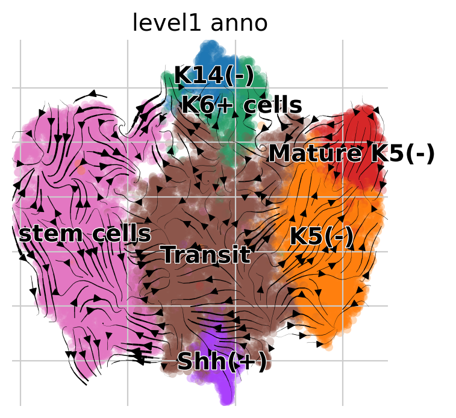
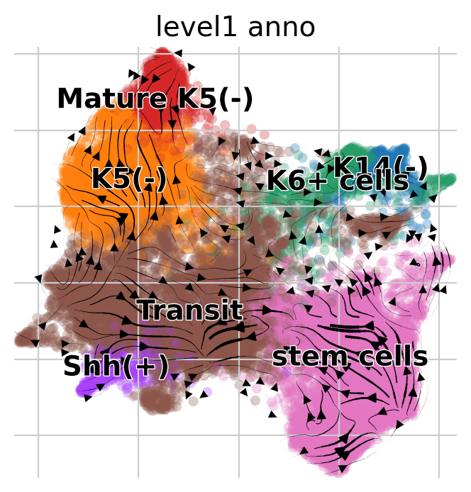
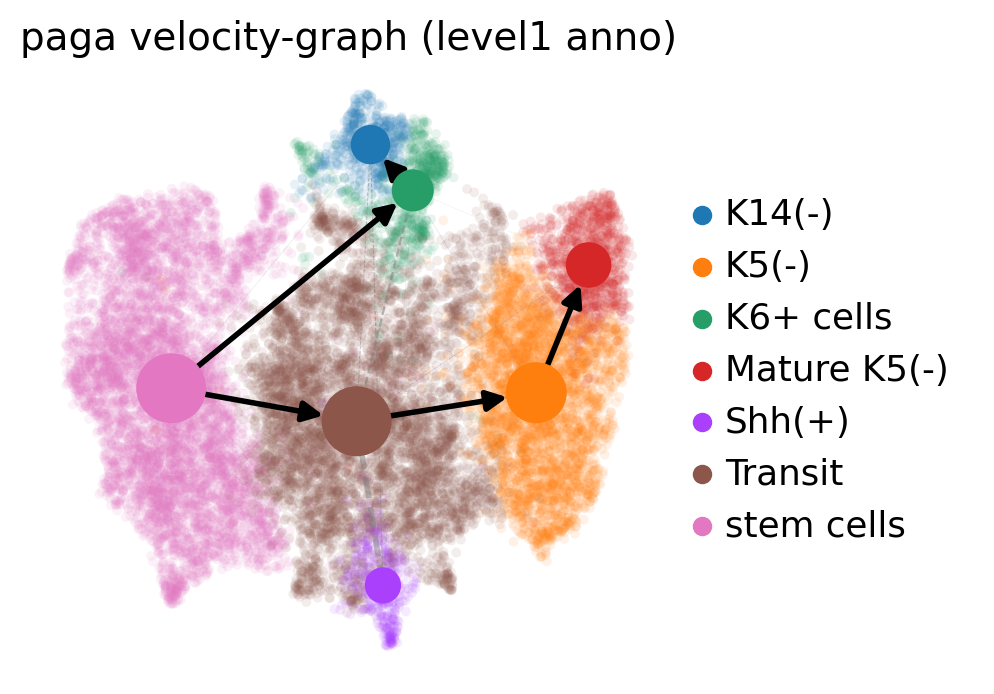
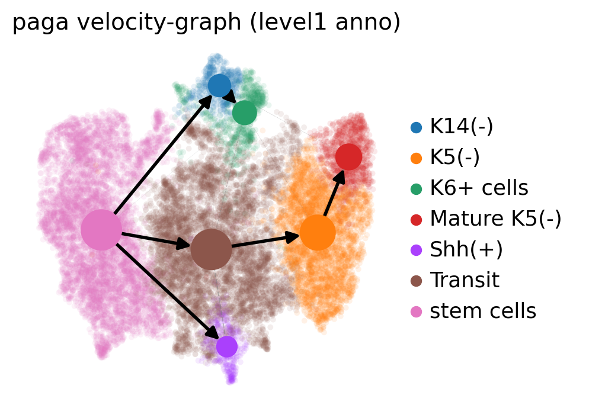
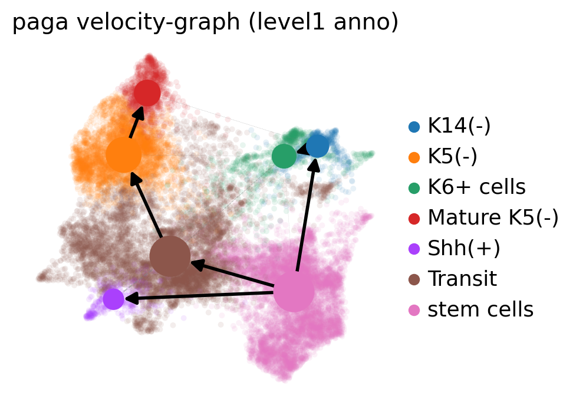

```python
import numpy as np

import cellrank as cr
import scanpy as sc
import scvelo as scv
import pandas as pd
```


```python
scv.settings.verbosity = 3
scv.settings.set_figure_params("scvelo")
sc.settings.set_figure_params(frameon=False, dpi=100)
cr.settings.verbosity = 2
```


```python
sc.settings.figdir = "../../descriptive_results/rna_trajecotry/velocity/"
scv.settings.figdir = "../../descriptive_results/rna_trajecotry/velocity/"
cr.settings.figdir = "../../descriptive_results/rna_trajecotry/velocity/"
```


```python
adata = sc.read("../../../2024.4_scATAC/processed_data/framework/4.29_scvi.h5ad")
```


```python
newumap=pd.read_csv("../../../2024.4_scATAC/processed_data/embedding/RNA_scvi_umap.csv",index_col=0)
adata.obsm["X_umap"] = np.array(newumap)
drawgraph_emb = pd.read_csv("../../../2024.4_scATAC/processed_data/embedding/RNA_scvi_20neibor_drawgraph.csv",index_col=0)
adata.obsm["X_draw_graph"] = np.array(drawgraph_emb)
```


```python
scvi = pd.read_csv("../../../2024.4_scATAC/processed_data/embedding/RNA_scvi_latent.csv",index_col=0)
adata.obsm["X_scvi"] = np.array(scvi)
```


```python
E12_1= sc.read_loom("../../../2024.4_scATAC/data/rna/E12.5_K5mTmG_1.loom")
E12_2= sc.read_loom("../../../2024.4_scATAC/data/rna/E12.5_K5mTmG_2.loom")
E14_1= sc.read_loom("../../../2024.4_scATAC/data/rna/E14.5_K5mTmG_1.loom")
E14_2= sc.read_loom("../../../2024.4_scATAC/data/rna/E14.5_K5mTmG_2.loom")
```

    /home/zhanglab/micromamba/envs/py311/lib/python3.11/site-packages/anndata/_core/anndata.py:1756: UserWarning: Variable names are not unique. To make them unique, call `.var_names_make_unique`.
      utils.warn_names_duplicates("var")
    /home/zhanglab/micromamba/envs/py311/lib/python3.11/site-packages/anndata/_core/anndata.py:1756: UserWarning: Variable names are not unique. To make them unique, call `.var_names_make_unique`.
      utils.warn_names_duplicates("var")
    /home/zhanglab/micromamba/envs/py311/lib/python3.11/site-packages/anndata/_core/anndata.py:1756: UserWarning: Variable names are not unique. To make them unique, call `.var_names_make_unique`.
      utils.warn_names_duplicates("var")
    /home/zhanglab/micromamba/envs/py311/lib/python3.11/site-packages/anndata/_core/anndata.py:1756: UserWarning: Variable names are not unique. To make them unique, call `.var_names_make_unique`.
      utils.warn_names_duplicates("var")


```python
def reverse_transform(input_str):
    parts = input_str.split('_')
    sequence = parts[2].split('-')[0]
    
    new_string = f"{parts[0]}_K5_mTmG_{parts[1]}:{sequence}x"
    
    return new_string


def reverse_transform2(input_str):
    parts = input_str.split('_')
    sequence = parts[2].split('-')[0]
    
    new_string = f"K5mTmG_{parts[1]}:{sequence}x"
    
    return new_string

```


```python
newnames = [reverse_transform(s) for s in adata.obs_names]
newnamesE14 = [reverse_transform2(s) for s in adata.obs_names]
```


```python
E12_1.var_names_make_unique()
E12_2.var_names_make_unique()
E14_1.var_names_make_unique()
E14_2.var_names_make_unique()
```


```python
E12_1 = E12_1[np.intersect1d(newnames,E12_1.obs_names)].copy()
E12_2 = E12_2[np.intersect1d(newnames,E12_2.obs_names)].copy()
E14_1 = E14_1[np.intersect1d(newnamesE14,E14_1.obs_names)].copy()
E14_2 = E14_2[np.intersect1d(newnamesE14,E14_2.obs_names)].copy()
```


```python
def get_indices(lst, search_lst):
    indices = []
    for item in search_lst:
        try:
            index = lst.index(item)
            indices.append(index)
        except ValueError:
            pass
    return indices
result1 = get_indices(newnames, E12_1.obs_names)
result2 = get_indices(newnames, E12_2.obs_names)
result3 = get_indices(newnamesE14, E14_1.obs_names)
result4 = get_indices(newnamesE14, E14_2.obs_names)
E12_1.obsm["X_draw_graph"] = adata.obsm["X_draw_graph"][result1]
E12_2.obsm["X_draw_graph"] = adata.obsm["X_draw_graph"][result2]
E14_1.obsm["X_draw_graph"] = adata.obsm["X_draw_graph"][result3]
E14_2.obsm["X_draw_graph"] = adata.obsm["X_draw_graph"][result4]


E12_1.obsm["X_umap"] = adata.obsm["X_umap"][result1]
E12_2.obsm["X_umap"] = adata.obsm["X_umap"][result2]
E14_1.obsm["X_umap"] = adata.obsm["X_umap"][result3]
E14_2.obsm["X_umap"] = adata.obsm["X_umap"][result4]
annotation = pd.read_csv("../../../2024.4_scATAC/processed_data/cluster/rna_annotation_scvi_mod.csv",index_col=0)
E12_1.obs["level1_anno"] = np.array(annotation["level1_anno"][result1])
E12_2.obs["level1_anno"] = np.array(annotation["level1_anno"][result2])
E14_1.obs["level1_anno"] = np.array(annotation["level1_anno"][result3])
E14_2.obs["level1_anno"] = np.array(annotation["level1_anno"][result4])

```


```python
E12_1.obsm["X_scvi"] = adata.obsm["X_scvi"][result1]
E12_2.obsm["X_scvi"] = adata.obsm["X_scvi"][result2]
E14_1.obsm["X_scvi"] = adata.obsm["X_scvi"][result3]
E14_2.obsm["X_scvi"] = adata.obsm["X_scvi"][result4]
```


```python
pseudotime = pd.read_csv("../../../2024.4_scATAC/processed_data/trajectory/5.1_rna_celloracle.pseudotime_run2.csv",index_col=0)
```


```python
E12_1.obs["Pseudotime"] = np.array(pseudotime["Pseudotime"][result1])
E12_2.obs["Pseudotime"] = np.array(pseudotime["Pseudotime"][result2])
E14_1.obs["Pseudotime"] = np.array(pseudotime["Pseudotime"][result3])
E14_2.obs["Pseudotime"] = np.array(pseudotime["Pseudotime"][result4])
```


```python
adata_velo = sc.concat([E12_1,E12_2,E14_1,E14_2])
```


```python
adata_velo
```


    AnnData object with n_obs × n_vars = 19422 × 25954
        obs: 'level1_anno', 'Pseudotime'
        obsm: 'X_draw_graph', 'X_umap'
        layers: 'matrix', 'ambiguous', 'spliced', 'unspliced'


```python
def velo(run_adata):
    scv.pp.filter_and_normalize(
        run_adata, min_shared_counts=20, n_top_genes=2000, subset_highly_variable=False
    )
    
    sc.tl.pca(run_adata)
    sc.pp.neighbors(run_adata, n_pcs=30, n_neighbors=30, random_state=0)
    scv.pp.moments(run_adata, n_pcs=None, n_neighbors=None)
    scv.tl.recover_dynamics(run_adata, n_jobs=18)
    scv.tl.velocity(run_adata, mode="dynamical")

```


```python
velo(adata_velo)
```

    Filtered out 14539 genes that are detected 20 counts (shared).
    Normalized count data: X, spliced, unspliced.
    Extracted 2000 highly variable genes.


    /home/zhanglab/micromamba/envs/py311/lib/python3.11/site-packages/scvelo/preprocessing/utils.py:705: DeprecationWarning: `log1p` is deprecated since scVelo v0.3.0 and will be removed in a future version. Please use `log1p` from `scanpy.pp` instead.
      log1p(adata)


    Logarithmized X.
    computing moments based on connectivities
        finished (0:00:28) --> added 
        'Ms' and 'Mu', moments of un/spliced abundances (adata.layers)
    recovering dynamics (using 18/48 cores)


      0%|          | 0/1335 [00:00<?, ?gene/s]


        finished (0:08:07) --> added 
        'fit_pars', fitted parameters for splicing dynamics (adata.var)
    computing velocities
        finished (0:00:56) --> added 
        'velocity', velocity vectors for each individual cell (adata.layers)


```python
def run_plot(adata_run):
    vk_run = cr.kernels.VelocityKernel(adata_run)
    vk_run.compute_transition_matrix()
    return(vk_run)
```


```python
vk = run_plot(adata_velo)
```

    Computing transition matrix using `'deterministic'` model


      0%|          | 0/19422 [00:00<?, ?cell/s]


    Using `softmax_scale=4.8906`


      0%|          | 0/19422 [00:00<?, ?cell/s]


        Finish (0:01:43)


```python
vk.plot_projection(color = "level1_anno",save="_velo_umap.pdf")
```

    Using precomputed projection `adata.obsm['T_fwd_umap']`


    /home/zhanglab/micromamba/envs/py311/lib/python3.11/site-packages/scvelo/plotting/utils.py:63: DeprecationWarning: is_categorical_dtype is deprecated and will be removed in a future version. Use isinstance(dtype, pd.CategoricalDtype) instead
      return isinstance(c, str) and c in data.obs.keys() and cat(data.obs[c])
    /home/zhanglab/micromamba/envs/py311/lib/python3.11/site-packages/scvelo/plotting/utils.py:63: DeprecationWarning: is_categorical_dtype is deprecated and will be removed in a future version. Use isinstance(dtype, pd.CategoricalDtype) instead
      return isinstance(c, str) and c in data.obs.keys() and cat(data.obs[c])


    saving figure to file ../../descriptive_results/rna_trajecotry/velocity/scvelo__velo_umap.pdf


    

    


```python
vk.plot_projection(basis="X_draw_graph",color = "level1_anno",save="_velo_drawgraph.pdf")
```

    Using precomputed projection `adata.obsm['T_fwd_draw_graph']`


    /home/zhanglab/micromamba/envs/py311/lib/python3.11/site-packages/scvelo/plotting/utils.py:63: DeprecationWarning: is_categorical_dtype is deprecated and will be removed in a future version. Use isinstance(dtype, pd.CategoricalDtype) instead
      return isinstance(c, str) and c in data.obs.keys() and cat(data.obs[c])
    /home/zhanglab/micromamba/envs/py311/lib/python3.11/site-packages/scvelo/plotting/utils.py:63: DeprecationWarning: is_categorical_dtype is deprecated and will be removed in a future version. Use isinstance(dtype, pd.CategoricalDtype) instead
      return isinstance(c, str) and c in data.obs.keys() and cat(data.obs[c])


    figure cannot be saved as pdf, using png instead (can only output finite numbers in pdf).
    saving figure to file ../../descriptive_results/rna_trajecotry/velocity/scvelo__velo_drawgraph.png


    

    


```python
vk.write_to_adata()
```


```python
scv.tl.velocity_graph(adata_velo)
```

    computing velocity graph (using 1/48 cores)


      0%|          | 0/19422 [00:00<?, ?cells/s]


        finished (0:05:27) --> added 
        'velocity_graph', sparse matrix with cosine correlations (adata.uns)


```python
def runVeloPaga(adata_run):
    scv.tl.velocity_graph(adata_run,n_jobs=20)
    adata_run.uns['neighbors']['distances'] = adata_run.obsp['distances']
    adata_run.uns['neighbors']['connectivities'] = adata_run.obsp['connectivities']
    
    scv.tl.paga(adata_run, groups='level1_anno')
    df = scv.get_df(adata_run, 'paga/transitions_confidence', precision=2).T
    return df
    #df.style.background_gradient(cmap='Blues').format('{:.2g}')
```


```python
df = runVeloPaga(adata_velo)
```

    computing velocity graph (using 20/48 cores)


      0%|          | 0/19422 [00:00<?, ?cells/s]


        finished (0:01:13) --> added 
        'velocity_graph', sparse matrix with cosine correlations (adata.uns)
    computing terminal states
        identified 1 region of root cells and 2 regions of end points .
        finished (0:00:05) --> added
        'root_cells', root cells of Markov diffusion process (adata.obs)
        'end_points', end points of Markov diffusion process (adata.obs)
    running PAGA using priors: ['velocity_pseudotime']


    ---------------------------------------------------------------------------

    ModuleNotFoundError                       Traceback (most recent call last)

    Cell In[36], line 1
    ----> 1 df = runVeloPaga(adata_velo)


    Cell In[35], line 6, in runVeloPaga(adata_run)
          3 adata_run.uns['neighbors']['distances'] = adata_run.obsp['distances']
          4 adata_run.uns['neighbors']['connectivities'] = adata_run.obsp['connectivities']
    ----> 6 scv.tl.paga(adata_run, groups='level1_anno')
          7 df = scv.get_df(adata_run, 'paga/transitions_confidence', precision=2).T
          8 return df


    File ~/micromamba/envs/py311/lib/python3.11/site-packages/scvelo/tools/paga.py:283, in paga(adata, groups, vkey, use_time_prior, root_key, end_key, threshold_root_end_prior, minimum_spanning_tree, copy)
        280 if "paga" not in adata.uns:
        281     adata.uns["paga"] = {}
    --> 283 paga.compute_connectivities()
        284 adata.uns["paga"]["connectivities"] = paga.connectivities
        285 adata.uns["paga"]["connectivities_tree"] = paga.connectivities_tree


    File ~/micromamba/envs/py311/lib/python3.11/site-packages/scanpy/tools/_paga.py:169, in PAGA.compute_connectivities(self)
        167 def compute_connectivities(self):
        168     if self._model == "v1.2":
    --> 169         return self._compute_connectivities_v1_2()
        170     elif self._model == "v1.0":
        171         return self._compute_connectivities_v1_0()


    File ~/micromamba/envs/py311/lib/python3.11/site-packages/scanpy/tools/_paga.py:178, in PAGA._compute_connectivities_v1_2(self)
        177 def _compute_connectivities_v1_2(self):
    --> 178     import igraph
        180     ones = self._neighbors.distances.copy()
        181     ones.data = np.ones(len(ones.data))


    ModuleNotFoundError: No module named 'igraph'


```python
adata_velo_bk.obs["velocity_pseudotime"] = adata_velo_bk.obs["Pseudotime"]
```


```python
adata_velo
```


    AnnData object with n_obs × n_vars = 19422 × 25954
        obs: 'level1_anno', 'Pseudotime'
        obsm: 'X_draw_graph', 'X_umap', 'X_scvi'
        layers: 'matrix', 'ambiguous', 'spliced', 'unspliced'


```python
adata_velo_bk.obsm["X_scvi"] = adata_velo.obsm["X_scvi"]
```


```python
adata_velo_bk.obsm["X_scvi"] = adata_velo.obsm["X_scvi"]
```


```python
adata_velo.obsm["X_scvi"].shape
```


    (19422, 30)


```python
sc.pp.neighbors(adata_velo_bk, n_neighbors=4, n_pcs=30,use_rep="X_scvi")
```


```python
scv.tl.paga(adata_velo_bk, groups='level1_anno')
scv.pl.paga(adata_velo_bk, basis='umap', size=50, alpha=.1,
            min_edge_width=2, node_size_scale=1.5,save="_velo_paga.pdf")
```

    running PAGA using priors: ['velocity_pseudotime']
        finished (0:00:10) --> added
        'paga/connectivities', connectivities adjacency (adata.uns)
        'paga/connectivities_tree', connectivities subtree (adata.uns)
        'paga/transitions_confidence', velocity transitions (adata.uns)


    /home/zhanglab/micromamba/envs/py311/lib/python3.11/site-packages/scvelo/plotting/utils.py:63: DeprecationWarning: is_categorical_dtype is deprecated and will be removed in a future version. Use isinstance(dtype, pd.CategoricalDtype) instead
      return isinstance(c, str) and c in data.obs.keys() and cat(data.obs[c])
    /home/zhanglab/micromamba/envs/py311/lib/python3.11/site-packages/scvelo/plotting/utils.py:63: DeprecationWarning: is_categorical_dtype is deprecated and will be removed in a future version. Use isinstance(dtype, pd.CategoricalDtype) instead
      return isinstance(c, str) and c in data.obs.keys() and cat(data.obs[c])


    WARNING: Invalid color key. Using grey instead.
    saving figure to file ../../descriptive_results/rna_trajecotry/velocity/scvelo__velo_paga.pdf


    

    


```python
scv.tl.paga(adata_velo_bk, groups='level1_anno')
scv.pl.paga(adata_velo_bk, basis='umap', size=50, alpha=.1,
            min_edge_width=2, node_size_scale=1.5)
```

    running PAGA using priors: ['velocity_pseudotime']
        finished (0:00:10) --> added
        'paga/connectivities', connectivities adjacency (adata.uns)
        'paga/connectivities_tree', connectivities subtree (adata.uns)
        'paga/transitions_confidence', velocity transitions (adata.uns)


    /home/zhanglab/micromamba/envs/py311/lib/python3.11/site-packages/scvelo/plotting/utils.py:63: DeprecationWarning: is_categorical_dtype is deprecated and will be removed in a future version. Use isinstance(dtype, pd.CategoricalDtype) instead
      return isinstance(c, str) and c in data.obs.keys() and cat(data.obs[c])
    /home/zhanglab/micromamba/envs/py311/lib/python3.11/site-packages/scvelo/plotting/utils.py:63: DeprecationWarning: is_categorical_dtype is deprecated and will be removed in a future version. Use isinstance(dtype, pd.CategoricalDtype) instead
      return isinstance(c, str) and c in data.obs.keys() and cat(data.obs[c])


    WARNING: Invalid color key. Using grey instead.


    

    


```python
sc.pp.neighbors(adata_velo_bk, n_neighbors=6, n_pcs=30,use_rep="X_scvi")
scv.tl.paga(adata_velo_bk, groups='level1_anno')
scv.pl.paga(adata_velo_bk, basis='umap', size=50, alpha=.1,
            min_edge_width=2, node_size_scale=1.5)
```

    running PAGA using priors: ['velocity_pseudotime']
        finished (0:00:10) --> added
        'paga/connectivities', connectivities adjacency (adata.uns)
        'paga/connectivities_tree', connectivities subtree (adata.uns)
        'paga/transitions_confidence', velocity transitions (adata.uns)


    /home/zhanglab/micromamba/envs/py311/lib/python3.11/site-packages/scvelo/plotting/utils.py:63: DeprecationWarning: is_categorical_dtype is deprecated and will be removed in a future version. Use isinstance(dtype, pd.CategoricalDtype) instead
      return isinstance(c, str) and c in data.obs.keys() and cat(data.obs[c])
    /home/zhanglab/micromamba/envs/py311/lib/python3.11/site-packages/scvelo/plotting/utils.py:63: DeprecationWarning: is_categorical_dtype is deprecated and will be removed in a future version. Use isinstance(dtype, pd.CategoricalDtype) instead
      return isinstance(c, str) and c in data.obs.keys() and cat(data.obs[c])


    WARNING: Invalid color key. Using grey instead.


    

    


```python
adata_velo_bk.obs["velocity_pseudotime"] = adata_velo.obs["Pseudotime"] 
```


```python
scv.tl.paga(adata_velo_bk, groups='level1_anno')
scv.pl.paga(adata_velo_bk, basis='umap', size=50, alpha=.1,
            min_edge_width=2, node_size_scale=1.5,save="_paga_directed.pdf")
```

    running PAGA using priors: ['velocity_pseudotime']
        finished (0:00:10) --> added
        'paga/connectivities', connectivities adjacency (adata.uns)
        'paga/connectivities_tree', connectivities subtree (adata.uns)
        'paga/transitions_confidence', velocity transitions (adata.uns)


    /home/zhanglab/micromamba/envs/py311/lib/python3.11/site-packages/scvelo/plotting/utils.py:63: DeprecationWarning: is_categorical_dtype is deprecated and will be removed in a future version. Use isinstance(dtype, pd.CategoricalDtype) instead
      return isinstance(c, str) and c in data.obs.keys() and cat(data.obs[c])


    WARNING: Invalid color key. Using grey instead.


    

    


```python
scv.pl.paga(adata_velo_bk, basis='umap', size=50, alpha=.1,
            min_edge_width=2, node_size_scale=1.5,save="_paga_directed.pdf")
```

    /home/zhanglab/micromamba/envs/py311/lib/python3.11/site-packages/scvelo/plotting/utils.py:63: DeprecationWarning: is_categorical_dtype is deprecated and will be removed in a future version. Use isinstance(dtype, pd.CategoricalDtype) instead
      return isinstance(c, str) and c in data.obs.keys() and cat(data.obs[c])
    /home/zhanglab/micromamba/envs/py311/lib/python3.11/site-packages/scvelo/plotting/utils.py:63: DeprecationWarning: is_categorical_dtype is deprecated and will be removed in a future version. Use isinstance(dtype, pd.CategoricalDtype) instead
      return isinstance(c, str) and c in data.obs.keys() and cat(data.obs[c])


    WARNING: Invalid color key. Using grey instead.
    saving figure to file ../../descriptive_results/rna_trajecotry/velocity/scvelo__paga_directed.pdf


    

    


```python
scv.pl.paga(adata_velo_bk, basis='draw_graph', size=50, alpha=.1,
            min_edge_width=2, node_size_scale=1.5,save="_paga_directed_drawgraph.pdf")
```

    /home/zhanglab/micromamba/envs/py311/lib/python3.11/site-packages/scvelo/plotting/utils.py:63: DeprecationWarning: is_categorical_dtype is deprecated and will be removed in a future version. Use isinstance(dtype, pd.CategoricalDtype) instead
      return isinstance(c, str) and c in data.obs.keys() and cat(data.obs[c])
    /home/zhanglab/micromamba/envs/py311/lib/python3.11/site-packages/scvelo/plotting/utils.py:63: DeprecationWarning: is_categorical_dtype is deprecated and will be removed in a future version. Use isinstance(dtype, pd.CategoricalDtype) instead
      return isinstance(c, str) and c in data.obs.keys() and cat(data.obs[c])


    WARNING: Invalid color key. Using grey instead.
    saving figure to file ../../descriptive_results/rna_trajecotry/velocity/scvelo__paga_directed_drawgraph.pdf


    

    


```python
del adata_velo_bk.layers
```


```python
del adata_velo_bk.X
```


```python
adata_velo_bk.write_h5ad("../../../2024.4_scATAC/processed_data/framework/velocity/20241005_merge_paga.h5ad")
```


```python
adata_velo_bk.uns["paga"]["connectivities_tree"].toarray()
```


    array([[0.        , 0.        , 1.        , 0.        , 0.        ,
            0.        , 0.        ],
           [0.        , 0.        , 0.        , 0.36045974, 0.        ,
            0.08784907, 0.        ],
           [0.        , 0.        , 0.        , 0.        , 0.        ,
            0.12322786, 0.        ],
           [0.        , 0.        , 0.        , 0.        , 0.        ,
            0.        , 0.        ],
           [0.        , 0.        , 0.        , 0.        , 0.        ,
            0.24443228, 0.        ],
           [0.        , 0.        , 0.        , 0.        , 0.        ,
            0.        , 0.06340814],
           [0.        , 0.        , 0.        , 0.        , 0.        ,
            0.        , 0.        ]])


```python
scv.tl.paga(adata_velo, groups='level1_anno')
```

    running PAGA using priors: ['velocity_pseudotime']
        finished (0:00:11) --> added
        'paga/connectivities', connectivities adjacency (adata.uns)
        'paga/connectivities_tree', connectivities subtree (adata.uns)
        'paga/transitions_confidence', velocity transitions (adata.uns)


```python
scv.pl.paga(adata_velo, basis='umap', size=50, alpha=.1,
            min_edge_width=2, node_size_scale=1.5,save="_velo_paga.pdf")
```

    /home/zhanglab/micromamba/envs/py311/lib/python3.11/site-packages/scvelo/plotting/utils.py:63: DeprecationWarning: is_categorical_dtype is deprecated and will be removed in a future version. Use isinstance(dtype, pd.CategoricalDtype) instead
      return isinstance(c, str) and c in data.obs.keys() and cat(data.obs[c])
    /home/zhanglab/micromamba/envs/py311/lib/python3.11/site-packages/scvelo/plotting/utils.py:63: DeprecationWarning: is_categorical_dtype is deprecated and will be removed in a future version. Use isinstance(dtype, pd.CategoricalDtype) instead
      return isinstance(c, str) and c in data.obs.keys() and cat(data.obs[c])


    WARNING: Invalid color key. Using grey instead.
    saving figure to file ../../descriptive_results/rna_trajecotry/velocity/scvelo__velo_paga.pdf


    

    


```python
adata_velo.obsp["T_fwd"]
```


    <19422x19422 sparse matrix of type '<class 'numpy.float64'>'
    	with 784130 stored elements in Compressed Sparse Row format>


```python
adata_combine.obsp["T_fwd"]
```


    <19404x19404 sparse matrix of type '<class 'numpy.float64'>'
    	with 391890 stored elements in Compressed Sparse Row format>


```python
adata_velo.obsp["T_fwd_bk"] = adata_velo.obsp["T_fwd"].copy()
```


```python
adata_velo.obsp["T_fwd"] = adata_combine.obsp["T_fwd"]
```


    ---------------------------------------------------------------------------

    ValueError                                Traceback (most recent call last)

    Cell In[71], line 1
    ----> 1 adata_velo.obsp["T_fwd"] = adata_combine.obsp["T_fwd"]


    File ~/micromamba/envs/py311/lib/python3.11/site-packages/anndata/_core/aligned_mapping.py:216, in AlignedActual.__setitem__(self, key, value)
        215 def __setitem__(self, key: str, value: Value):
    --> 216     value = self._validate_value(value, key)
        217     self._data[key] = value


    File ~/micromamba/envs/py311/lib/python3.11/site-packages/anndata/_core/aligned_mapping.py:97, in AlignedMappingBase._validate_value(self, val, key)
         91         dims = tuple(("obs", "var")[ax] for ax in self.axes)
         92         msg = (
         93             f"Value passed for key {key!r} is of incorrect shape. "
         94             f"Values of {self.attrname} must match dimensions {dims} of parent. "
         95             f"Value had shape {actual_shape} while it should have had {right_shape}."
         96         )
    ---> 97     raise ValueError(msg)
         99 name = f"{self.attrname.title().rstrip('s')} {key!r}"
        100 return coerce_array(val, name=name, allow_df=self._allow_df)


    ValueError: Value passed for key 'T_fwd' is of incorrect shape. Values of obsp must match dimensions ('obs', 'obs') of parent. Value had shape (19404, 19404) while it should have had (19422, 19422).


```python
name1 = [reverse_transform(s) for s in adata_combine.obs_names[adata_combine.obs["time"] == 12.5]]
name2 = [reverse_transform2(s) for s in adata_combine.obs_names[adata_combine.obs["time"] == 14.5]]
```


```python
list1 = name1 + name2
```


```python
obsName = np.array(adata_velo.obs_names)
```


```python
len(np.intersect1d(list1,adata_velo.obs_names))
```


    19404


```python
adata_velo
```


    AnnData object with n_obs × n_vars = 19422 × 11415
        obs: 'level1_anno', 'Pseudotime', 'initial_size_unspliced', 'initial_size_spliced', 'initial_size', 'n_counts', 'velocity_self_transition', 'root_cells', 'end_points', 'velocity_pseudotime'
        var: 'gene_count_corr', 'means', 'dispersions', 'dispersions_norm', 'highly_variable', 'fit_r2', 'fit_alpha', 'fit_beta', 'fit_gamma', 'fit_t_', 'fit_scaling', 'fit_std_u', 'fit_std_s', 'fit_likelihood', 'fit_u0', 'fit_s0', 'fit_pval_steady', 'fit_steady_u', 'fit_steady_s', 'fit_variance', 'fit_alignment_scaling', 'velocity_genes'
        uns: 'log1p', 'pca', 'neighbors', 'recover_dynamics', 'velocity_params', 'T_fwd_params', 'level1_anno_colors', 'velocity_graph', 'velocity_graph_neg', 'paga', 'level1_anno_sizes'
        obsm: 'X_draw_graph', 'X_umap', 'X_pca', 'T_fwd_umap', 'T_fwd_draw_graph'
        varm: 'PCs', 'loss'
        layers: 'matrix', 'ambiguous', 'spliced', 'unspliced', 'Ms', 'Mu', 'fit_t', 'fit_tau', 'fit_tau_', 'velocity', 'velocity_u'
        obsp: 'distances', 'connectivities', 'T_fwd', 'T_fwd_bk'


```python
adata_velo_bk = adata_velo.copy()
```


```python
del adata_velo.obsp
```


```python
adata_velo
```


    AnnData object with n_obs × n_vars = 19422 × 11415
        obs: 'level1_anno', 'Pseudotime', 'initial_size_unspliced', 'initial_size_spliced', 'initial_size', 'n_counts', 'velocity_self_transition', 'root_cells', 'end_points', 'velocity_pseudotime'
        var: 'gene_count_corr', 'means', 'dispersions', 'dispersions_norm', 'highly_variable', 'fit_r2', 'fit_alpha', 'fit_beta', 'fit_gamma', 'fit_t_', 'fit_scaling', 'fit_std_u', 'fit_std_s', 'fit_likelihood', 'fit_u0', 'fit_s0', 'fit_pval_steady', 'fit_steady_u', 'fit_steady_s', 'fit_variance', 'fit_alignment_scaling', 'velocity_genes'
        uns: 'log1p', 'pca', 'neighbors', 'recover_dynamics', 'velocity_params', 'T_fwd_params', 'level1_anno_colors', 'velocity_graph', 'velocity_graph_neg', 'paga', 'level1_anno_sizes'
        obsm: 'X_draw_graph', 'X_umap', 'X_pca', 'T_fwd_umap', 'T_fwd_draw_graph'
        varm: 'PCs', 'loss'
        layers: 'matrix', 'ambiguous', 'spliced', 'unspliced', 'Ms', 'Mu', 'fit_t', 'fit_tau', 'fit_tau_', 'velocity', 'velocity_u'


```python
adata_velo_sub = adata_velo[np.intersect1d(list1,adata_velo.obs_names)].copy()
```


```python
del adata_velo_sub.uns
```


```python
bool1 = np.isin(adata_velo.obs_names,list1)
```


```python
len(bool1)
```


    19422


```python
arr = np.array(adata_velo_sub.obs["Pseudotime"]).copy()
```


```python
dist= adata_velo.obsp["distances"].toarray()[bool1][:, bool1]
```


```python
from scipy.sparse import csr_matrix

dist = csr_matrix(dist)
```


```python
dist.shape
```


    (19404, 19404)


```python
adata_velo.write_h5ad("../../../2024.4_scATAC//processed_data/framework/velocity/merge_velo.h5ad")
```


```python
adata_combine = sc.read("../../../2024.4_scATAC/processed_data/framework/5.26_cellrank_ck.h5ad")
```
