## Introduction
This script is aimed to integrate scATAC and scRNA by timepoint


```python
import anndata as ad
import networkx as nx
import scanpy as sc
import scglue
import numpy as np
from matplotlib import rcParams
scglue.plot.set_publication_params()
rcParams["figure.figsize"] = (4, 4)
from itertools import chain
import pandas as pd
import matplotlib.pyplot as plt

sc.settings.figdir = "../result/intergrate/202408_scglue/"
```


```python

```


```python
atac= sc.read("../process/framework/obj/atac_scglue_prepare.h5ad")
```


```python
rna_raw = sc.read("../process/framework/obj/rna_raw_scglue_prepare.h5ad")
```


```python
rna_raw.obs["group"]
```


    E125_1_AAACCCAAGTCATGAA-1    E125
    E125_1_AAACCCACAAGACCGA-1    E125
    E125_1_AAACCCACATGCACTA-1    E125
    E125_1_AAACCCAGTCAGTCGC-1    E125
    E125_1_AAACCCAGTCCACGCA-1    E125
                                 ... 
    E145_2_TTTGGTTCATACCATG-1    E145
    E145_2_TTTGGTTCATGCCGGT-1    E145
    E145_2_TTTGGTTTCGTAGGAG-1    E145
    E145_2_TTTGTTGCACACCGAC-1    E145
    E145_2_TTTGTTGTCAACTGGT-1    E145
    Name: group, Length: 19404, dtype: category
    Categories (2, object): ['E125', 'E145']


```python
rna_raw[rna_raw.obs["group"] == "E125"]
```


    View of AnnData object with n_obs × n_vars = 12998 × 21638
        obs: 'orig.ident', 'nCount_RNA', 'nFeature_RNA', 'percent.mt', 'nCount_SCT', 'nFeature_SCT', 'SCT_snn_res.0.8', 'seurat_clusters', 'group', 'SCT_snn_res.0.6', 'celltype', 'SCT_snn_res.0.4', 'S.Score', 'G2M.Score', 'Phase', 'old.ident', 'ident'
        var: 'mean', 'std'
        uns: 'X_name', 'log1p', 'pca'
        obsm: 'HARMONY', 'PCA', 'UMAP', 'X_pca'
        varm: 'PCs'
        layers: 'counts', 'logcounts'


```python
guidance = nx.read_graphml("../process/scglue/guidance.graphml.gz")
```


```python
split = atac.var_names.str.split(r"[:-]")
atac.var["chrom"] = split.map(lambda x: x[0])
atac.var["chromStart"] = split.map(lambda x: x[1]).astype(int)
atac.var["chromEnd"] = split.map(lambda x: x[2]).astype(int)
atac.var.head()
scglue.data.get_gene_annotation(
    rna_raw, gtf="../../../database/gtf/gencode.vM25.chr_patch_hapl_scaff.annotation.gtf.gz",
    gtf_by="gene_name"
)
rna_raw.var.loc[:, ["chrom", "chromStart", "chromEnd"]].head()
```


<div>
<style scoped>
    .dataframe tbody tr th:only-of-type {
        vertical-align: middle;
    }

    .dataframe tbody tr th {
        vertical-align: top;
    }

    .dataframe thead th {
        text-align: right;
    }
</style>
<table border="1" class="dataframe">
  <thead>
    <tr style="text-align: right;">
      <th></th>
      <th>chrom</th>
      <th>chromStart</th>
      <th>chromEnd</th>
    </tr>
  </thead>
  <tbody>
    <tr>
      <th>Xkr4</th>
      <td>chr1</td>
      <td>3205900</td>
      <td>3671498</td>
    </tr>
    <tr>
      <th>Gm1992</th>
      <td>chr1</td>
      <td>3466586</td>
      <td>3513553</td>
    </tr>
    <tr>
      <th>Rp1</th>
      <td>chr1</td>
      <td>3999556</td>
      <td>4409241</td>
    </tr>
    <tr>
      <th>Sox17</th>
      <td>chr1</td>
      <td>4490930</td>
      <td>4497354</td>
    </tr>
    <tr>
      <th>Mrpl15</th>
      <td>chr1</td>
      <td>4773205</td>
      <td>4785739</td>
    </tr>
  </tbody>
</table>
</div>


```python
rna_raw_E12 = rna_raw[rna_raw.obs["group"] == "E125"].copy()
rna_raw_E14 = rna_raw[rna_raw.obs["group"] == "E145"].copy()
```


```python
atac.obs["group"] = "E125"
atac.obs["group"][atac.obs["batch"].isin(["B1","B2"])] = "E145"
```

    /tmp/ipykernel_1823907/4090903329.py:2: FutureWarning: ChainedAssignmentError: behaviour will change in pandas 3.0!
    You are setting values through chained assignment. Currently this works in certain cases, but when using Copy-on-Write (which will become the default behaviour in pandas 3.0) this will never work to update the original DataFrame or Series, because the intermediate object on which we are setting values will behave as a copy.
    A typical example is when you are setting values in a column of a DataFrame, like:
    
    df["col"][row_indexer] = value
    
    Use `df.loc[row_indexer, "col"] = values` instead, to perform the assignment in a single step and ensure this keeps updating the original `df`.
    
    See the caveats in the documentation: https://pandas.pydata.org/pandas-docs/stable/user_guide/indexing.html#returning-a-view-versus-a-copy
    
      atac.obs["group"][atac.obs["batch"].isin(["B1","B2"])] = "E145"
    /tmp/ipykernel_1823907/4090903329.py:2: SettingWithCopyWarning: 
    A value is trying to be set on a copy of a slice from a DataFrame
    
    See the caveats in the documentation: https://pandas.pydata.org/pandas-docs/stable/user_guide/indexing.html#returning-a-view-versus-a-copy
      atac.obs["group"][atac.obs["batch"].isin(["B1","B2"])] = "E145"


```python
atac_E12 = atac[atac.obs["group"] == "E125"].copy()
atac_E14 = atac[atac.obs["group"] == "E145"].copy()
```


```python
sc.pp.highly_variable_genes(rna_raw_E12, n_top_genes=2000)
sc.pp.highly_variable_genes(rna_raw_E14, n_top_genes=2000)
```

    /home/zhanglab/micromamba/envs/py311/lib/python3.11/site-packages/scanpy/preprocessing/_highly_variable_genes.py:305: RuntimeWarning: invalid value encountered in log
      dispersion = np.log(dispersion)
    /home/zhanglab/micromamba/envs/py311/lib/python3.11/site-packages/scanpy/preprocessing/_highly_variable_genes.py:305: RuntimeWarning: invalid value encountered in log
      dispersion = np.log(dispersion)


```python
guidanceE12 = scglue.genomics.rna_anchored_guidance_graph(rna_raw_E12, atac_E12)
guidanceE14 = scglue.genomics.rna_anchored_guidance_graph(rna_raw_E14, atac_E14)
```


    window_graph:   0%|          | 0/21638 [00:00<?, ?it/s]


    window_graph:   0%|          | 0/21638 [00:00<?, ?it/s]


```python
scglue.models.configure_dataset(
    rna_raw_E12, "NB", use_highly_variable=True,use_batch="orig.ident",
    use_layer="counts", use_rep="X_pca"
)
```


```python
scglue.models.configure_dataset(
    atac_E12, "NB", use_highly_variable=True,use_batch="batch",
    use_rep="X_lsi"
)
```


```python
guidance_hvf = guidance.subgraph(chain(
    rna_raw_E12.var.query("highly_variable").index,
    atac_E12.var.query("highly_variable").index
)).copy()
```


```python
atac_E12
```


    AnnData object with n_obs × n_vars = 16995 × 297386
        obs: 'nCount_ATAC', 'nFeature_ATAC', 'nCount_peaks', 'nFeature_peaks', 'nucleosome_signal', 'nucleosome_percentile', 'nucleosome_group', 'TSS.enrichment', 'TSS.percentile', 'high.tss', 'total', 'duplicate', 'chimeric', 'unmapped', 'lowmapq', 'mitochondrial', 'nonprimary', 'passed_filters', 'is__cell_barcode', 'excluded_reason', 'TSS_fragments', 'DNase_sensitive_region_fragments', 'enhancer_region_fragments', 'promoter_region_fragments', 'on_target_fragments', 'blacklist_region_fragments', 'peak_region_fragments', 'peak_region_cutsites', 'pct_reads_in_peaks', 'blacklist_ratio', 'n_fragment', 'frac_dup', 'scDblFinderScore', 'peaks_snn_res.0.8', 'seurat_clusters', 'nCount_RNA', 'nFeature_RNA', 'predicted.id', 'prediction.score.pe4', 'prediction.score.pe2', 'prediction.score.pe3', 'prediction.score.pe1', 'prediction.score.pe6', 'prediction.score.pe11', 'prediction.score.pe5', 'prediction.score.pe10', 'prediction.score.pe8', 'prediction.score.pe13', 'prediction.score.pe7', 'prediction.score.pe12', 'prediction.score.pe9', 'prediction.score.max', 'archR_label', 'coarseLabel', 'batch', 'FRIP', 'logCount', 'group', 'coarse_label', 'balancing_weight'
        var: 'name', 'chrom', 'chromStart', 'chromEnd', 'highly_variable'
        uns: 'neighbors', 'seurat_clusters_colors', 'umap', '__scglue__'
        obsm: 'X_harmony', 'X_lsi', 'X_umap', 'X_umap_after', 'X_umap_before'
        obsp: 'connectivities', 'distances'


```python
glue = scglue.models.fit_SCGLUE(
    {"rna": rna_raw_E12, "atac": atac_E12}, guidance_hvf,
    fit_kws={"directory": "glue"}
)
```

    [INFO] fit_SCGLUE: Pretraining SCGLUE model...
    [INFO] check_graph: Checking variable coverage...
    [INFO] check_graph: Checking edge attributes...
    [INFO] check_graph: Checking self-loops...
    [INFO] check_graph: Checking graph symmetry...
    [INFO] SCGLUEModel: Setting `graph_batch_size` = 14704
    [INFO] SCGLUEModel: Setting `max_epochs` = 114
    [INFO] SCGLUEModel: Setting `patience` = 10
    [INFO] SCGLUEModel: Setting `reduce_lr_patience` = 5
    [INFO] SCGLUETrainer: Using training directory: "glue/pretrain"


    /home/zhanglab/micromamba/envs/py311/lib/python3.11/site-packages/torch/optim/lr_scheduler.py:62: UserWarning: The verbose parameter is deprecated. Please use get_last_lr() to access the learning rate.
      warnings.warn(


    [INFO] SCGLUETrainer: [Epoch 10] train={'g_nll': 0.442, 'g_kl': 0.012, 'g_elbo': 0.454, 'x_rna_nll': 0.077, 'x_rna_kl': 0.002, 'x_rna_elbo': 0.079, 'x_atac_nll': 0.167, 'x_atac_kl': 0.001, 'x_atac_elbo': 0.169, 'dsc_loss': 0.694, 'vae_loss': 0.266, 'gen_loss': 0.231}, val={'g_nll': 0.441, 'g_kl': 0.012, 'g_elbo': 0.452, 'x_rna_nll': 0.078, 'x_rna_kl': 0.002, 'x_rna_elbo': 0.08, 'x_atac_nll': 0.169, 'x_atac_kl': 0.001, 'x_atac_elbo': 0.17, 'dsc_loss': 0.696, 'vae_loss': 0.268, 'gen_loss': 0.233}, 81.1s elapsed
    [INFO] LRScheduler: Learning rate reduction: step 1
    [INFO] SCGLUETrainer: [Epoch 20] train={'g_nll': 0.433, 'g_kl': 0.012, 'g_elbo': 0.444, 'x_rna_nll': 0.076, 'x_rna_kl': 0.002, 'x_rna_elbo': 0.078, 'x_atac_nll': 0.166, 'x_atac_kl': 0.001, 'x_atac_elbo': 0.167, 'dsc_loss': 0.698, 'vae_loss': 0.263, 'gen_loss': 0.228}, val={'g_nll': 0.433, 'g_kl': 0.012, 'g_elbo': 0.445, 'x_rna_nll': 0.077, 'x_rna_kl': 0.002, 'x_rna_elbo': 0.079, 'x_atac_nll': 0.171, 'x_atac_kl': 0.001, 'x_atac_elbo': 0.172, 'dsc_loss': 0.675, 'vae_loss': 0.268, 'gen_loss': 0.235}, 78.9s elapsed
    [INFO] SCGLUETrainer: [Epoch 30] train={'g_nll': 0.433, 'g_kl': 0.012, 'g_elbo': 0.444, 'x_rna_nll': 0.076, 'x_rna_kl': 0.002, 'x_rna_elbo': 0.078, 'x_atac_nll': 0.167, 'x_atac_kl': 0.001, 'x_atac_elbo': 0.168, 'dsc_loss': 0.697, 'vae_loss': 0.264, 'gen_loss': 0.229}, val={'g_nll': 0.432, 'g_kl': 0.012, 'g_elbo': 0.444, 'x_rna_nll': 0.076, 'x_rna_kl': 0.002, 'x_rna_elbo': 0.078, 'x_atac_nll': 0.169, 'x_atac_kl': 0.001, 'x_atac_elbo': 0.17, 'dsc_loss': 0.664, 'vae_loss': 0.266, 'gen_loss': 0.232}, 72.1s elapsed
    [INFO] LRScheduler: Learning rate reduction: step 2


    2024-12-02 13:53:35,293 ignite.handlers.early_stopping.EarlyStopping INFO: EarlyStopping: Stop training


    [INFO] EarlyStopping: Restoring checkpoint "32"...
    [INFO] EarlyStopping: Restoring checkpoint "32"...


    /home/zhanglab/micromamba/envs/py311/lib/python3.11/site-packages/scglue/models/plugins.py:145: FutureWarning: You are using `torch.load` with `weights_only=False` (the current default value), which uses the default pickle module implicitly. It is possible to construct malicious pickle data which will execute arbitrary code during unpickling (See https://github.com/pytorch/pytorch/blob/main/SECURITY.md#untrusted-models for more details). In a future release, the default value for `weights_only` will be flipped to `True`. This limits the functions that could be executed during unpickling. Arbitrary objects will no longer be allowed to be loaded via this mode unless they are explicitly allowlisted by the user via `torch.serialization.add_safe_globals`. We recommend you start setting `weights_only=True` for any use case where you don't have full control of the loaded file. Please open an issue on GitHub for any issues related to this experimental feature.
      loaded = torch.load(directory / f"checkpoint_{ckpts[0]}.pt")


    [INFO] fit_SCGLUE: Estimating balancing weight...
    [INFO] estimate_balancing_weight: Clustering cells...
    [INFO] estimate_balancing_weight: Matching clusters...
    [INFO] estimate_balancing_weight: Matching array shape = (20, 26)...
    [INFO] estimate_balancing_weight: Estimating balancing weight...
    [INFO] fit_SCGLUE: Fine-tuning SCGLUE model...
    [INFO] check_graph: Checking variable coverage...
    [INFO] check_graph: Checking edge attributes...
    [INFO] check_graph: Checking self-loops...
    [INFO] check_graph: Checking graph symmetry...
    [INFO] SCGLUEModel: Setting `graph_batch_size` = 14704
    [INFO] SCGLUEModel: Setting `align_burnin` = 19
    [INFO] SCGLUEModel: Setting `max_epochs` = 114
    [INFO] SCGLUEModel: Setting `patience` = 10
    [INFO] SCGLUEModel: Setting `reduce_lr_patience` = 5
    [INFO] SCGLUETrainer: Using training directory: "glue/fine-tune"


    /home/zhanglab/micromamba/envs/py311/lib/python3.11/site-packages/torch/optim/lr_scheduler.py:62: UserWarning: The verbose parameter is deprecated. Please use get_last_lr() to access the learning rate.
      warnings.warn(


```python
glue.save("../process/scglue/20241203_E12_scATAC_rna_glue.dill")
```


```python
rna_raw_E12.obsm["X_glue"] = glue.encode_data("rna", rna_raw_E12)
atac_E12.obsm["X_glue"] = glue.encode_data("atac", atac_E12)
```


```python
combined = ad.concat([rna_raw_E12, atac_E12])
```


```python
sc.pp.neighbors(combined, use_rep="X_glue", metric="cosine")
sc.tl.umap(combined)
```


```python
sc.pl.umap(combined)
```


    
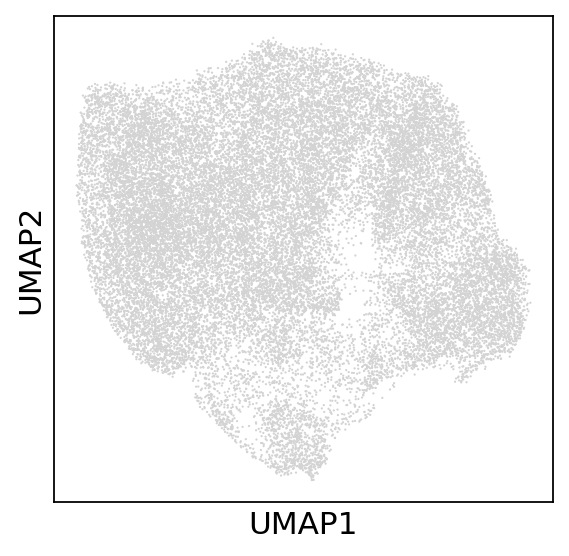
    


```python
combined.obs["modal"] = "ATAC"
combined.obs["modal"][rna_raw_E12.obs_names] = "RNA"
```

    /tmp/ipykernel_1823907/2988154660.py:2: FutureWarning: ChainedAssignmentError: behaviour will change in pandas 3.0!
    You are setting values through chained assignment. Currently this works in certain cases, but when using Copy-on-Write (which will become the default behaviour in pandas 3.0) this will never work to update the original DataFrame or Series, because the intermediate object on which we are setting values will behave as a copy.
    A typical example is when you are setting values in a column of a DataFrame, like:
    
    df["col"][row_indexer] = value
    
    Use `df.loc[row_indexer, "col"] = values` instead, to perform the assignment in a single step and ensure this keeps updating the original `df`.
    
    See the caveats in the documentation: https://pandas.pydata.org/pandas-docs/stable/user_guide/indexing.html#returning-a-view-versus-a-copy
    
      combined.obs["modal"][rna_raw_E12.obs_names] = "RNA"
    /tmp/ipykernel_1823907/2988154660.py:2: SettingWithCopyWarning: 
    A value is trying to be set on a copy of a slice from a DataFrame
    
    See the caveats in the documentation: https://pandas.pydata.org/pandas-docs/stable/user_guide/indexing.html#returning-a-view-versus-a-copy
      combined.obs["modal"][rna_raw_E12.obs_names] = "RNA"


```python
sc.pl.umap(combined,color="modal",save="_modal_E12")
```

    WARNING: saving figure to file ../result/intergrate/202408_scglue/umap_modal_E12.pdf


    
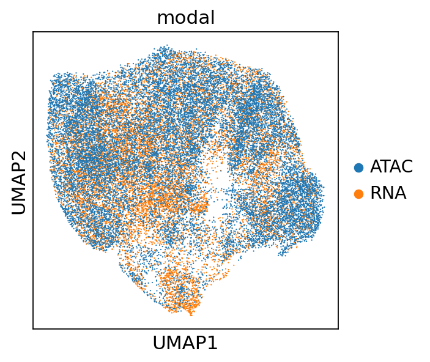
    


```python
clustering = pd.read_csv("../../2024.4_scATAC/processed_data/cluster/rna_annotation_scvi_mod.csv",index_col=0)
```


```python
level1_anno = clustering.loc[rna_raw_E12.obs_names]["level1_anno"]
```


```python
combined.obs['rna_cluster'] = np.nan 
combined.obs['rna_cluster'][level1_anno.index] = level1_anno
```

    /tmp/ipykernel_1823907/3112139837.py:2: FutureWarning: ChainedAssignmentError: behaviour will change in pandas 3.0!
    You are setting values through chained assignment. Currently this works in certain cases, but when using Copy-on-Write (which will become the default behaviour in pandas 3.0) this will never work to update the original DataFrame or Series, because the intermediate object on which we are setting values will behave as a copy.
    A typical example is when you are setting values in a column of a DataFrame, like:
    
    df["col"][row_indexer] = value
    
    Use `df.loc[row_indexer, "col"] = values` instead, to perform the assignment in a single step and ensure this keeps updating the original `df`.
    
    See the caveats in the documentation: https://pandas.pydata.org/pandas-docs/stable/user_guide/indexing.html#returning-a-view-versus-a-copy
    
      combined.obs['rna_cluster'][level1_anno.index] = level1_anno
    /tmp/ipykernel_1823907/3112139837.py:2: SettingWithCopyWarning: 
    A value is trying to be set on a copy of a slice from a DataFrame
    
    See the caveats in the documentation: https://pandas.pydata.org/pandas-docs/stable/user_guide/indexing.html#returning-a-view-versus-a-copy
      combined.obs['rna_cluster'][level1_anno.index] = level1_anno
    /tmp/ipykernel_1823907/3112139837.py:2: FutureWarning: Setting an item of incompatible dtype is deprecated and will raise an error in a future version of pandas. Value '['stem cells' 'stem cells' 'Transit' ... 'stem cells' 'stem cells' 'K5(-)']' has dtype incompatible with float64, please explicitly cast to a compatible dtype first.
      combined.obs['rna_cluster'][level1_anno.index] = level1_anno


```python
sc.pl.umap(combined,color="rna_cluster",save="_rna_cluster")
```

    WARNING: saving figure to file ../result/intergrate/202408_scglue/umap_rna_cluster.pdf


    
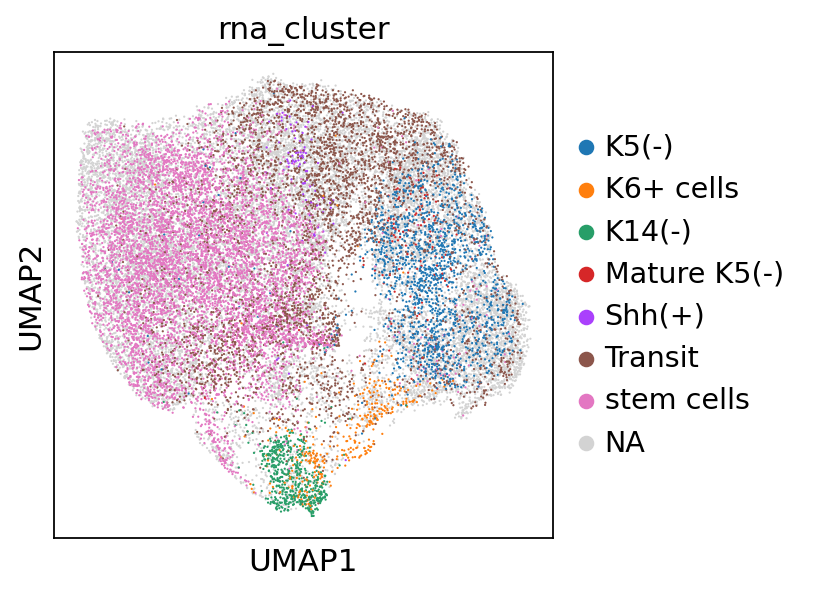
    


```python
umap_E12 = pd.DataFrame(combined.obsm["X_umap"])
umap_E12.index = combined.obs_names
umap_E12.to_csv("../process/framework/reduction/12.3_scglue_E12.csv")
```


```python
glueDF = pd.DataFrame(combined.obsm["X_glue"])
glueDF.index = combined.obs_names
glueDF.to_csv("../process/framework/reduction/12.3_scglue_E12_xglue.csv")
```


```python
rna_raw_E12.obs["rna_cluster"] = level1_anno
```


```python
scglue.data.transfer_labels(rna_raw_E12, atac_E12, "rna_cluster", use_rep="X_glue")
```


```python
sc.pl.umap(atac_E12,color=["rna_cluster"])
```


    
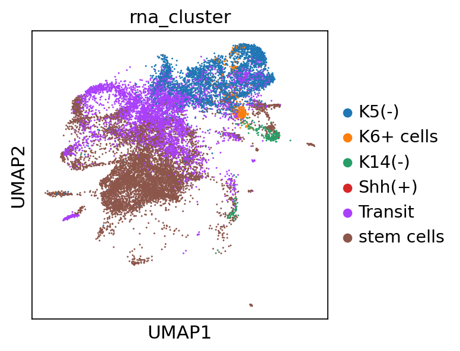
    


```python
atac_E12.obsm["scglue_umap"] = np.array(umap_E12.loc[atac_E12.obs_names])
```


```python
sc.pl.embedding(atac_E12,color=["rna_cluster"],basis="scglue_umap")
```


    
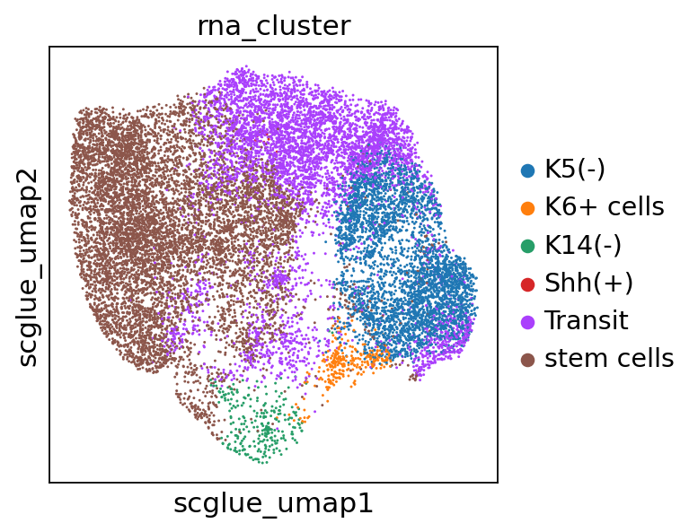
    


```python
pd.DataFrame(atac_E12.obs["rna_cluster"]).to_csv("../process/framework/cluster/E12_scglue_rna_cluster.csv")
```


```python

```


```python
scglue.models.configure_dataset(
    rna_raw_E14, "NB", use_highly_variable=True,use_batch="orig.ident",
    use_layer="counts", use_rep="X_pca"
)
```


```python
scglue.models.configure_dataset(
    atac_E14, "NB", use_highly_variable=True,use_batch="batch",
    use_rep="X_lsi"
)
```


```python
guidance_hvf_E14 = guidance.subgraph(chain(
    rna_raw_E14.var.query("highly_variable").index,
    atac_E14.var.query("highly_variable").index
)).copy()
```


```python
glue = scglue.models.fit_SCGLUE(
    {"rna": rna_raw_E14, "atac": atac_E14}, guidance_hvf_E14,
    fit_kws={"directory": "glue"}
)
```

    [INFO] fit_SCGLUE: Pretraining SCGLUE model...
    [INFO] check_graph: Checking variable coverage...
    [INFO] check_graph: Checking edge attributes...
    [INFO] check_graph: Checking self-loops...
    [INFO] check_graph: Checking graph symmetry...
    [INFO] SCGLUEModel: Setting `graph_batch_size` = 13643
    [INFO] SCGLUEModel: Setting `max_epochs` = 109
    [INFO] SCGLUEModel: Setting `patience` = 10
    [INFO] SCGLUEModel: Setting `reduce_lr_patience` = 5
    [INFO] SCGLUETrainer: Using training directory: "glue/pretrain"


    /home/zhanglab/micromamba/envs/py311/lib/python3.11/site-packages/torch/optim/lr_scheduler.py:62: UserWarning: The verbose parameter is deprecated. Please use get_last_lr() to access the learning rate.
      warnings.warn(


    [INFO] SCGLUETrainer: [Epoch 10] train={'g_nll': 0.42, 'g_kl': 0.009, 'g_elbo': 0.429, 'x_rna_nll': 0.06, 'x_rna_kl': 0.002, 'x_rna_elbo': 0.062, 'x_atac_nll': 0.069, 'x_atac_kl': 0.001, 'x_atac_elbo': 0.07, 'dsc_loss': 0.692, 'vae_loss': 0.149, 'gen_loss': 0.115}, val={'g_nll': 0.419, 'g_kl': 0.009, 'g_elbo': 0.429, 'x_rna_nll': 0.061, 'x_rna_kl': 0.002, 'x_rna_elbo': 0.063, 'x_atac_nll': 0.069, 'x_atac_kl': 0.001, 'x_atac_elbo': 0.069, 'dsc_loss': 0.694, 'vae_loss': 0.15, 'gen_loss': 0.115}, 76.7s elapsed
    [INFO] SCGLUETrainer: [Epoch 20] train={'g_nll': 0.407, 'g_kl': 0.008, 'g_elbo': 0.415, 'x_rna_nll': 0.059, 'x_rna_kl': 0.002, 'x_rna_elbo': 0.061, 'x_atac_nll': 0.069, 'x_atac_kl': 0.0, 'x_atac_elbo': 0.069, 'dsc_loss': 0.693, 'vae_loss': 0.147, 'gen_loss': 0.112}, val={'g_nll': 0.407, 'g_kl': 0.008, 'g_elbo': 0.415, 'x_rna_nll': 0.061, 'x_rna_kl': 0.002, 'x_rna_elbo': 0.063, 'x_atac_nll': 0.068, 'x_atac_kl': 0.0, 'x_atac_elbo': 0.069, 'dsc_loss': 0.693, 'vae_loss': 0.148, 'gen_loss': 0.113}, 126.0s elapsed
    [INFO] SCGLUETrainer: [Epoch 30] train={'g_nll': 0.401, 'g_kl': 0.008, 'g_elbo': 0.409, 'x_rna_nll': 0.059, 'x_rna_kl': 0.002, 'x_rna_elbo': 0.061, 'x_atac_nll': 0.069, 'x_atac_kl': 0.0, 'x_atac_elbo': 0.069, 'dsc_loss': 0.693, 'vae_loss': 0.146, 'gen_loss': 0.112}, val={'g_nll': 0.4, 'g_kl': 0.008, 'g_elbo': 0.408, 'x_rna_nll': 0.061, 'x_rna_kl': 0.002, 'x_rna_elbo': 0.063, 'x_atac_nll': 0.068, 'x_atac_kl': 0.0, 'x_atac_elbo': 0.068, 'dsc_loss': 0.693, 'vae_loss': 0.148, 'gen_loss': 0.113}, 84.5s elapsed
    [INFO] LRScheduler: Learning rate reduction: step 1
    [INFO] LRScheduler: Learning rate reduction: step 2
    [INFO] SCGLUETrainer: [Epoch 40] train={'g_nll': 0.399, 'g_kl': 0.008, 'g_elbo': 0.407, 'x_rna_nll': 0.059, 'x_rna_kl': 0.002, 'x_rna_elbo': 0.061, 'x_atac_nll': 0.069, 'x_atac_kl': 0.0, 'x_atac_elbo': 0.069, 'dsc_loss': 0.693, 'vae_loss': 0.146, 'gen_loss': 0.111}, val={'g_nll': 0.399, 'g_kl': 0.008, 'g_elbo': 0.406, 'x_rna_nll': 0.061, 'x_rna_kl': 0.002, 'x_rna_elbo': 0.063, 'x_atac_nll': 0.068, 'x_atac_kl': 0.0, 'x_atac_elbo': 0.069, 'dsc_loss': 0.693, 'vae_loss': 0.148, 'gen_loss': 0.113}, 88.6s elapsed
    [INFO] LRScheduler: Learning rate reduction: step 3
    [INFO] SCGLUETrainer: [Epoch 50] train={'g_nll': 0.399, 'g_kl': 0.008, 'g_elbo': 0.407, 'x_rna_nll': 0.059, 'x_rna_kl': 0.002, 'x_rna_elbo': 0.061, 'x_atac_nll': 0.069, 'x_atac_kl': 0.0, 'x_atac_elbo': 0.069, 'dsc_loss': 0.692, 'vae_loss': 0.146, 'gen_loss': 0.111}, val={'g_nll': 0.399, 'g_kl': 0.008, 'g_elbo': 0.407, 'x_rna_nll': 0.061, 'x_rna_kl': 0.002, 'x_rna_elbo': 0.062, 'x_atac_nll': 0.068, 'x_atac_kl': 0.0, 'x_atac_elbo': 0.069, 'dsc_loss': 0.693, 'vae_loss': 0.147, 'gen_loss': 0.113}, 90.9s elapsed
    [INFO] LRScheduler: Learning rate reduction: step 4


    2024-12-03 03:34:41,493 ignite.handlers.early_stopping.EarlyStopping INFO: EarlyStopping: Stop training


    [INFO] EarlyStopping: Restoring checkpoint "51"...
    [INFO] EarlyStopping: Restoring checkpoint "51"...


    /home/zhanglab/micromamba/envs/py311/lib/python3.11/site-packages/scglue/models/plugins.py:145: FutureWarning: You are using `torch.load` with `weights_only=False` (the current default value), which uses the default pickle module implicitly. It is possible to construct malicious pickle data which will execute arbitrary code during unpickling (See https://github.com/pytorch/pytorch/blob/main/SECURITY.md#untrusted-models for more details). In a future release, the default value for `weights_only` will be flipped to `True`. This limits the functions that could be executed during unpickling. Arbitrary objects will no longer be allowed to be loaded via this mode unless they are explicitly allowlisted by the user via `torch.serialization.add_safe_globals`. We recommend you start setting `weights_only=True` for any use case where you don't have full control of the loaded file. Please open an issue on GitHub for any issues related to this experimental feature.
      loaded = torch.load(directory / f"checkpoint_{ckpts[0]}.pt")


    [INFO] fit_SCGLUE: Estimating balancing weight...
    [INFO] estimate_balancing_weight: Clustering cells...
    [INFO] estimate_balancing_weight: Matching clusters...
    [INFO] estimate_balancing_weight: Matching array shape = (20, 21)...
    [INFO] estimate_balancing_weight: Estimating balancing weight...
    [INFO] fit_SCGLUE: Fine-tuning SCGLUE model...
    [INFO] check_graph: Checking variable coverage...
    [INFO] check_graph: Checking edge attributes...
    [INFO] check_graph: Checking self-loops...
    [INFO] check_graph: Checking graph symmetry...
    [INFO] SCGLUEModel: Setting `graph_batch_size` = 13643
    [INFO] SCGLUEModel: Setting `align_burnin` = 19
    [INFO] SCGLUEModel: Setting `max_epochs` = 109
    [INFO] SCGLUEModel: Setting `patience` = 10
    [INFO] SCGLUEModel: Setting `reduce_lr_patience` = 5
    [INFO] SCGLUETrainer: Using training directory: "glue/fine-tune"


    /home/zhanglab/micromamba/envs/py311/lib/python3.11/site-packages/torch/optim/lr_scheduler.py:62: UserWarning: The verbose parameter is deprecated. Please use get_last_lr() to access the learning rate.
      warnings.warn(


    [INFO] SCGLUETrainer: [Epoch 10] train={'g_nll': 0.396, 'g_kl': 0.008, 'g_elbo': 0.403, 'x_rna_nll': 0.059, 'x_rna_kl': 0.001, 'x_rna_elbo': 0.06, 'x_atac_nll': 0.069, 'x_atac_kl': 0.0, 'x_atac_elbo': 0.069, 'dsc_loss': 0.691, 'vae_loss': 0.146, 'gen_loss': 0.111}, val={'g_nll': 0.396, 'g_kl': 0.007, 'g_elbo': 0.404, 'x_rna_nll': 0.06, 'x_rna_kl': 0.001, 'x_rna_elbo': 0.062, 'x_atac_nll': 0.068, 'x_atac_kl': 0.0, 'x_atac_elbo': 0.068, 'dsc_loss': 0.699, 'vae_loss': 0.146, 'gen_loss': 0.111}, 82.6s elapsed
    [INFO] SCGLUETrainer: [Epoch 20] train={'g_nll': 0.393, 'g_kl': 0.007, 'g_elbo': 0.4, 'x_rna_nll': 0.059, 'x_rna_kl': 0.001, 'x_rna_elbo': 0.06, 'x_atac_nll': 0.069, 'x_atac_kl': 0.0, 'x_atac_elbo': 0.069, 'dsc_loss': 0.69, 'vae_loss': 0.145, 'gen_loss': 0.111}, val={'g_nll': 0.392, 'g_kl': 0.007, 'g_elbo': 0.399, 'x_rna_nll': 0.061, 'x_rna_kl': 0.001, 'x_rna_elbo': 0.063, 'x_atac_nll': 0.068, 'x_atac_kl': 0.0, 'x_atac_elbo': 0.068, 'dsc_loss': 0.695, 'vae_loss': 0.147, 'gen_loss': 0.112}, 86.1s elapsed
    [INFO] LRScheduler: Learning rate reduction: step 1
    [INFO] SCGLUETrainer: [Epoch 30] train={'g_nll': 0.39, 'g_kl': 0.007, 'g_elbo': 0.398, 'x_rna_nll': 0.059, 'x_rna_kl': 0.001, 'x_rna_elbo': 0.06, 'x_atac_nll': 0.069, 'x_atac_kl': 0.0, 'x_atac_elbo': 0.069, 'dsc_loss': 0.692, 'vae_loss': 0.145, 'gen_loss': 0.11}, val={'g_nll': 0.391, 'g_kl': 0.007, 'g_elbo': 0.398, 'x_rna_nll': 0.062, 'x_rna_kl': 0.001, 'x_rna_elbo': 0.063, 'x_atac_nll': 0.068, 'x_atac_kl': 0.0, 'x_atac_elbo': 0.068, 'dsc_loss': 0.697, 'vae_loss': 0.147, 'gen_loss': 0.112}, 81.5s elapsed
    [INFO] LRScheduler: Learning rate reduction: step 2
    [INFO] SCGLUETrainer: [Epoch 40] train={'g_nll': 0.39, 'g_kl': 0.007, 'g_elbo': 0.398, 'x_rna_nll': 0.059, 'x_rna_kl': 0.001, 'x_rna_elbo': 0.061, 'x_atac_nll': 0.069, 'x_atac_kl': 0.0, 'x_atac_elbo': 0.069, 'dsc_loss': 0.691, 'vae_loss': 0.145, 'gen_loss': 0.111}, val={'g_nll': 0.391, 'g_kl': 0.007, 'g_elbo': 0.398, 'x_rna_nll': 0.06, 'x_rna_kl': 0.001, 'x_rna_elbo': 0.062, 'x_atac_nll': 0.068, 'x_atac_kl': 0.0, 'x_atac_elbo': 0.068, 'dsc_loss': 0.698, 'vae_loss': 0.145, 'gen_loss': 0.11}, 88.0s elapsed


    2024-12-03 04:38:17,001 ignite.handlers.early_stopping.EarlyStopping INFO: EarlyStopping: Stop training


    [INFO] EarlyStopping: Restoring checkpoint "40"...
    [INFO] EarlyStopping: Restoring checkpoint "40"...


    /home/zhanglab/micromamba/envs/py311/lib/python3.11/site-packages/scglue/models/plugins.py:145: FutureWarning: You are using `torch.load` with `weights_only=False` (the current default value), which uses the default pickle module implicitly. It is possible to construct malicious pickle data which will execute arbitrary code during unpickling (See https://github.com/pytorch/pytorch/blob/main/SECURITY.md#untrusted-models for more details). In a future release, the default value for `weights_only` will be flipped to `True`. This limits the functions that could be executed during unpickling. Arbitrary objects will no longer be allowed to be loaded via this mode unless they are explicitly allowlisted by the user via `torch.serialization.add_safe_globals`. We recommend you start setting `weights_only=True` for any use case where you don't have full control of the loaded file. Please open an issue on GitHub for any issues related to this experimental feature.
      loaded = torch.load(directory / f"checkpoint_{ckpts[0]}.pt")


```python
glue.save("../process/scglue/E14_scATAC_rna_glue.dill")
```


```python
rna_raw_E14.obsm["X_glue"] = glue.encode_data("rna", rna_raw_E14)
atac_E14.obsm["X_glue"] = glue.encode_data("atac", atac_E14)
```


```python
combined_E14 = ad.concat([rna_raw_E14, atac_E14])
```


```python
sc.pp.neighbors(combined_E14, use_rep="X_glue", metric="cosine")
sc.tl.umap(combined_E14)
```


```python
sc.pl.umap(combined_E14)
```


    
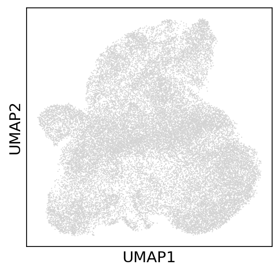
    


```python
combined_E14.obs["modal"] = "ATAC"
combined_E14.obs["modal"][rna_raw_E14.obs_names] = "RNA"
```

    /tmp/ipykernel_1823907/3244149336.py:2: FutureWarning: ChainedAssignmentError: behaviour will change in pandas 3.0!
    You are setting values through chained assignment. Currently this works in certain cases, but when using Copy-on-Write (which will become the default behaviour in pandas 3.0) this will never work to update the original DataFrame or Series, because the intermediate object on which we are setting values will behave as a copy.
    A typical example is when you are setting values in a column of a DataFrame, like:
    
    df["col"][row_indexer] = value
    
    Use `df.loc[row_indexer, "col"] = values` instead, to perform the assignment in a single step and ensure this keeps updating the original `df`.
    
    See the caveats in the documentation: https://pandas.pydata.org/pandas-docs/stable/user_guide/indexing.html#returning-a-view-versus-a-copy
    
      combined_E14.obs["modal"][rna_raw_E14.obs_names] = "RNA"
    /tmp/ipykernel_1823907/3244149336.py:2: SettingWithCopyWarning: 
    A value is trying to be set on a copy of a slice from a DataFrame
    
    See the caveats in the documentation: https://pandas.pydata.org/pandas-docs/stable/user_guide/indexing.html#returning-a-view-versus-a-copy
      combined_E14.obs["modal"][rna_raw_E14.obs_names] = "RNA"


```python
sc.pl.umap(combined_E14,color="modal",save="_E14_modal")
```

    WARNING: saving figure to file ../result/intergrate/202408_scglue/umap_E14_modal.pdf


    
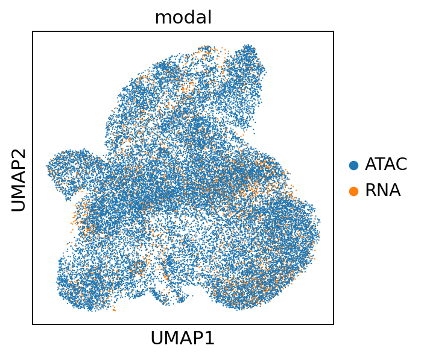
    


```python

```


```python
level1_anno_E14 = clustering.loc[rna_raw_E14.obs_names]["level1_anno"]
```


```python
combined_E14.obs['rna_cluster'] = np.nan 
combined_E14.obs['rna_cluster'][level1_anno_E14.index] = level1_anno_E14
```

    /tmp/ipykernel_1823907/4025282003.py:2: FutureWarning: ChainedAssignmentError: behaviour will change in pandas 3.0!
    You are setting values through chained assignment. Currently this works in certain cases, but when using Copy-on-Write (which will become the default behaviour in pandas 3.0) this will never work to update the original DataFrame or Series, because the intermediate object on which we are setting values will behave as a copy.
    A typical example is when you are setting values in a column of a DataFrame, like:
    
    df["col"][row_indexer] = value
    
    Use `df.loc[row_indexer, "col"] = values` instead, to perform the assignment in a single step and ensure this keeps updating the original `df`.
    
    See the caveats in the documentation: https://pandas.pydata.org/pandas-docs/stable/user_guide/indexing.html#returning-a-view-versus-a-copy
    
      combined_E14.obs['rna_cluster'][level1_anno_E14.index] = level1_anno_E14
    /tmp/ipykernel_1823907/4025282003.py:2: SettingWithCopyWarning: 
    A value is trying to be set on a copy of a slice from a DataFrame
    
    See the caveats in the documentation: https://pandas.pydata.org/pandas-docs/stable/user_guide/indexing.html#returning-a-view-versus-a-copy
      combined_E14.obs['rna_cluster'][level1_anno_E14.index] = level1_anno_E14
    /tmp/ipykernel_1823907/4025282003.py:2: FutureWarning: Setting an item of incompatible dtype is deprecated and will raise an error in a future version of pandas. Value '['Shh(+)' 'K5(-)' 'K5(-)' ... 'Transit' 'Transit' 'Transit']' has dtype incompatible with float64, please explicitly cast to a compatible dtype first.
      combined_E14.obs['rna_cluster'][level1_anno_E14.index] = level1_anno_E14


```python
sc.pl.umap(combined_E14,color="rna_cluster",save="_E14_rna_cluster")
```

    WARNING: saving figure to file ../result/intergrate/202408_scglue/umap_E14_rna_cluster.pdf


    
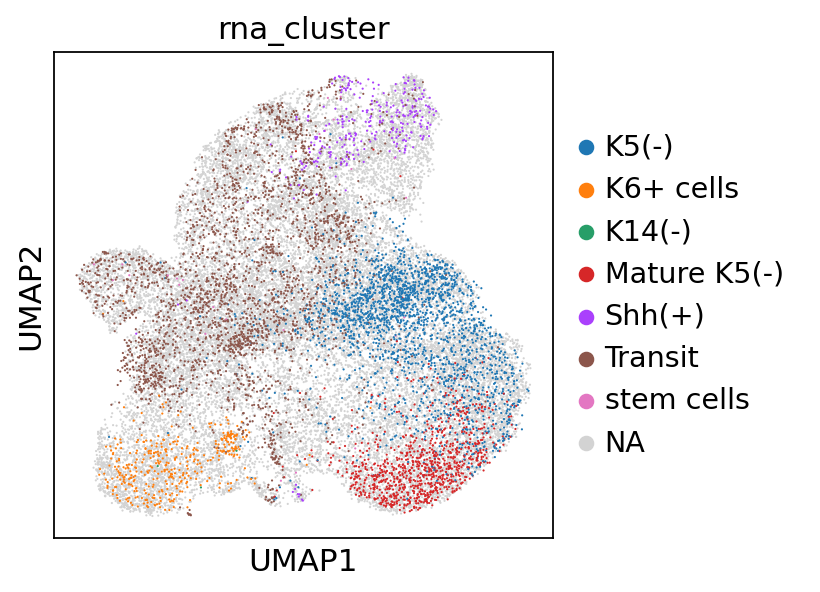
    


```python
umap_E14 = pd.DataFrame(combined_E14.obsm["X_umap"])
umap_E14.index = combined_E14.obs_names
umap_E14.to_csv("../process/framework/reduction/12.3_scglue_E14.csv")
```


```python
glueDF = pd.DataFrame(combined_E14.obsm["X_glue"])
glueDF.index = combined_E14.obs_names
glueDF.to_csv("../process/framework/reduction/12.3_scglue_E14_xglue.csv")
```


```python
rna_raw_E14.obs["rna_cluster"] = level1_anno_E14
```


```python
scglue.data.transfer_labels(rna_raw_E14, atac_E14, "rna_cluster", use_rep="X_glue")
```


```python
sc.pl.umap(atac_E14,color=["rna_cluster"])
```


    
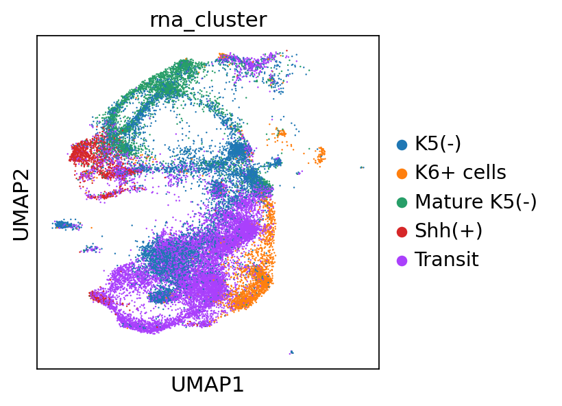
    


```python
atac_E14.obsm["scglue_umap"] = np.array(umap_E14.loc[atac_E14.obs_names])
```


```python
sc.pl.embedding(atac_E14,color=["rna_cluster"],basis="scglue_umap")
```


    
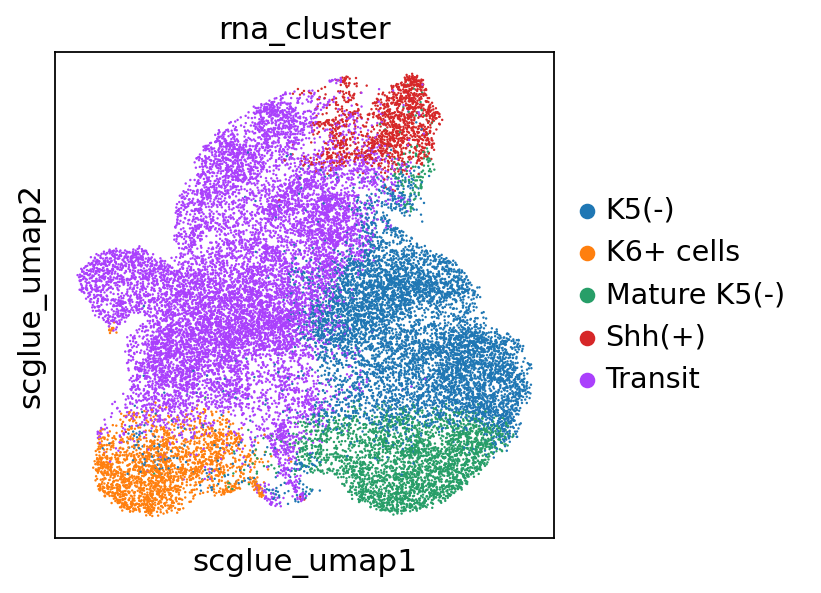
    


```python
pd.DataFrame(atac_E14.obs["rna_cluster"]).to_csv("../process/framework/cluster/E14_scglue_rna_cluster.csv")
```


```python
atac.obs["rna_cluster"] = np.nan
atac.obs["rna_cluster"][atac_E12.obs_names] = atac_E12.obs["rna_cluster"]
atac.obs["rna_cluster"][atac_E14.obs_names] = atac_E14.obs["rna_cluster"]
```

    /tmp/ipykernel_1823907/3746622907.py:2: FutureWarning: ChainedAssignmentError: behaviour will change in pandas 3.0!
    You are setting values through chained assignment. Currently this works in certain cases, but when using Copy-on-Write (which will become the default behaviour in pandas 3.0) this will never work to update the original DataFrame or Series, because the intermediate object on which we are setting values will behave as a copy.
    A typical example is when you are setting values in a column of a DataFrame, like:
    
    df["col"][row_indexer] = value
    
    Use `df.loc[row_indexer, "col"] = values` instead, to perform the assignment in a single step and ensure this keeps updating the original `df`.
    
    See the caveats in the documentation: https://pandas.pydata.org/pandas-docs/stable/user_guide/indexing.html#returning-a-view-versus-a-copy
    
      atac.obs["rna_cluster"][atac_E12.obs_names] = atac_E12.obs["rna_cluster"]
    /tmp/ipykernel_1823907/3746622907.py:2: SettingWithCopyWarning: 
    A value is trying to be set on a copy of a slice from a DataFrame
    
    See the caveats in the documentation: https://pandas.pydata.org/pandas-docs/stable/user_guide/indexing.html#returning-a-view-versus-a-copy
      atac.obs["rna_cluster"][atac_E12.obs_names] = atac_E12.obs["rna_cluster"]
    /tmp/ipykernel_1823907/3746622907.py:2: FutureWarning: Setting an item of incompatible dtype is deprecated and will raise an error in a future version of pandas. Value '['Transit', 'K5(-)', 'Transit', 'Transit', 'stem cells', ..., 'stem cells', 'K5(-)', 'stem cells', 'stem cells', 'stem cells']
    Length: 16995
    Categories (6, object): ['K5(-)', 'K6+ cells', 'K14(-)', 'Shh(+)', 'Transit', 'stem cells']' has dtype incompatible with float64, please explicitly cast to a compatible dtype first.
      atac.obs["rna_cluster"][atac_E12.obs_names] = atac_E12.obs["rna_cluster"]


```python
sc.pl.umap(atac,color="rna_cluster",save="_scATAC_anno_reduction1.pdf")
```

    WARNING: saving figure to file ../result/intergrate/202408_scglue/umap_scATAC_anno_reduction1.pdf


    
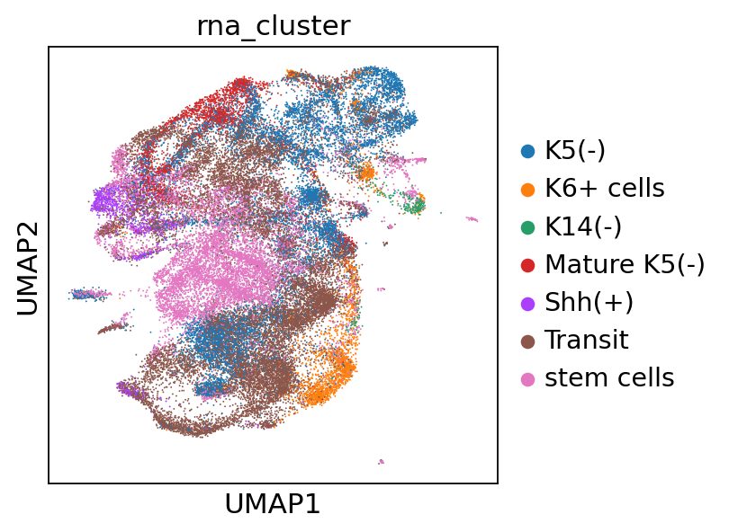
    


```python
peakvi = pd.read_csv("../process/framework/reduction/7.17_combined_umap_full.csv",index_col=0)
```


```python
atac.obsm["peakvi_umap"] = np.array(peakvi)
```


```python
sc.pl.embedding(atac,color="rna_cluster",basis="peakvi_umap",save="_scATAC_anno_reduction2.pdf")
```

    WARNING: saving figure to file ../result/intergrate/202408_scglue/peakvi_umap_scATAC_anno_reduction2.pdf


    

    


```python
previousLabel = pd.read_csv("../process/framework/cluster/combine_scglue_cluster.csv",index_col=0)
```


```python
atac.obs["previous_cluster"] = previousLabel
```


```python
sc.pl.embedding(atac,color="previous_cluster",basis="peakvi_umap",save="_scATAC_anno_reduction2_previous.pdf")
```

    WARNING: saving figure to file ../result/intergrate/202408_scglue/peakvi_umap_scATAC_anno_reduction2_previous.pdf


    
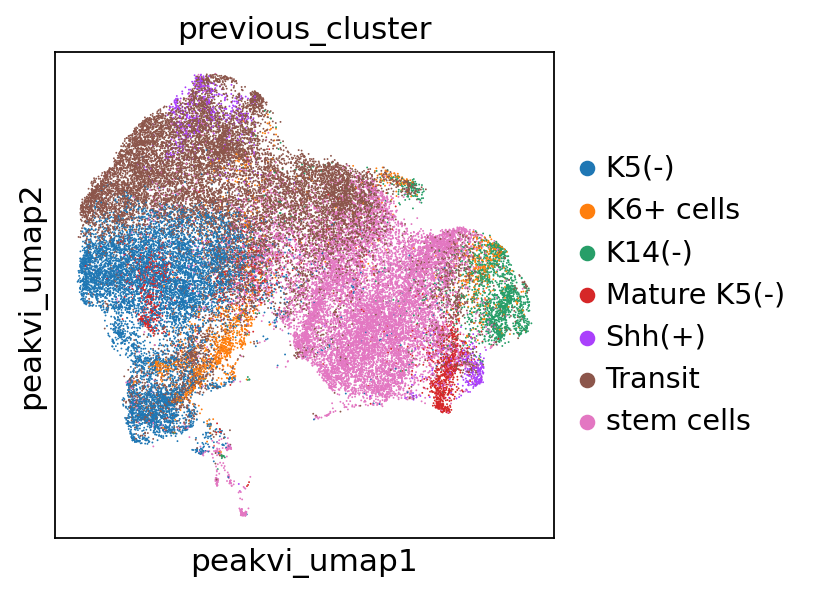
    


## Comparison


```python
grouped2=atac.obs.groupby(["rna_cluster","batch"]).size().reset_index(name='count')
df = grouped2
df_pivot = df.pivot_table(values='count', index='batch', columns='rna_cluster', aggfunc='sum', fill_value=0)
df_pivot = df_pivot.div(df_pivot.sum(axis=0), axis=1) * 100

df = df_pivot
# Plotting
plt.figure(figsize=(10, 6))

# Stacked bar plot
bottom = None
for batch in df.index:
    plt.bar(df.columns, df.loc[batch], bottom=bottom, label=batch)
    if bottom is None:
        bottom = df.loc[batch].values
    else:
        bottom += df.loc[batch].values

plt.xlabel('clusters_scglue')
plt.ylabel('Percentage')
plt.title('Stacked Bar Plot of Batch by Clusters_scglue')
plt.xticks(df.columns)
plt.legend(title='Batch')
plt.tight_layout()
plt.savefig("../result/intergrate/202408_scglue/20241203_barplot_by_ident.pdf")
plt.show()
```

    /tmp/ipykernel_1823907/16319187.py:1: FutureWarning: The default of observed=False is deprecated and will be changed to True in a future version of pandas. Pass observed=False to retain current behavior or observed=True to adopt the future default and silence this warning.
      grouped2=atac.obs.groupby(["rna_cluster","batch"]).size().reset_index(name='count')
    /tmp/ipykernel_1823907/16319187.py:3: FutureWarning: The default value of observed=False is deprecated and will change to observed=True in a future version of pandas. Specify observed=False to silence this warning and retain the current behavior
      df_pivot = df.pivot_table(values='count', index='batch', columns='rna_cluster', aggfunc='sum', fill_value=0)


    
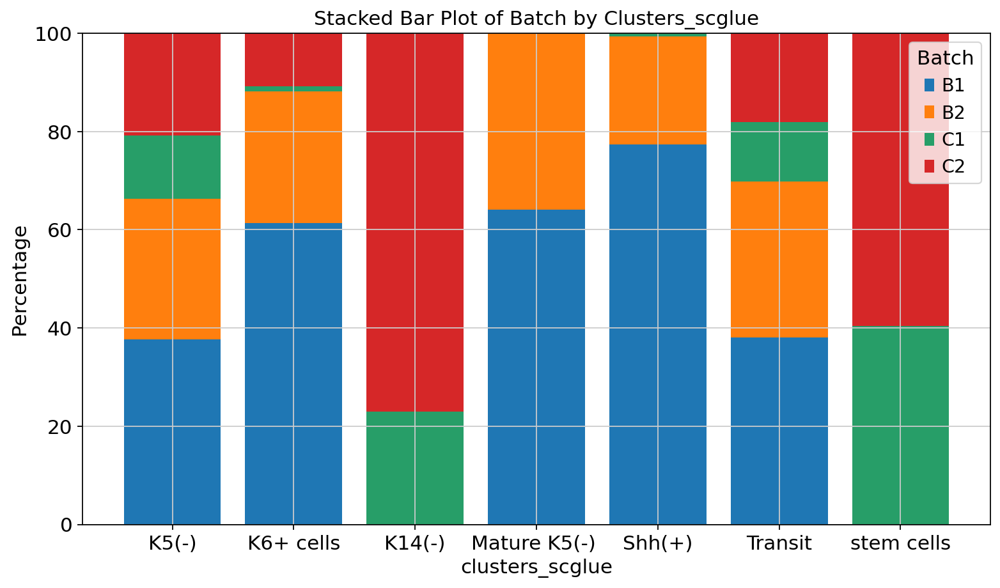
    


```python
grouped2=atac.obs.groupby(["rna_cluster","previous_cluster"]).size().reset_index(name='count')
df = grouped2
df_pivot = df.pivot_table(values='count', index='previous_cluster', columns='rna_cluster', aggfunc='sum', fill_value=0)
df_pivot = df_pivot.div(df_pivot.sum(axis=0), axis=1) * 100

df = df_pivot
# Plotting
plt.figure(figsize=(10, 6))

# Stacked bar plot
bottom = None
for batch in df.index:
    plt.bar(df.columns, df.loc[batch], bottom=bottom, label=batch)
    if bottom is None:
        bottom = df.loc[batch].values
    else:
        bottom += df.loc[batch].values

plt.xlabel('clusters_scglue')
plt.ylabel('Percentage')
plt.title('Stacked Bar Plot of Batch by Clusters_scglue')
plt.xticks(df.columns)
plt.legend(title='Batch')
plt.tight_layout()
plt.savefig("../result/intergrate/202408_scglue/20241203_barplot_by_previousanno.pdf")
plt.show()
```

    /tmp/ipykernel_1823907/3434057561.py:1: FutureWarning: The default of observed=False is deprecated and will be changed to True in a future version of pandas. Pass observed=False to retain current behavior or observed=True to adopt the future default and silence this warning.
      grouped2=atac.obs.groupby(["rna_cluster","previous_cluster"]).size().reset_index(name='count')
    /tmp/ipykernel_1823907/3434057561.py:3: FutureWarning: The default value of observed=False is deprecated and will change to observed=True in a future version of pandas. Specify observed=False to silence this warning and retain the current behavior
      df_pivot = df.pivot_table(values='count', index='previous_cluster', columns='rna_cluster', aggfunc='sum', fill_value=0)


    
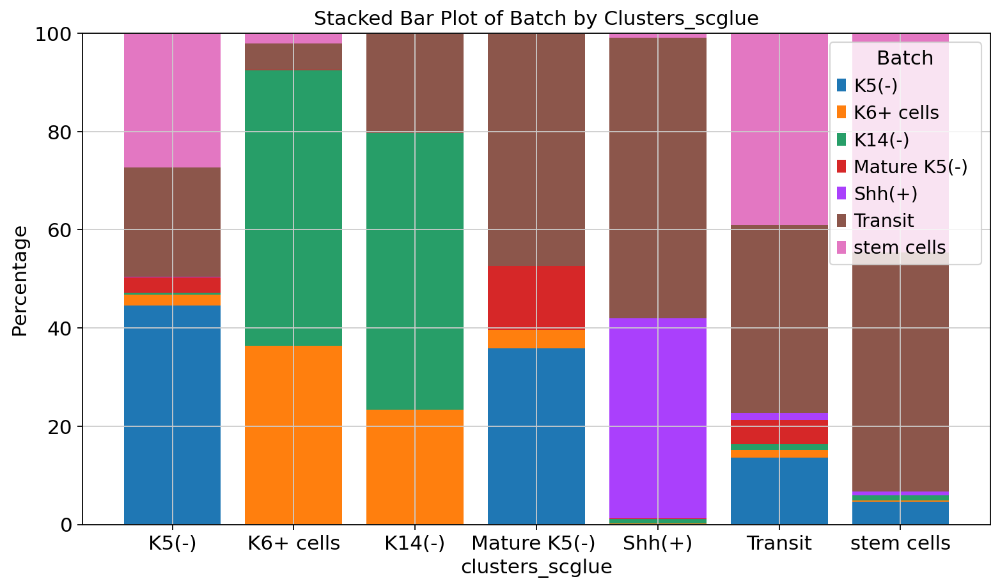
    


```python
annoATAC = pd.read_csv("../process/framework/cluster/combine_peakvi.csv",index_col=0)
```


```python
atac.obs["peakvi_cluster"] = annoATAC
```


```python
atac.obs["peakvi_cluster"] = atac.obs["peakvi_cluster"].astype(str)
```


```python
grouped2=atac.obs.groupby(["rna_cluster","peakvi_cluster"]).size().reset_index(name='count')
df = grouped2
df_pivot = df.pivot_table(values='count', index='peakvi_cluster', columns='rna_cluster', aggfunc='sum', fill_value=0)
df_pivot = df_pivot.div(df_pivot.sum(axis=0), axis=1) * 100

df = df_pivot
# Plotting
plt.figure(figsize=(10, 6))

# Stacked bar plot
bottom = None
for batch in df.index:
    plt.bar(df.columns, df.loc[batch], bottom=bottom, label=batch)
    if bottom is None:
        bottom = df.loc[batch].values
    else:
        bottom += df.loc[batch].values

plt.xlabel('clusters_scglue')
plt.ylabel('Percentage')
plt.title('Stacked Bar Plot of Batch by Clusters_scglue')
plt.xticks(df.columns)
plt.legend(title='Batch')
plt.tight_layout()
plt.savefig("../result/intergrate/202408_scglue/20241203_barplot_by_peakvi.pdf")
plt.show()
```

    /tmp/ipykernel_1823907/1852443459.py:1: FutureWarning: The default of observed=False is deprecated and will be changed to True in a future version of pandas. Pass observed=False to retain current behavior or observed=True to adopt the future default and silence this warning.
      grouped2=atac.obs.groupby(["rna_cluster","peakvi_cluster"]).size().reset_index(name='count')
    /tmp/ipykernel_1823907/1852443459.py:3: FutureWarning: The default value of observed=False is deprecated and will change to observed=True in a future version of pandas. Specify observed=False to silence this warning and retain the current behavior
      df_pivot = df.pivot_table(values='count', index='peakvi_cluster', columns='rna_cluster', aggfunc='sum', fill_value=0)


    
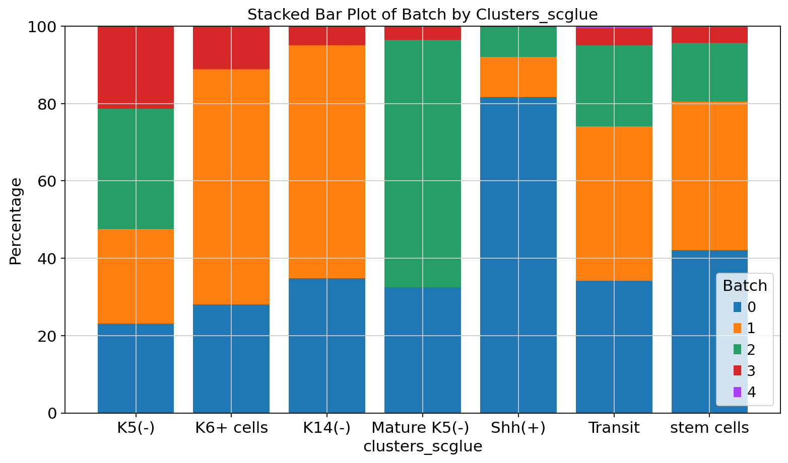
    


```python
grouped2=atac.obs.groupby(["rna_cluster","peakvi_cluster"]).size().reset_index(name='count')
df = grouped2
df_pivot = df.pivot_table(values='count', index='rna_cluster', columns='peakvi_cluster', aggfunc='sum', fill_value=0)
df_pivot = df_pivot.div(df_pivot.sum(axis=0), axis=1) * 100

df = df_pivot
# Plotting
plt.figure(figsize=(10, 6))

# Stacked bar plot
bottom = None
for batch in df.index:
    plt.bar(df.columns, df.loc[batch], bottom=bottom, label=batch)
    if bottom is None:
        bottom = df.loc[batch].values
    else:
        bottom += df.loc[batch].values

plt.xlabel('clusters_scglue')
plt.ylabel('Percentage')
plt.title('Stacked Bar Plot of Batch by Clusters_scglue')
plt.xticks(df.columns)
plt.legend(title='Batch')
plt.tight_layout()
plt.savefig("../result/intergrate/202408_scglue/20241203_barplot_by_peakvi2.pdf")
plt.show()
```

    /tmp/ipykernel_1823907/2629199858.py:1: FutureWarning: The default of observed=False is deprecated and will be changed to True in a future version of pandas. Pass observed=False to retain current behavior or observed=True to adopt the future default and silence this warning.
      grouped2=atac.obs.groupby(["rna_cluster","peakvi_cluster"]).size().reset_index(name='count')
    /tmp/ipykernel_1823907/2629199858.py:3: FutureWarning: The default value of observed=False is deprecated and will change to observed=True in a future version of pandas. Specify observed=False to silence this warning and retain the current behavior
      df_pivot = df.pivot_table(values='count', index='rna_cluster', columns='peakvi_cluster', aggfunc='sum', fill_value=0)


    
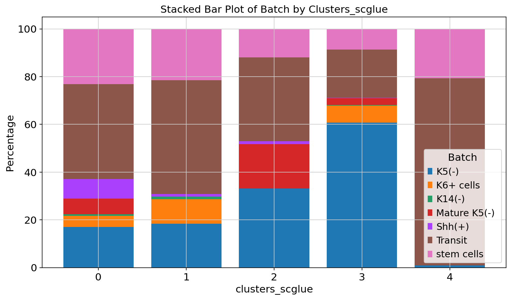
    


```python
pd.DataFrame(atac.obs["rna_cluster"]).to_csv("../process/framework/cluster/20241203_atac_scglue_split.csv")
```
